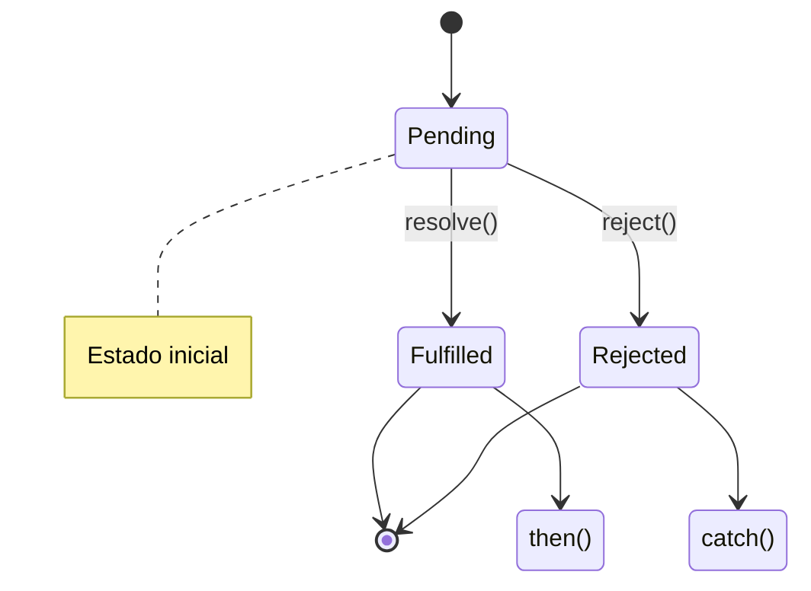
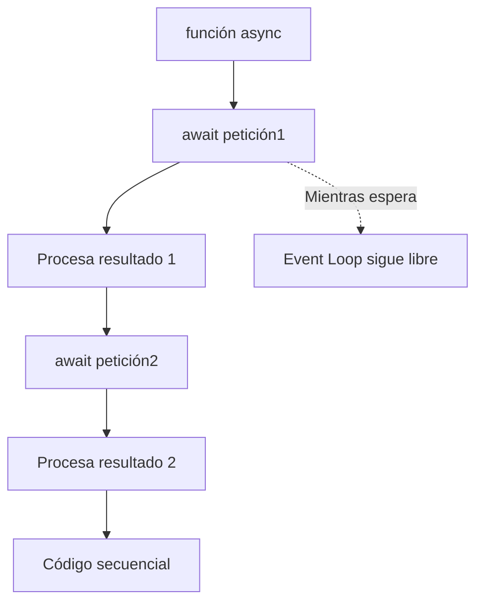
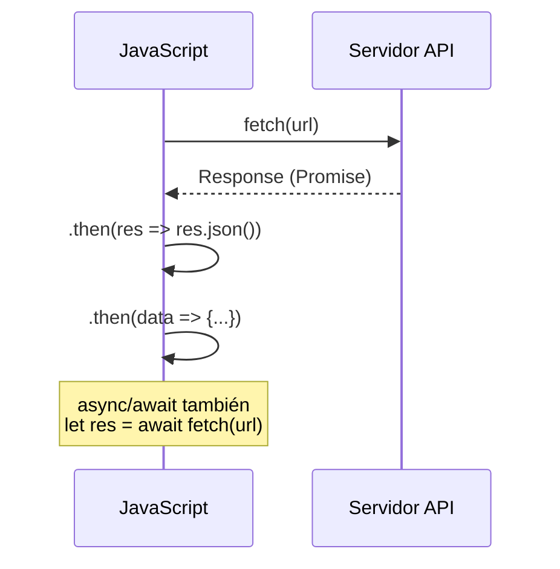

# Async/Await

**Módulo:** `Promesas y Async/Await` | **Lección:** 04

## 🧩 Código JavaScript

```javascript
async function obtenerTodo() {
        console.log("Este codigo esta al comienzo");
        let respuestaGasolina = await fetch('https://api.datos.gob.mx/v1/precio.gasolina.publico');
        let datosGasolina = await respuestaGasolina.json();
        
        console.log("Este codigo esta al medio");
        let respuestaDolar = await fetch('https://open.er-api.com/v6/latest/USD');
        let datosDolar = await respuestaDolar.json();
        
        console.log(datosGasolina, datosDolar);
        console.log("Este codigo esta al final");
      }

      obtenerTodo();
```


## 📊 Diagrama Conceptual








## 🔗 Enlaces Relacionados

### En este módulo
- [[Sincronía y Asincronpia]]
- [[Callbacks]]
- [[Promesas]]
- [[Manejo de Errores]]
- [[Cotizaciones]]
- [[Cotizaciones BTC]]

### Navegación del curso
- ⬅️ Módulo anterior: [[Eventos]]
- ➡️ Módulo siguiente: [[Frameworks y Librerías]]
- 🏠 Volver al [[Índice del Curso]]
