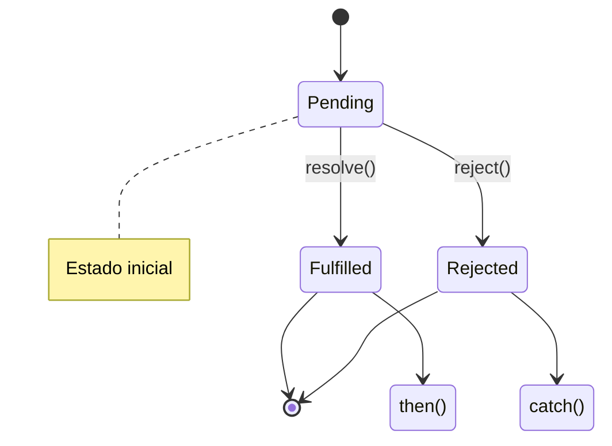
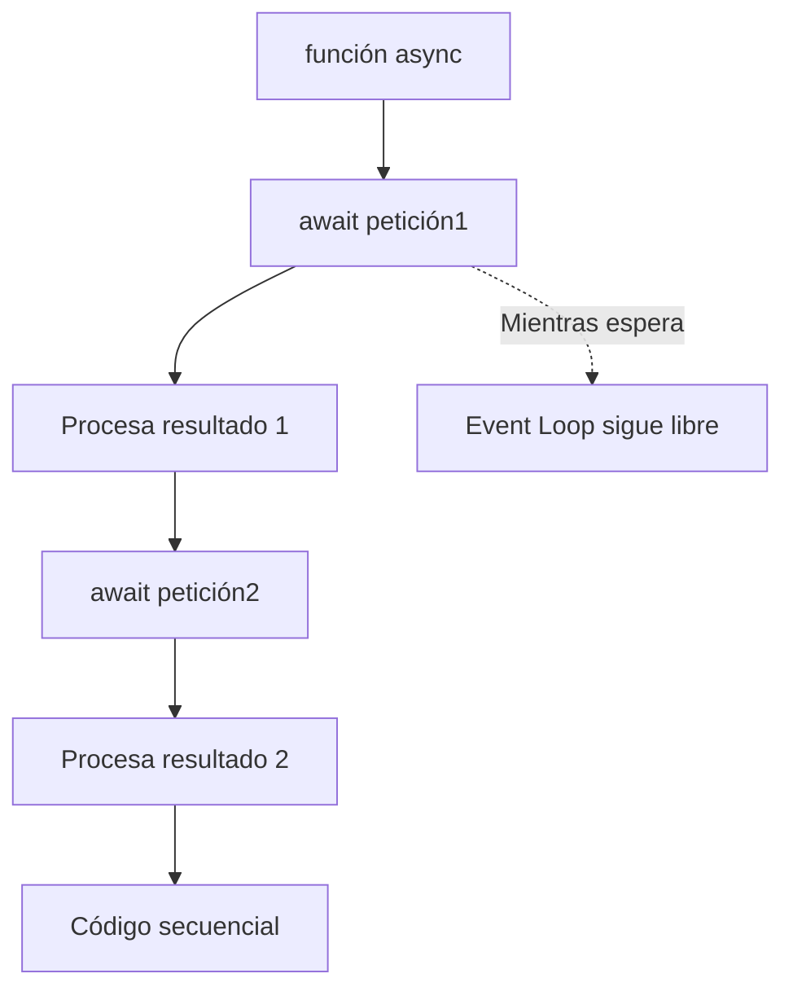
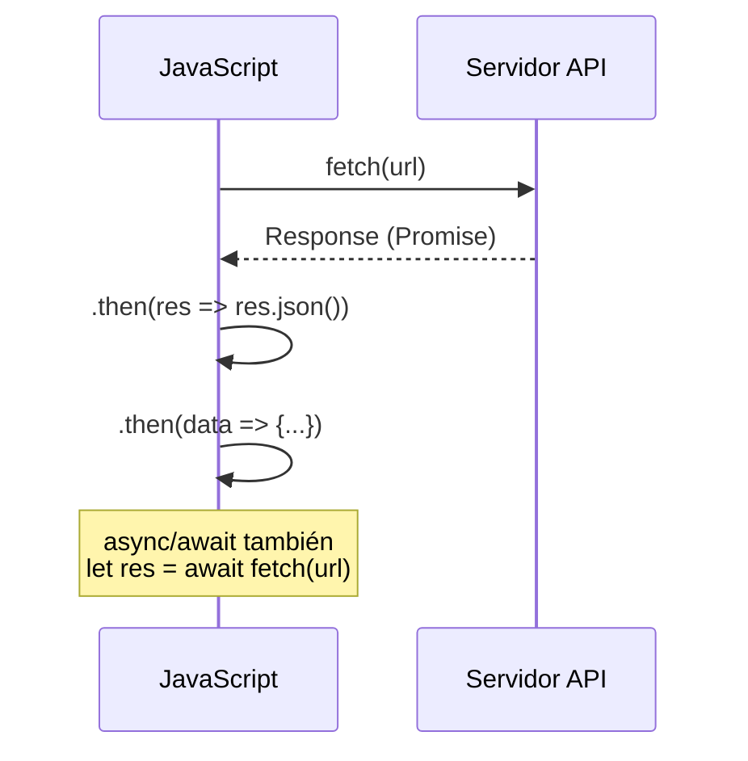

# Manejo de Errores

**Módulo:** `Promesas y Async/Await` | **Lección:** 05

## 🧩 Código JavaScript

```javascript
/*//CALLBACKS
      function sumarNumeros(a, b, callback) {
        setTimeout(function() {
          if(typeof a != 'number' || typeof b != 'number') {
            return callback(new Error('Algun argumento no es numero'));
          }
          callback(null, a+b);
        }, 1000); 
      }

      sumarNumeros('1', 2, function(error, resultado) {
        if (error) {
          console.error(error);
        } else {
          console.log(resultado);
        }
      });

      //PROMESAS
      function sumarNumeros(a, b) {
        return new Promise(function(resolve, reject) {
          setTimeout(function() {
            if(typeof a != 'number' || typeof b != 'number') {
              reject(new Error("Ambos argumentos deben ser numeros"));
            } else {
              resolve(a + b);
            }
          }, 1000);
        })
         
      }

      sumarNumeros(1, '2')
      .then(function(resultado) {
        console.log(resultado);
      }).catch(function(error) {
        console.error(error);
      })*/


      //ASYNC/AWAIT
      async function sumarNumeros(a, b) {
        if(typeof a != 'number' || typeof b != 'number') {
          throw new Error('Alguno de los argumentos no es numero');
        }
        return a + b
      }

      async function manejarErrores() {
        try{
          let resultado = await sumarNumeros('2', 3);
          console.log(resultado);
        } catch (error) {
          console.error(error.message);
        }
      }

      manejarErrores();
```


## 📊 Diagrama Conceptual








## 🔗 Enlaces Relacionados

### En este módulo
- [[Sincronía y Asincronpia]]
- [[Callbacks]]
- [[Promesas]]
- [[Async/Await]]
- [[Cotizaciones]]
- [[Cotizaciones BTC]]

### Navegación del curso
- ⬅️ Módulo anterior: [[Eventos]]
- ➡️ Módulo siguiente: [[Frameworks y Librerías]]
- 🏠 Volver al [[Índice del Curso]]
