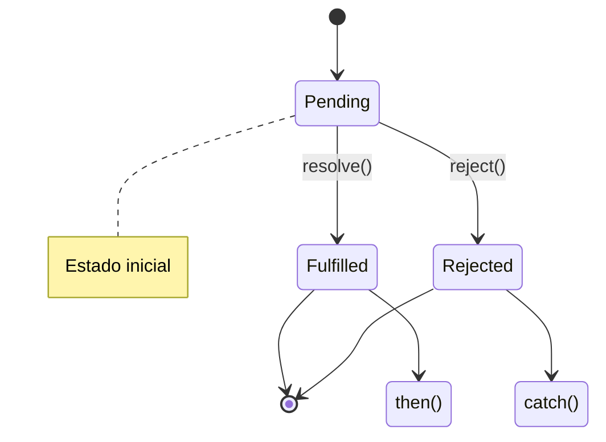

# Promesas y Async/Await

## 📊 Diagrama del Módulo

## Lecciones

- [[Sincronía y Asincronpia]]
- [[Callbacks]]
- [[Promesas]]
- [[Async/Await]]
- [[Manejo de Errores]]
- [[Cotizaciones]]
- [[Cotizaciones BTC]]

---

⬅️ [[Eventos]] | [🏠 Índice del Curso](../index.md) | [[Frameworks y Librerías]] ➡️
