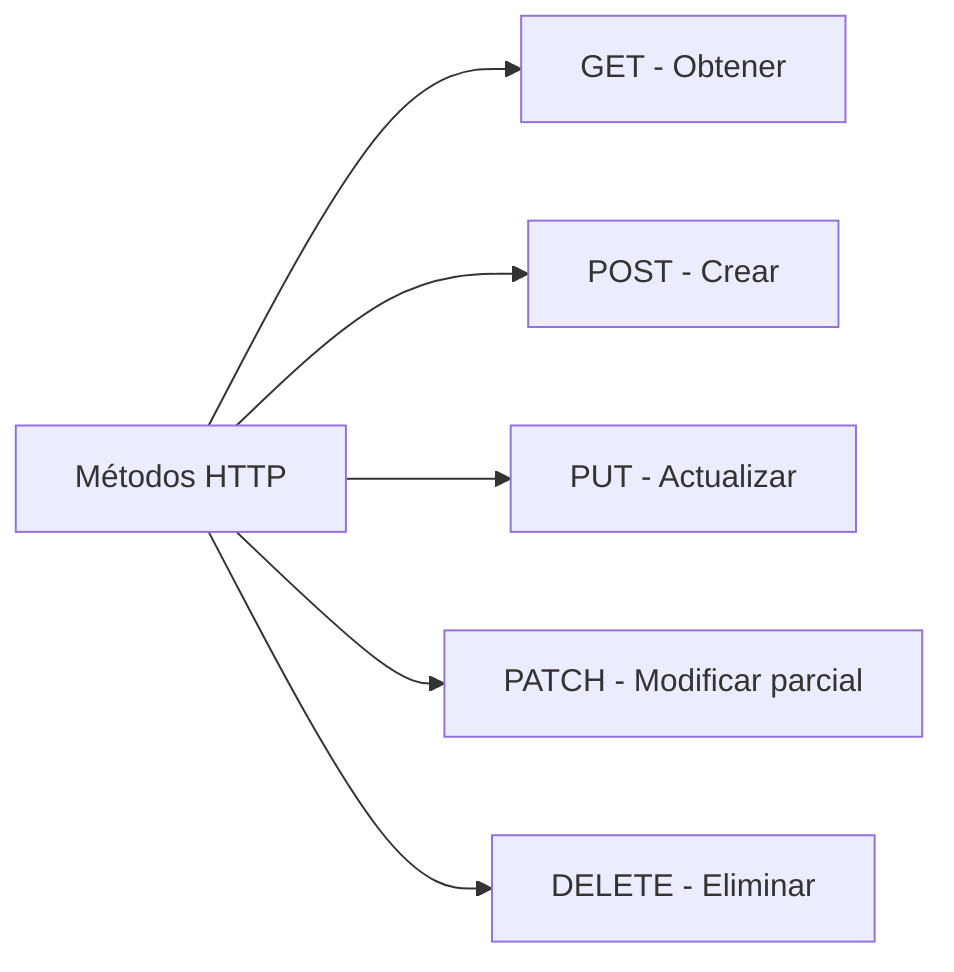
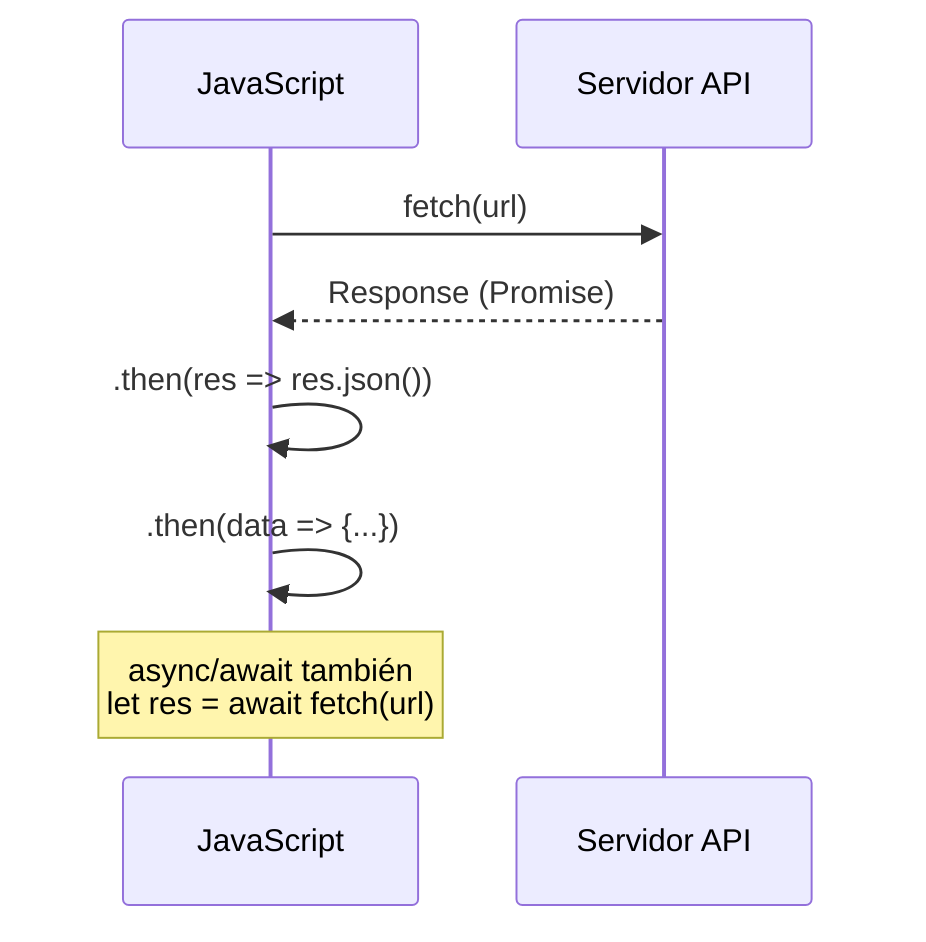

# Tienda de telefonos

**Módulo:** `Solicitudes HTTP` | **Lección:** 06

Tienda de teléfonos Id Marca Modelo Color Almacenamiento Procesador ID Marca Modelo Color Almacenamiento Procesador Obtener Registrar Borrar Actualizar

## 🧩 Código JavaScript

**Archivo:** `https://cdn.jsdelivr.net/npm/axios/dist/axios.min.js`

**Archivo:** `main.js`

## 📊 Diagrama Conceptual

## 🔗 Enlaces Relacionados

### En este módulo
- [[Fetch a Fondo]]
- [[Otras Solicitudes]]
- [[Fetch Avanzado]]
- [[Axios en Detalle]]
- [[Cell-Land]]

### Navegación del curso
- ⬅️ Módulo anterior: [[Frameworks y Librerías]]
- ➡️ Módulo siguiente: [[Bases de Datos]]
- 🏠 Volver al [[Índice del Curso]]
