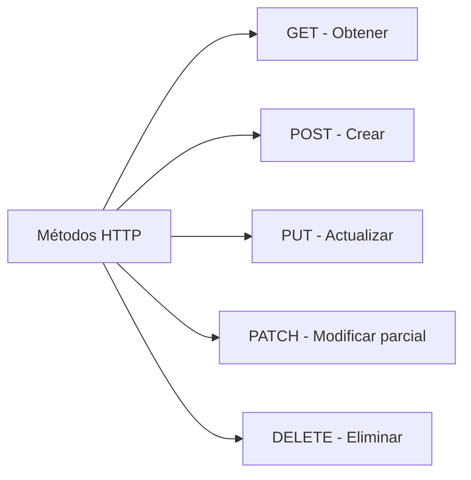

# Solicitudes HTTP

## 📊 Diagrama del Módulo

## Lecciones

- [[Fetch a Fondo]]
- [[Otras Solicitudes]]
- [[Fetch Avanzado]]
- [[Axios en Detalle]]
- [[Cell-Land]]
- [[Tienda de telefonos]]

---

⬅️ [[Frameworks y Librerías]] | [🏠 Índice del Curso](../index.md) | [[Bases de Datos]] ➡️
