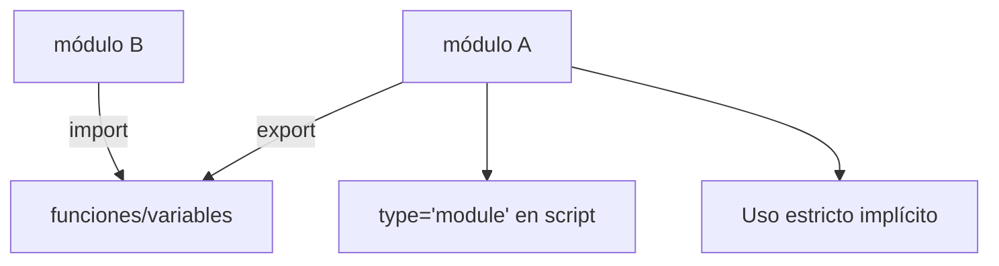

# Módulos

**Módulo:** `Últimos Temas` | **Lección:** 01

# Ejemplo de módulos

## 🧩 Código JavaScript

**Archivo:** `misScripts.js`

## 📊 Diagrama Conceptual

## 🔗 Enlaces Relacionados

### En este módulo
- [[Uso Estricto]]
- [[Noticias YA!]]

### Navegación del curso
- ⬅️ Módulo anterior: [[Proyecto Final]]
- 🏠 Volver al [[Índice del Curso]]
