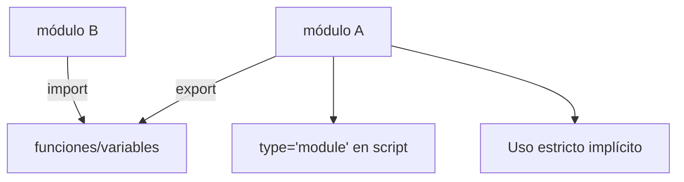

# Uso Estricto

**Módulo:** `Últimos Temas` | **Lección:** 04

## 🧩 Código JavaScript

**Archivo:** `misScripts.js`

## 📊 Diagrama Conceptual

## 🔗 Enlaces Relacionados

### En este módulo
- [[Módulos]]
- [[Noticias YA!]]

### Navegación del curso
- ⬅️ Módulo anterior: [[Proyecto Final]]
- 🏠 Volver al [[Índice del Curso]]
