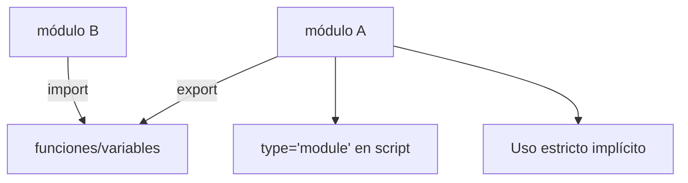

# Últimos Temas

## 📊 Diagrama del Módulo

```mermaid
graph TD
    A[módulo A] --> |export| B[funciones/variables]
    C[módulo B] --> |import| B
    A --> D[type='module' en script]
    A --> E[Uso estricto implícito]
```

## Lecciones

- [[Módulos]]
- [[Uso Estricto]]
- [[Noticias YA!]]

---

⬅️ [[Proyecto Final]] | [🏠 Índice del Curso](../index.md)
