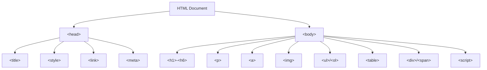
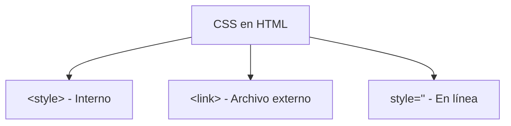
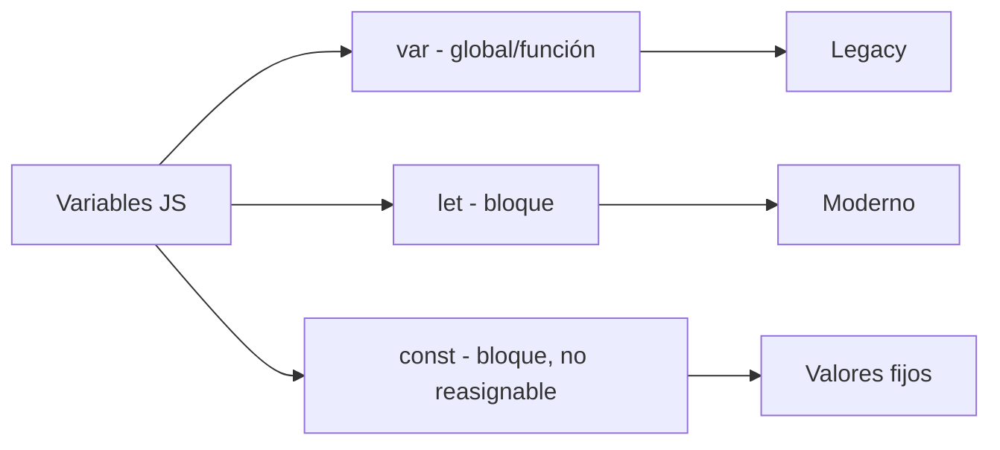
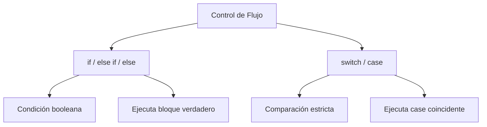
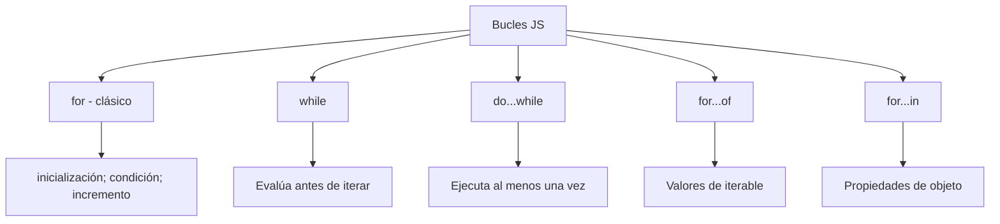
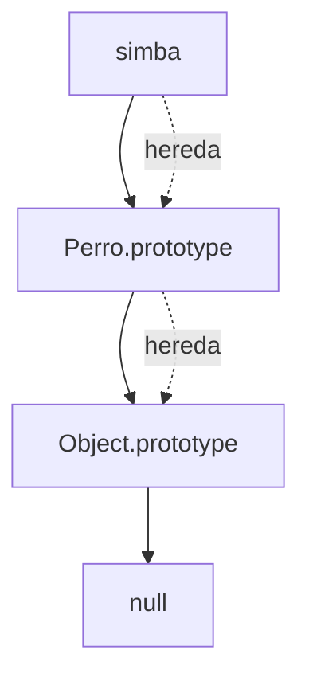
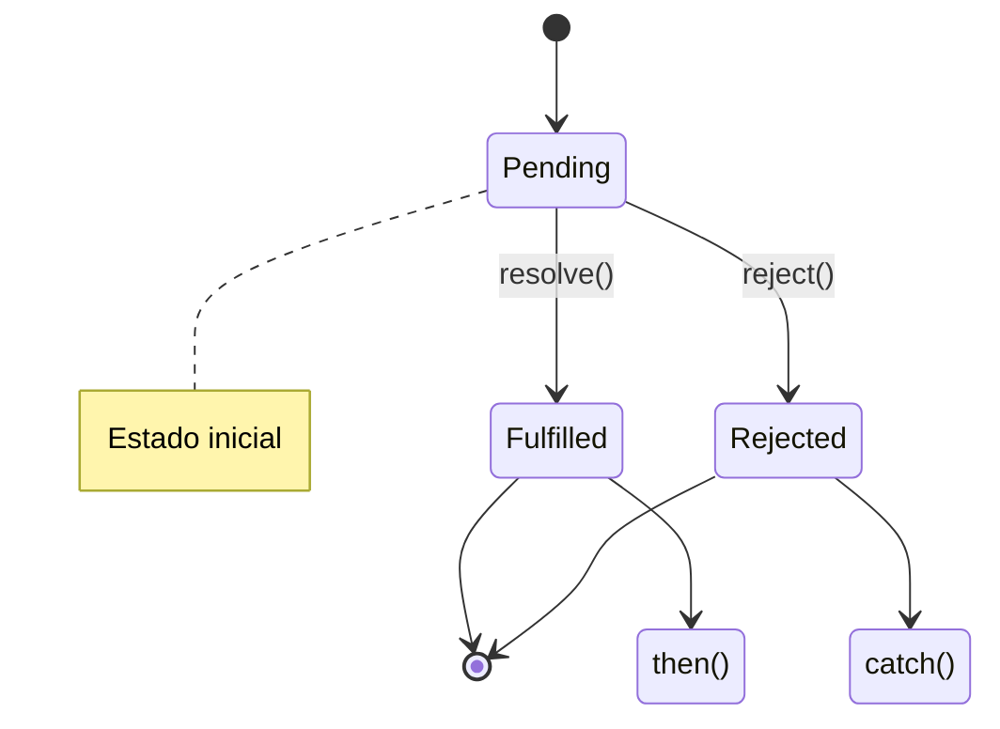
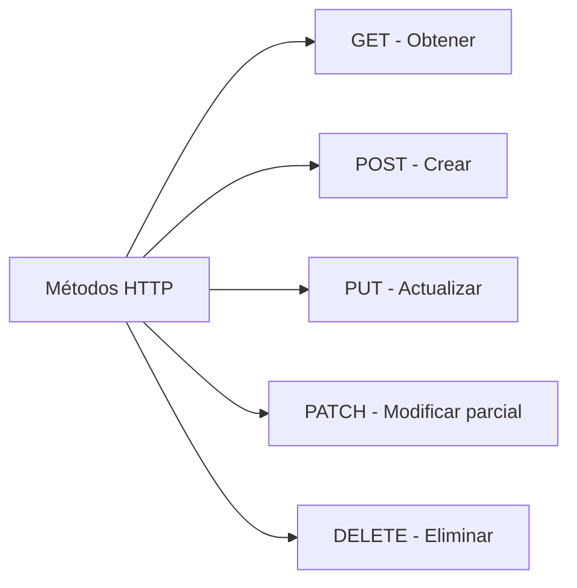
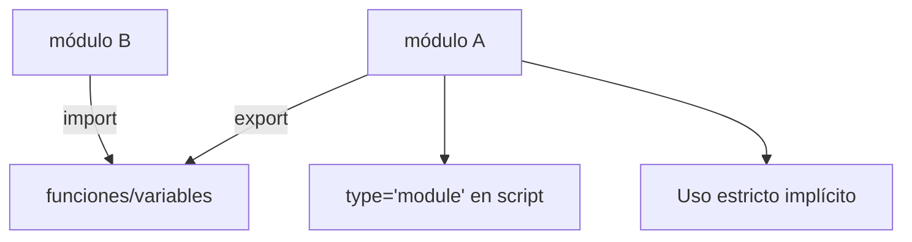

# 🎓 Minicurso de Programación Básica

> *"Esta web es un minicurso de programación básica, principalmente JavaScript"*

Bienvenido al minicurso. Aquí encontrarás lecciones organizadas por módulos que cubren desde HTML básico hasta conceptos avanzados de JavaScript.

---

## 📚 Módulos del Curso

### HTML Básico
**Lecciones:** 12


📖 [[HTML Básico|Ir al módulo]]

---

### HTML Intermedio
**Lecciones:** 13


📖 [[HTML Intermedio|Ir al módulo]]

---

### Variables
**Lecciones:** 10


📖 [[Variables|Ir al módulo]]

---

### Funciones
**Lecciones:** 9

```mermaid
flowchart TD
    A[Función] --> B[Declaración: function f(){}]
    A --> C[Expresión: const f = function(){}]
    A --> D[Arrow: const f = () => {}]
    B --> E[Hosting]
    C --> F[No hosting]
    D --> G[this léxico]
    B --> H[Usar return]
    C --> H
```
📖 [[Funciones|Ir al módulo]]

---

### Flujo del Programa
**Lecciones:** 7


📖 [[Flujo del Programa|Ir al módulo]]

---

### Bucles
**Lecciones:** 11


📖 [[Bucles|Ir al módulo]]

---

### Proyecto: Tienda de Donas
**Lecciones:** 7

📖 [[Proyecto: Tienda de Donas|Ir al módulo]]

---

### POO - Objetos
**Lecciones:** 12

```mermaid
graph TD
    A[Objeto JS] --> B[Propiedades: clave: valor]
    A --> C[Métodos: función()]
    B --> D[Acceso: obj.prop]
    B --> E[Acceso: obj['prop']]
    C --> F[this se refiere al objeto]
    A --> G[Se crean con {}]
```
📖 [[POO - Objetos|Ir al módulo]]

---

### Prototipos
**Lecciones:** 5


📖 [[Prototipos|Ir al módulo]]

---

### Clases y Encapsulamiento
**Lecciones:** 5

```mermaid
graph TD
    A[Clase] --> B[constructor()]
    A --> C[Métodos]
    A --> D[Getters / Setters]
    A --> E[Subclase: extends]
    E --> F[super() - llama al padre]
    A --> G[#propiedad - Privada]
```
📖 [[Clases y Encapsulamiento|Ir al módulo]]

---

### Manejo de Excepciones y JSON
**Lecciones:** 5

```mermaid
graph LR
    A[JSON] --> B[JavaScript Object Notation]
    B --> C[Formato de intercambio]
    C --> D[fetch() - Obtener]
    C --> E[JSON.stringify() - Enviar]
    C --> F[JSON.parse() - Leer]
```
📖 [[Manejo de Excepciones y JSON|Ir al módulo]]

---

### Eventos
**Lecciones:** 10

```mermaid
graph TD
    A[Evento] --> B[Tipo: click, keydown, etc]
    A --> C[Elemento objetivo]
    A --> D[Manejador - Handler]
    B --> E[Eventos de ratón]
    B --> F[Eventos de teclado]
    B --> G[Eventos de formulario]
    B --> H[Eventos personalizados]
    D --> I[addEventListener()]
    D --> J[onclick / onkeydown]
```
📖 [[Eventos|Ir al módulo]]

---

### Promesas y Async/Await
**Lecciones:** 7


📖 [[Promesas y Async/Await|Ir al módulo]]

---

### Frameworks y Librerías
**Lecciones:** 3

📖 [[Frameworks y Librerías|Ir al módulo]]

---

### Solicitudes HTTP
**Lecciones:** 6


📖 [[Solicitudes HTTP|Ir al módulo]]

---

### Bases de Datos
**Lecciones:** 0

📖 [[Bases de Datos|Ir al módulo]]

---

### Proyecto Final
**Lecciones:** 7

📖 [[Proyecto Final|Ir al módulo]]

---

### Últimos Temas
**Lecciones:** 3


📖 [[Últimos Temas|Ir al módulo]]

---


## 📈 Progresión Recomendada

```mermaid
graph LR
    A[HTML Básico] --> B[HTML Intermedio]
    B --> C[Variables]
    C --> D[Funciones]
    D --> E[Flujo del Programa]
    E --> F[Bucles]
    F --> G[Proyecto: Tienda de Donas]
    G --> H[POO - Objetos]
    H --> I[Prototipos]
    I --> J[Clases y Encapsulamiento]
    J --> K[Manejo de Excepciones]
    K --> L[Eventos]
    L --> M[Promesas y Async/Await]
    M --> N[Frameworks y Librerías]
    N --> O[Solicitudes HTTP]
    O --> P[Proyecto Final]
    P --> Q[Últimos Temas]
```



---

> 🧑‍💻 Creado por un estudiante eterno, para estudiantes.
