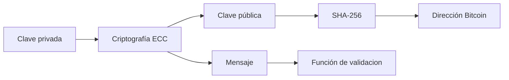

# Curso Completo: Blockchain y Web3

## Anatomía de un Bloque

### Cabecera
- **Hash del bloque previo** — enlace al bloque anterior
- **Versión** — indica las reglas de validación seguidas
- **Raíz de Merkle** — hash raíz del árbol de Merkle de las transacciones
- **Timestamp** — marca de tiempo Unix (segundos desde 1970)
- **Nonce** — número de 32 bits usado en la minería
- **Dificultad objetivo** — umbral que debe cumplir el hash del bloque

### Contenido
- Lista de transacciones

---

🔗 [Blockchain Explorer](https://www.blockchain.com/es/explorer)

---

## Los 5 Pilares de Blockchain

1. **Criptografía Hash**
2. **Libro mayor inmutable**
3. **Red distribuida P2P**
4. **Minado**
5. **Protocolos de Consenso**

---

### Criptografía Hash

Bitcoin usa el algoritmo **SHA-256** que produce un hash de 64 caracteres hex. Es fácil de generar y no consume casi recursos.

🔗 [Algoritmos hash online](https://joaneeet7.github.io/online-tools)

**Propiedades:**

- **Unidireccional** — de un documento obtienes su hash, pero del hash no puedes obtener el documento original.
- **Determinista** — mismo algoritmo + mismo documento → mismo hash.
- **Fácil de calcular** — bajo coste computacional.
- **Compresible** — 2 frases o 1000 páginas siempre producen 64 caracteres.
- **Efecto avalancha** — un mínimo cambio en la entrada altera completamente el hash.
- **Resistencia a colisiones** — es computacionalmente inviable encontrar dos entradas distintas con el mismo hash.
- **Irreversible** — no se puede recuperar la entrada a partir del hash.

> Toda criptomoneda usa generalmente dos identificadores hash: el **hash previo** (generado por el bloque anterior) y el **hash del bloque** (generado a partir de las transacciones actuales).

---

### Libro Mayor Inmutable

Imagina que quieres comprar una casa. Redactas el contrato y la escritura donde se asocia el dueño con la propiedad y se guarda en un servidor. Un *hacker* ataca el servidor y cambia el propietario por él mismo: pierdes la propiedad.

Ahora imagina que guardas la escritura en una blockchain. Esta información se replica por toda la red. Si el *hacker* ataca tu bloque, existen tantas copias que el bloque se puede recuperar y no pierdes tu propiedad.

---

### Red Distribuida P2P

Otra capa de seguridad: los bloques se almacenan en distintos nodos (computadoras de hogar). Si un *hacker* altera un bloque no pasa nada, porque los demás nodos —mediante el protocolo de consenso— recuperan la información. Un atacante necesitaría controlar **más del 51 % de los nodos** simultáneamente para alterar un bloque.

---

### Casos de Uso de Blockchain

- **Certificaciones** — almacenar certificados en la blockchain protegiéndolos de falsificaciones.
- **Votación** — preserva el anonimato y evita la alteración de resultados.
- **Notarios** — los contratos inteligentes reemplazan la figura del notario tradicional.

---

### Minado

#### Rompecabezas Criptográfico

En Bitcoin, el **nonce** es un número de 32 bits que forma parte del encabezado de un bloque. Los mineros lo ajustan para encontrar un hash válido que cumpla con la dificultad objetivo (por ejemplo, un número específico de ceros iniciales). Este proceso es esencial en la minería de Bitcoin y permite agregar nuevos bloques a la cadena. Los mineros son recompensados con bitcoins por su trabajo exitoso.

#### Incremento de Dificultad

El nonce es un entero de 32 bits (2³²), que un minero puede recorrer en segundos; un *pool* de minería lo recorre en fracciones de segundo. Aquí entra el **timestamp**, un entero de 64 bits (2⁶⁴) que identifica cada segundo desde el 1 de enero de 1971. El timestamp combinado con el nonce debe coincidir con el hash del bloque.

#### Mempool

Las transacciones que aún no han sido asignadas a un bloque permanecen en una *mempool* a la espera de que un minero las tome y las incluya en un bloque. El minero puede seleccionar cuántas transacciones entran en cada bloque. Como las transacciones alteran el hash del bloque, hay que alternar entre combinaciones para encontrar el hash que, junto con el nonce, resuelva el rompecabezas.

🔗 [Mempool en vivo](https://mempool.space/es/)

---

### Protocolo de Consenso

Existen varios protocolos de consenso; los más importantes son **PoW (Proof of Work)** y **PoS (Proof of Stake)**.

La red tiene latencias físicas. Supón que se mina un bloque en Colombia con un timestamp concreto y simultáneamente se mina otro bloque en Italia con el mismo timestamp. La red disemina ambos, pero en algún punto colisionan y la red debe elegir cuál incluir:

- El bloque con la **cadena más larga** es el que se añade a la red.
- El bloque descartado se convierte en un **bloque huérfano**.

#### Bloque Huérfano

Un bloque huérfano es un bloque válido que pasa momentáneamente a una bifurcación temporal de la red (*orphan blockchain*). Sus transacciones se reincorporan en el siguiente bloque de la red principal, pero el minero no recibe su recompensa.

---

### Diversidad Comparativa entre Blockchains

| Característica      | Públicas                           | Privadas                      | Federadas                           |
|---------------------|------------------------------------|-------------------------------|-------------------------------------|
| **Participación**   | Cualquiera                         | No                            | No                                  |
| **Nodos**           | Sí                                 | No                            | No                                  |
| **Transparencia**   | Sí                                 | Turbia                        | Turbia                              |
| **Administración**  | Sin administrador                  | Administrador único           | Más de un administrador             |
| **Smart Contracts** | Sí                                 | Sí                            | Sí                                  |
| **Recompensa**      | Sí (según moneda)                  | No                            | No                                  |
| **Minado**          | Sí                                 | No                            | No                                  |
| **Confianza**       | Sí                                 | No                            | ±                                  |
| **Consenso**        | Sí                                 | No                            | ±                                  |
| **Seguridad**       | Sí                                 | ±                             | ±                                  |

**Ejemplos:**

- **Públicas:** Bitcoin, Ethereum, Litecoin
- **Privadas:** Hyperledger, Corda, Quorum
- **Federadas:** Hyperledger, Corda, Quorum

#### Blockchain como Servicio (BaaS)

- **IBM** — IBM Blockchain Platform
- **Microsoft** — Azure Blockchain
- **Amazon** — Amazon Managed Blockchain

---

### Proof of Work (PoW)

- Crea un rompecabezas criptográfico; quien lo resuelve primero se lleva la recompensa.
- En caso de conflicto, gana la red con mayor poder de cómputo.
- **Problema:** alto consumo energético (crece cada año).
- Es el consenso más seguro, aunque el monopolio lo acapara el *pool* más grande.
- **Poco escalable.**

### Proof of Stake (PoS)

- Resuelve los problemas de escalabilidad y velocidad.
- Elimina el alto consumo energético de la minería.
- Descentraliza la red (aunque el monopolio lo tiene quien posea más *tokens*).
- Desincentiva el ataque del 51 % (quien tenga todos los *tokens* haría que su valor se desplome).

> Si hay 3 grupos con distinta cantidad de *tokens* bloqueados, el protocolo elige al azar —con mayor probabilidad— a un validador con muchos *tokens*, pero los grupos con menos *tokens* también tienen oportunidad de validar un bloque.

---

### Árbol de Merkle (Merkle Tree)

El **Árbol de Merkle** es una estructura de datos utilizada en blockchain para verificar la integridad de un conjunto de datos (generalmente las transacciones de un bloque). Se construye agrupando las transacciones en pares y calculando el hash de cada par. Luego los hashes se agrupan nuevamente y se repite el proceso hasta obtener una única **raíz de Merkle**.

Esta raíz es un hash único que representa todo el conjunto de datos. Cualquier cambio en los datos altera drásticamente la raíz, lo que asegura la integridad de la información.

La raíz de Merkle se incluye en el encabezado del bloque, lo que permite verificar rápidamente la validez del bloque y las transacciones sin necesidad de descargar todos los datos individuales. Esto mejora la eficiencia y la seguridad de la red.

---

### Billeteras (Wallets)

```
Clave privada
      │
      ▼
 Criptografía ECC ───────────► Clave pública ── SHA-256 ──► Dirección Bitcoin
      │
      └── Mensaje ──► Función de validación
```




