# Día 1 — Introducción a Agentes de IA

Basado en el *Whitepaper Companion Podcast* del curso intensivo de 5 días de Google × Kaggle.

---

## ¿Qué es un Agente de IA?

> Un agente de IA es un sistema autónomo y orientado a objetivos que **planea, actúa y resuelve problemas complejos en múltiples pasos** sin supervisión constante.

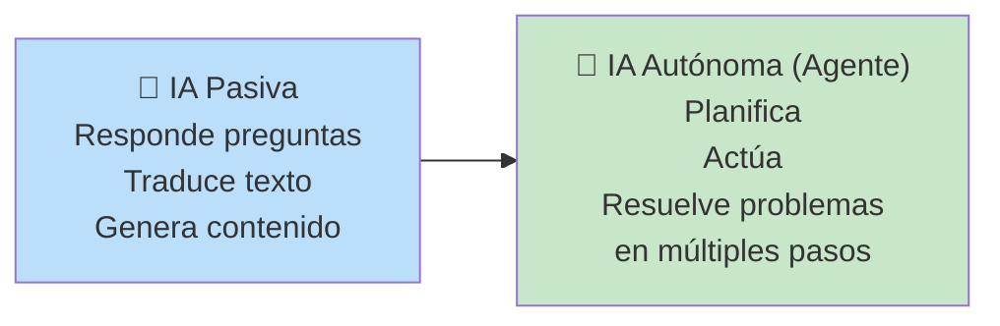

---

## Anatomía de un Agente — Las 3 Partes Centrales

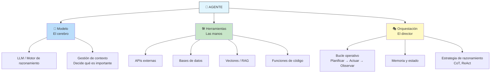

---

### 1. Modelo — El Cerebro

El LLM central actúa como **motor de razonamiento**. Su función clave es la **gestión de la ventana de contexto**: decide qué información es relevante en cada momento, curando la entrada para el siguiente paso del razonamiento.

```
El modelo recibe información de:
  - La misión/objetivo (prompt inicial)
  - La memoria (estado de la tarea)
  - Las herramientas (resultados de acciones previas)

Y decide: ¿qué es importante ahora? ¿qué ignorar? ¿qué paso sigue?
```

### 2. Herramientas — Las Manos

Son la **conexión con el mundo exterior**. Sin herramientas, el modelo solo puede usar su conocimiento pre-entrenado.

| Tipo | Ejemplos |
|------|----------|
| **APIs** | Calendario, CRM, clima, pagos |
| **Bases de datos** | Consultas SQL, NL2SQL |
| **RAG / Vectores** | Búsqueda en documentos no estructurados |
| **Ejecución de código** | Python sandbox para tareas dinámicas |
| **Búsqueda web** | APIs de búsqueda |

El modelo **razona sobre qué herramienta necesita** para el paso actual de su plan, y la orquestación ejecuta la llamada.

### 3. Orquestación — El Director

Es el **gobernador de todo el proceso**. Gestiona:

- **El bucle operativo** (pensar → actuar → observar)
- **La planificación** (desglosar el objetivo en pasos)
- **La memoria** (corto y largo plazo)
- **La estrategia de razonamiento** (CoT, ReAct)
- **La identidad y reglas del agente** (system prompt / constitución)

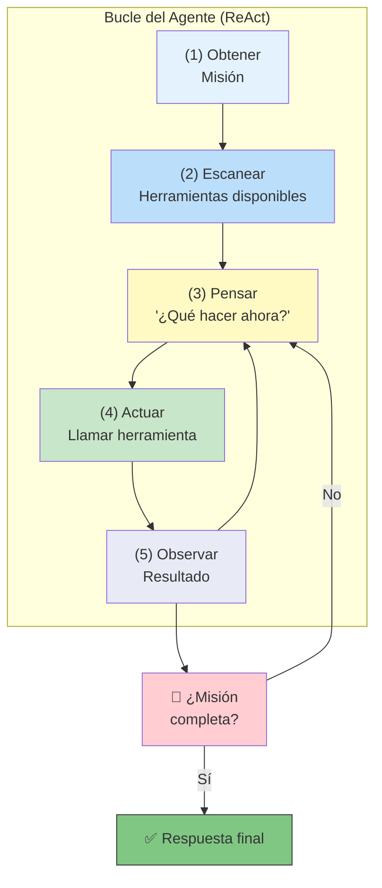

---

## Taxonomía de Capacidades del Agente (5 Niveles)

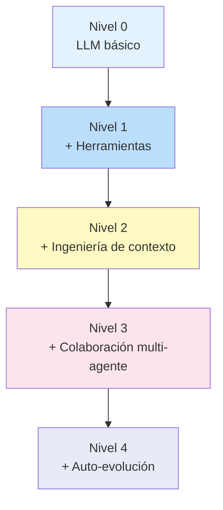

### Nivel 0 — LLM Base

El modelo de lenguaje por sí solo. Sin herramientas. Solo sabe lo que aprendió en su entrenamiento.

```
Puede: explicar conceptos, responder preguntas históricas
No puede: consultar datos en tiempo real, ejecutar acciones, acceder a APIs
```

### Nivel 1 — Solucionador Conectado

El LLM + herramientas. Se conecta al mundo exterior mediante APIs, bases de datos, búsqueda.

```
Puede: responder el resultado de un partido (busca en web),
        consultar disponibilidad de productos (API de inventario)
Clave: ahora tiene conciencia del mundo real
```

### Nivel 2 — Solucionador Estratégico

Va más allá de tareas simples. Puede manejar **metas complejas de múltiples pasos** usando **ingeniería de contexto**: usa la salida de un paso para dar forma inteligente a la entrada del siguiente paso.

```
Ejemplo: "Busca un buen café a medio camino entre estas dos direcciones"
  1. Usa herramienta de mapas → calcula coordenadas del punto medio
  2. Usa esas coordenadas → busca cafeterías con rating > 4.0
  3. Síntesis: recomienda las mejores opciones

Clave: gestión activa de contexto para evitar ruido
```

### Nivel 3 — Colaboración Multi-Agente

Un **equipo de agentes especializados** que se tratan entre sí como herramientas. Un agente director delega objetivos a agentes subordinados.

```
Ejemplo: "Analiza los precios de la competencia"
  Agente Director → delega a:
    ├── Agente de Investigación de Mercado
    └── Agente de Análisis de Datos

  Cada sub-agente ejecuta su propio plan de varios pasos
  con sus propias herramientas y devuelve un resultado sintetizado.

Clave: delegación de objetivos (no solo llamadas a funciones)
```

### Nivel 4 — Sistema Auto-Evolutivo

El sistema puede **identificar carencias en sus propias capacidades** y crear nuevas herramientas para llenarlas.

```
Ejemplo: El agente director necesita análisis de sentimiento en redes sociales.
         No existe un agente/herramienta que lo haga.
         → Invoca una herramienta de creación de agentes
         → Construye un nuevo agente de análisis de sentimiento sobre la marcha
         → Configura sus permisos y lo integra

Clave: adaptación y expansión autónoma del conjunto de herramientas
```

---

## Construcción de Agentes Confiables

### Selección del Modelo

No siempre el modelo más grande es el mejor para un agente. Se necesita:

- **Buen razonamiento** para planificar
- **Uso confiable de herramientas** (function calling)
- Estrategia de **enrutamiento de modelos**:

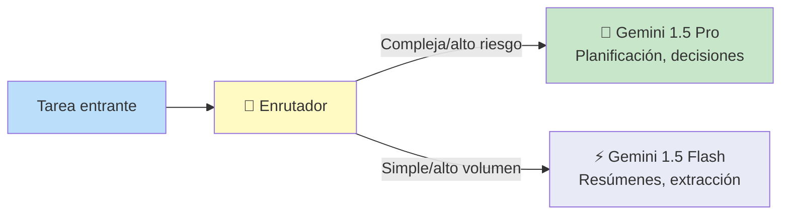

### Herramientas Clave

| Técnica | Propósito |
|---------|-----------|
| **RAG** | Fundamentar al agente en hechos (documentos no estructurados) |
| **NL2SQL** | Consultar bases de datos estructuradas en lenguaje natural |
| **APIs** | Acciones concretas (agendar, actualizar CRM, ejecutar código) |
| **Function Calling** | Descripción clara de herramientas (especificación OpenAPI) |

### Function Calling

Cada herramienta necesita una **especificación clara** (como OpenAPI) que le diga al modelo:

```
Qué hace la herramienta
Qué parámetros necesita (ej: orden, email)
Qué formato tendrá la salida
```

Sin esta comunicación estructurada, **todo el bucle puede romperse**.

La herramienta devuelve una **observación** → se alimenta de vuelta al contexto del modelo → listo para el siguiente ciclo.

---

## Memoria del Agente

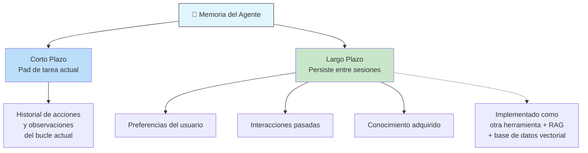

---

## Operaciones: Pruebas y Depuración

Los agentes presentan un **desafío único** para testing: la salida puede ser perfectamente válida incluso si está redactada de forma diferente cada vez.

### LM as Judge (LM como Juez)

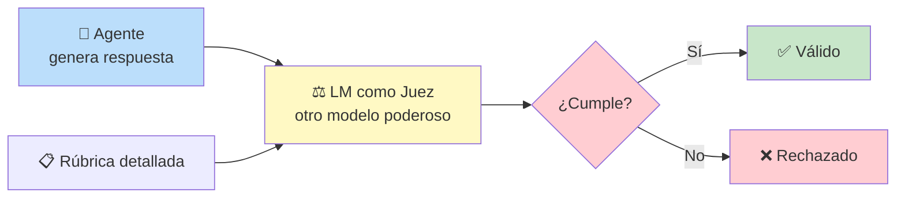

**La rúbrica evalúa:**
- ¿La respuesta cumple los requisitos?
- ¿Está fundamentada en hechos?
- ¿Siguió las restricciones negativas?

### Observabilidad con Trazas

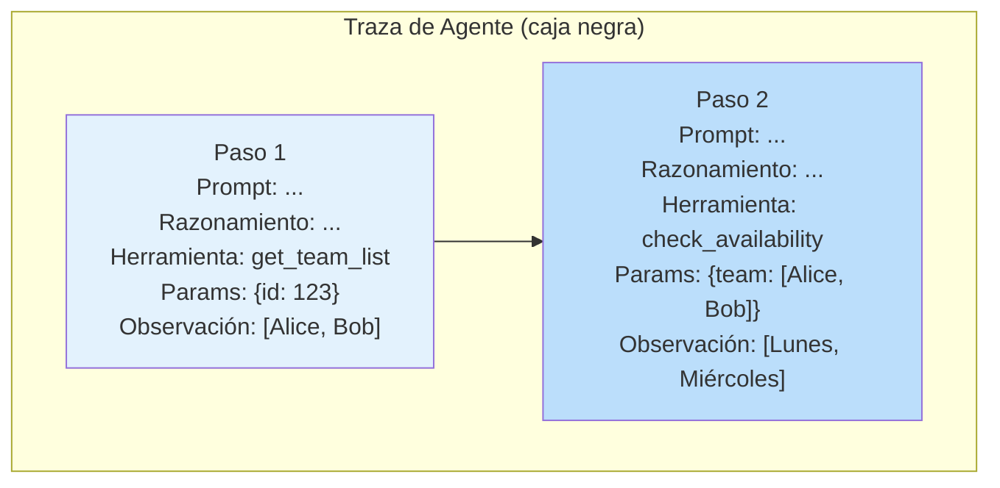

Cada traza proporciona un **registro paso a paso**:
- El prompt en cada paso
- El razonamiento del modelo
- Qué herramienta fue elegida
- Los parámetros exactos enviados
- La observación recibida

### Ciclo de Mejora Continua

```
1. Usuario reporta fallo o comportamiento extraño
2. Capturas el escenario
3. Lo reproduces
4. Lo conviertes en un caso de prueba permanente
5. → Vacunas al sistema contra ese error específico
```

---

## Seguridad y Gobernanza

### La Tensión Fundamental

> **Más utilidad → más riesgo potencial**

### Defensa en Profundidad

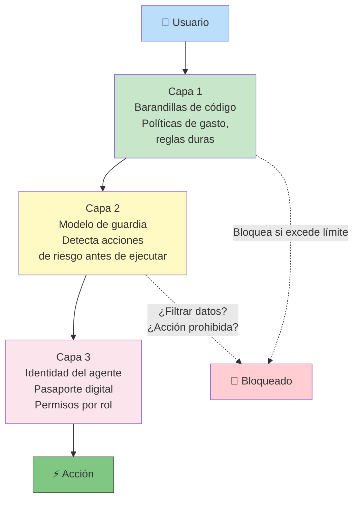

### Identidad del Agente

> Un agente **no actúa como el usuario**. Es un nuevo actor en el sistema con su propia **identidad segura y verificable** (pasaporte digital, ej: estándares como SEBGF).

```
Identidad permite:
  - Privilegio mínimo: el agente de ventas accede al CRM, NO a RR.HH.
  - Trazabilidad: toda acción queda registrada contra el agente
  - Aislamiento: permisos granulares por rol
```

### Expansión de Agentes (Agent Sprawl)

Cuando escalas a nivel 3+ con decenas/cientos de agentes:

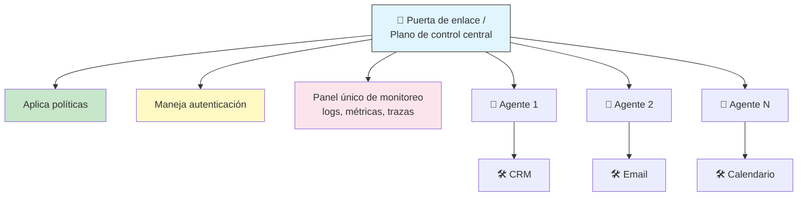

Todo el tráfico (usuario→agente, agente→herramienta, agente→agente) debe pasar por esta puerta de enlace.

### Aprendizaje y Evolución

Los agentes necesitan adaptarse o su rendimiento se degrada a medida que el mundo cambia.

```
Fuentes de aprendizaje:
  - Análisis de experiencia en tiempo de ejecución (logs, trazas)
  - Feedback de usuarios
  - Señales externas (políticas actualizadas de la empresa)

Output del feedback:
  - Refinar system prompts
  - Mejorar ingeniería de contexto
  - Optimizar o crear nuevas herramientas
```

### Simulación — El "Gimnasio de Agentes"

Entorno seguro fuera de producción para:
- Simular interacciones
- Usar datos sintéticos
- Involucrar expertos de dominio
- Probar estrés y optimizar colaboración entre agentes
- Sin impacto en usuarios reales

---

## Ejemplos Reales

### Google Co-Scientist (Nivel 3-4)

Sistema para investigación científica que actúa como **colaborador virtual de investigación**:

```
Agente Supervisor → gestiona el proyecto, delega:
  ├── Agente de formulación de hipótesis
  ├── Agente de diseño de experimentos
  └── Agente de análisis de datos

Itera y refina ideas → refleja flujo de trabajo de investigación humana
```

### Alphavolve (Nivel 4)

Sistema que descubre y optimiza algoritmos usando:
- **LLMs** para generar código
- **Proceso evolutivo automatizado** para probar y mejorar

Ha encontrado operaciones más eficientes de centro de datos y formas más rápidas de matemáticas fundamentales (ej: multiplicación de matrices).

> La asociación: la IA genera soluciones (código), los humanos proveen guía experta, métricas de evaluación y aseguran que las soluciones sean comprensibles.

---

## Conclusión

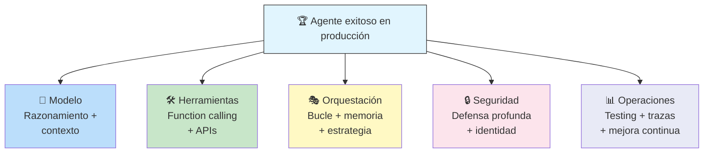

> El éxito de un agente no depende solo del modelo más inteligente. Depende del **rigor de ingeniería**: la arquitectura, la gobernanza, la seguridad, las pruebas y la observabilidad. Tu rol evoluciona de **codificador a arquitecto**, de operador a **director** guiando sistemas autónomos.

---

## Navegación

- [[dia-2-agent-tools-y-interoperabilidad-mcps]] → Siguiente: herramientas del agente y MCP
- [[opcional-dia-1-livestream]] → Siguiente: Livestream Q&A del Día 1
- [[5-day-ai-agents-intensive-course-with-google]] ← Volver al índice
