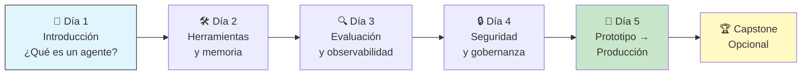
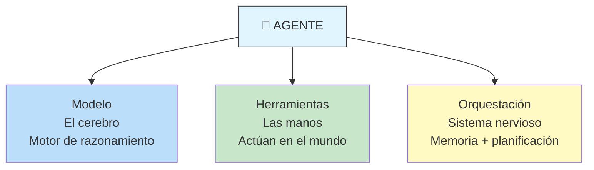
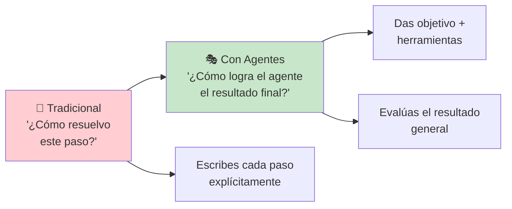
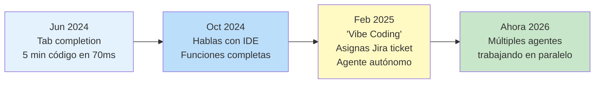
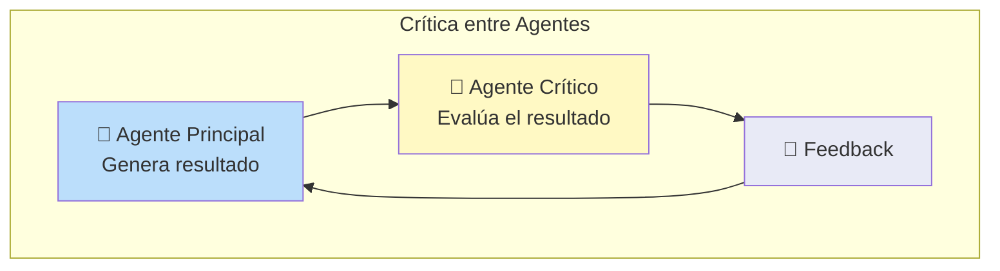
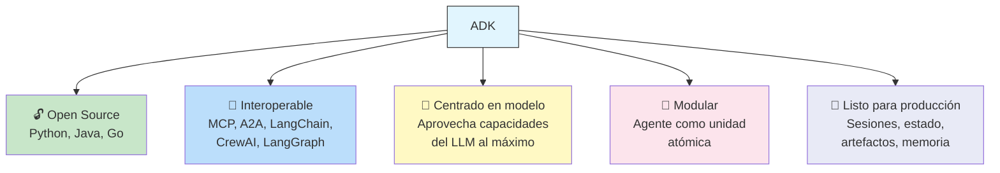
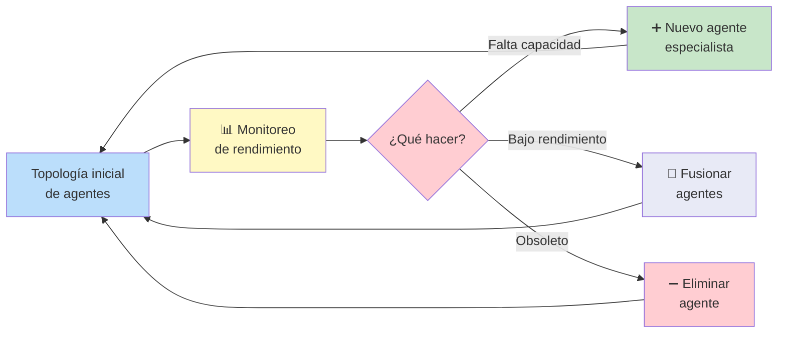
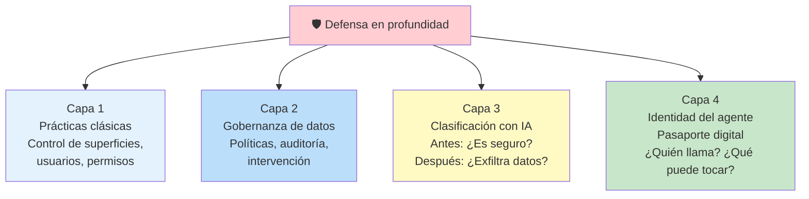
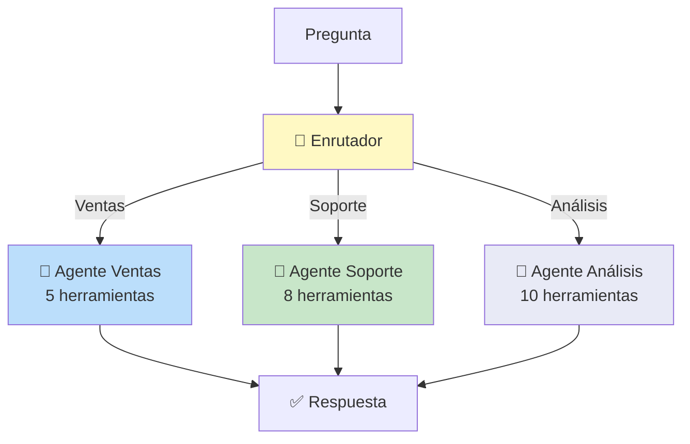
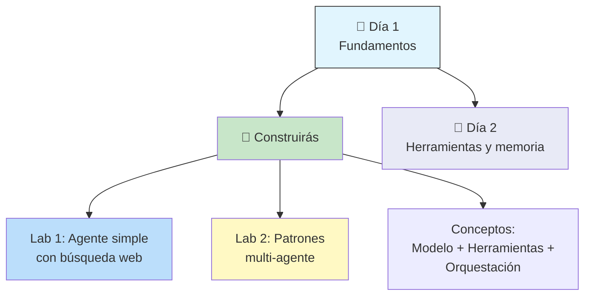

# Día 1 — Livestream: Q&A con Expertos de Google

*Livestream del curso intensivo de 5 días de Google × Kaggle. Panel de expertos, overview del whitepaper, laboratorios de código y quiz.*

---

## Overview del Curso



**Formato diario:**
- **Whitepaper** técnico para leer
- **Podcast** resumido (companion)
- **Code labs** prácticos
- **Livestream** Q&A con expertos
- **Capstone opcional** al final del curso

---

## Resumen del Whitepaper (por Anand)

Tres componentes centrales de un agente:



**El bucle fundamental:** Pensar → Actuar → Observar

**Taxonomía (N0 → N4):**

| Nivel | Nombre | Capacidad |
|-------|--------|-----------|
| N0 | Motor de razonamiento | Solo LLM, sin herramientas |
| N1 | + Herramientas | Conectado al mundo exterior |
| N2 | Solucionador estratégico | Ingeniería de contexto, metas multi-paso |
| N3 | Colaboración multi-agente | Equipos de agentes (Co-Scientist) |
| N4 | Auto-evolución | Crea sus propias herramientas (Alphavolve) |

**Conceptos clave introducidos:**
- **Sistemas multi-agente**: múltiples agentes colaborando
- **A2A (Agent-to-Agent)**: protocolo para comunicación entre agentes
- **Identidad del agente**: nueva clase de identidad para gobernanza
- **Seguridad**: confianza en sistemas autónomos

---

## Panel de Preguntas y Respuestas

### 🧑‍💻 El Cambio del Desarrollador: De Código a Dirección

**Participante:** Mike Clark — Producto de Agentes en Google Cloud

> Los agentes cambian el paradigma: pasas de escribir código explícito para cada tarea a pensar en el **resultado general** que el agente debe lograr.



**Puntos clave:**
- El código ya no es sobre "cómo se ve mi sintaxis", sino sobre "¿está resolviendo el resultado?"
- Los desarrolladores ahora también deben **evaluar y medir** el rendimiento del proceso general
- Surge el **desarrollador ciudadano**: personas sin experiencia en código ahora pueden crear software
- El oficio del desarrollador se vuelve menos sobre escribir código y más sobre **arquitectura y orquestación**

---

### 🚀 Visión a Largo Plazo: Agentes que se Auto-mejoran

**Participante:** Michael G — VP de Producto, Vertex AI

**Michael G** presentó una línea de tiempo de la evolución de los agentes de código:



**Tres formas en que los agentes transforman los negocios:**

| Forma | Descripción | Ejemplo |
|-------|-------------|---------|
| **Desarrollador ciudadano** | No-ingenieros crean código de producción | Vendedores haciendo demos técnicas, PMs haciendo análisis estadístico |
| **Productividad individual** | Una persona acelera su trabajo | Vendedor usa agente de investigación profunda para expediente de cliente |
| **Transformación de procesos** | Equipos completos automatizan flujos complejos | Farmacéutica: bloqueo de base de datos de estudio clínico → resumen para FDA |

---

### 🔄 Patrones de Agentes que se Auto-mejoran

**Participante:** Antonio — Oficina del CTO de Google



**Patrones emergentes:**
- **Crítica entre agentes**: un agente produce resultados, otro agente los critica
- **Optimización de topología**: agentes que pueden fusionarse, dividirse o crear nuevos agentes según rendimiento
- **Agent broker**: un agente cuyo trabajo es "contratar" nuevos agentes, despedir otros, fusionar capacidades para maximizar rendimiento
- Las **evaluaciones** son críticas — necesitas medir para optimizar, y monitorear a lo largo del tiempo para detectar deriva

> Pronóstico de Antonio: en 2026 veremos cambios dinámicos de prompts y topologías de agentes.

---

### 🎤 Nuevas Capacidades: Voz, Video, Uso de Computadora

**Participante:** Alan — PM, ex-ingeniero de software

**Principio clave:** empieza simple, añade capas gradualmente.

```
Recomendación:
  1. Empieza con texto y herramientas básicas
  2. Depura en escenario simple
  3. Añade nuevas interfaces encima (voz, video, etc.)
```

**Computer Use:** permite al agente hacer todo lo que un humano hace en una computadora (clic, llenar formularios, navegar). Aumenta el alcance cuando no hay APIs disponibles.

**Caso real: DoorDash (audio a audio):**
```
Contexto: Un Dasher (repartidor) tiene ambas manos ocupadas
          con un paquete, un perro ladrando, bicicleta encadenada.
          
Problema: ¿Puede dejar el paquete en el patio delantero?
          Necesita buscar la política corporativa.

Solución: Agente con audio en vivo (70-200ms de latencia).
          El Dasher habla, el agente busca la política en RAG,
          responde sin que el Dasher suelte el paquete.
```

**Consideraciones técnicas:**
- RAG para acceso rápido a datos
- Función de banco de memoria (sub-agente que analiza comportamiento y almacena datos sintéticos)
- Caché para acelerar respuestas recurrentes

---

### 🏗️ Principios de Diseño de ADK

**ADK (Agent Development Kit)** — el framework que se usa en el curso.



**Principios:**
1. **Open source** — cualquiera puede contribuir
2. **Interoperable** — funciona con MCP, A2A, LangChain, LangGraph, CrewAI, APIs OpenAPI, wrappers empresariales
3. **Centrado en el modelo** — apuesta a que los modelos son cada vez mejores; no limitarlos con flujos deterministas
4. **Modular** — agente como unidad atómica; fácil empezar, control total cuando se necesita
5. **Producción** — sesiones, estado, artefactos, memoria a largo plazo

**Diferenciador clave:** el **estado (state)** de diseño — separa un chatbot de juguete de un agente listo para producción.

---

### 🎯 Auto-organización de Agentes

**Participante:** Antonio — Continuación

Los agentes pueden **auto-organizarse** para optimizar su rendimiento:



> Recomendación: leer el paper "Multi-Agent Design" de Google y el libro de Antonio sobre **patrones de diseño de agentes**.

---

### 🔒 Seguridad: Identidad y Gobernanza

**Participante:** Michael G, Mike Clark, Alan

**Separación de preocupaciones:**
1. **MCP** (Model Context Protocol) — el propietario de los datos expone datos con gobernanza
2. **A2A** (Agent-to-Agent) — agente responde con datos mitigados según la identidad del llamante

**Defensa en profundidad:**



**Nuevo anuncio (sigiloso):** Protocolo **A2A UI** — generar UI como parte de la interacción agente, no solo acciones.

---

### 🔗 Encadenar 50+ Herramientas

**Participante:** Alan, Mike

> **Recomendación principal: NO metas 50 herramientas en un solo agente.**

**Estrategia:**
- Divide en **agentes especializados** (5-10 herramientas cada uno)
- Enruta al agente apropiado según la tarea
- **Recuperación dinámica de herramientas** → de una base de datos de 1000 herramientas, solo obtienes las 4 relevantes para el contexto actual

**Problemas al escalar:**
- 50 herramientas → 500 pasos → el **contexto** crece enormemente
- Mayor latencia, mayor costo, menor calidad
- Solución: romper en agentes paralelos, usar el modelo correcto para cada paso



**Patrones de flujo de trabajo multi-agente:**
- **Secuencial**: pipeline, cada paso depende del anterior (blog post)
- **Paralelo**: agentes independientes trabajan simultáneamente
- **Bucle**: iterar y refinar hasta cumplir criterio (agente crítico)

---

## Laboratorios de Código del Día 1

Presentados por **Chris Overholt** (Developer Advocate) y **Hanfei** (Co-fundador/Lead de ADK).

### Laboratorio 1: Del Prompt a la Acción

Tres aprendizajes principales:

1. **Diferencia entre LLM y Agente**
   - LLM: prompt → respuesta de texto
   - Agente: prompt + modelo + instrucciones + herramientas → decide qué herramienta usar y en qué orden

2. **Construir un agente simple**
   - ~10 líneas de código
   - Agente con herramienta de **Google Search** (built-in en Gemini)
   - Ejemplo: preguntar sobre ADK (publicado la semana pasada → el LLM no lo sabe en entrenamiento → el agente lo busca)

3. **Interfaz Web de ADK**
   - ADK Web UI para interactuar con el agente
   - Evaluación y observabilidad en días posteriores

### Laboratorio 2: Sistemas Multi-Agente

Tres aprendizajes principales:

1. **¿Por qué multi-agente?**
   - Un solo agente se sobrecarga con demasiadas instrucciones y herramientas

2. **Patrones de diseño:**
   - **Flujo secuencial** → pipeline reproducible (ej: escribir blog post paso a paso)
   - **Flujo paralelo** → agentes independientes trabajan simultáneamente
   - **Agente de bucle** → iterar y refinar hasta cumplir criterio (ej: generar historia + crítico que mejora)

3. **¿Cuándo usar cada patrón?**
   - Diagrama de flujo para elegir el tipo de agente según la tarea

---

## Quiz del Día 1

Preguntas del livestream para evaluar comprensión del whitepaper:

| # | Pregunta | Opciones | Respuesta |
|---|----------|----------|-----------|
| 1 | ¿Cuáles son los 3 componentes esenciales de un agente? | A) Modelo, UI, BD / **B) Modelo, Herramientas, Orquestación** / C) Prompt, RAG, Output / D) Razonamiento, Memoria, Gateway | **B** |
| 2 | ¿Cuál es el orden correcto del proceso de 5 pasos? | A) Pensar → Actuar → Misión → Escanear → Observar / B) Misión → Pensar → Escanear → Actuar → Observar / **C) Misión → Escanear → Pensar → Actuar → Observar** / D) Escanear → Misión → Pensar → Observar → Actuar | **C** |
| 3 | ¿Qué distingue un Nivel 2 de un Nivel 1? | A) Usar herramientas externas / B) Colaborar con otros agentes / C) Crear herramientas dinámicamente / **D) Ingeniería de contexto para metas multi-paso** | **D** |
| 4 | ¿Cuál es el rol principal de la capa de orquestación? | **A) Conductor: gestiona el bucle pensar-actuar-observar** / B) Cerebro: razonamiento / C) Manos: herramientas / D) Memoria a largo plazo | **A** |
| 5 | ¿Qué define un agente Nivel 4 (auto-evolución)? | A) Ejecutar sin supervisión / **B) Evolucionar capacidades y crear nuevas herramientas** / C) Equipo de agentes / D) Modelo multimodal | **B** |

---

## ADK en Números

| Dato | Valor |
|------|-------|
| Estrellas GitHub | 14,000+ |
| Descargas | Muchos millones |
| Lenguajes | Python, Java, Go |
| Licencia | Open source |
| Filosofía | Interoperable, neutral, producción |

---

## Conclusión



> "No es el año de los agentes, es la década de los agentes" — Karpathy

---

## Navegación

- [[dia-1-introduccion-a-agentes]] ← Anterior: introducción a los agentes
- [[dia-2-agent-tools-y-interoperabilidad-mcps]] → Siguiente: herramientas del agente
- [[5-day-ai-agents-intensive-course-with-google]] ← Volver al índice
