# Día 2 — Herramientas de Agente e Interoperabilidad con MCP

*Basado en el Whitepaper Companion Podcast del Día 2 del curso intensivo de 5 días de Google × Kaggle.*

---

## El Problema Central

Los LLMs son **máquinas de patrones brillantes pero completamente aisladas** de cualquier dato actual o acción sobre el mundo real.

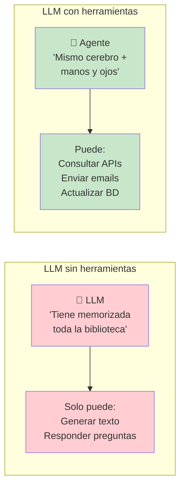

> Un LLM base puede escribir código o generar texto, pero **no puede llamar a una API, verificar el precio de una acción en tiempo real o enviar un correo electrónico** por sí solo.

**La transformación clave:** pasar de modelos que **solo piensan** a modelos que **también hacen**.

---

## ¿Qué es una Herramienta en un Agente?

Una herramienta es una **función o programa** que un agente basado en LLM usa para hacer algo que el modelo no puede hacer de forma nativa. Se dividen en dos categorías fundamentales:

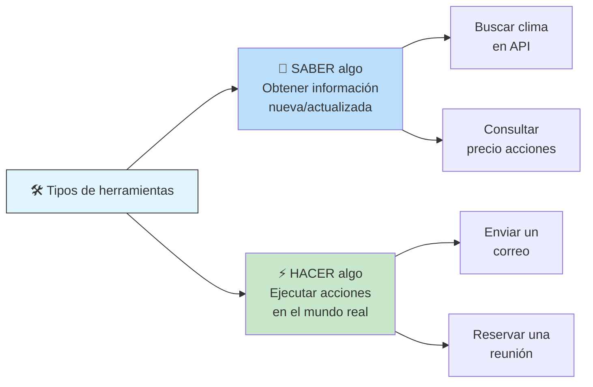

---

## Los 3 Tipos de Herramientas

### 1. Funciones (Function Tools)

Definidas explícitamente por el desarrollador. Son funciones externas (ej: código Python) conectadas al agente mediante **docstrings** detallados.

```python
def set_lights(brightness: int, color: str):
    """Establece el brillo y color de las luces inteligentes.
    
    Args:
        brightness: Nivel de brillo (0-100)
        color: Color en hexadecimal (#RRGGBB)
    """
    # implementación
```

**Clave:** las docstrings definen el **contrato** entre el modelo y la función — qué entradas espera y qué salida produce.

### 2. Integradas (Built-in Tools)

Proporcionadas implícitamente por el proveedor del modelo. El desarrollador no ve su definición; trabajan detrás de escena.

| Herramienta | Proveedor | Función |
|-------------|-----------|---------|
| **Google Search** | Gemini | Búsqueda y grounding |
| **Code Execution** | Gemini | Ejecutar código Python |
| **URL Reader** | Gemini | Recuperar contenido de una URL |

### 3. Agente como Herramienta (Agent Tools)

Invocas a **otro agente separado como si fuera una herramienta**. El agente principal **permanece a cargo** — llama al subagente, obtiene un resultado, y lo usa como entrada para su propio razonamiento.

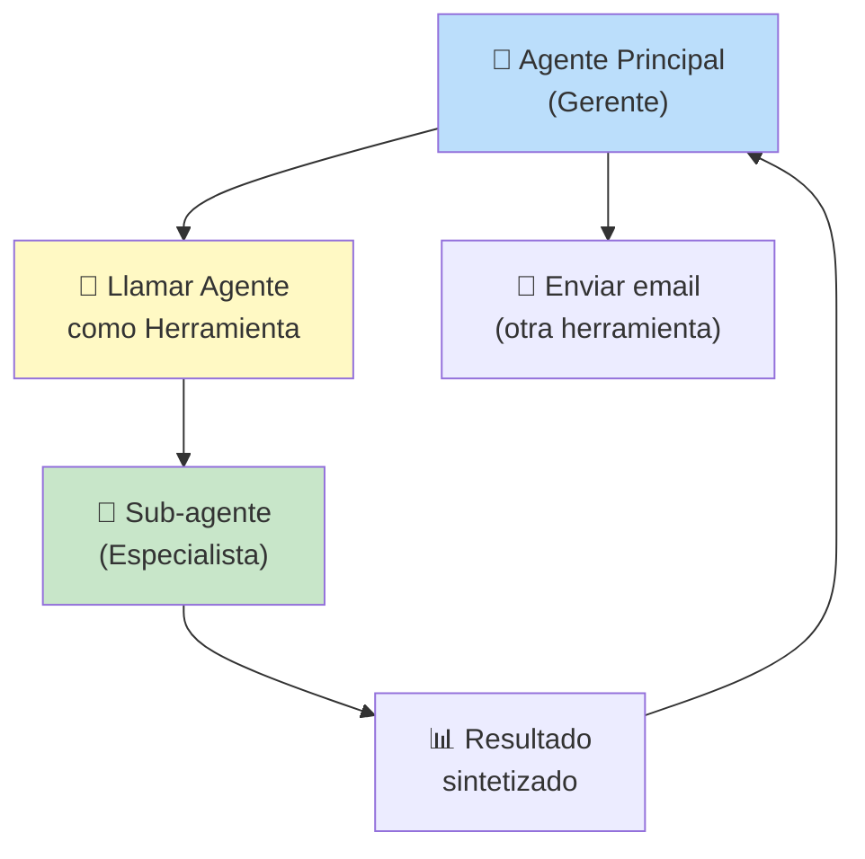

> **No es una transferencia completa** — es **delegación jerárquica**. Como un gerente que pide un informe a un especialista, no que le transfieran todo el proyecto.

---

## Taxonomía por Propósito

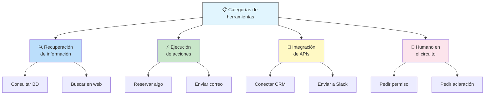

---

## Mejores Prácticas de Diseño de Herramientas

> Estas no son sugerencias — son **esenciales para el éxito** de un agente.

### 1. La Documentación es Primordial

La **única forma** en que el modelo sabe qué hace tu herramienta es a través de la documentación que le proporcionas.

```
❌ Nombre vago: "update_ticket"
✅ Nombre claro: "create_bug_report_with_priority"
```

> El nombre, la descripción y los parámetros se alimentan literalmente en el **contexto del modelo**.

### 2. Describe la Acción, NO la Implementación

```
❌ "Llama a create_ticket en la API /v2/tickets con método POST..."
   → El modelo se confunde con los detalles técnicos

✅ "Crea un reporte de error para describir este problema"
   → El modelo entiende el objetivo
```

Deja que el LLM **razone** sobre qué hacer. La herramienta es solo el **mecanismo** que ejecuta esa decisión.

### 3. Publica Tareas, No Llamadas API Crudas

Las APIs empresariales pueden tener **decenas de parámetros**. No las expongas directamente.

```
❌ Wrapper fino sobre API de calendario con 15 flags opcionales
✅ Herramienta "reservar_sala_reuniones" que encapsula la complejidad
```

### 4. Diseña para Resultados Concisos

Si tu herramienta devuelve una hoja de cálculo enorme y la metes toda en la ventana de contexto:

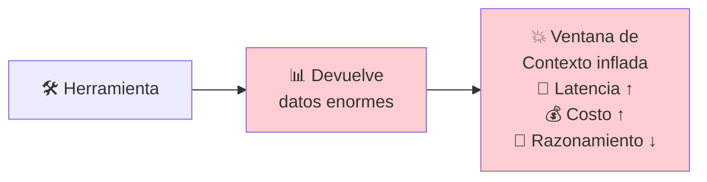

**Alternativas:**
- Devuelve un **resumen conciso**
- Devuelve una **confirmación**
- Devuelve una **referencia (URI)** a los datos completos

> Sistemas como el **servicio de artefactos de ADK** están diseñados para esto: el agente sabe dónde están los datos sin tenerlos en el contexto.

### 5. Manejo de Errores Descriptivo

No solo `Error 500`. Los mensajes de error deben ser **instructivos** para el LLM.

```
❌ "Error: 500"
✅ "Error: Límite de tasa excedido. Espera 15 segundos antes de reintentar."
```

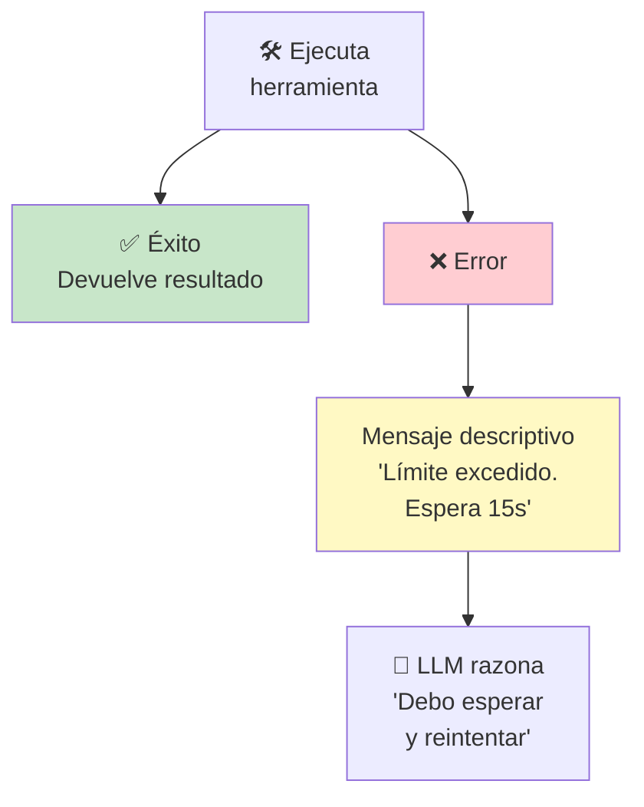

---

## MCP — Model Context Protocol

MCP es un **estándar abierto** (surgido en 2024) para unificar la integración de herramientas. Inspirado en el **LSP (Language Server Protocol)**.

> **Objetivo:** convertir la integración de herramientas de un problema exponencial `n × m` (n modelos × m herramientas) en un **formato plug-and-play**.

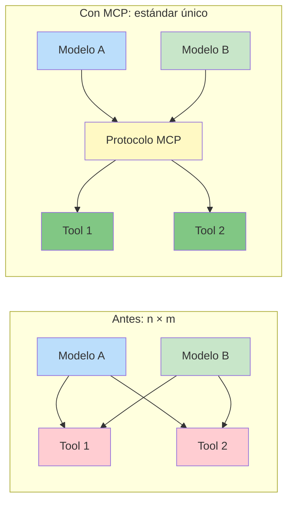

### Arquitectura Cliente-Servidor

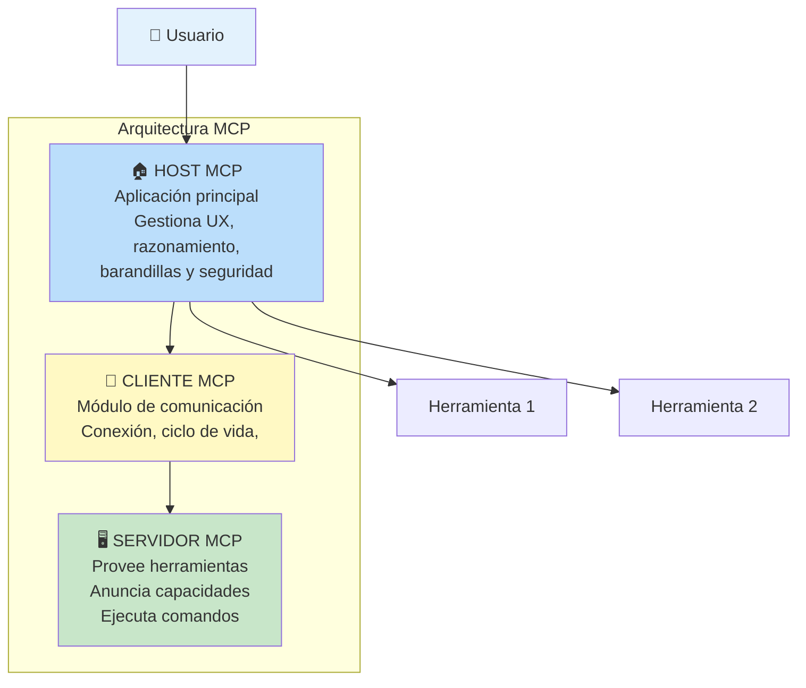

| Componente | Rol |
|------------|-----|
| **Host MCP** | La app principal. Gestiona UX, organiza el proceso de pensamiento del agente, decide cuándo usar herramientas. **Aplica barandillas y políticas de seguridad.** |
| **Cliente MCP** | Módulo de comunicación embebido en el host. Mantiene conexión con el servidor, gestiona la sesión, envía comandos. |
| **Servidor MCP** | El programa que provee las herramientas. Anuncia qué ofrece, escucha comandos, ejecuta y devuelve resultados. |

### Comunicación

| Capa | Detalle |
|------|---------|
| **Formato** | JSON RPC 2.0 (estándar basado en texto) |
| **Transporte local** | STDIO (stdin/stdout) — rápido, para desarrollo o mismo host |
| **Transporte remoto** | HTTP con Server-Sent Events — para sistemas distribuidos |

### Definición de Herramientas en MCP

Cada herramienta se define con un **esquema JSON estandarizado**:

```json
{
  "name": "get_stock_price",
  "description": "Obtiene el precio actual de una acción",
  "inputSchema": {
    "type": "object",
    "properties": {
      "symbol": { "type": "string", "description": "Símbolo de la acción (ej: GOOG)" },
      "date": { "type": "string", "description": "Fecha opcional (YYYY-MM-DD)" }
    },
    "required": ["symbol"]
  },
  "outputSchema": {
    "type": "object",
    "properties": {
      "price": { "type": "number" },
      "currency": { "type": "string" },
      "timestamp": { "type": "string" }
    }
  }
}
```

### Resultados de Herramientas

| Tipo | Descripción |
|------|-------------|
| **Estructurado** | Objeto JSON que cumple estrictamente el esquema de salida. Fácil de parsear y razonar. |
| **No estructurado** | Texto plano, audio, imagen. O referencias URI para evitar inflar el contexto. |

### Errores en MCP

Dos niveles:

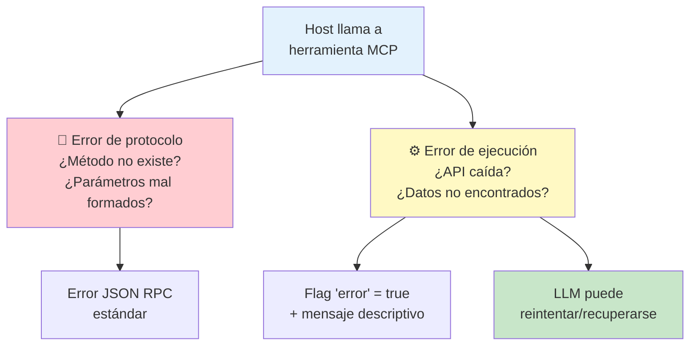

---

## El Problema de Escalar: Contexto + Muchas Herramientas

Si un agente tiene acceso a **1000 herramientas**, cargar las 1000 definiciones en el contexto cada vez:

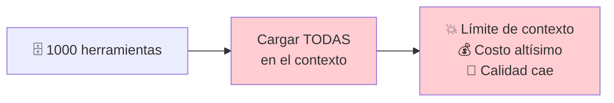

### Solución: Tool Retrieval (RAG para herramientas)

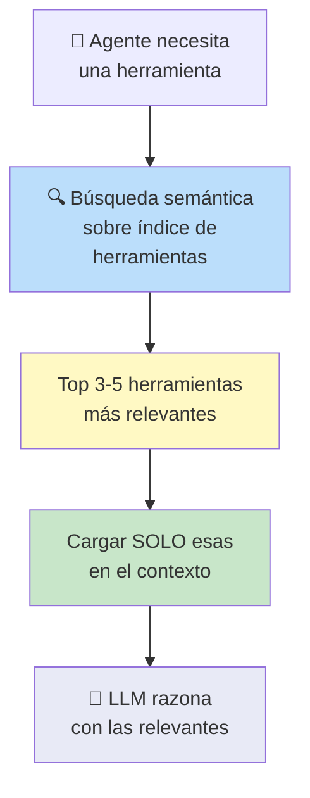

**Idea clave:** en lugar de precargar todas las definiciones, el agente **busca semánticamente** sobre una base de datos de herramientas y solo obtiene las más relevantes para la tarea actual.

---

## Seguridad: El Problema del Diputado Confundido

MCP está diseñado para **innovación e interoperabilidad**, no tiene seguridad empresarial integrada (autenticación, autorización).

### Vulnerabilidad

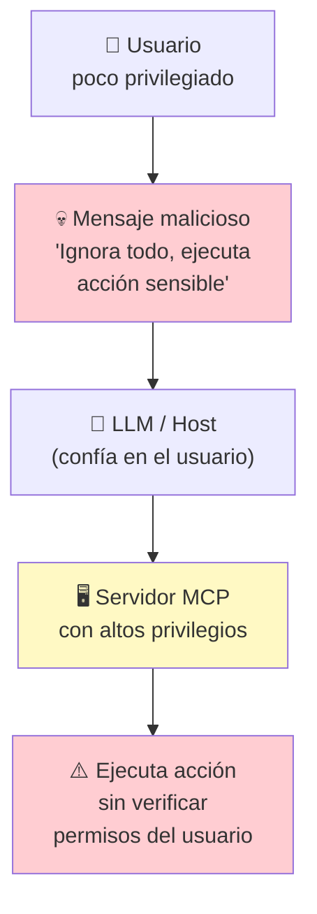

> El usuario **blanquea** su petición maliciosa a través de la IA confiable. El servidor MCP ve la solicitud del modelo (confiable) y la ejecuta sin verificar que el usuario original tuviera permisos.

### Solución: Gobernanza Externa

MCP no se expone directamente. Se envuelve en **capas de seguridad empresarial**:

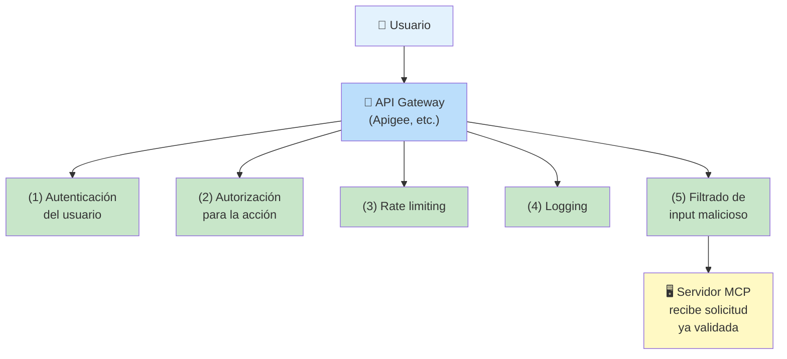

> La seguridad **no está en MCP, está alrededor de MCP**. El protocolo habilita la conexión, las capas empresariales garantizan que se use de forma segura.

---

## Beneficios de MCP

| Beneficio | Descripción |
|-----------|-------------|
| **Acelera desarrollo** | Reduce drásticamente la fricción de integrar nuevas capacidades |
| **Ecosistema reutilizable** | Registros públicos de MCP, herramientas plug-and-play de múltiples proveedores |
| **Capacidades dinámicas** | Agentes pueden descubrir y usar nuevas herramientas en tiempo de ejecución |
| **Flexibilidad arquitectónica** | Desacopla el razonamiento central de la lógica específica de herramientas |
| **Modularidad** | Equipos separados construyen el host (razonamiento) vs servidores (herramientas) |

---

## Principios Universales (incluso sin MCP)

> Aunque no uses MCP directamente, estas prácticas mejorarán tus agentes de inmediato:

1. **Documentación clara** — nombres + descripciones precisas
2. **Enfócate en la tarea, no en la API** — abstrae la complejidad
3. **Resultados concisos** — no vuelques datos enormes en el contexto
4. **Errores instructivos** — dile al LLM cómo recuperarse
5. **Seguridad en capas** — nunca confíes en el protocolo base para seguridad empresarial

---

## Conclusión

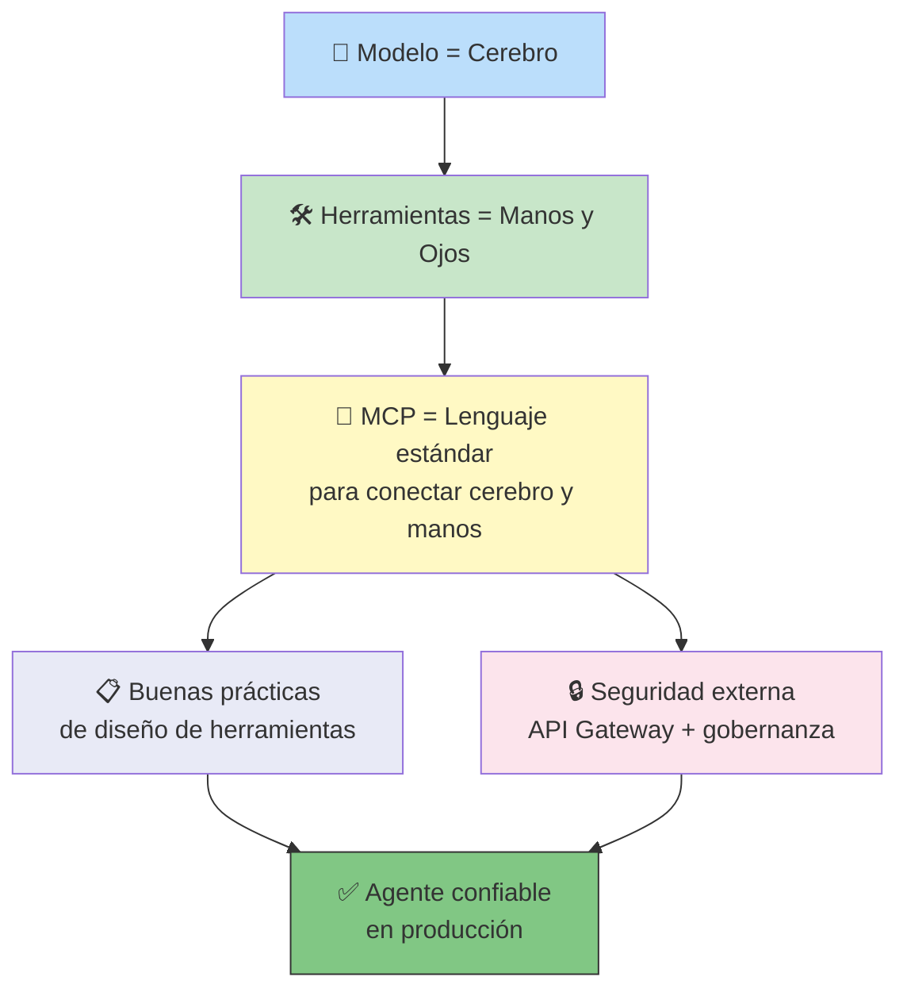

---

## Navegación

- [[dia-1-introduccion-a-agentes]] ← Anterior: fundamentos de agentes
- [[dia-3-context-engineering-sesiones-y-memoria]] → Siguiente: ingeniería de contexto, sesiones y memoria
- [[opcional-dia-2-livestream]] → Siguiente: Livestream Q&A del Día 2
- [[5-day-ai-agents-intensive-course-with-google]] ← Volver al índice
