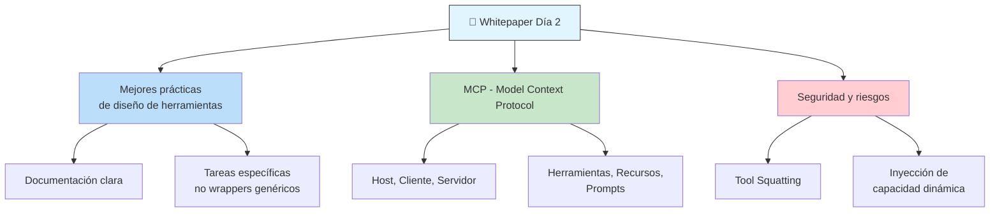
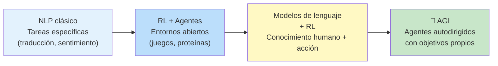
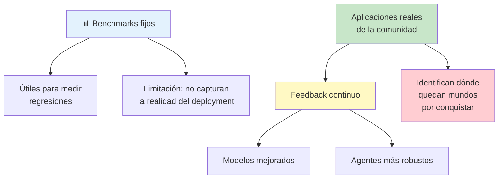
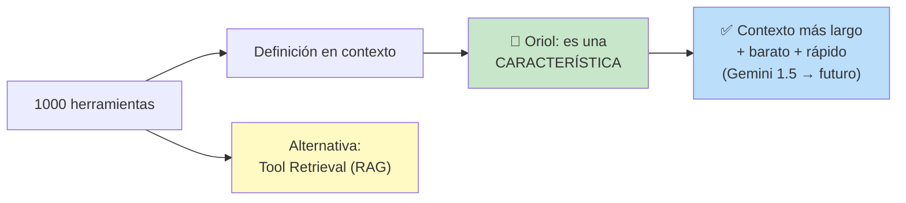
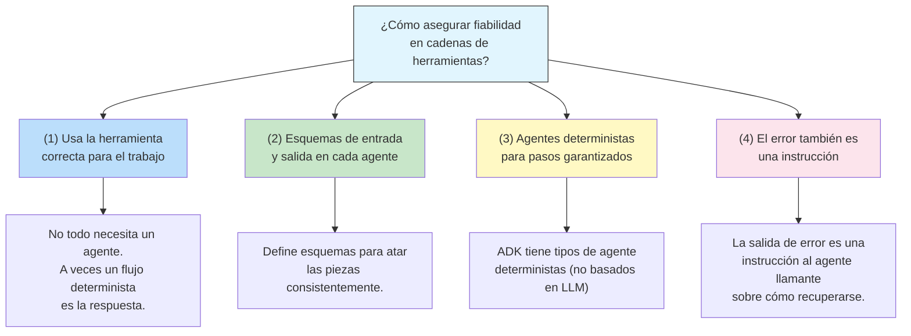
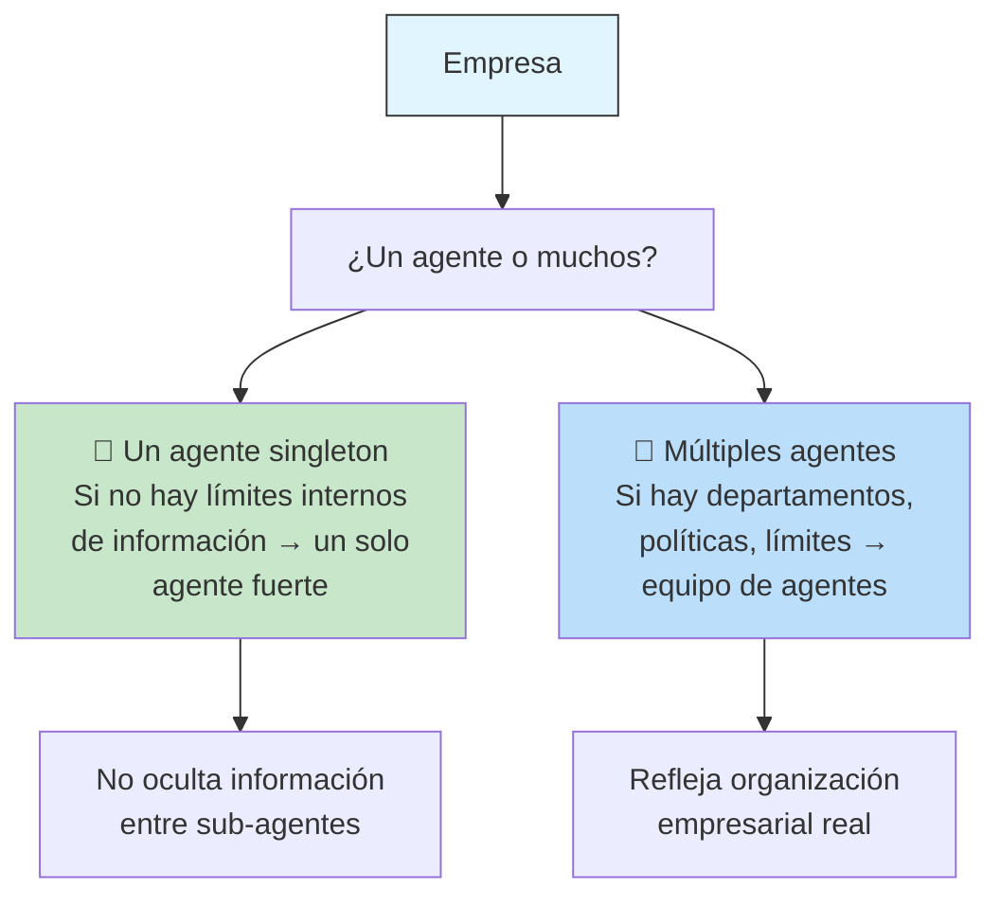
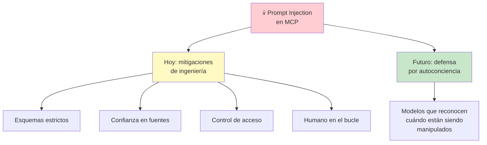
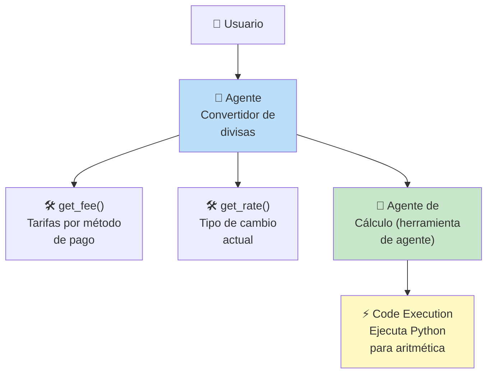
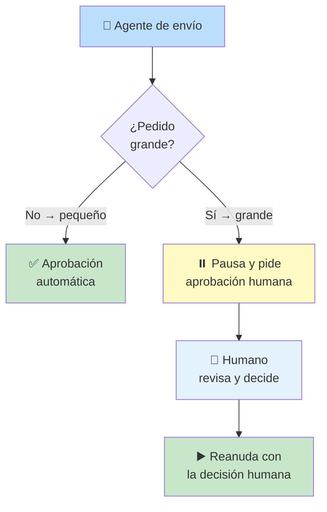

# Día 2 — Livestream: Herramientas, MCP y el Futuro de los Agentes

*Livestream del Día 2 del curso intensivo de 5 días de Google × Kaggle. Panel con Dr. Alex, Oriol Vinyals, Edward, Mike.*

---

## Panel de Expertos

| Nombre | Rol |
|--------|-----|
| **Dr. Alex** | Científico de la computación y físico. Piensa en resolver los problemas más difíciles del mundo con IA. |
| **Oriol Vinyals** | VP de Investigación, co-líder técnico del modelo Gemini (12 años en Google) |
| **Edward (Ed)** | Director de Investigación en Google DeepMind (Frontier AI), Profesor Honorario UCL |
| **Mike** | Ingeniero de software, coautor del whitepaper, arquitecto de soluciones en Google |

---

## Overview del Whitepaper del Día 2 (por Anand)

**El problema N×M:** conectar cada modelo a cada herramienta existente escala cuadráticamente. MCP lo resuelve desacoplando agentes de implementaciones específicas.

> MCP es como **USB para agentes de IA**.

**Primitivas de MCP:**
- **Herramientas** → tomar acciones
- **Recursos** → leer datos externos (archivos, logs, BD)
- **Prompts** → compartir instrucciones reutilizables

**Nuevos riesgos de seguridad:**
- **Tool Squatting** → herramienta maliciosa engaña al agente para usarla en lugar de la legítima
- **Inyección de capacidad dinámica** → el agente hereda habilidades sin las aprobaciones necesarias

---

## Q&A: ¿Hacia dónde van los Agentes?

### 🧠 El Camino hacia AGI

**Oriol:** Los agentes que **hacen investigación de IA/ML por sí mismos** son increíblemente emocionantes. Automatizar partes del desarrollo del modelo Gemini. Los LLMs **ya están evolucionando para ser agentes** — esa era la visión original de Gemini.

**Edward:** El lenguaje es uno de los sustratos de la inteligencia humana. Los modelos de lenguaje ahora se combinan con **aprendizaje por refuerzo** para actuar sobre entornos arbitrarios. Gracias a protocolos como MCP, esos entornos se definen casi en el punto de uso.

**Pregunta profunda de Edward:** ¿Cómo imbuir a los agentes de **autodirección** — la capacidad de establecer sus propios objetivos, medir su éxito, y convertirse en **socios verdaderamente autónomos**?

---

### 📊 Más Allá de los Benchmarks

**Edward:** Los benchmarks siguen siendo importantes pero son un **sustituto** de la capacidad real de implementación. El problema es que las aplicaciones reales de agentes ahora son **dirigidas por el usuario** — el ingeniero de prompts, el contexto, los servidores MCP.

> La mejor manera de evaluar es confiar en **datos de aplicaciones reales** — la comunidad construye, reporta dónde falla, y eso informa la siguiente iteración.

---

### 🛠️ Miles de Herramientas en Contexto

**Pregunta:** Los protocolos actuales requieren definiciones de herramientas en contexto, consumiendo tokens valiosos. ¿Qué avances permitirían manejar nativamente miles de herramientas?

**Oriol:** *Desafía la premisa.* La capacidad del modelo para **seguir instrucciones y aprender en contexto** son características críticas de la inteligencia. Definir herramientas en contexto es una **característica, no un problema**.

> El desafío real es la **gestión eficiente del contexto**: contexto más largo, más barato, más rápido.

**Contexto largo de Gemini:** Gemini 1.5 ya rompió los 10 millones de tokens. Siguen trabajando en contexto aún más largo, barato (casi gratis) y súper rápido.

---

### 🔗 Confiabilidad en Cadenas de Herramientas

**Mike — 4 consejos para manejar errores en toolchains:**

---

### 🧪 Entrenamiento con Herramientas Simuladas

**Pregunta:** ¿El entrenamiento de modelos evolucionará para incluir episodios de uso de herramientas simuladas, en lugar de aprender herramientas solo desde prompts y esquemas?

**Oriol:** Sí, a través de **self-play** y **aprendizaje curricular**, el modelo podría idear sus propias combinaciones de herramientas. Esto podría ser un **ingrediente clave para la escalabilidad del post-entrenamiento**.

**Dilema:** El uso de herramientas podría ser un **artefacto de las limitaciones actuales del modelo** que eventualmente sea absorbido por los pesos del modelo. ¿Tener un "modelo del mundo" de cada herramienta podría eliminar la necesidad de herramientas?

> Apostaría **en contra** de eso por ahora. Las herramientas son como **abstracción y reutilización de software** — es parte de cómo pensamos.

---

### 🌐 Internet de Agentes

**Dr. Alex:** El futuro cercano podría tener una **proporción diluida entre humanos y agentes** en actividades económicas.

**Gobernanza:** las limitaciones de los agentes se parecerán más a **límites de responsabilidad legal/ética** — ¿cuál es el número mínimo de personas físicas que pueden supervisar una flota de agentes?

**Agente singleton vs multitud de agentes:**

---

### 🔒 Protocolo Multi-Agente contra Inyección

**Mike — 3 mitigaciones:**

1. **Esquemas de entrada/salida** → limitan posibilidades de salidas no deseadas
2. **Confianza en las fuentes** → tool squatting ocurre cuando un servidor MCP no confiable presenta herramientas inesperadas. Verifica el operador/mantenedor.
3. **Control de acceso propagado** → la confianza del usuario debe propagarse a través del sistema hasta la fuente de datos
4. **Humano en el bucle (HITL)** → para operaciones sensibles, el protocolo MCP permite pausar y pedir aprobación humana

**Dr. Alex:** La inyección de prompts ha pasado de ser un **problema de ingeniería** (soluble con regex, plantillas, etc.) a ser uno de los **grandes desafíos de la IA/ML**, porque ahora operamos en un mundo desestructurado de lenguaje natural.

> La inyección de prompts en llamadas MCP es un **caso especial de ataque de envenenamiento** contra sistemas autónomos. La solución a largo plazo probablemente implique sistemas capaces de **introspección en sus activaciones internas** — autoconciencia.

---

## Reflexiones Finales del Panel

| Experto | Mensaje |
|---------|---------|
| **Edward** | Estamos en uno de dos escenarios: o tenemos todos los ingredientes para la superinteligencia y solo necesitamos escalar, o no. Ustedes, como constructores, son parte integral de determinar cuál es. |
| **Oriol** | La era de agentes ha comenzado. No es completamente nueva — se basa en mucho de lo que vino antes (RL, modelos de lenguaje, multimodal). El **andamiaje** alrededor de los modelos es la siguiente etapa evolutiva. |
| **Mike** | Paso más tiempo pensando en **lo que los agentes NO pueden hacer** que en lo que sí pueden. Pero lo que he visto es realmente impresionante. Recuerden pensar críticamente sobre **cuándo aplicar agentes y cuándo no**. |
| **Dr. Alex** | Pienso en lo que viene después de la superinteligencia: **soluciones a los problemas más difíciles del mundo**. Invito a la comunidad a colaborar en esto. |

---

## Resumen de Laboratorios de Código (Lakshmi)

### Laboratorio 1: Herramientas Personalizadas

**Objetivo:** Convertidor de divisas con herramientas Python + agente especialista.

**Concepto clave: Agent Tool vs Subagente**

| Patrón | Control | Quién habla con el usuario |
|--------|---------|---------------------------|
| **Agent Tool** | El agente principal mantiene el control | El agente principal |
| **Subagente** | El control se transfiere al subagente | El subagente |

> Dependiendo del escenario de negocio, elige uno u otro.

### Laboratorio 2: MCP y Operaciones de Larga Duración

**Flujo MCP en 4 pasos:**
1. Elige tu servidor MCP y las herramientas que quieres usar
2. Crea un **toolset MCP** configurando la conexión
3. Agrega la herramienta a tu agente
4. Ejecuta y prueba

**Humano en el bucle (operaciones largas):**

**Estado persistente:** los agentes estándar son **stateless** — si pausan, olvidan todo. La clave es **`resume=true`** en la configuración de la aplicación, que guarda todo el estado a un nivel de persistencia.

---

## Quiz del Día 2

| # | Pregunta | Opciones | Respuesta |
|---|----------|----------|-----------|
| 1 | ¿Qué problema principal resuelve MCP? | A) Latencia de inferencia / **B) Problema de integración N×M** / C) Falta de benchmarks / D) Memoria a largo plazo | **B** |
| 2 | ¿Cuál NO es un componente arquitectónico de MCP? | A) Host / B) Cliente / C) Servidor / **D) Gateway** | **D** |
| 3 | ¿Qué es un "recurso" en MCP? | A) Una función ejecutable / **B) Datos contextuales (archivos, logs, BD)** / C) Plantilla de prompt / D) Capacidad del cliente | **B** |
| 4 | ¿Qué es el problema del "diputado confundido"? | A) Servidor saturado / **B) Agente engañado para ejecutar acción dañina** / C) Deadlock entre agentes / D) Usuario confunde agente con humano | **B** |
| 5 | ¿Cuál es el transporte recomendado para MCP remoto? | A) STDIO / B) WebSockets / **C) HTTP con SSE** / D) gRPC | **C** |

---

## Navegación

- [[dia-2-agent-tools-y-interoperabilidad-mcps]] ← Whitepaper del mismo día
- [[dia-1-introduccion-a-agentes]] ← Anterior
- [[dia-3-context-engineering-sesiones-y-memoria]] → Siguiente: ingeniería de contexto
- [[5-day-ai-agents-intensive-course-with-google]] ← Volver al índice
