# Día 3 — Ingeniería de Contexto, Sesiones y Memoria

*Basado en el Whitepaper Companion Podcast del Día 3 del curso intensivo de 5 días de Google × Kaggle.*

---

## El Problema Central: Los LLM son Stateless

> **Los LLM son fundamentalmente apátridas.** Cada llamada API es como empezar de nuevo. El modelo tiene memoria cero del turno anterior.

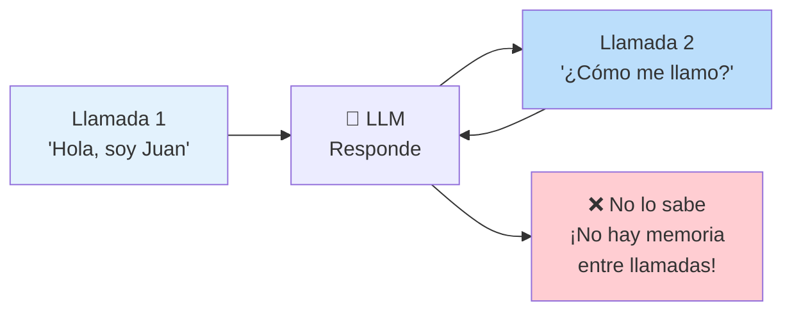

Para que un agente tenga **estado**, hay que construir dinámicamente un paquete de información complejo en **cada llamada**. Eso es exactamente la **ingeniería de contexto**.

---

## Las 3 Ideas Centrales

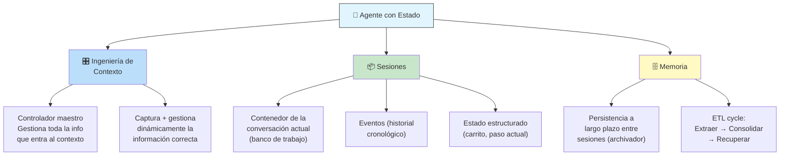

---

## Ingeniería de Contexto

No es solo **ingeniería de prompts**. La ingeniería de prompts es darle una receta al chef. La ingeniería de contexto es **prepararle toda la mise en place** (ingredientes correctos, herramientas listas, memoria del usuario).

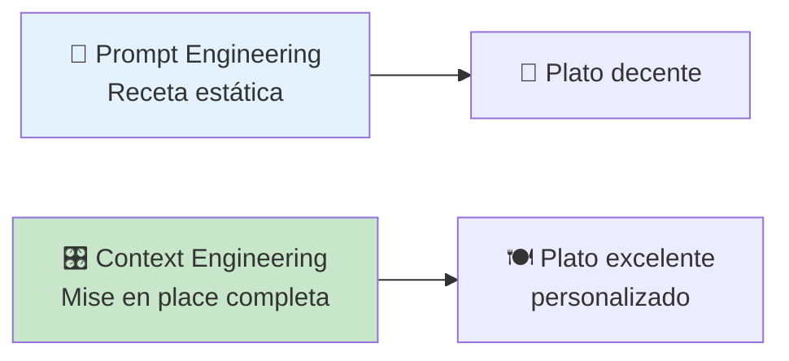

### ¿Qué incluye la ingeniería de contexto?

```
Datos operativos:
  - Instrucciones del sistema
  - Definiciones de herramientas
  - Ejemplos few-shot

Datos externos:
  - Memoria a largo plazo (recuperada)
  - Documentos vía RAG
  - Salidas de herramientas recién usadas

Datos de la conversación:
  - Historial del diálogo
  - Scratchpad temporal
  - Último mensaje del usuario
```

### El Problema: Context Decay (Podredumbre del Contexto)

> Cuando la ventana de contexto se llena demasiado y se vuelve ruidosa, la capacidad del modelo para prestar atención a las partes importantes y razonar efectivamente **se degrada**.

### El Ciclo de Gestión de Contexto

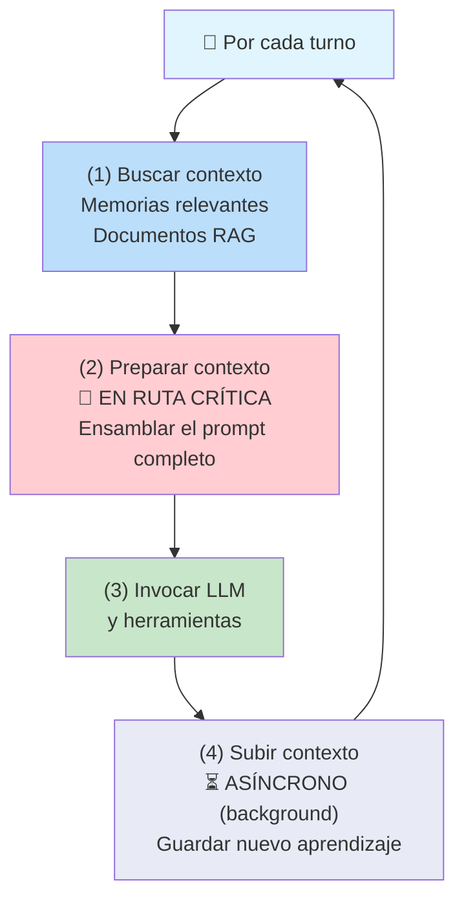

**Paso 4 crítico:** debe hacerse **de fondo, asincrónicamente**. Nunca debe bloquear la respuesta al usuario.

---

## Sesiones

La sesión es el **banco de trabajo** para una conversación continua. Es autónoma, específica de un usuario, y mantiene el contexto para una sola conversación.

### Estructura de una Sesión

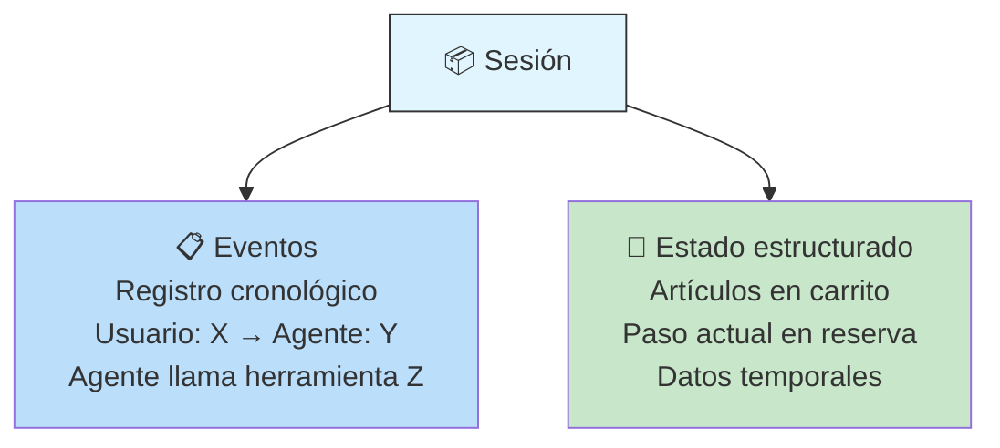

### Manejo de Sesiones por Framework

| Framework | Modelo de Sesión | Clave |
|-----------|------------------|-------|
| **ADK** | Objeto explícito con eventos + estados separados | Clara separación de concerns |
| **LangGraph** | Objeto de estado **mutable** como sesión | Permite compactación directa (reemplazar mensajes antiguos con resúmenes) |

### Sesiones en Sistemas Multi-Agente

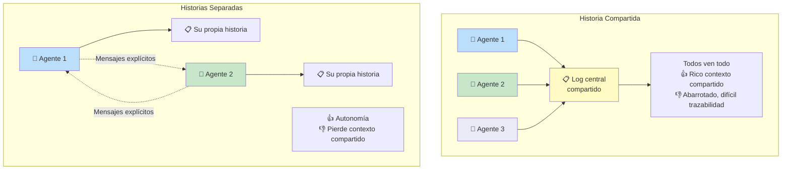

### Consideraciones de Producción

| Aspecto | Práctica |
|---------|----------|
| **Privacidad** | Aislamiento estricto (ACLs). Redactar PII **antes** de almacenar (no después) |
| **Cumplimiento** | GDPR, CCPA — sanitizar con herramientas como DLP |
| **TTL** | Políticas de tiempo de vida para sesiones |
| **Orden** | Los eventos deben ser deterministas |
| **Rendimiento** | Los datos de sesión están en la ruta activa → la compactación es crítica |

---

## Compactación de Contexto

> Como un viajero empacando una maleta. No puedes meter todo. Golpeas los límites de la API, los costos suben, la latencia empeora, la calidad baja por **context decay**.

### Estrategias de Compactación

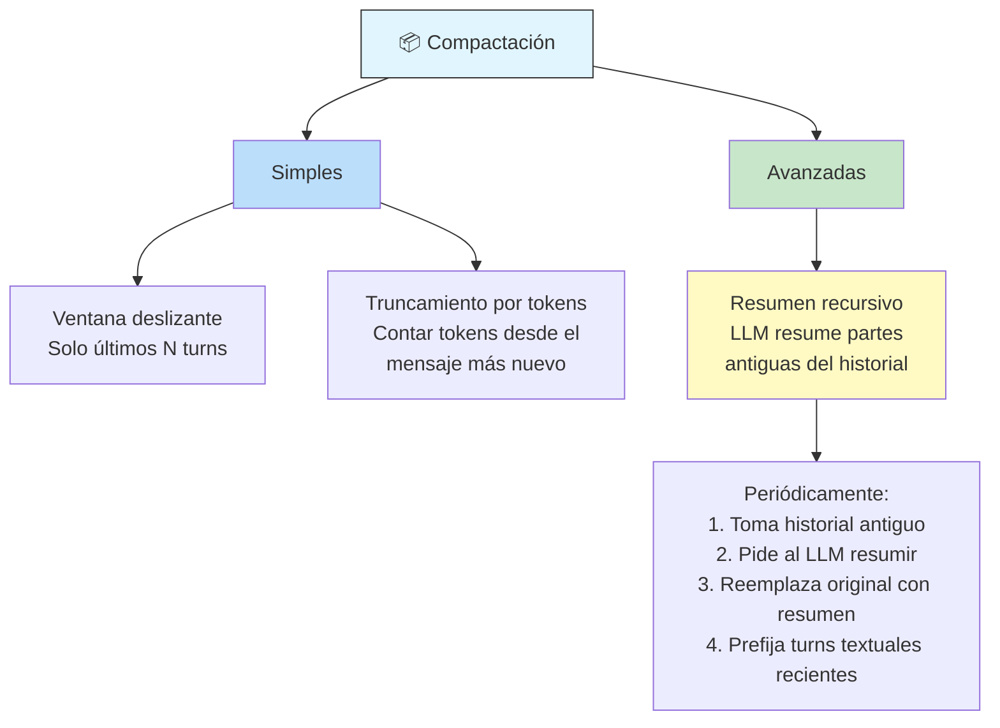

**Resumen recursivo:**
- ✅ Conserva la esencia
- ✅ Reduce drásticamente el conteo de tokens
- ⚠️ Computacionalmente pesado → **debe ser asíncrono en background**
- Se activa por: número de turns, período de inactividad, o cuando se completa una tarea

---

## Memoria

### Memoria vs RAG

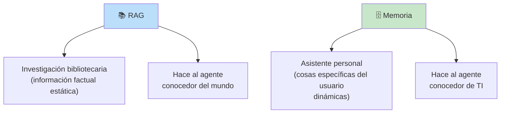

### Tipos de Memoria

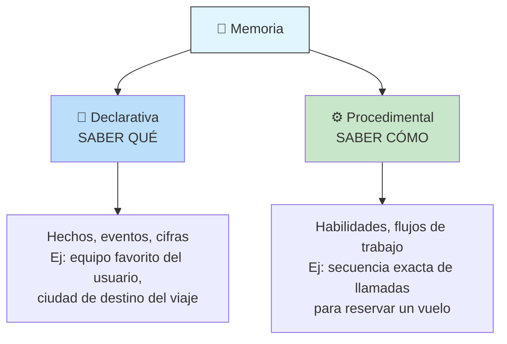

### Organización de la Memoria

| Estructura | Descripción |
|------------|-------------|
| **Colecciones** | Conjuntos de recuerdos por usuario o tema |
| **Perfil de usuario** | Tarjeta de contacto rápida (core facts) |
| **Resumen acumulativo** | Documento único que evoluciona continuamente |

### Almacenamiento: Híbrido Vectorial + Grafos de Conocimiento

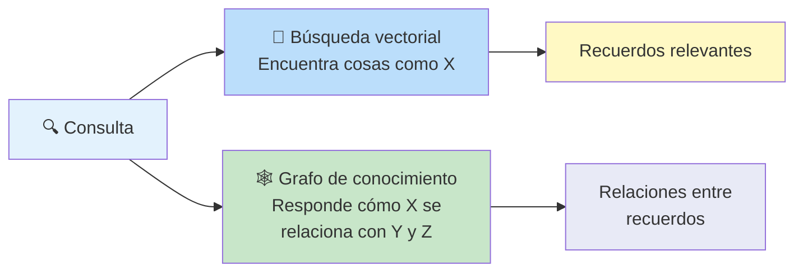

### Alcance de la Memoria

| Nivel | Ámbito | Ejemplo |
|-------|--------|---------|
| **Usuario** | Entre sesiones del mismo usuario | Preferencias, datos personales |
| **Sesión** | Solo dentro de un chat | Información temporal de la conversación |
| **Aplicación** | Global (requiere cuidado) | Procedimientos compartidos |

### Generación de Memoria: Ciclo ETL

El proceso de creación de memoria es un proceso **ETL impulsado por LLM**:

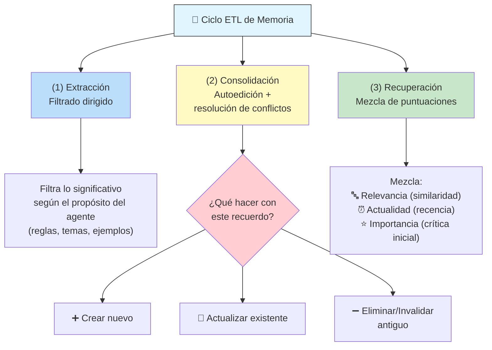

**Procedencia y confianza:**
- ¿De dónde vino el recuerdo?
- ¿Qué edad tiene?
- ¿Fue declarado explícitamente por el usuario o inferido por el agente?
- Las puntuaciones de confianza evolucionan: si el usuario menciona a su perro Winston 3 veces → la confianza sube. Si no se accede en meses → la relevancia decae.

> ⚠️ La generación de memoria **SIEMPRE debe ser asíncrona** (background). Si la consolidación ocurre mientras el usuario espera, la latencia será inaceptable.

---

## Memoria como Herramienta

En lugar de depender solo de reglas predefinidas, le das al agente herramientas para **gestionar su propia memoria**:

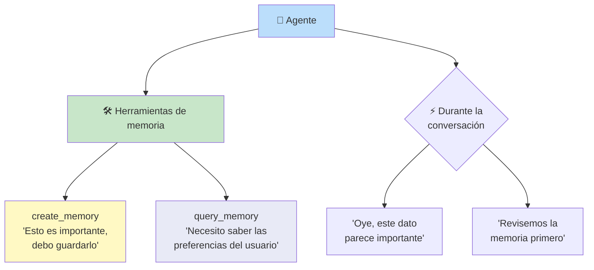

### Recuperación: Proactiva vs Reactiva

| Estrategia | Cuándo | Pros | Contras |
|------------|--------|------|---------|
| **Proactiva** | Al inicio de cada turno | Simple, siempre presente | Latencia si es lenta; trae cosas irrelevantes |
| **Reactiva** | Cuando el agente decide consultar | Más eficiente | Requiere agente más inteligente; LLM call extra |

### Colocación de Recuerdos en el Prompt

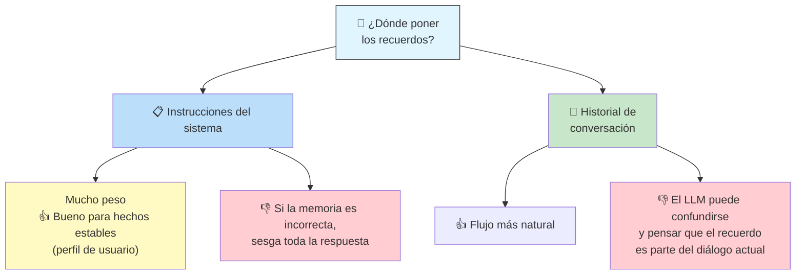

---

## Evaluación de Sistemas de Memoria

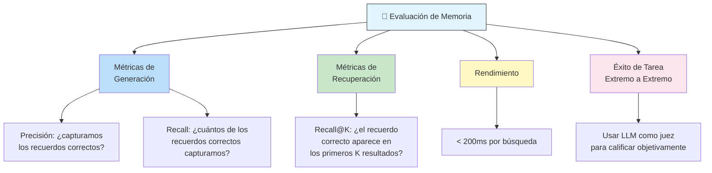

---

## Resumen Visual

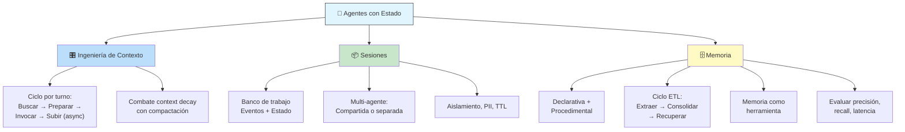

> El camino para construir agentes que **aprendan, recuerden y personalicen** está en dominar la interacción entre ingeniería de contexto, sesiones y memoria.

---

## Navegación

- [[dia-2-agent-tools-y-interoperabilidad-mcps]] ← Anterior: herramientas y MCP
- [[dia-4-agent-quality]] → Siguiente: calidad del agente
- [[opcional-dia-3-livestream]] → Siguiente: Livestream Q&A del Día 3
- [[5-day-ai-agents-intensive-course-with-google]] ← Volver al índice
