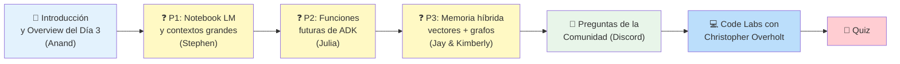
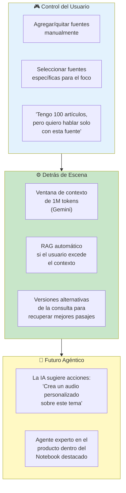
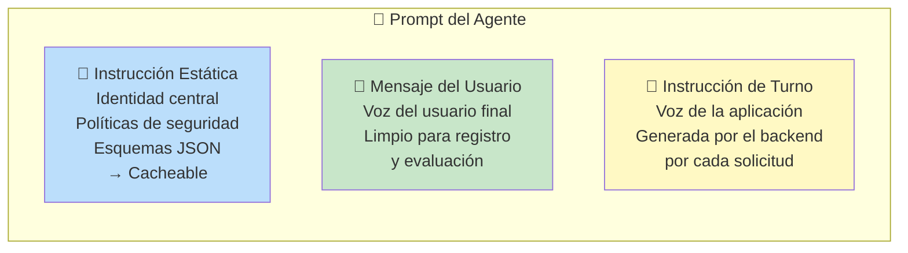
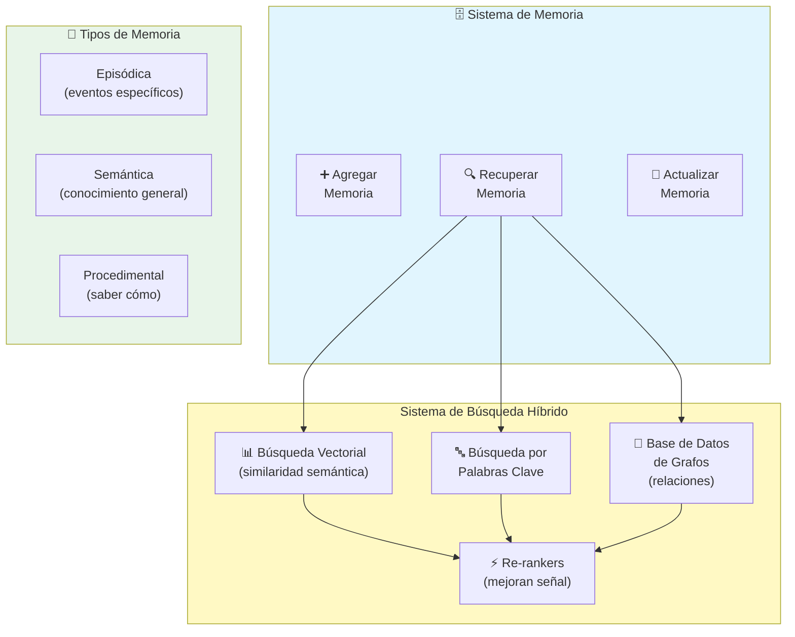
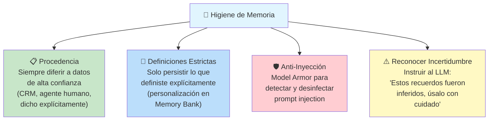
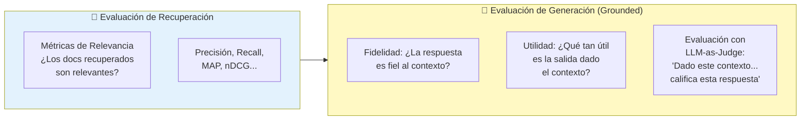
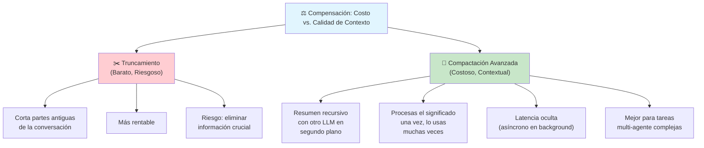

# ☕ Opcional — Livestream Q&A del Día 3

*Panel de discusión del Día 3 del curso intensivo de 5 días de Google × Kaggle.*
*Anfitriones: Kanchana Patlolla y Anant Nawalgaria.*

---

## Panelistas

| Panelista | Rol | Afiliación |
|-----------|-----|------------|
| 📖 **Jay Alammar** | Coautor "Hands-On Large Language Models", director | Cohere |
| 📓 **Stephen Johnson** | Cofundador de Notebook LM, director editorial | Google Labs |
| 🧠 **Kimberly Milam** | Tech Lead — Agent Engine Memory Bank, coautora del whitepaper Día 3 | Google |
| 🎯 **Julia Wiesinger** | PM del ecosistema de agentes (ADK), autora del whitepaper original de agentes | Google |

---

## 📋 Agenda del Livestream

---

## ❓ Pregunta 1: Notebook LM y Gestión de Grandes Contextos

**Para Stephen:** ¿Cómo maneja Notebook LM contextos grandes y cómo se integra con el mundo agéntico?

### Gestión de Contexto en Notebook LM

> **💡 Clave:** Notebook LM ya actúa como un gestor de contexto para no-programadores. El futuro es que la IA dentro del notebook sugiera y ejecute acciones por sí misma.

---

## ❓ Pregunta 2: Funciones Futuras de ADK para Contexto y Memoria

**Para Julia:** ¿Qué funciones interesantes están en el horizonte para la ingeniería de contexto y la gestión de memoria a escala en ADK?

### Separación de Instrucciones en ADK

Julia destacó una innovación reciente: **separar los componentes del prompt en 3 partes** para mantener registros limpios y facilitar la auditoría:

| Componente | Descripción | Beneficio |
|------------|-------------|-----------|
| 📜 **Instrucción Estática** | Identidad central, políticas de seguridad, esquemas JSON | Almacenable en caché → más rápido y barato |
| 👤 **Mensaje del Usuario** | Lo que escribe el usuario final | Registro limpio para auditoría |
| 🔄 **Instrucción de Turno** | Generada por el backend por cada solicitud | Permite contexto dinámico por turno |

### Áreas Clave de Inversión Futura

| Área | Descripción |
|------|-------------|
| 🎛️ **Contexto más dinámico** | Inyectar contexto de forma dinámica (similar a Notebook LM pero para desarrolladores) |
| 🗄️ **Memoria** | Personalización a largo plazo para experiencias que evolucionan con el usuario |
| ⚡ **Context Caching** | Almacenar el contexto para reinyectarlo sin llamar al LLM → **más rápido y más barato** |

> **Context Caching:** Guarda el contexto (instrucciones estáticas, historial común) para no tener que recalcularlo en cada llamada. Reduce latencia y costo.

---

## ❓ Pregunta 3: Memoria Híbrida — Vectores + Grafos + Keywords

**Para Jay y Kimberly:** ¿Hay escenarios donde un enfoque híbrido (vectores + grafos de conocimiento) sea necesario?

> **La memoria no tiene una arquitectura única que funcione para todos los casos de uso.** Aún estamos en etapas tempranas.

### Arquitectura de Sistema de Memoria

### La Recuperación Ocurre en 2 Lugares

| Fase | Propósito | Enfoque Recomendado |
|------|-----------|---------------------|
| 🔍 **Recuperación en uso** | Cuando el agente busca recuerdos para responder | Búsqueda híbrida + re-rankers |
| 🧹 **Recuperación en consolidación** | Cuando se actualizan/ fusionan recuerdos existentes | Grafos de conocimiento (relaciones entre recuerdos) |

> **Consejo de Jay:** No te limites a búsqueda vectorial. Los motores de búsqueda reales usan keywords + vectores + re-rankers + grafos. Tu sistema de memoria puede ser tan sofisticado como los sistemas de búsqueda que ya conocemos.

---

## 💬 Preguntas de la Comunidad (Discord)

### P: ¿Cómo prevenir que la memoria se corrompa con claims falsos del usuario?

*Respondido por Kimberly*

**💡 Buenas prácticas adicionales:**
- Usar la **memoria como herramienta** — que el agente decida cuándo guardar/recuperar, no inyectar siempre todo
- ADK permite **callbacks y plugins** para agregar motores de políticas que gobiernen la memoria
- Mantener el **mensaje del usuario limpio** (separación de instrucciones) para poder auditar qué recuerdos se generaron

---

### P: ¿Cómo equilibrar contexto comprehensivo vs. enfocado en RAG?

*Respondido por Jay*

**RAG tiene 2 áreas de medición:**

| Métrica | ¿Qué Mide? | Herramienta |
|---------|-------------|-------------|
| 📊 **Relevancia** | ¿Los documentos recuperados son relevantes? | Métricas IR clásicas |
| 🎯 **Fidelidad** | ¿La respuesta es fiel al contexto dado? | Ragas (biblioteca de evaluación RAG) |
| ⭐ **Utilidad** | ¿Qué tan útil es la salida para el caso de uso? | LLM-as-Judge con rúbrica |

> **Clave:** La mejor métrica es la que mide el **rendimiento en tu caso de uso final**, no métricas genéricas.

---

### P: ¿Truncar historial vs. compactar? ¿Cuál es la compensación crítica?

*Respondido por Julia*

| Estrategia | Costo | Riesgo | Ideal para |
|------------|-------|--------|------------|
| ✂️ **Truncar** | Bajo | Alto — pierde contexto importante | Tareas simples de un solo turno |
| 🧩 **Compactación (resumen)** | Medio (LLM extra en background) | Bajo — preserva lo significativo | Conversaciones multi-turno complejas |

---

### P: ¿Pueden los agentes usar estructura narrativa para organizar la memoria a largo plazo?

*Respondido por Stephen*

> **Sí, y es exactamente hacia donde debemos ir.** Un proyecto cambia con el tiempo (etapa temprana, media, final). Los eventos tempranos son generalmente menos relevantes, pero algunos son **fundamentales** y se recuerdan siempre. La IA necesita organizar la información en una **línea de tiempo narrativa** para ser realmente útil.

**El problema actual:** La IA a menudo recuerda detalles irrelevantes del pasado y olvida que ya se resolvieron problemas anteriores. Es como un asistente que dice "¿Has pensado en X?" cuando X se resolvió hace un año.

> *"Se trata de poner contexto en contexto."* — Stephen Johnson

---

## 💻 Resumen de Code Labs

*Presentado por Christopher Overholt*

| Code Lab | Enfoque | Conceptos Clave |
|----------|---------|-----------------|
| 📓 **1 — Sesiones** | Agentes con estado en ADK | Session service, persistencia (memoria vs DB), compactación de contexto, variables de estado |
| 📓 **2 — Memoria** | Memoria a largo plazo entre sesiones | Memory service, ETL cycle (extraer → consolidar → recuperar), callbacks para guardado automático |

**Nota:** Sam Path era el autor original de los notebooks pero tuvo un cambio de último minuto. Christopher presentó en su lugar.

---

## 🧠 Quiz del Día 3

| Pregunta | Opciones | Respuesta |
|----------|----------|-----------|
| ¿Qué analogía describe mejor sesión vs. memoria? | A) Biblioteca vs. página B) **Banco de trabajo temporal vs. archivador organizado** C) LP vs. caché D) Hechos vs. preferencias | **B** |
| ¿Qué es ingeniería de contexto? | A) Fine-tuning B) **Gestión dinámica de información en la ventana contextual** C) Instrucciones estáticas D) Optimización de hardware | **B** |
| Diferencia clave entre memoria declarativa y procedural | A) Corto vs. largo plazo B) Vector vs. SQL C) **Saber qué vs. saber cómo** D) Usuario vs. LLM | **C** |
| ¿Objetivo principal de la consolidación de memoria? | A) **Fusionar información nueva con existente resolviendo conflictos** B) Acelerar con caché C) Cifrar D) Comprimir logs | **A** |
| Diferencia fundamental entre RAG y memoria | A) RAG conoce al usuario, memoria hechos globales B) **RAG = hechos globales estáticos; Memoria = dinámica y específica del usuario** C) Son intercambiables | **B** |

---

## 📚 Principales Conclusiones

1. **Notebook LM es un gestor de contexto para no-programadores** — el futuro agéntico hará que la IA sugiera y ejecute acciones
2. **ADK separa el prompt en 3 partes** (estática, usuario, turno) para mejor auditoría y escalado
3. **No hay una arquitectura de memoria única** — combina vectores + keywords + grafos + re-rankers según tu caso de uso
4. **La higiene de memoria es crítica** — procedencia, definiciones estrictas, anti-inyección, incertidumbre explícita
5. **Compactación > Truncamiento** para tareas complejas — cuesta más pero preserva el contexto significativo
6. **La narrativa importa** — organizar la memoria como una línea de tiempo mejora la utilidad del agente

---

## Navegación

- [[dia-3-context-engineering-sesiones-y-memoria]] ← Anterior: whitepaper de contexto y memoria
- [[dia-4-agent-quality]] → Siguiente: calidad del agente
- [[5-day-ai-agents-intensive-course-with-google]] ← Volver al índice
