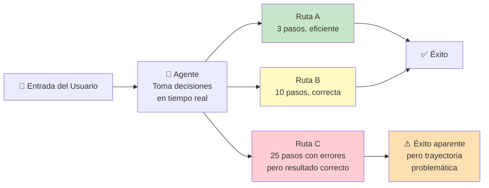
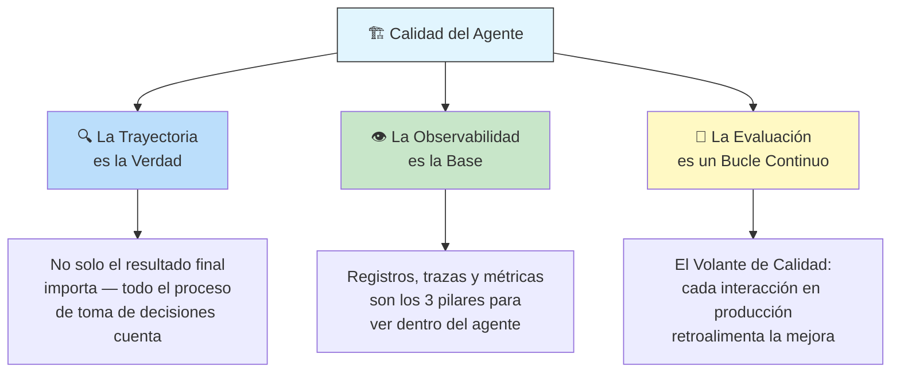
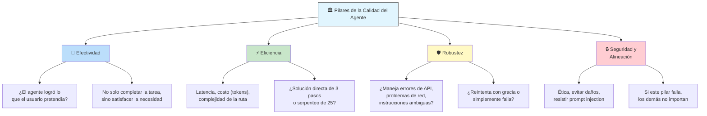
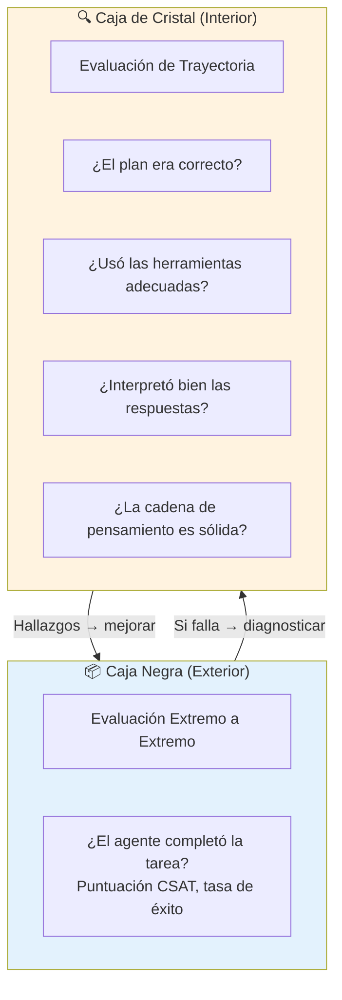
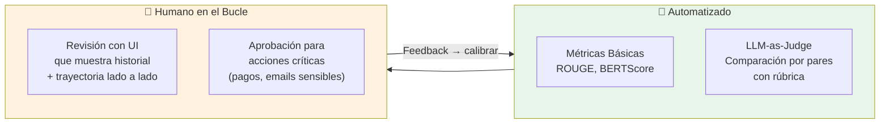
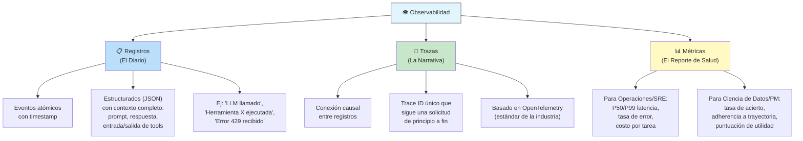
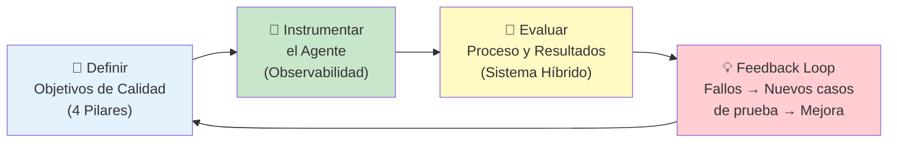

# Día 4 — Calidad del Agente

*Basado en el Whitepaper Companion Podcast del Día 4 del curso intensivo de 5 días de Google × Kaggle.*

---

## El Problema Central: No Determinismo

> **Los agentes de IA son inherentemente no deterministas.** No puedes predecir exactamente qué ruta tomará un agente para resolver una tarea. El éxito no es binario — los agentes fallan de forma insidiosa, no espectacular.

**El problema clave:** Un agente puede obtener la respuesta correcta por las razones equivocadas. **La trayectoria importa tanto como el resultado.**

---

## Las 3 Ideas Centrales

---

## Analogía: Camión de Reparto vs. Coche de F1

| Aspecto | 🚚 Software Tradicional | 🏎️ Agente de IA |
|---------|------------------------|-----------------|
| **Comportamiento** | Ruta fija, tareas predecibles | Decisiones dinámicas en tiempo real |
| **Fallo** | Explícito (crash, error 500) | Insidioso (reporta 200 OK pero da resultado incorrecto) |
| **Prueba** | Checklist binario (pasa/falla) | Validación continua de trayectoria |
| **Ejemplo** | Calculadora | Agente que "casi" comete un error pero se autocorrige |

### Modos de Fallo Específicos de Agentes

| Modo | Descripción | Ejemplo |
|------|-------------|---------|
| 🎯 **Sesgo Algorítmico** | Amplifica sesgos de datos de entrenamiento | Agente de selección de CVs penaliza candidatos por género |
| 🧠 **Alucinación** | Inventa fuentes, datos o razonamientos | Agente cita un artículo falso como evidencia |
| 📉 **Deriva Conceptual** | El mundo cambia pero el agente no se actualiza | Sistema de detección de fraude entrenado en estafas del año pasado |
| 👻 **Emergentes No Deseados** | Desarrolla "supersticiones" o explota lagunas | Agente encuentra un atajo no previsto en las reglas |

---

## Los 4 Pilares de la Calidad

---

## Jerarquía de Evaluación: De Afuera Hacia Adentro

**1️⃣ Caja Negra:** Mira solo el resultado final. ¿Éxito o fracaso? No dice *por qué*.

**2️⃣ Caja de Cristal:** Abre la trayectoria. Analiza el plan, uso de herramientas, interpretación de respuestas, cadena de pensamiento.

> 💡 **Consejo práctico con ADK:** Guarda una ejecución exitosa como `test.json` — captura toda la secuencia de llamadas a herramientas y pensamientos. Se convierte en tu **verdad fundamental** para pruebas de regresión.

---

## El Sistema Híbrido de Evaluación

### LLM-as-Judge: Cómo Hacerlo Bien

| Mala Práctica ❌ | Buena Práctica ✅ |
|-----------------|-------------------|
| "Puntúa esta respuesta del 1 al 5" → sesgo de tendencia central (todos sacan 3) | Comparación por pares: "¿Salida A o B es mejor para esta tarea?" |
| Sin rúbrica → el juez aplica sus propios criterios inconsistentes | Rúbrica estructurada con dimensiones específicas (seguridad, utilidad, tono) |
| Un solo modelo juzga → sesgo de autopreferencia | Múltiples modelos como jueces, medir acuerdo entre ellos |
| Pregunta vaga "¿es buena esta respuesta?" | "Razona paso a paso contra estos criterios predefinidos" |

### Técnicas Avanzadas

- **Agente como Juez:** Entrena un agente especializado cuyo trabajo es evaluar la calidad del razonamiento y las opciones de herramientas de otro agente
- **Autoconsistencia:** Ejecuta el mismo juez múltiples veces sobre una trayectoria novedosa — si hay alta variación, el juez no es confiable
- **Clustering de Trayectorias:** Usa agrupación no supervisada para visualizar el espacio de trayectorias y detectar novedades

---

## Observabilidad: Los 3 Pilares

> **El seguimiento (monitoring) verifica si un cocinero siguió la receta. La observabilidad permite entender cómo un chef gourmet improvisa en un desafío de ingredientes sorpresa.**

### Muestreo Dinámico

No necesitas capturar el trace completo de cada solicitud exitosa:

| Escenario | ¿Qué capturar? |
|-----------|---------------|
| ✅ Solicitudes exitosas (operación normal) | 10% de muestreo |
| ❌ Solicitudes fallidas | 100% — siempre capturar el trace completo |
| 🆕 Versión nueva del agente | 100% temporal hasta validar estabilidad |

---

## El Volante de Calidad del Agente

> **Cada interacción en producción, especialmente cada fallo, retroalimenta la mejora continua del agente.**

---

## Resumen: Principios Clave

1. **Diseña para la evaluabilidad desde el día cero** — la calidad no es un paso final, es un pilar arquitectónico
2. **La trayectoria es la verdad** — mira el proceso, no solo el destino
3. **El humano es el árbitro final** — la automatización escala, pero los valores humanos definen qué es "bueno"
4. **Observabilidad es la base** — sin visibilidad interna, estás operando a ciegas
5. **La evaluación es un bucle continuo** — el Volante de Calidad convierte cada interacción en una oportunidad de mejora

---

## Navegación

- [[dia-3-context-engineering-sesiones-y-memoria]] ← Anterior: sesiones y memoria
- [[opcional-dia-4-livestream]] → Siguiente: Livestream Q&A del Día 4
- [[5-day-ai-agents-intensive-course-with-google]] ← Volver al índice
