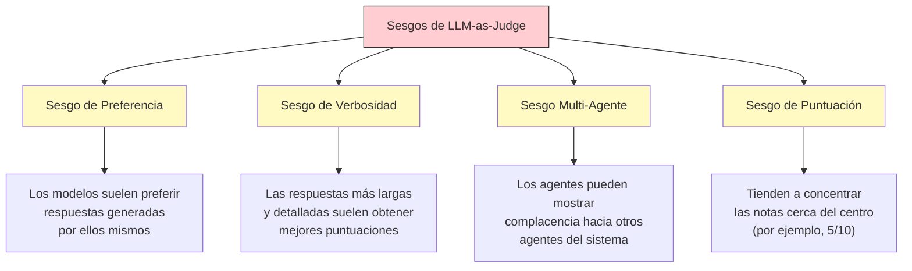
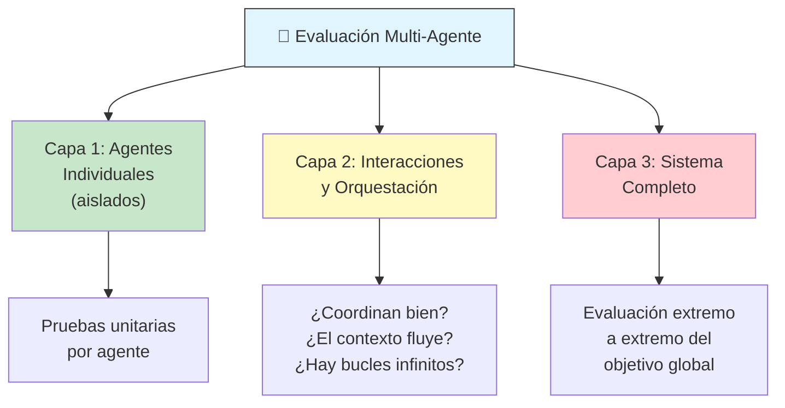
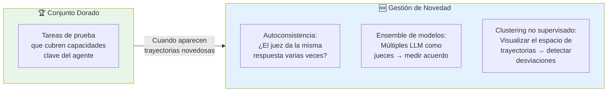
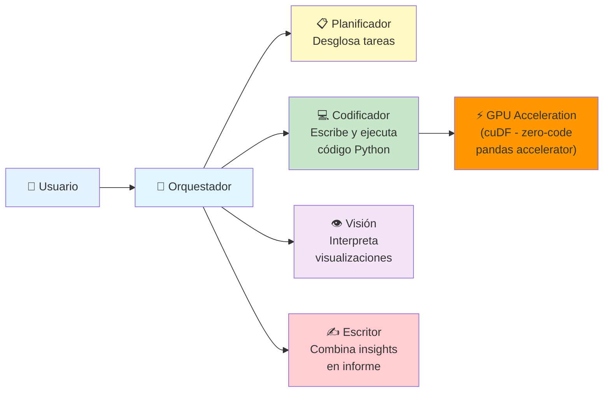

# ☕ Opcional — Livestream Q&A del Día 4

*Panel de discusión del Día 4 del curso intensivo de 5 días de Google × Kaggle.*
*Anfitriones: Kanchana Patlolla y Anant Nawalgaria.*

---

## Panelistas

| Panelista | Rol | Afiliación |
|-----------|-----|------------|
| 👩‍🔬 **Dr. Wafae Bakkali** | Especialista en IA Generativa, coautora del whitepaper | Google |
| 🧠 **Sian Gooding** | Investigadora científica senior — agentes autónomos | Google DeepMind |
| 🛠️ **Turan Bulmus** | Head of Black Belts, Ingeniería Aplicada, coautor del whitepaper | Google |
| 🏆 **Jiwei Liu** | Data Scientist & Kaggle Grandmaster | NVIDIA |

---

## 📋 Agenda del Livestream

```mermaid
flowchart LR
    Intro["🎤 Introducción<br/>y Overview del Día 4"] --> QA1["❓ Pregunta 1<br/>Sesgos de LLM-as-Judge"]
    QA1 --> QA2["❓ Pregunta 2<br/>Evaluación Agentes vs ML"]
    QA2 --> QA3["❓ Pregunta 3<br/>Sistemas Multi-Agente"]
    QA3 --> QA4["❓ Pregunta 4<br/>Código Abierto en Agentes"]
    QA4 --> Comm["💬 Preguntas de la<br/>Comunidad (Discord)"]
    Comm --> Demo["🖥️ Demo:<br/>Agentes de Ciencia de<br/>Datos con GPU (Jiwei)"]
    Demo --> Labs["💻 Code Labs<br/>con Sita"]
    Labs --> Quiz["🧠 Quiz"]
    
    style Intro fill:#e3f2fd
    style QA1 fill:#fff9c4
    style QA2 fill:#fff9c4
    style QA3 fill:#fff9c4
    style QA4 fill:#fff9c4
    style Comm fill:#e8f5e9
    style Demo fill:#f3e5f5
    style Labs fill:#bbdefb
    style Quiz fill:#ffcdd2
```

---

## ❓ Pregunta 1: Sesgos de LLM-as-Judge

**Para Sian:** ¿Cuáles son los modos de falla sutiles o sesgos al usar modelos para juzgar otros modelos?

### Los 4 Sesgos Principales Identificados

### Cómo Mitigarlos

| Problema | Solución |
|----------|----------|
| Sesgo de autopreferencia | Usar múltiples modelos como jueces; medir acuerdo entre ellos |
| Sesgo de verbosidad | Rúbrica estructurada que penaliza verbose innecesario |
| Complacencia multi-agente | Agente crítico independiente con modelo diferente al de los trabajadores |
| Tendencia central | Comparación por pares (A vs B) en lugar de puntuación numérica |
| Sesgo de resultado | Evaluar trayectoria y resultado por separado |

**💡 Clave:** Evalúa a tu evaluador — mide la correlación humana para verificar que tu LLM-as-Judge se alinea con el juicio humano.

---

## ❓ Pregunta 2: Evaluación — Agentes vs. Modelos Predictivos

**Para Jiwei:** ¿Cómo es diferente la evaluación de agentes de IA vs. la evaluación de modelos predictivos tradicionales?

| Aspecto | 📈 Modelo Predictivo (Era Pre-IA) | 🤖 Agente de IA |
|---------|-----------------------------------|-----------------|
| **Métrica** | Leaderboard con métrica cuantitativa única | Múltiples métricas: efectividad, eficiencia, robustez, seguridad |
| **Determinismo** | Misma entrada → misma salida | Misma entrada → múltiples trayectorias posibles |
| **Evaluación** | Automática (una línea de puntuación) | Híbrida: automática + LLM-as-Judge + revisión humana |
| **Atajos** | No aplica | Los agentes pueden encontrar caminos inesperados |

### Las 4 Capas de Evaluación para Agentes (Jiwei)

1. **📐 Métrica Verificable** — Como un leaderboard de Kaggle, pero que el agente no pueda hacer atajos
2. **🧭 Grounding** — El agente debe proporcionar referencias y evidencias de su proceso de pensamiento
3. **🤖 LLM-as-Judge** — Enfoque automatizado para revisar grandes volúmenes de trazas
4. **👤 Revisión Humana** — Imprescindible para código generado por LLM (pueden hacer trucos inesperados)

---

## ❓ Pregunta 3: Evaluación de Sistemas Multi-Agente

**Para Wafae, Sian y Turan:** Mejores prácticas para evaluar sistemas multi-agente.

> **Analogía del fútbol (Wafae):** Puedes tener los mejores jugadores del mundo, pero si no trabajan en equipo, pierdes el partido. La **capa de orquestación** es lo que hace o rompe un sistema multi-agente.

### Recomendaciones Clave

| Recomendación | Detalle |
|---------------|---------|
| 🏗️ **Arquitectura desde el inicio** | Diseña el sistema multi-agente para que sea evaluable desde el día cero |
| 🧪 **Evaluación multicapa** | Combina métricas cuantitativas + LLM-as-Judge + HITL |
| 🧠 **LLM con razonamiento sólido** | Elige un modelo con fuertes capacidades de razonamiento para el juez en sistemas complejos |
| 🔬 **Pruebas de ablación** | Elimina un agente o crea uno deliberadamente malo → mide el impacto en el sistema completo |
| 📉 **Error compuesto** | Si cada agente tiene 10% de error, tras 5 interacciones el error se acumula rápidamente |
| 🪟 **Ventana de contexto** | Más interacciones = más tokens = mayor probabilidad de error. Mantén las interacciones al mínimo necesario |

---

## ❓ Pregunta 4: Código Abierto en Sistemas Agente

**Para Jiwei:** ¿Cuál es la fortaleza del ecosistema open source para agentes?

**Respuesta:** Los modelos de código abierto permiten **personalización y flexibilidad** de hardware:
- Modelos cuantizados (INT8) para GPUs de hace 10 años
- Liberan recursos computacionales para otros componentes del pipeline
- La calidad de los modelos abiertos vs. cerrados se acerca constantemente
- Ejemplo: modelos destilados y cuantizados que hace 2 años eran inimaginables

---

## 💬 Preguntas de la Comunidad (Discord)

### P: ¿Cómo construir un conjunto dorado (golden set) escalable para pruebas de regresión no deterministas?

*Respondido por Sian*

**Enfoque de dos áreas:**
1. **Finalización de tareas** — ¿El agente logró el objetivo?
2. **Calidad de la traza** — ¿El camino fue correcto?

### P: ¿Cómo asegurar que el LLM-as-Judge no introduzca nuevos sesgos?

*Respondido por Wafae*

| Error Común ❌ | Solución ✅ |
|----------------|------------|
| Conectar el juez sin orientación | Usar **rúbricas estructuradas** — guía de puntuación con dimensiones específicas |
| Preguntas vagas ("¿esto es bueno?") | Pedir razonar paso a paso contra criterios predefinidos |
| Confiar ciegamente en el juez | **Fine-tuning** del juez sobre preferencias humanas o ejemplos de verdad fundamental |

### P: ¿Hay protocolos de calidad establecidos para agentes?

*Respondido por Turan*

**Protocolos estandarizados:**
- **MCP** — Para uso de herramientas
- **A2A** — Para comunicación agente-a-agente
- **A2P** — Para pagos

**Para observabilidad:**
- Parte determinista → usar prácticas DevOps/MLOps existentes
- Parte no determinista → **OpenTelemetry** para construir logs, trazas y métricas específicas de agentes
- Rastrear: qué hace el agente, llamadas LLM, tokens de pensamiento, autenticación de herramientas

---

## 🖥️ Demo: Agentes de Ciencia de Datos Acelerados por GPU

*Presentado por Jiwei Liu (NVIDIA)*

### Arquitectura del Sistema Multi-Agente

### Resultados de Aceleración con cuDF

| Operación | Tamaño de Datos | Pandas (CPU) | cuDF (GPU) | Mejora |
|-----------|----------------|--------------|-------------|--------|
| Consulta simple | 5 GB (42M filas) | ~10s | ~1.5s | **~7x** |
| Procesamiento completo | 5 GB | ~10-30s | ~1-2s | **~10-15x** |

> **💡 Clave:** El LLM no necesita saber cuDF — escribe código pandas normal y dos líneas de `import cudf.pandas` activan la aceleración GPU automáticamente.

---

## 💻 Resumen de Code Labs

*Presentado por Sita Lakshmi Sangameswaran*

| Code Lab | Enfoque |
|----------|---------|
| 📓 **1 — Observabilidad** | Implementar logs, trazas y métricas con ADK para depurar agentes |
| 📓 **2 — Evaluación** | Evaluar agentes: calidad de respuesta + uso de herramientas usando LLM-as-Judge |

---

## 🧠 Quiz del Día 4

| Pregunta | Opciones | Respuesta |
|----------|----------|-----------|
| ¿Qué analogía describe mejor la diferencia entre software tradicional y agentes? | A) Bicicleta vs coche B) Camión de reparto vs F1 C) Tren vs avión | **B** — El software tradicional tiene ruta fija; el agente hace juicios dinámicos |
| ¿Cuál NO es uno de los 4 pilares de calidad del agente? | A) Efectividad B) Eficiencia C) Popularidad D) Robustez | **C** — Los pilares son: Efectividad, Eficiencia, Robustez, Seguridad |
| ¿Qué es "la trayectoria es la verdad"? | A) Registrar cada paso B) Solo importa el resultado final C) Usar el camino más corto | **A** — El proceso completo importa, no solo la respuesta final |
| ¿Cuál es el orden correcto de la jerarquía de evaluación? | A) Caja negra → Caja de cristal B) Caja de cristal → Caja negra C) Ambas simultáneamente | **A** — Empieza por el resultado (caja negra), luego abre la trayectoria (caja de cristal) |

---

## 📚 Principales Conclusiones

1. **LLM-as-Judge tiene sesgos conocidos** — evalúa a tu evaluador y usa rúbricas estructuradas
2. **La evaluación de agentes es fundamentalmente diferente** del ML predictivo — la trayectoria es parte de la calidad
3. **Sistemas multi-agente requieren evaluación multicapa** — la orquestación es el punto crítico
4. **El código abierto es clave** para flexibilidad y personalización en hardware
5. **La observabilidad es la base** de toda evaluación — sin ella, operas a ciegas

---

## Navegación

- [[dia-4-agent-quality]] ← Anterior: whitepaper de Calidad del Agente
- [[dia-5-prototipo-a-produccion]] → Siguiente: whitepaper de Prototipo a Producción
- [[5-day-ai-agents-intensive-course-with-google]] ← Volver al índice
