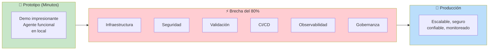
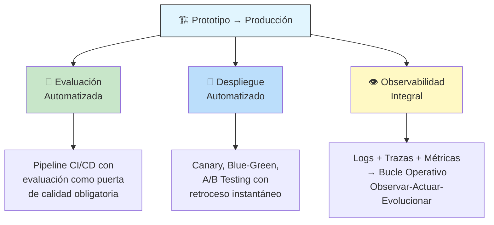
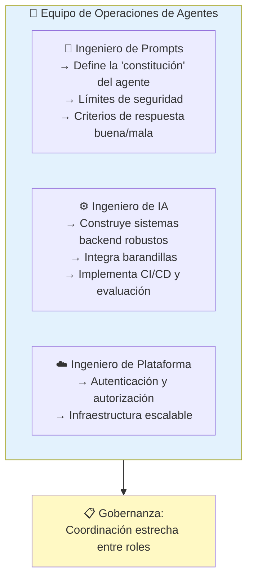
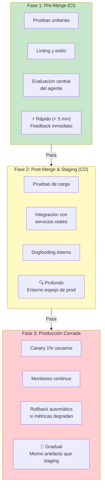
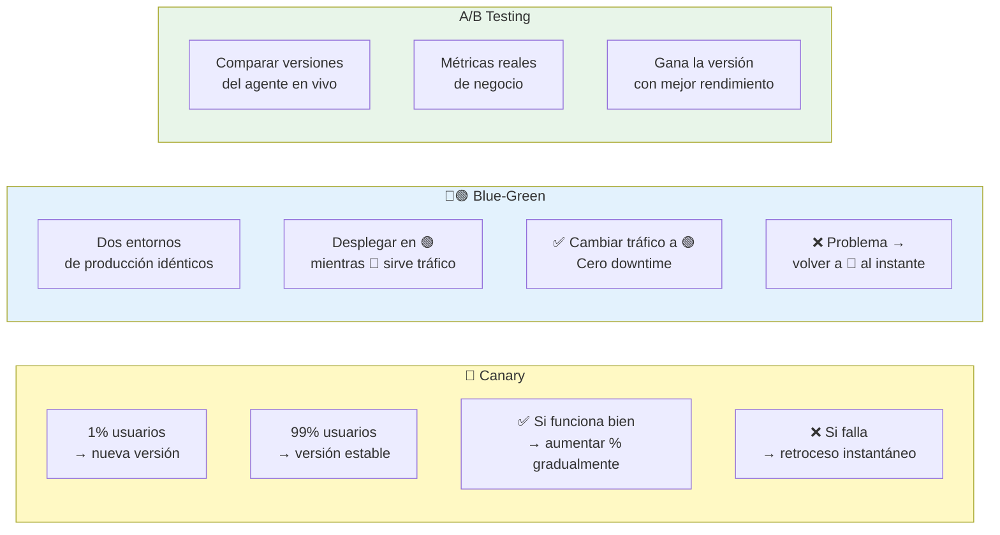
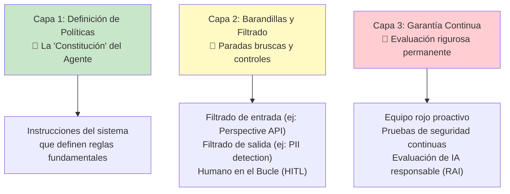
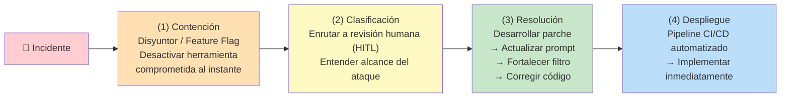
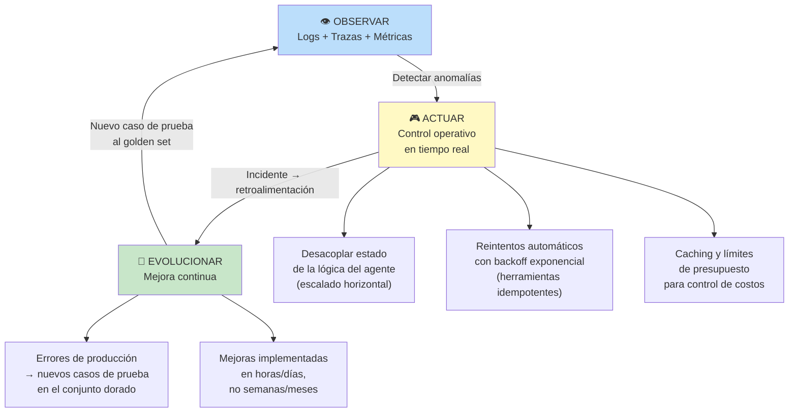
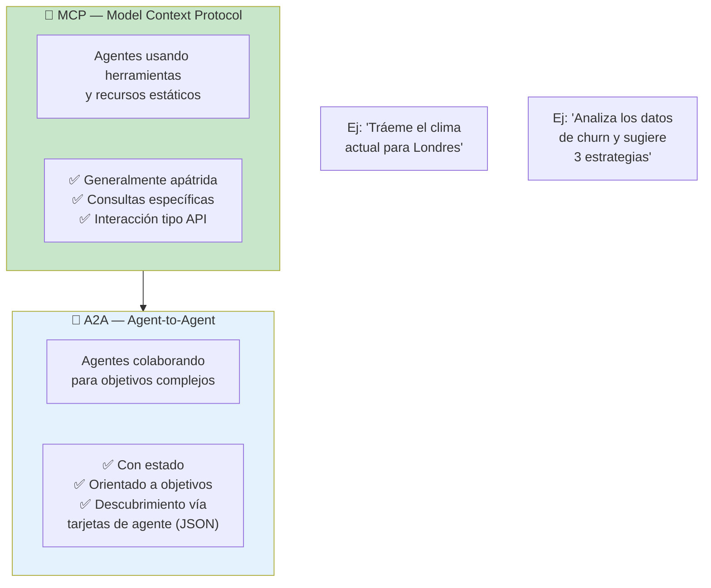
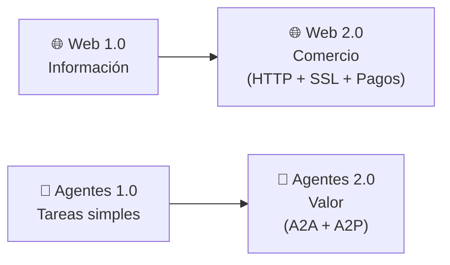

# Día 5 — De Prototipo a Producción

*Basado en el Whitepaper Companion Podcast del Día 5 del curso intensivo de 5 días de Google × Kaggle.*

---

## El Problema Central: La Brecha de la Última Milla

> **El 80% del esfuerzo no es la inteligencia central de la IA — es la infraestructura, la seguridad, la validación y la plomería necesaria para hacer que un agente funcione de forma segura y confiable en producción.**

---

## Las 3 Ideas Centrales

---

## Personas y Procesos: El Paso Cero

Antes de la tecnología, define los roles:

> **❌ Error común:** El equipo de cloud configura autenticación, pero el prompt engineer no lo sabe → el agente puede acceder a datos prohibidos. La coordinación no es opcional.

---

## Pipeline de Evaluación Cerrada (CI/CD para Agentes)

> **Ningún agente llega a producción sin pasar controles rigurosos que demuestren su eficacia y seguridad.**

### El Embudo Progresivo (Shift Left)

### Puertas de Calidad

| Tipo | Cómo Funciona |
|------|---------------|
| 🚪 **Puerta Manual** | Ingeniero ejecuta suite de evaluación → vincula reporte al PR → revisión humana obligatoria |
| 🤖 **Puerta Automática** | Pipeline CI/CD ejecuta evaluación automáticamente; si métricas caen bajo umbral → despliegue bloqueado |

---

## Estrategias de Despliegue Seguro

### Versiona Todo

> **Código, prompts, esquemas de herramientas, estructura de memoria — todo necesita un número de versión. Es tu botón de deshacer en producción.**

---

## Seguridad: Marco SIF (3 Capas)

### Libro de Jugadas de Respuesta a Incidentes

---

## Bucle Operativo: Observar → Actuar → Evolucionar

### Principios Arquitectónicos Clave

| Principio | Descripción |
|-----------|-------------|
| 🏗️ **Desacoplar estado de lógica** | Memoria y sesiones en base de datos externa (Cloud SQL, etc.) → escalado horizontal |
| 🔄 **Idempotencia** | Las herramientas deben poder reintentarse sin efectos secundarios (GET ok, POST de pago NO) |
| ⚡ **Caching** | Reduce latencia y costo en consultas repetitivas |
| 📊 **Muestreo dinámico** | 100% de trazas en fallos, ~10% en éxitos |

---

## Interoperabilidad: MCP vs A2A

> **Analogía del taller de reparación de coches:**
> - El **gerente** (agente orquestador) delega el diagnóstico del motor a un **mecánico** (sub-agente) usando **A2A**
> - El **mecánico** usa **MCP** para consultar el escáner de diagnóstico y la base de datos de piezas

### Registros de Agentes y Herramientas

Cuando tienes cientos de agentes o miles de herramientas, el **descubrimiento** se convierte en un cuello de botella:

| Registro | Propósito | Estándar |
|----------|-----------|----------|
| 🧰 **Registro de Herramientas** | Catalogar y gobernar herramientas disponibles | MCP |
| 🤖 **Registro de Agentes** | Catalogar agentes especializados con sus capacidades | A2A (tarjetas de agente) |

---

## 👀 Mirando al Futuro

### Protocolo de Pagos de Agentes (A2P)

> Así como la web floreció cuando se convirtió en un vehículo para el comercio, los agentes florecerán cuando puedan realizar transacciones de valor de forma autónoma.

---

## Resumen: Principios Clave

1. **El 80% del esfuerzo está en la plomería** — infraestructura, seguridad, validación
2. **Evalúa antes de desplegar** — pipeline CI/CD con puertas de calidad automáticas
3. **Despliega gradualmente** — canary, blue-green, con retroceso instantáneo
4. **Observabilidad integral** — logs, trazas, métricas para operar y mejorar
5. **A2A + MCP son complementarios** — uno para colaboración entre agentes, otro para uso de herramientas
6. **La seguridad es 3 capas** — política + barandillas + garantía continua
7. **La velocidad de evolución es la meta** — mejoras en horas/días, no semanas/meses

---

## Navegación

- [[opcional-dia-4-livestream]] ← Anterior: Livestream Q&A del Día 4
- [[opcional-dia-5-livestream]] → Siguiente: Livestream Q&A del Día 5
- [[5-day-ai-agents-intensive-course-with-google]] ← Volver al índice
