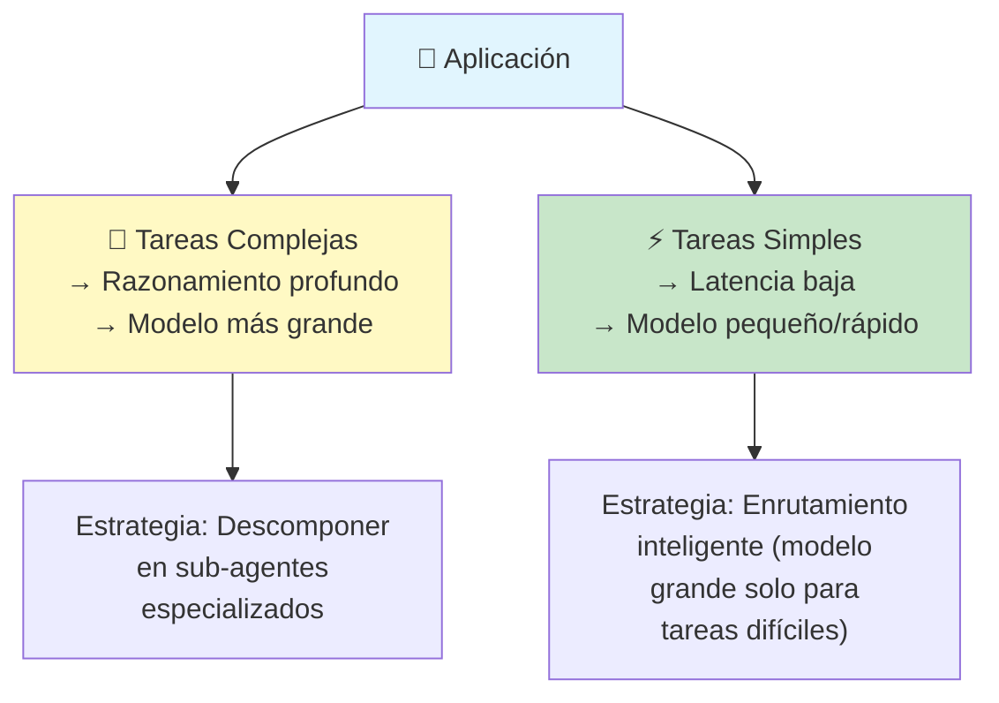
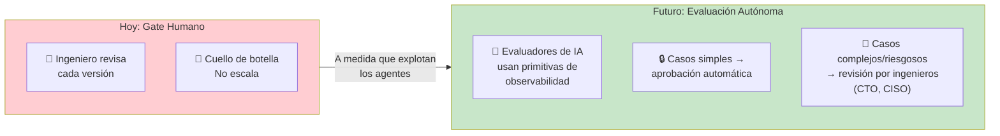
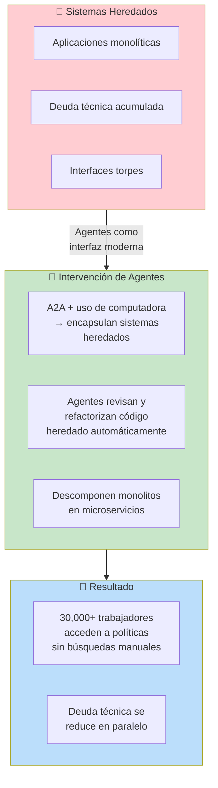
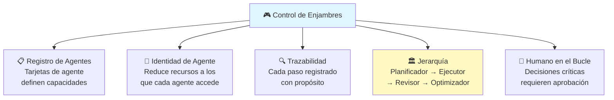
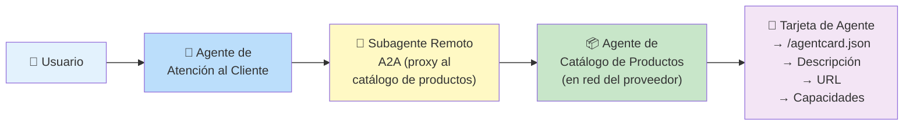

# ☕ Opcional — Livestream Q&A del Día 5

*Panel de discusión del Día 5 del curso intensivo de 5 días de Google × Kaggle.*
*Anfitriones: Kanchana Patlolla y Anant Nawalgaria.*

---

## Panelistas

| Panelista | Rol | Afiliación |
|-----------|-----|------------|
| ☁️ **Will Grannis** | CTO | Google Cloud |
| 🧠 **Sokratis Kartakis** | VP, Cloud AI (Vertex, Kaggle) | Google |
| 🛠️ **Elia Secchi** | Black Belt, coautor del whitepaper | Google Cloud |
| 🚀 **Saurabh Tiwary** | Product Lead — Agent Engine | Google |

---

## 📋 Agenda del Livestream

```mermaid
flowchart LR
    Intro["🎤 Introducción<br/>y Overview del Día 5"] --> QA1["❓ Trade-offs:<br/>Razonamiento vs<br/>Eficiencia"]
    QA1 --> QA2["❓ Brecha en<br/>Herramientas de<br/>Producción"]
    QA2 --> QA3["❓ A2A para<br/>Modernización de<br/>Legados"]
    QA3 --> Comm["💬 Preguntas de la<br/>Comunidad (Discord)"]
    Comm --> Demo["🖥️ Demo A2A +<br/>Deploy a Vertex AI<br/>(Laxmi)"]
    Demo --> Quiz["🧠 Quiz"]
    Quiz --> Capstone["🏆 Anuncio del<br/>Proyecto Capstone<br/>(Brenda)"]
    
    style Intro fill:#e3f2fd
    style QA1 fill:#fff9c4
    style QA2 fill:#fff9c4
    style QA3 fill:#fff9c4
    style Comm fill:#e8f5e9
    style Demo fill:#f3e5f5
    style Quiz fill:#ffcdd2
    style Capstone fill:#c8e6c9
```



---

## ❓ Pregunta 1: Razonamiento Profundo vs. Eficiencia

**Para Sokratis:** ¿Qué es más importante — capacidades de razonamiento profundo o eficiencia/rapidez de tokens para que las mallas multi-agente sean comercialmente viables?

> **Respuesta:** Depende de la aplicación, pero la tendencia es que el razonamiento se está "adelgazando" — los modelos procesan más lógica internamente con menos tokens de razonamiento visibles.

### Compensaciones Clave



### Principios Prácticos

| Principio | Descripción |
|-----------|-------------|
| 🧩 **Descomposición** | Divide una tarea compleja en múltiples sub-agentes en lugar de un super-agente con un prompt gigante |
| 📉 **Costos** | El razonamiento se vuelve más eficiente con el tiempo → permite mallas de 15+ agentes |
| 🎯 **Enrutamiento** | Usa modelos pequeños/rápidos (Gemini Flash) para tareas simples y modelos grandes (Gemini Pro) para razonamiento crítico |

> 💡 **Analogía con microservicios:** Trata los sub-agentes como microservicios — reduce el problema al mínimo esfuerzo. La diferencia: los agentes pueden necesitar compartir estado, a diferencia de los microservicios clásicos.

---

## ❓ Pregunta 2: La Brecha en Herramientas de Producción

**Para Will:** ¿Cuál es la mayor brecha en las herramientas de la industria para producción de agentes a escala?

**Respuesta:** Hoy los humanos son la puerta de despliegue. Necesitamos **evaluación continua de agentes** (Agent Continuous Evaluation).



### Componentes Clave del Futuro

| Componente | Rol |
|------------|-----|
| 📊 **Primitivas de observabilidad** | Cloud Trace, sesiones — datos base para evaluadores automáticos |
| 🎯 **Simulación offline** | Entrenar evaluadores con datos reales o simulados |
| 🔁 **Bucles de feedback** | Automáticos (para bajo riesgo) + manuales (para alto riesgo) |
| 🏪 **Mercado de agentes** | Reputación, reseñas, confianza — como una Play Store de agentes |

---

## ❓ Pregunta 3: A2A para Modernización de Legados

**Para Saurabh y Will:** ¿A2A se convertirá en el estándar de facto para modernizar sistemas heredados, o es más deuda técnica?

> **Respuesta:** Sí, y sí. A2A será el estándar, y sí, traerá deuda técnica — pero los propios agentes ayudarán a quemar esa deuda.



### Protocolo de Pagos de Agentes (A2P)

> **Will:** La web no floreció hasta que tuvo comercio y pagos (HTTP + SSL). Los agentes seguirán el mismo camino: A2A + A2P permitirán transacciones de valor autónomas entre agentes — compras, negociaciones, verificación de proveedores.

---

## 💬 Preguntas de la Comunidad (Discord)

### P: Modelo de seguridad para llamadas A2A entre organizaciones no confiables

*Respondido por Saurabh y Elia*

| Práctica | ¿Recomendada? |
|----------|--------------|
| ❌ Pasar tokens de agente a agente | **No recomendado** — inseguro |
| ❌ Re-autenticar al usuario en cada agente remoto | **No** — molesto para el usuario |
| ✅ Autoridad central de autorización de agentes | **Sí** — los agentes se comunican con una autoridad que almacena credenciales |
| ✅ Extensiones de seguridad + barandillas en A2A | **Sí** — A2A es extensible por diseño |
| ✅ Prácticas existentes (API gateways, tokens de acceso, rate limiting) | **Sí** — A2A se apoya en infraestructura probada |

### P: Limitar alcance operativo de enjambres de agentes

*Respondido por Will, Saurabh, Elia*



> **Clave:** Las organizaciones enteras serán más seguras porque los agentes obligan a **codificar políticas** que antes eran implícitas o se aplicaban informalmente. Al escribir políticas en software, la seguridad aumenta.

### P: Estrategias de degradación segura

*Respondido por Sokratis, Elia*

| Estrategia | Descripción |
|------------|-------------|
| 🔄 **Reintento con backoff** | Reintentar con backoff exponencial cuando un agente remoto falla |
| 🔀 **Re-ruteo** | Caer a un agente generalista que pueda responder parcialmente |
| 🧩 **Cumplimiento parcial** | Si un agente falla pero otros 3 funcionan, entregar valor parcial |
| 💬 **UX transparente** | Para acciones críticas (ej: reservar vuelo), ser honesto con el usuario: "No pude reservar, pero aquí tienes el itinerario" |
| 👁️ **Supervisor** | Agente central que monitorea el flujo conversacional y corta bucles |
| 🧪 **Agente crítico independiente** | Agente dedicado solo a verificar hechos, potencialmente con ejecución de código |

### P: Costos y latencia impredecibles

*Respondido por Saurabh, Elia*

| Técnica | Beneficio |
|---------|-----------|
| ⚡ **Context caching** | Reduce costo y latencia en prompts repetitivos |
| 🎯 **Enrutamiento de modelo** | Modelo Pro para tareas complejas, Flash para tareas simples (ej: saludar) |
| 🧷 **Muestreo restringido** | Limitar el espacio de salida del modelo a un dominio específico |
| 💾 **KV caching** | Optimización de hardware para mejorar rendimiento |
| 🔮 **Decodificación especulativa** | Generación más rápida usando un modelo draft |
| 🔢 **Cuantización** | Reducir bits (16→8→4) para mayor eficiencia |
| 🛑 **Barandillas tempranas** | ADK tiene callbacks pre/post modelo/herramienta para detener interacciones no deseadas inmediatamente |

---

## 🖥️ Demos: A2A + Deploy a Vertex AI

*Presentado por Laxmi Harikumar*

### Demo 1: Comunicación A2A



**Flujo:**
1. Usuario pregunta: "¿Cuéntame sobre el iPhone 15 Pro? ¿Está en stock?"
2. Agente de atención al cliente recibe la consulta
3. La transmite al subagente remoto A2A (proxy)
4. El proxy se conecta al Agente de Catálogo de Productos (en red del proveedor)
5. Recupera la información y la devuelve al usuario

**Hacer un agente compatible con A2A en ADK:**
```python
# Así de simple:
adk.A2AAgent(agent=product_catalog_agent, port=8001, agent_name="product_catalog")
# → Genera automáticamente /agentcard.json
```

### Demo 2: Despliegue en Vertex AI Agent Engine

| Paso | Acción |
|------|--------|
| 1️⃣ | Configurar cuenta GCP ($300 en créditos gratis por 90 días) |
| 2️⃣ | Crear agente (ej: agente meteorológico simple) |
| 3️⃣ | Configurar archivo de despliegue |
| 4️⃣ | `adk deploy agent_engine --agent sample_agent` (3-5 minutos) |
| 5️⃣ | Consultar el agente desplegado vía API |
| 6️⃣ | Opcional: conectar a Memory Bank para memoria persistente entre sesiones |
| 7️⃣ | **Importante:** Eliminar el agent engine cuando termines para evitar costos |

> **Nota:** Vertex AI Agent Engine tiene nivel gratuito mensual y es un servicio completamente gestionado con auto-escalado y gestión de sesiones incorporada.

---

## 🧠 Quiz del Día 5

| Pregunta | Opciones | Respuesta |
|----------|----------|-----------|
| ¿Qué es la implementación cerrada de evaluación? | A) Usuarios califican el agente B) **Ninguna versión llega a usuarios sin evaluación automatizada** C) Solo equipos internos D) Revisión manual en tiempo real | **B** |
| ¿Cómo se complementan A2A y MCP? | A) **A2A para delegar objetivos complejos a agentes; MCP para conectar herramientas** B) A2A para BD, MCP para agentes C) A2A reemplaza MCP D) MCP para agentes remotos, A2A para locales | **A** |
| ¿Qué estrategia de despliegue usa dos entornos idénticos y conmuta tráfico instantáneamente? | A) Canary B) A/B C) Feature flags D) **Blue-Green** | **D** |
| ¿Cuáles son las 3 capas de defensa del marco seguro de IA de Google? | A) Cifrado, firewall, identidad B) Equipo rojo/azul/morado C) **Política + barandillas/filtrado/HITL + garantía continua** D) Unitarias, integración, E2E | **C** |
| ¿Cuál es el propósito de la fase de evolución en el bucle Observar-Actuar-Evolucionar? | A) Clasificar amenazas B) **Usar datos de producción para actualizar evaluación y mejorar agente** C) Monitorear paneles D) Auto-escalar infraestructura | **B** |

---

## 🏆 Anuncio del Proyecto Capstone

*Presentado por Brenda (Kaggle)*

### 4 Categorías

| Categoría | Descripción |
|-----------|-------------|
| 🛎️ **Conserjería** | Planificación de comidas, compras, gestión de calendario |
| 🏢 **Empresarial** | Flujos de trabajo corporativos, análisis de datos, atención al cliente |
| 🌍 **Para el Bien** | Salud, educación, sostenibilidad |
| 🧪 **Pista Libre** | Cualquier idea creativa que no encaje en las anteriores |

### Detalles

- **Fecha límite:** 1 de diciembre
- **Equipos:** Individual o hasta 4 personas
- **Premios:** Top 3 de cada categoría → botín Kaggle + reconocimiento
- **Todos los participantes:** Insignia Kaggle + **Certificado** (solicitado por la comunidad)
- **Envío:** Máximo 1 proyecto por participante

---

## 📚 Principales Conclusiones

1. **Razonamiento vs. eficiencia** no es un debate binario — descompón tareas complejas en sub-agentes y enruta inteligentemente
2. **La evaluación automatizada es la puerta de producción del futuro** — los humanos no escalan como gatekeepers
3. **A2A + MCP son complementarios**, no competidores: A2A para agentes, MCP para herramientas
4. **La seguridad en agentes exige cero confianza** — autoridades de autorización centrales, no pasar tokens
5. **Los agentes queman deuda técnica** mientras modernizan sistemas heredados
6. **Capstone a la vista** — 4 categorías, premios, certificado

---

## Navegación

- [[dia-5-prototipo-a-produccion]] ← Anterior: whitepaper de Prototipo a Producción
- [[5-day-ai-agents-intensive-course-with-google]] ← Volver al índice
