# Seguridad Web

La seguridad web protege los datos y sistemas contra accesos no autorizados, ataques y vulnerabilidades. Es responsabilidad de todo desarrollador entender los riesgos básicos y cómo mitigarlos.

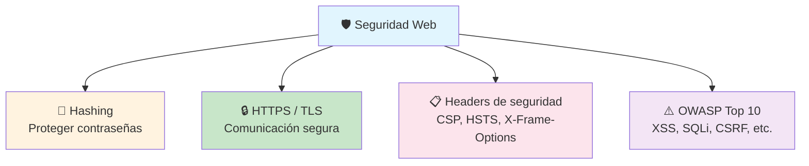

---

## Algoritmos de Hashing

El **hashing** convierte cualquier entrada en una cadena de longitud fija (hash) que es **irreversible**: no se puede obtener el valor original a partir del hash.

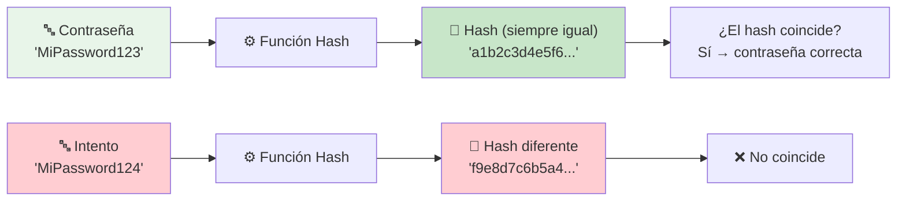

### Hashing vs Encriptación

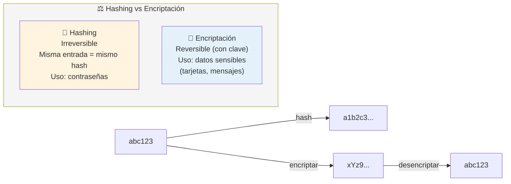

> **Regla:** Las contraseñas se **hashean** (nunca se encriptan). Si puedes desencriptar, es encriptación, no hash.

### Tipos de algoritmos

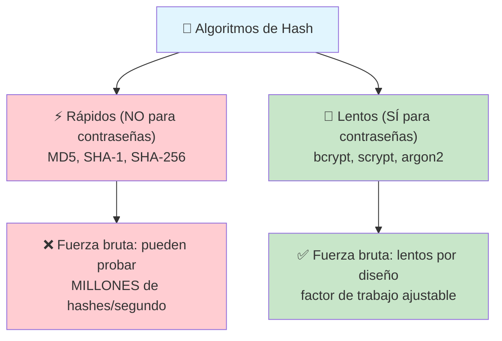

---

## MD5

**MD5** (Message Digest 5) produce un hash de **128 bits** (32 caracteres hex). Fue popular en los 90, pero hoy está **completamente roto** para seguridad.

```bash
echo -n "MiPassword123" | md5sum
# → 4d9f5c6b8a3e2f1d7c0b9a8e7f6d5c4b
```

### Por qué NO usar MD5

1. **Colisiones demostradas** — se pueden generar dos entradas distintas con el mismo hash (2004)
2. **Rápidísimo** — se pueden calcular **miles de millones** de hashes por segundo con GPUs
3. **Sin sal (salt)** — mismo password = mismo hash (ataques con rainbow tables)

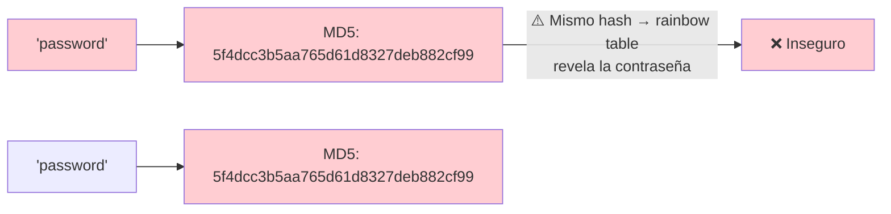

> **NO uses MD5 para contraseñas.** Solo sirve para checksums de integridad (verificar que un archivo no se corrompió).

---

## SHA

**SHA** (Secure Hash Algorithm) es una familia de funciones hash diseñadas por la NSA. Incluye SHA-1, SHA-2 (SHA-256, SHA-512) y SHA-3.

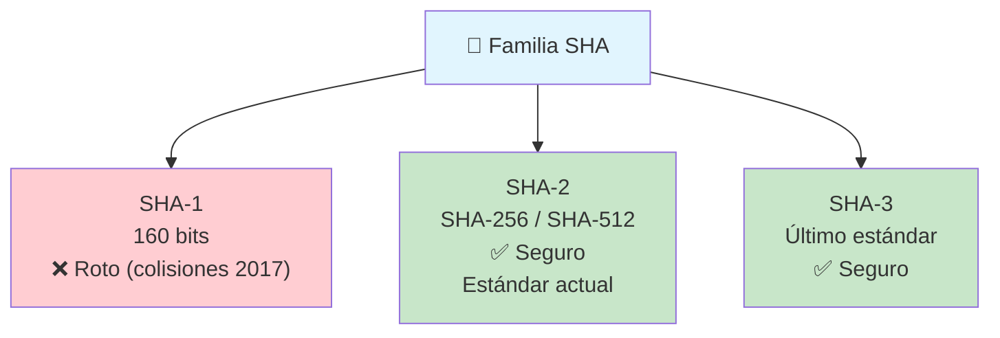

### ¿SHA es seguro para contraseñas?

```bash
# SHA-256 de "MiPassword123"
echo -n "MiPassword123" | sha256sum
# → 8d9f7c6b5a4e3f2d1c0b9a8e7f6d5c4b3a2e1f0d9c8b7a6e5f4d3c2b1a0f9e8d
```

**SHA-256 es seguro criptográficamente, pero es DEMASIADO RÁPIDO** para contraseñas.

| Algoritmo     | Velocidad (hashes/seg en GPU) |
| ------------- | ----------------------------- |
| MD5           | ~20,000 millones              |
| SHA-1         | ~10,000 millones              |
| SHA-256       | ~5,000 millones               |
| SHA-512       | ~2,000 millones               |

> **¿Para qué sirve SHA entonces?** Firma digital, certificados SSL/TLS, integridad de archivos, Git (SHA-1 para commits), blockchain. **No para almacenar contraseñas.**

---

## Funciones de derivación de clave (KDF)

Para contraseñas necesitas algoritmos diseñados para ser **lentos y costosos** en CPU/memoria.

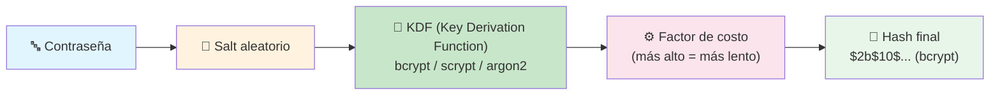

### ¿Qué es el "salt"?

Una cadena aleatoria única que se añade a cada contraseña antes de hashearla. Así, dos usuarios con la misma contraseña tienen **hashes completamente diferentes**.

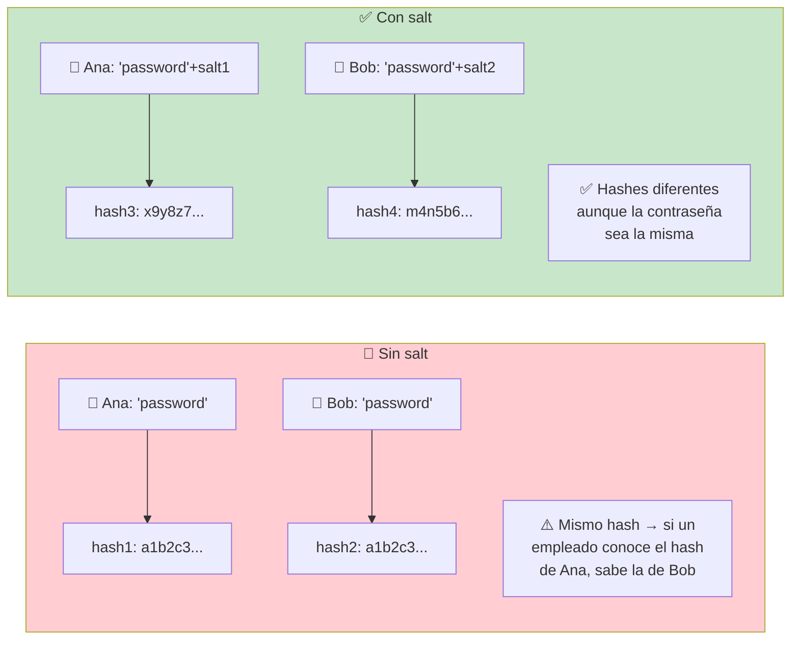

---

## bcrypt

**bcrypt** es el algoritmo más usado para almacenar contraseñas. Está diseñado específicamente para este propósito: es **lento, incluye salt automático** y su costo es ajustable.

```bash
# Ejemplo de hash bcrypt
$2b$10$A8f5B7C2dE9fG1hI3jK4lM5nO6pQ7rS8tU9vW0xY1zA2bC3dE4fG5hI6j
├─┤├─┤├────────────────────────────────────────────────────────────┤
│  │  └── Hash + Salt (60 caracteres)
│  └── Factor de costo (10 = 2^10 iteraciones)
└── Versión (2b)
```

### Factor de costo

El factor de costo determina cuántas iteraciones hace bcrypt. Cada incremento duplica el tiempo.

| Costo | Iteraciones | Tiempo aprox. |
| ----- | ----------- | -------------- |
| 10    | 1,024       | ~100ms         |
| 12    | 4,096       | ~400ms         |
| 14    | 16,384      | ~1.6s          |

```javascript
// Node.js con bcrypt
const bcrypt = require('bcrypt');

// Hashear (automáticamente genera salt)
const hash = await bcrypt.hash('MiPassword123', 12);

// Verificar
const coincide = await bcrypt.compare('MiPassword123', hash);
// → true / false
```

```python
# Python con bcrypt
import bcrypt

# Hashear
hash = bcrypt.hashpw(b'MiPassword123', bcrypt.gensalt(rounds=12))

# Verificar
coincide = bcrypt.checkpw(b'MiPassword123', hash)
# → True / False
```

> **bcrypt es el estándar de facto** para contraseñas. Si no sabes cuál usar, usa bcrypt.

---

## scrypt

**scrypt** es similar a bcrypt pero además de ser costoso en CPU, también requiere **mucha memoria RAM**, lo que hace extremadamente difícil el ataque con GPUs o ASICs.

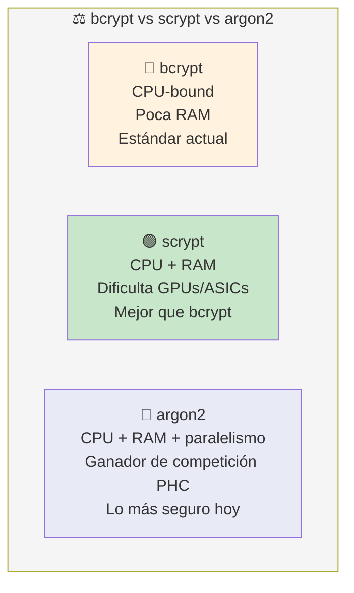

```bash
# Hash scrypt
$s0$e0801$W9j8f7d6g5h4j3k2l1m0n9b8v7c6x5z4a3s2d1f0g1h2j3k4l5m6n7b8v9c0x
```

```javascript
// Node.js con scrypt (nativo desde Node 10)
const { scryptSync, randomBytes, timingSafeEqual } = require('crypto');

const salt = randomBytes(16).toString('hex');
const hash = scryptSync('MiPassword123', salt, 64).toString('hex');

// Guardas: salt + ":" + hash
const almacenado = `${salt}:${hash}`;
```

---

## argon2

**argon2** es el ganador de la competición PHC (Password Hashing Competition) en 2015. Es el algoritmo más seguro y moderno para contraseñas.

```javascript
// Node.js con argon2
const argon2 = require('argon2');

const hash = await argon2.hash('MiPassword123', {
    type: argon2.argon2id,  // recomendado
    memoryCost: 19456,       // 19 MB
    timeCost: 2,
    parallelism: 1
});

const ok = await argon2.verify(hash, 'MiPassword123');
```

```python
# Python con argon2-cffi
from argon2 import PasswordHasher

ph = PasswordHasher()
hash = ph.hash("MiPassword123")
ok = ph.verify(hash, "MiPassword123")
```

---

## Comparativa: ¿cuál usar?

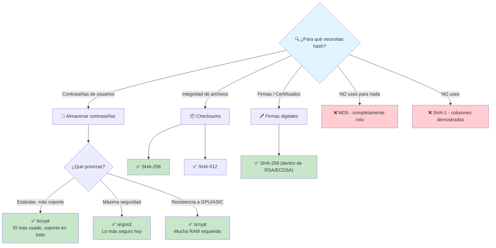

### Tabla resumen

| Algoritmo | ¿Para contraseñas? | Velocidad   | Seguridad      | Uso recomendado           |
| --------- | ------------------ | ----------- | -------------- | ------------------------- |
| **MD5**   | ❌ No              | ⚡ Muy rápida | ❌ Roto       | Solo checksums no críticos |
| **SHA-1** | ❌ No              | ⚡ Muy rápida | ❌ Roto       | Nada (migrar a SHA-2)     |
| **SHA-256** | ❌ No            | ⚡ Rápida    | ✅ Criptográfico | Firma, TLS, integridad  |
| **bcrypt**  | ✅ Sí           | 🐢 Lenta     | ✅ Seguro      | **Estándar para pw**      |
| **scrypt**  | ✅ Sí           | 🐢 Lenta + RAM | ✅ Más seguro | Resistencia a hardware    |
| **argon2**  | ✅ Sí           | 🐢 Lenta + RAM | ✅✅ Más seguro | Lo más moderno           |

---

## Recomendaciones finales

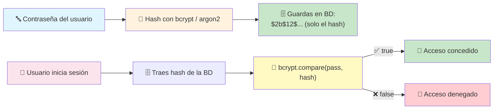

### Checklist de seguridad para contraseñas

- [ ] Usa **bcrypt** (costo ≥ 12) o **argon2**
- [ ] **Nunca** uses MD5, SHA-1, SHA-256 para contraseñas
- [ ] **Nunca** almacenes contraseñas en texto plano
- [ ] **Nunca** encriptes contraseñas (la encriptación se puede desencriptar)
- [ ] **Siempre** usa salt (bcrypt/argon2 lo generan automáticamente)
- [ ] **HTTPS** en toda comunicación
- [ ] **Rate limiting** en login para prevenir fuerza bruta

> **Siguiente paso:** Reemplaza cualquier hash inseguro en tus proyectos con bcrypt o argon2, y estudia el [OWASP Top 10](https://owasp.org/www-project-top-ten/) para conocer las vulnerabilidades web más críticas.
