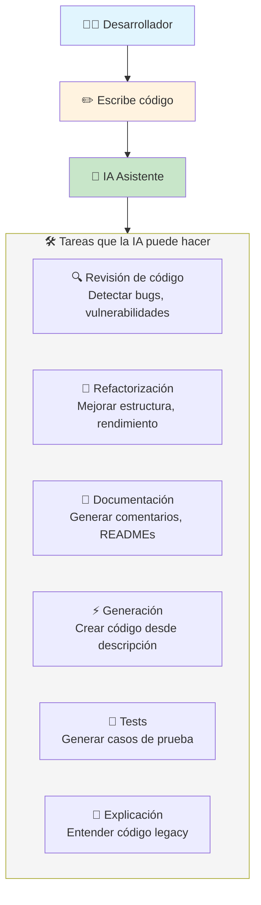
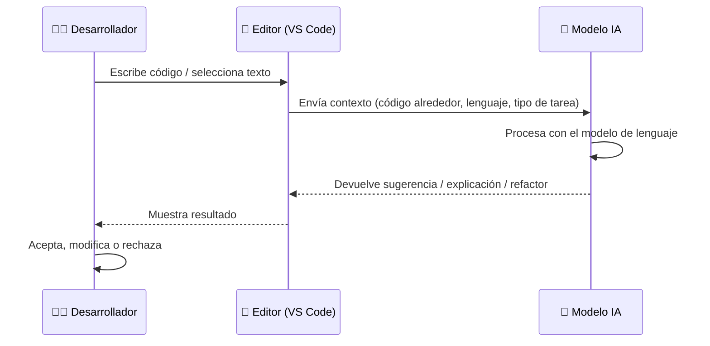
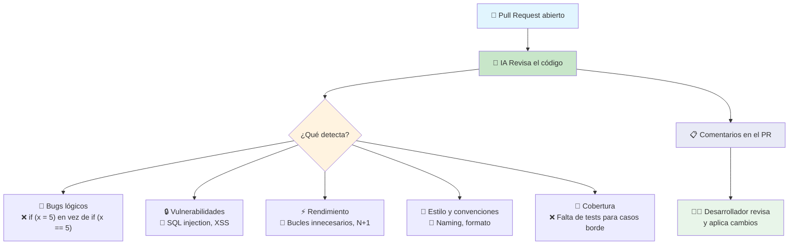
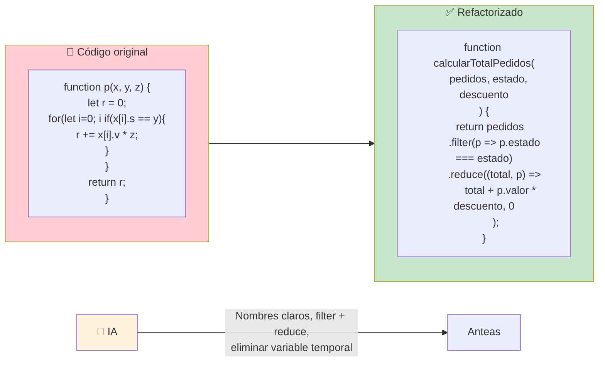
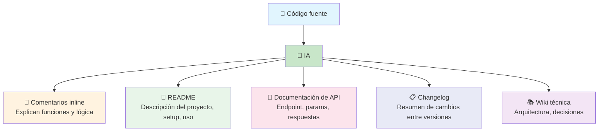
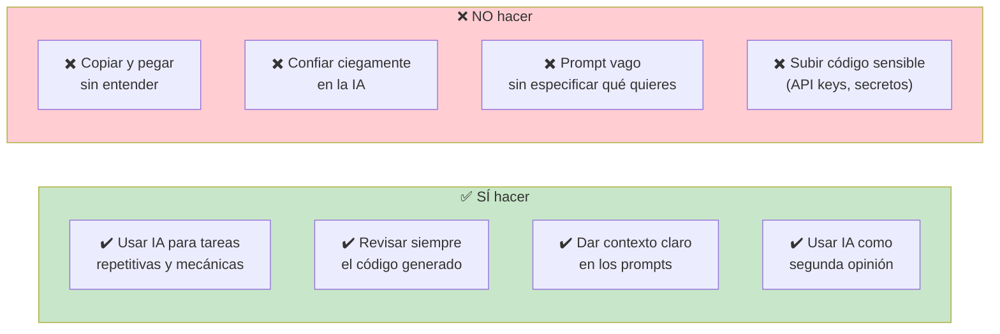
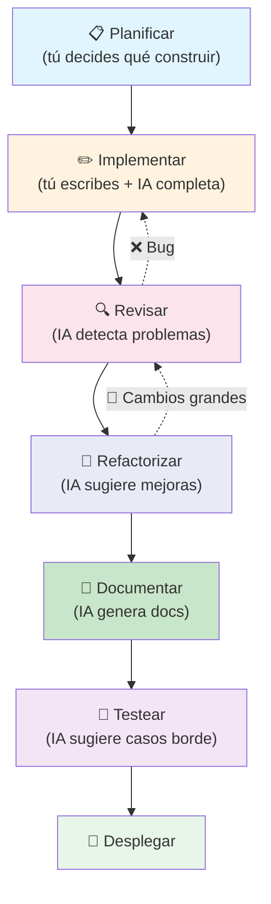
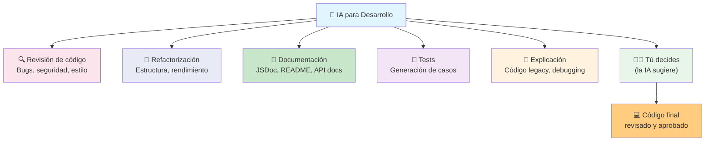

# Aplicaciones con IA

La IA está transformando la forma en que escribimos, revisamos y mantenemos código. No reemplaza al desarrollador, pero lo hace **significativamente más productivo**.



### ¿Cómo funciona un asistente de código IA?



> **La clave:** El desarrollador siempre tiene la última palabra. La IA es copiloto, no piloto.

---

## Revisión de código

La IA puede revisar tu código en busca de **bugs, vulnerabilidades, malas prácticas y mejoras de rendimiento**.



### Ejemplo real

```javascript
// ❌ Código con problemas
function getTotal(items) {
    let total = 0;
    for (var i = 0; i < items.length; i++) {
        total += items[i].price * items[i].quantity;
    }

    // 🐛 Bug: dividir por cantidad para obtener total?
    // 😱 Si quantity es 0, esto explota
    return total / items.length;
}

// 🤖 IA sugiere:
// 1. Bug: el nombre sugiere "total" pero devuelve "promedio"
// 2. Seguridad: si items.length es 0, crash
// 3. Mejora: usar reduce en vez de for + var
```

```javascript
// ✅ Código corregido
function getAverage(items) {
    if (!items?.length) return 0;

    const total = items.reduce((sum, item) => {
        return sum + (item.price * item.quantity);
    }, 0);

    return total / items.length;
}
```

### Herramientas de revisión con IA

| Herramienta      | Cómo funciona                          |
| ---------------- | -------------------------------------- |
| **Copilot Review** | Comentarios automáticos en PRs (GitHub) |
| **CodeRabbit**   | Revisión automatizada de PRs           |
| **Cursor**       | Editor con IA integrada para revisiones |
| **Qodo (Codium)**| Genera tests y revisa PRs              |

---

## Refactorizaciones

La IA puede **mejorar la estructura del código** sin cambiar su comportamiento: renombrar variables, extraer funciones, simplificar condicionales.



### Tipos de refactorización que la IA hace bien

| Tipo                   | Ejemplo                                      |
| ---------------------- | -------------------------------------------- |
| **Renombrar**          | `x` → `pedidos`, `p` → `producto`            |
| **Extraer función**    | Bloque de 20 líneas → `calcularDescuento()`  |
| **Simplificar**        | `if (x == true)` → `if (x)`                  |
| **Modernizar**         | `var` → `let/const`, `for` → `map/filter`    |
| **Eliminar duplicación** | Código repetido → función reutilizable    |
| **Mejorar rendimiento** | Bucles anidados → objetos lookup            |

### Prompt típico para refactorizar

```
Refactoriza este código JavaScript:
- Usa nombres descriptivos
- Reemplaza for con métodos funcionales (map, filter, reduce)
- Extrae la lógica de descuento a una función separada
- Usa arrow functions
- Añade manejo de errores

[CÓDIGO AQUÍ]
```

---

## Generación de documentación

Una de las tareas que más tiempo consume (y que menos nos gusta) es documentar. La IA puede generar documentación automáticamente a partir del código.



### Ejemplo: documentación de una función

```javascript
// 🤖 IA genera esto automáticamente:

/**
 * Calcula el precio total de un pedido aplicando descuentos
 * y calculando impuestos según la región del cliente.
 *
 * @param {Array<Product>} productos - Lista de productos en el pedido
 * @param {string} codigoDescuento - Código de descuento opcional
 * @param {string} region - Región del cliente (MX, US, ES)
 * @returns {Promise<Object>} { subtotal, descuento, impuestos, total }
 * @throws {Error} Si la región no tiene configuración de impuestos
 *
 * @example
 * const resultado = await calcularTotal([
 *   { id: 1, precio: 100, cantidad: 2 }
 * ], 'DESC10', 'MX');
 * // → { subtotal: 200, descuento: 20, impuestos: 32, total: 212 }
 */
async function calcularTotal(productos, codigoDescuento, region) {
    // ... implementación
}
```

### Ejemplo: README automático

```markdown
# 📦 api-pedidos

API REST para gestión de pedidos de comercio electrónico.

## 🚀 Inicio rápido

```bash
npm install
cp .env.example .env
npm run dev
```

## 📋 Endpoints

| Método | Ruta              | Descripción             |
| ------ | ----------------- | ----------------------- |
| GET    | /api/pedidos      | Listar pedidos          |
| POST   | /api/pedidos      | Crear pedido            |
| GET    | /api/pedidos/:id  | Obtener pedido          |
| PUT    | /api/pedidos/:id  | Actualizar pedido       |

## 🧪 Tests

```bash
npm test        # Tests unitarios
npm run test:e2e  # Tests end-to-end
```
```

### Herramientas de documentación con IA

| Herramienta           | Genera                                 |
| --------------------- | -------------------------------------- |
| **Copilot / Cursor**  | Comentarios inline, JSDoc              |
| **Mintlify**          | Documentación de APIs                  |
| **GitHub Copilot for PRs** | Resúmenes automáticos de PRs      |
| **Swimm**             | Documentación de código que se actualiza sola |

---

## Buenas prácticas al usar IA



### Consejos para prompts efectivos

```markdown
❌ Mal prompt:
"Refactoriza esto"

✅ Buen prompt:
"Refactoriza esta función de Node.js:
- Divide en funciones más pequeñas (máximo 15 líneas cada una)
- Usa async/await en vez de .then()
- Añade manejo de errores con try/catch
- Renombra variables para que sean descriptivas
- Añade comentarios explicando la lógica de negocio"

```

---

## Flujo de trabajo ideal con IA



---

## Resumen visual



> **Siguiente paso:** Prueba GitHub Copilot o Cursor en tu editor. Pídele que revise un PR, que refactorice una función fea, o que documente tu API. La práctica es la mejor forma de entender sus límites y fortalezas.

## Relacionados:
- [[bases-de-la-ia]] #anterior 
- [[codigo-asistido-por-ia]] #siguiente 