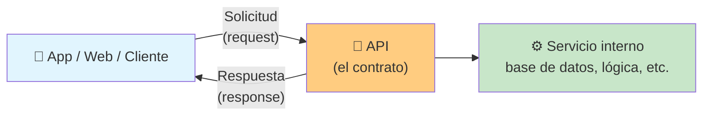
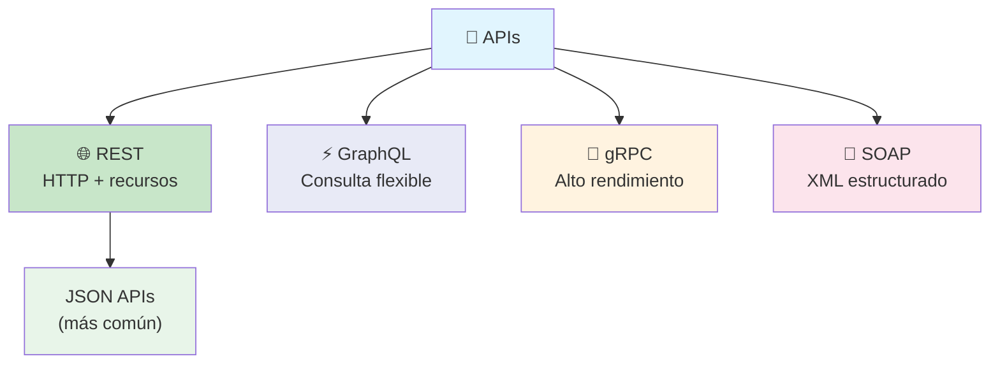
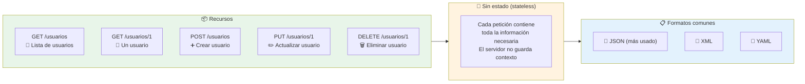
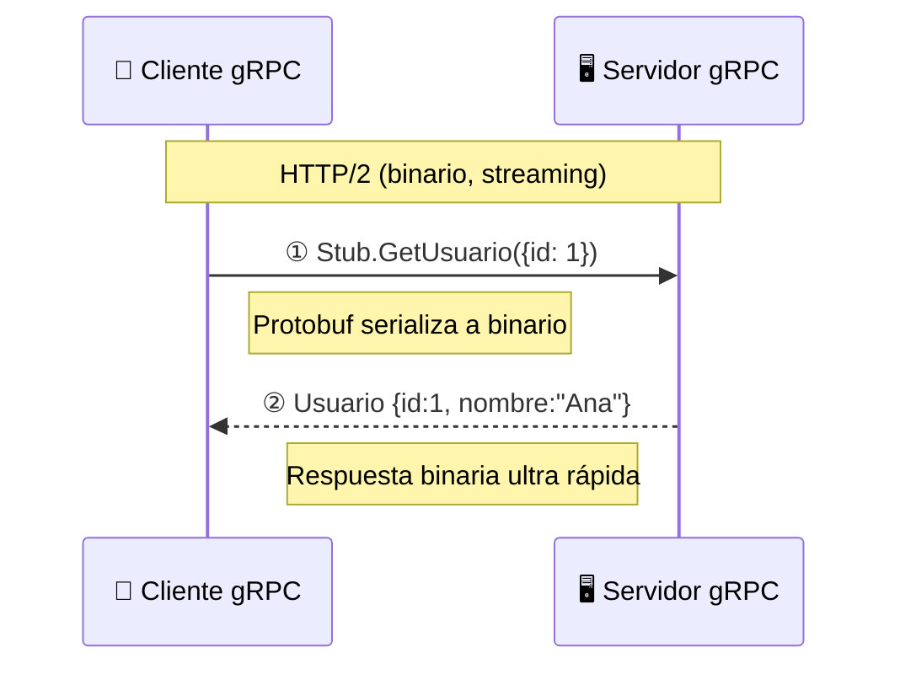
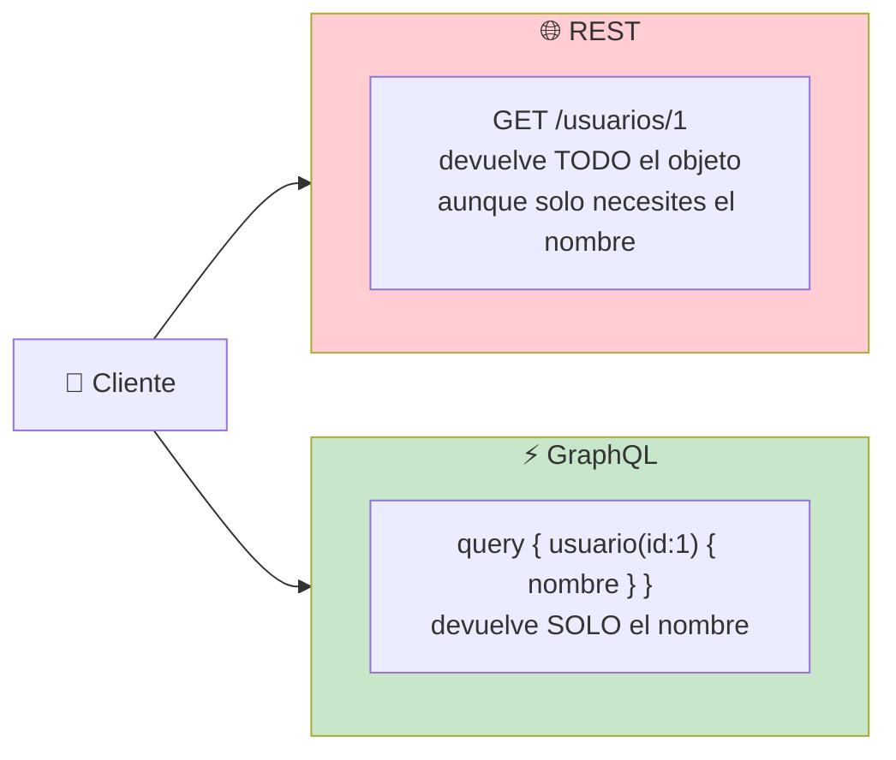
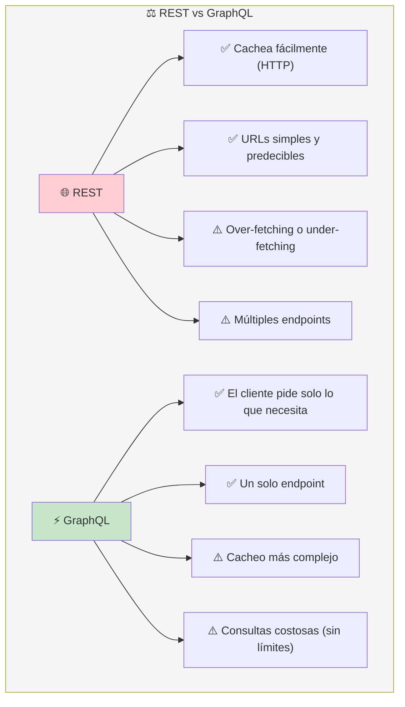
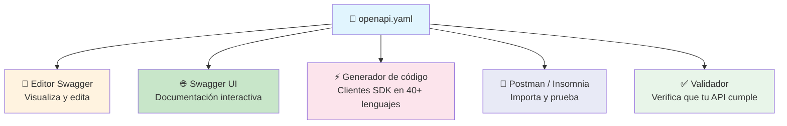
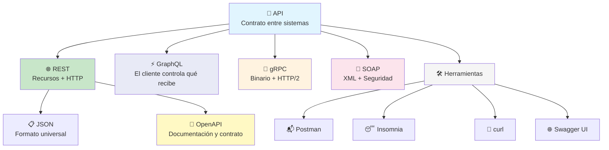

# Aprende de APIs

Una **API** (Application Programming Interface) es un **contrato** entre dos programas: define cómo un cliente puede pedir datos o acciones a un servidor sin saber cómo funciona internamente.



> **Analogía:** Un restaurante. Tú (cliente) le pides al mesero (API) lo que quieres. El mesero lleva tu pedido a la cocina (servidor) y te trae lo que pediste. No necesitas saber cómo cocinan.

---

## Estilos de APIs



---

## REST

**REST** (Representational State Transfer) es el estilo arquitectónico más usado en APIs web. Trata los datos como **recursos** identificados por URLs y operados con métodos HTTP.

### Principios REST



### Convenciones RESTful

| Método   | URL              | Acción           | Código éxito |
| -------- | ---------------- | ---------------- | ------------ |
| `GET`    | `/usuarios`      | Listar usuarios  | 200          |
| `GET`    | `/usuarios/1`    | Obtener usuario  | 200          |
| `POST`   | `/usuarios`      | Crear usuario    | 201          |
| `PUT`    | `/usuarios/1`    | Reemplazar       | 200          |
| `PATCH`  | `/usuarios/1`    | Actualizar parcial | 200        |
| `DELETE` | `/usuarios/1`    | Eliminar         | 204          |

### Ejemplo de petición REST

```bash
# Petición
GET /usuarios/1 HTTP/1.1
Host: api.miapp.com
Authorization: Bearer token123
Accept: application/json

# Respuesta
HTTP/1.1 200 OK
Content-Type: application/json

{
    "id": 1,
    "nombre": "Ana",
    "email": "ana@email.com",
    "posts": 12
}
```

### Buenas prácticas REST

- Usa nombres **en plural** (`/usuarios`, no `/usuario`)
- **Jerarquías** con `/: `/usuarios/1/posts`
- **Filtros** con query params: `/usuarios?rol=admin&activo=true`
- **Versionado**: `/api/v1/usuarios`
- **Errores consistentes**:

```json
{
    "error": {
        "codigo": 404,
        "mensaje": "Usuario no encontrado",
        "detalle": "No existe usuario con id 99"
    }
}
```

---

## JSON APIs

JSON (JavaScript Object Notation) es el formato de intercambio de datos más usado en APIs modernas. Es **ligero, legible por humanos y fácil de parsear** desde cualquier lenguaje.

### JSON vs XML

```json
// ✅ JSON
{
    "id": 1,
    "nombre": "Ana",
    "email": "ana@email.com"
}
```

```xml
<!-- ❌ XML (más verboso) -->
<usuario>
    <id>1</id>
    <nombre>Ana</nombre>
    <email>ana@email.com</email>
</usuario>
```

### Tipos de datos en JSON

```json
{
    "string": "Hola mundo",
    "number": 42,
    "boolean": true,
    "null": null,
    "array": ["rojo", "verde", "azul"],
    "object": {
        "clave": "valor"
    }
}
```

---

## SOAP

**SOAP** (Simple Object Access Protocol) es un protocolo de intercambio de datos basado en **XML** que fue el estándar empresarial antes de REST. Es más rígido y pesado, pero ofrece más seguridad y transaccionalidad.

- **Formato:** Solo XML
- **Transporte:** HTTP, SMTP, TCP
- **WSDL:** Define el contrato de forma estricta
- **Seguridad:** WS-Security (encriptación, firmas)
- **Estado:** Puede ser stateful

```xml
<!-- Ejemplo SOAP -->
<soap:Envelope xmlns:soap="http://schemas.xmlsoap.org/soap/envelope/">
    <soap:Body>
        <getUsuario xmlns="http://miapp.com/soap">
            <id>1</id>
        </getUsuario>
    </soap:Body>
</soap:Envelope>
```

> **¿Cuándo usarlo?** Sistemas bancarios, gubernamentales, facturación electrónica — donde la seguridad y el contrato estricto son prioridad.

---

## gRPC

**gRPC** es un framework de RPC (Remote Procedure Call) creado por Google. Usa **Protocol Buffers** en lugar de JSON/XML y **HTTP/2** como transporte. Es ideal para comunicación interna entre microservicios.

### Cómo funciona

```protobuf
// 1. Defines un .proto
service UsuarioService {
    rpc GetUsuario (GetUsuarioRequest) returns (Usuario);
}

message GetUsuarioRequest {
    int32 id = 1;
}

message Usuario {
    int32 id = 1;
    string nombre = 2;
    string email = 3;
}
```



### Ventajas de gRPC

- **Rendimiento:** Serialización binaria mucho más rápida que JSON
- **Streaming:** Soporta streams bidireccionales (HTTP/2)
- **Contrato estricto:** El `.proto` define TODO
- **Generación automática:** Crea clientes en múltiples lenguajes

> **¿Cuándo usarlo?** Microservicios, sistemas de alta performance, streaming de datos, comunicación interna.

---

## GraphQL

**GraphQL** es un lenguaje de consulta creado por Facebook. A diferencia de REST (donde el servidor decide qué devuelve), en GraphQL **el cliente pide exactamente lo que necesita**.



### Ejemplo GraphQL

```graphql
# Consulta: el cliente pide exactamente lo que necesita
query {
    usuario(id: 1) {
        nombre
        email
        posts {
            titulo
        }
    }
}
```

```json
// Respuesta: solo los campos pedidos
{
    "data": {
        "usuario": {
            "nombre": "Ana",
            "email": "ana@email.com",
            "posts": [
                { "titulo": "Post 1" },
                { "titulo": "Post 2" }
            ]
        }
    }
}
```

### REST vs GraphQL



> **¿Cuándo usarlo?** Aplicaciones con datos complejos y relacionados, dashboards, apps móviles (ancho de banda limitado). No es ideal si necesitas caching HTTP simple.

---

## Especificaciones de APIs Abiertas

Las **especificaciones de APIs abiertas** (OpenAPI) son estándares para **describir, documentar y consumir APIs REST** de forma estructurada.

### OpenAPI (Swagger)

OpenAPI es el estándar más usado. Permite definir tu API en un archivo YAML o JSON que puede generar documentación interactiva, clientes SDK y tests automáticos.

```yaml
openapi: "3.0.0"
info:
  title: API de Usuarios
  version: "1.0.0"
paths:
  /usuarios:
    get:
      summary: Lista todos los usuarios
      responses:
        "200":
          description: Lista de usuarios
          content:
            application/json:
              schema:
                type: array
                items:
                  $ref: "#/components/schemas/Usuario"

components:
  schemas:
    Usuario:
      type: object
      properties:
        id:
          type: integer
        nombre:
          type: string
        email:
          type: string
```

### Herramientas del ecosistema OpenAPI



### Beneficios de usar OpenAPI

- **Documentación viva** — siempre sincronizada con el código
- **Cliente automático** — genera SDKs para JS, Python, Java, Go, etc.
- **Pruebas desde la UI** — Swagger UI permite probar endpoints desde el navegador
- **Contrato claro** — frontend y backend acuerdan el contrato antes de codificar

### Otras especificaciones

| Especificación   | Propósito                              |
| ---------------- | -------------------------------------- |
| **OpenAPI**      | REST APIs (estándar de facto)          |
| **JSON Schema**  | Validar estructura de datos JSON       |
| **AsyncAPI**     | APIs basadas en eventos (WebSockets, Kafka) |
| **GraphQL Schema** | Define tipos y consultas GraphQL   |

---

## Resumen visual



### ¿Cuál elegir?

| API            | Cuándo usarla                              |
| -------------- | ------------------------------------------ |
| **REST**       | APIs web generales, mayoría de proyectos   |
| **GraphQL**    | Apps complejas, dashboards, móvil          |
| **gRPC**       | Microservicios, alto rendimiento, streaming |
| **SOAP**       | Sistemas legacy, banca, gobierno           |

> **Siguiente paso:** Aprende a diseñar una API REST con OpenAPI, pruébala con Postman/Insomnia, y luego impleméntala en tu backend con Express, FastAPI o Spring Boot.

## Relacionados:
- [[bases-de-datos-relacionales]] #anterior 
- [[caching]] #siguiente 
- [[autenticacion]] #extra
- [[algoritmos-de-hashing-web-security]] #extra 
- [[seguridad-web]] #extra 