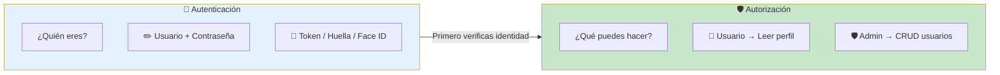
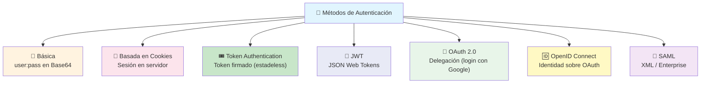
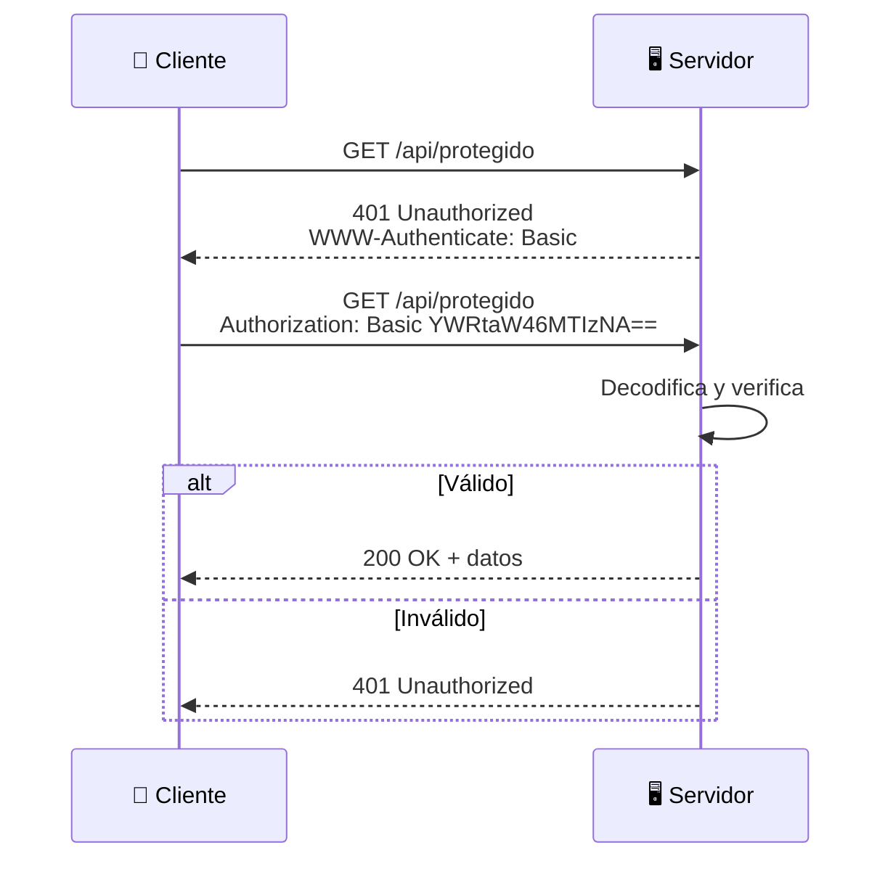
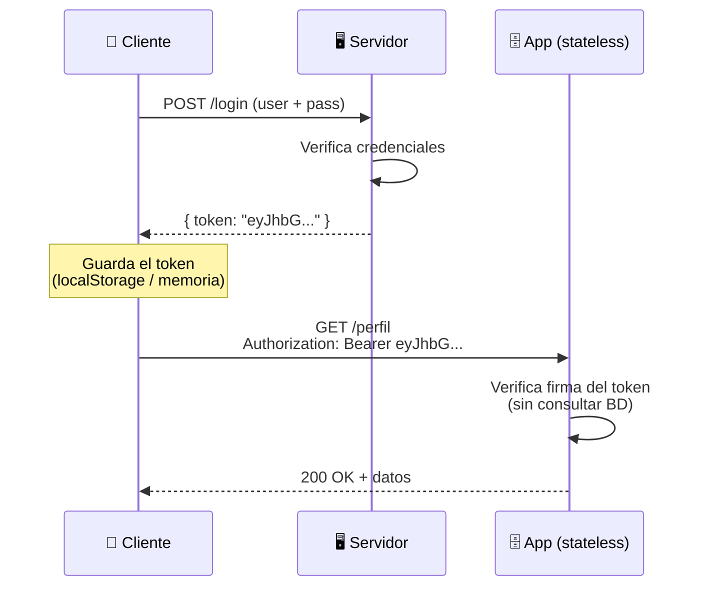
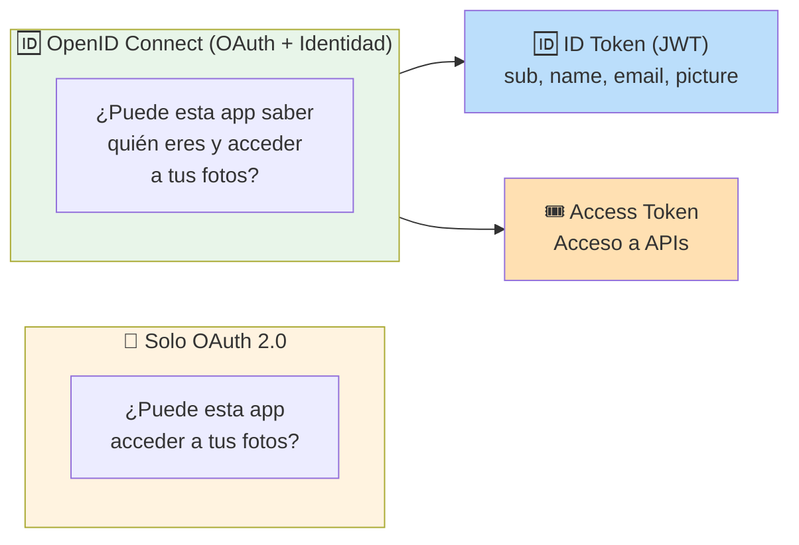
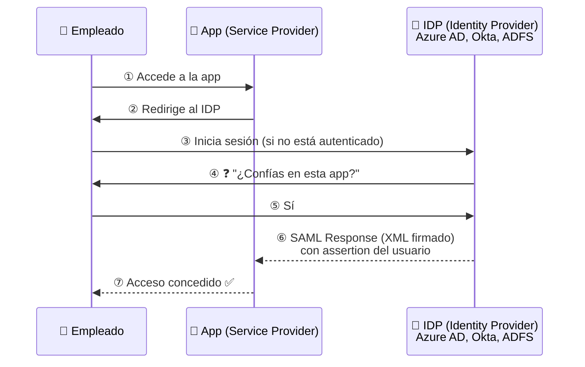
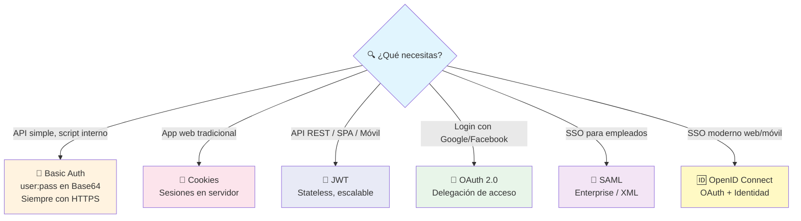
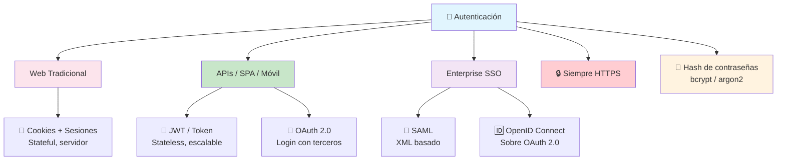

# Autenticación

La **autenticación** verifica **quién eres** (identity). La **autorización** verifica **qué puedes hacer** (permisos). No son lo mismo.



> **Analogía:** Autenticación = mostrar tu pasaporte en el aeropuerto. Autorización = que tu boleto diga que puedes abordar el vuelo.

---

## Tipos de autenticación



---

## Autenticación básica (Basic Auth)

Es el método más simple. El cliente envía `usuario:contraseña` codificado en **Base64** en la cabecera `Authorization`.

```http
# Petición
GET /api/protegido HTTP/1.1
Authorization: Basic YWRtaW46MTIzNA==
#                ↑ admin:1234 en Base64
```



| Ventajas                     | Desventajas                          |
| ---------------------------- | ------------------------------------ |
| ✅ Muy simple de implementar | ❌ Envía credenciales en cada request |
| ✅ Sin dependencias externas | ❌ Solo Base64 (no encriptado, usa HTTPS) |
| ✅ Universal                 | ❌ No tiene logout / expiración      |

> **¿Cuándo usarlo?** APIs internas, desarrollo local, scripts automatizados (siempre con HTTPS).

---

## Autenticación basada en Cookies

El servidor crea una **sesión**, guarda los datos del usuario (en memoria o BD) y envía al navegador un **cookie** con el ID de sesión.

```mermaid
sequenceDiagram
    participant Browser as 🌍 Navegador
    participant Server as 🖥️ Servidor
    participant Session as 🗄️ Almacén de Sesiones

    Browser->>Server: POST /login (user + pass)
    Server->>Server: Verifica credenciales
    Server->>Session: Guarda sesión {user: "ana", rol: "admin"}
    Server-->>Browser: 200 OK<br/>Set-Cookie: sessionId=abc123; HttpOnly

    Note over Browser: El navegador guarda<br/>la cookie automáticamente

    Browser->>Server: GET /perfil<br/>Cookie: sessionId=abc123
    Server->>Session: Busca sesión abc123
    Session-->>Server: {user: "ana", rol: "admin"}
    Server-->>Browser: 200 OK + datos del perfil

    Note over Browser: Cookie se envía automáticamente<br/>en cada request al mismo dominio
```

### Características

- **Stateful** — el servidor guarda la sesión (ocupa memoria/BD)
- **HttpOnly** — la cookie no es accesible desde JavaScript (seguridad XSS)
- **Secure** — solo se envía por HTTPS
- **SameSite** — protege contra CSRF
- **Expiración** — la sesión puede expirar automáticamente

| Ventajas                     | Desventajas                          |
| ---------------------------- | ------------------------------------ |
| ✅ Transparente (navegador maneja cookies) | ❌ Stateful (escala más complejo) |
| ✅ HttpOnly protege contra XSS | ❌ Vulnerable a CSRF (sin SameSite) |
| ✅ Fácil logout (borrar sesión) | ❌ No funciona bien en apps móviles |

---

## Token Authentication

En lugar de sesiones en servidor, el cliente guarda un **token** y lo envía en cada petición. El servidor solo verifica la validez del token. Es **stateless**.

```mermaid
flowchart LR
    Client["📱 Cliente"] --> Login["POST /login<br/>(user + pass)"]
    Login --> Server["🖥️ Servidor<br/>Verifica y genera token"]
    Server --> Client
    Note right of Server: Token firmado o<br/>referencia a sesión

    Client --> Request["GET /recurso<br/>Authorization: Bearer &lt;token&gt;"]
    Request --> Server2["🖥️ Servidor<br/>Verifica token"]
    Server2 -->|"✅ Token válido"| Response["📦 Respuesta"]

    style Client fill:#e1f5fe
    style Login fill:#fff3e0
    style Server fill:#c8e6c9
    style Request fill:#fce4ec
    style Server2 fill:#c8e6c9
    style Response fill:#e8f5e9
```

### Token opaco vs Token autocontenido

| Tipo         | Almacena datos en | Cómo se verifica        | Ejemplo      |
| ------------ | ----------------- | ----------------------- | ------------ |
| **Opaco**    | Servidor (BD/Redis) | El servidor busca el token | Session ID |
| **Autocontenido** | El token mismo | Se verifica la firma     | JWT          |

---

## JWT (JSON Web Token)

**JWT** es un formato de token **autocontenido y firmado**. El token contiene la información del usuario (claims) y una firma que garantiza que no fue modificado.

```mermaid
graph LR
    subgraph JWTStructure ["🔐 Estructura de un JWT"]
        Header["🗒️ HEADER<br/>{'alg':'HS256',<br/>'typ':'JWT'}"]
        Payload["📦 PAYLOAD<br/>{'sub':'1',<br/>'name':'Ana',<br/>'iat': 1700000000}"]
        Signature["✍️ SIGNATURE<br/>HMACSHA256(<br/>base64(header) + '.' +<br/>base64(payload),<br/>secret)]

        Header -->|"base64"| H64["eyJhbGciOiJIUzI1NiIsInR5cCI6IkpXVCJ9"]
        Payload -->|"base64"| P64["eyJzdWIiOiIxIiwibmFtZSI6IkFuYSJ9"]
        H64 --> Final
        P64 --> Final
        Signature --> Final["eyJhbGci... . eyJzdWIi... . s9fK3..."]
    end

    style JWTStructure fill:#e8eaf6
    style Header fill:#bbdefb
    style Payload fill:#ffe0b2
    style Signature fill:#c8e6c9
```

```
Token JWT completo:
eyJhbGciOiJIUzI1NiJ9.eyJzdWIiOiIxIn0.s9fK3lVx
└───── header ─────┘.└─── payload ───┘.└─ firma ─┘
```

### Flujo JWT



### Cuándo usar JWT

| Ventajas                     | Desventajas                          |
| ---------------------------- | ------------------------------------ |
| ✅ Stateless (no ocupa servidor) | ❌ No se puede invalidar fácilmente |
| ✅ Escalable horizontalmente | ❌ Payload no encriptado (solo firmado) |
| ✅ Portable entre servicios   | ❌ Token grande (más ancho de banda) |
| ✅ Soporta expiración (exp)   | ❌ Difícil renovación (refresh tokens) |

---

## OAuth 2.0

**OAuth 2.0** es un **protocolo de delegación de acceso**. Permite que una app acceda a recursos de un usuario en **otro servicio** sin conocer su contraseña. No es autenticación, es **autorización delegada**.

```mermaid
flowchart TB
    User["👤 Usuario"] --> App["📱 App (Cliente)"]
    App --> Auth["🔐 Servidor de Autorización<br/>(Google, GitHub, Facebook)"]
    Auth --> User
    User --> Auth
    Auth --> App
    App --> API["🌐 API de Recursos<br/>(Google Drive, GitHub repos)"]

    Note over App,Auth: "Quiero acceder a tus fotos"
    Note over User,Auth: "¿Permites que esta app acceda?"
    Note over Auth,App: Aquí tienes un token
    Note over App,API: Token → Acceso a recursos

    style User fill:#e1f5fe
    style App fill:#fff3e0
    style Auth fill:#c8e6c9
    style API fill:#fce4ec
```

### Roles en OAuth 2.0

| Rol                        | Descripción                              |
| -------------------------- | ---------------------------------------- |
| **Resource Owner**         | Tú (el usuario dueño de los datos)       |
| **Client**                 | La app que quiere acceder a tus datos    |
| **Authorization Server**   | Proveedor (Google, GitHub) que da tokens |
| **Resource Server**        | La API que tiene los datos               |

### Flujo típico (Authorization Code)

```mermaid
sequenceDiagram
    participant User as 👤 Usuario
    participant App as 📱 Mi App
    participant Google as 🔐 Google (Auth Server)
    participant API as 🌐 Google API

    User->>App: ① Click "Login con Google"
    App->>Google: ② Redirect a Google<br/>?client_id=xxx&redirect_uri=yyy
    Google->>User: ③ "¿Permites acceso?"
    User->>Google: ④ Acepto
    Google-->>App: ⑤ Redirect con código
    App->>Google: ⑥ Canjea código + secret
    Google-->>App: ⑦ access_token + refresh_token
    App->>API: ⑧ GET /fotos<br/>Authorization: Bearer &lt;token&gt;
    API-->>App: ⑨ 📸 Tus fotos
    App-->>User: ⑩ Muestra las fotos
```

---

## OpenID Connect

**OpenID Connect (OIDC)** es una capa de **identidad** sobre OAuth 2.0. Mientras OAuth delega **acceso a recursos**, OpenID añade **verificación de identidad**.



### ¿Qué aporta OpenID?

- **ID Token** — un JWT que demuestra quién es el usuario (`sub`, `name`, `email`, `picture`)
- **UserInfo endpoint** — obtienes perfil completo del usuario
- **Estandariza** cómo se hace "Login con Google/Facebook/GitHub"

> **Login con Google** que ves en todos lados es OAuth 2.0 + OpenID Connect.

---

## SAML

**SAML** (Security Assertion Markup Language) es un estándar empresarial para **Single Sign-On (SSO)** basado en XML. Es el más usado en empresas y gobiernos.



### SAML vs OpenID Connect

| Característica      | SAML                  | OpenID Connect        |
| ------------------- | --------------------- | --------------------- |
| **Formato**         | XML                   | JSON                  |
| **Token**           | SAML Assertion        | JWT (ID Token)        |
| **Transporte**      | HTTP Redirect / POST  | REST API              |
| **Complejidad**     | Alta                  | Baja                  |
| **Uso típico**      | Empresas, gobierno    | Web, móvil, startups  |
| **SSO**             | Sí                    | Sí                    |

---

## Comparativa: cuándo usar cada uno



### Tabla resumen

| Método               | Stateful  | Formato     | Ideal para                        |
| -------------------- | --------- | ----------- | --------------------------------- |
| **Basic Auth**       | No        | Base64      | APIs internas, scripts            |
| **Cookies**          | Sí        | Cookie HTTP | Apps web tradicionales            |
| **Token**            | No        | String      | APIs REST, apps móviles           |
| **JWT**              | No        | JWT firmado | APIs escalables, microservicios   |
| **OAuth 2.0**        | No        | Token       | Login con terceros, delegación    |
| **OpenID Connect**   | No        | JWT + Token | SSO moderno, identidad            |
| **SAML**             | Depende   | XML         | SSO empresarial, legacy           |

---

## Buenas prácticas

1. **Siempre HTTPS** — cualquier token o cookie viaja encriptado
2. **Nunca guardes tokens en localStorage** si hay riesgo XSS → mejor cookies HttpOnly o memoria
3. **Expiración corta** para access tokens (15-60 min) + refresh tokens de larga duración
4. **Invalidación** — ten un mecanismo para revocar tokens si es necesario (blacklist en Redis)
5. **Rate limiting** en login para evitar fuerza bruta
6. **Hash de contraseñas** con bcrypt/argon2, nunca almacenes texto plano
7. **JWT: no pongas info sensible** en el payload (solo está firmado, no encriptado)

---

## Resumen visual



> **Siguiente paso:** Implementa JWT en tu backend favorito (Node.js con `jsonwebtoken` o Python con `PyJWT`), y luego agrega login con Google usando OAuth 2.0 + OpenID Connect.
