# Introducción

El **backend** es la parte de una aplicación que no vemos: el motor que procesa datos, ejecuta lógica de negocio y se comunica con bases de datos y otros servicios. Mientras el frontend es lo que el usuario ve y toca, el backend es lo que hace que todo funcione detrás de escena.

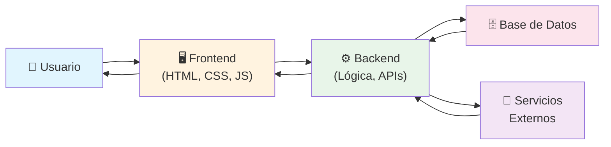

---

## ¿Cómo funciona Internet?

Internet es una **red global de computadoras interconectadas** que se comunican mediante protocolos estandarizados. Cuando accedes a un sitio web, tu dispositivo envía y recibe datos a través de múltiples nodos hasta llegar al servidor destino.

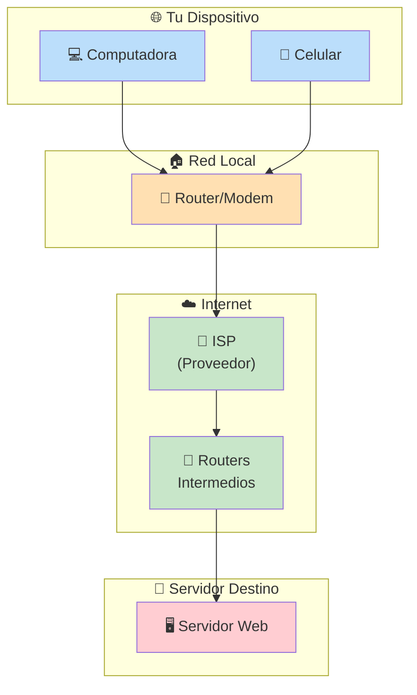

**El viaje de un paquete de datos:**

1. Tu computadora divide la información en **paquetes**
2. Cada paquete viaja por diferentes rutas (como si fueran cartas enviadas por caminos distintos)
3. Los **routers** intermedios reenvían los paquetes hacia su destino
4. El servidor destino reensambla los paquetes en el orden correcto

---

## ¿Qué es HTTP?

**HTTP** (HyperText Transfer Protocol) es el protocolo que permite la comunicación entre navegadores y servidores web. Es el "idioma" que hablan cliente y servidor para intercambiar información.

```mermaid
sequenceDiagram
    participant C as 🌍 Navegador (Cliente)
    participant S as 🖥️ Servidor Web

    Note over C,S: Protocolo HTTP/1.1 o HTTP/2

    C->>S: ① GET /index.html HTTP/1.1
    Note right of C: Headers: Host, User-Agent,<br/>Accept, Cookie...

    S-->>C: ② Respuesta HTTP
    Note left of S: Status: 200 OK<br/>Content-Type: text/html<br/>Content-Length: 4521

    S-->>C: ③ &lt;html&gt;&lt;body&gt;...&lt;/body&gt;&lt;/html&gt;
    Note right of C: El navegador renderiza<br/>el HTML recibido

    C->>S: ④ GET /styles.css HTTP/1.1
    S-->>C: ⑤ 200 OK + contenido CSS

    C->>S: ⑥ GET /app.js HTTP/1.1
    S-->>C: ⑦ 200 OK + contenido JS
```

### Métodos HTTP más comunes

| Método   | Acción       | Ejemplo                    |
| -------- | ------------ | -------------------------- |
| `GET`    | Obtener datos | Ver un artículo            |
| `POST`   | Crear recursos | Registrar un usuario       |
| `PUT`    | Actualizar todo | Editar perfil completo   |
| `PATCH`  | Actualizar parcial | Cambiar solo el email |
| `DELETE` | Eliminar      | Borrar una cuenta          |

### Códigos de estado HTTP

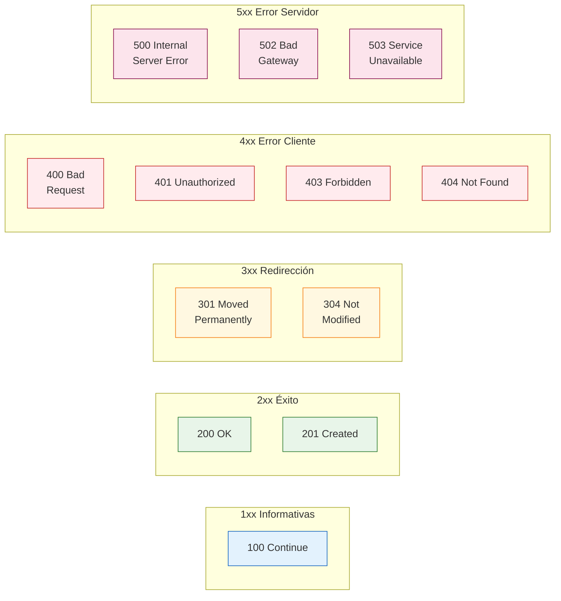

---

## ¿Qué es el Dominio de Nombres?

El **DNS** (Domain Name System) es como la **agenda telefónica de Internet**. Los humanos recordamos nombres (`google.com`), pero las computadoras se comunican mediante direcciones IP numéricas (`142.250.184.14`). El DNS traduce un nombre en su IP correspondiente.

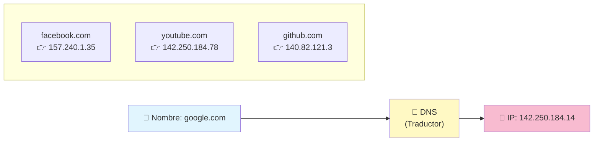

**Jerarquía de dominios:**

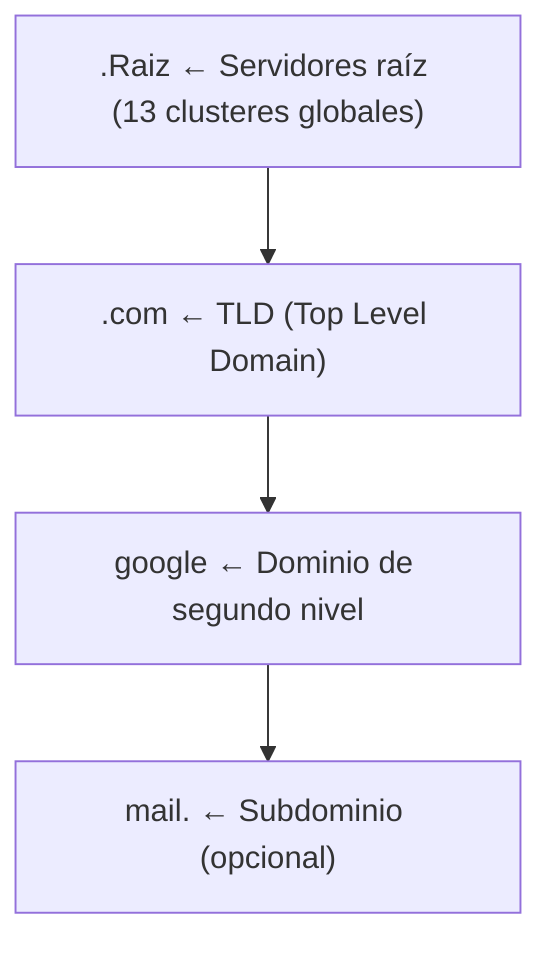

> mail.google.com → leer de derecha a izquierda: `.` → `.com` → `google` → `mail.`


---

## ¿Qué es hosting?

El **hosting** (alojamiento web) es el servicio que proporciona **espacio en un servidor** para almacenar los archivos de tu sitio web y hacerlos accesibles desde Internet 24/7.

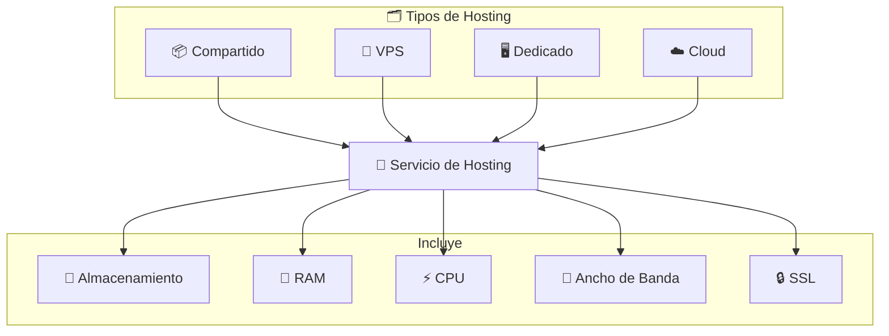

| Tipo       | Ideal para...              | Ejemplo                    |
| ---------- | -------------------------- | -------------------------- |
| Compartido | Blogs, sitios pequeños     | Bluehost, HostGator        |
| VPS        | Sitios en crecimiento      | DigitalOcean, Linode       |
| Dedicado   | Grandes aplicaciones       | OVH, Hetzner               |
| Cloud      | Aplicaciones variables     | AWS, Google Cloud, Azure   |

---

## ¿Cómo funciona el DNS?

Cuando escribes una URL en el navegador, ocurre toda una coreografía para resolver el nombre a una dirección IP.

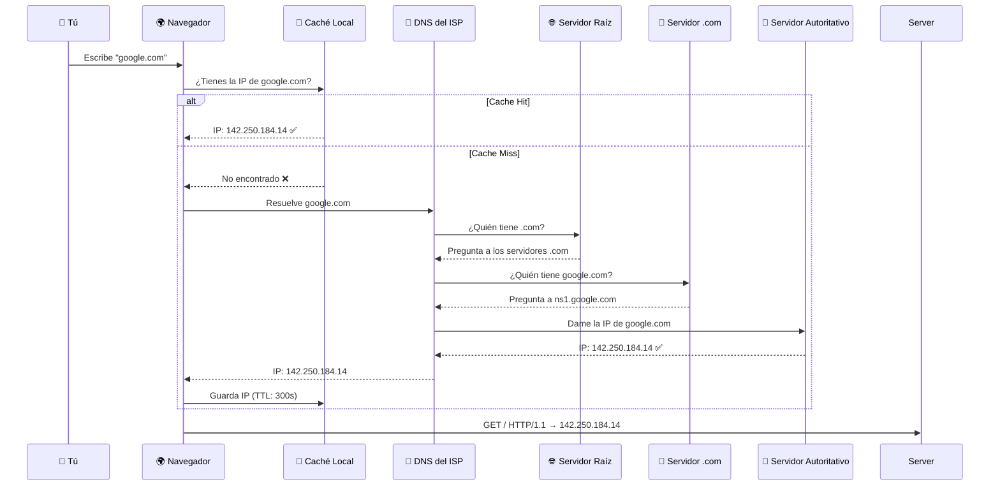

**Pasos resumidos:**

1. **Caché del navegador** → Si ya visitaste el sitio, usa la IP guardada
2. **Caché del SO** → Revisa la caché del sistema operativo
3. **DNS del ISP** → Pregunta al servidor DNS de tu proveedor
4. **Servidores raíz** → Indican dónde está el TLD (`.com`, `.org`, etc.)
5. **Servidor TLD** → Indica el servidor autoritativo del dominio
6. **Servidor autoritativo** → Devuelve la IP final

---

## ¿Cómo funcionan los navegadores?

El navegador es el **intérprete y visualizador** de la web. Su trabajo es tomar código (HTML, CSS, JS) y convertirlo en una página interactiva.

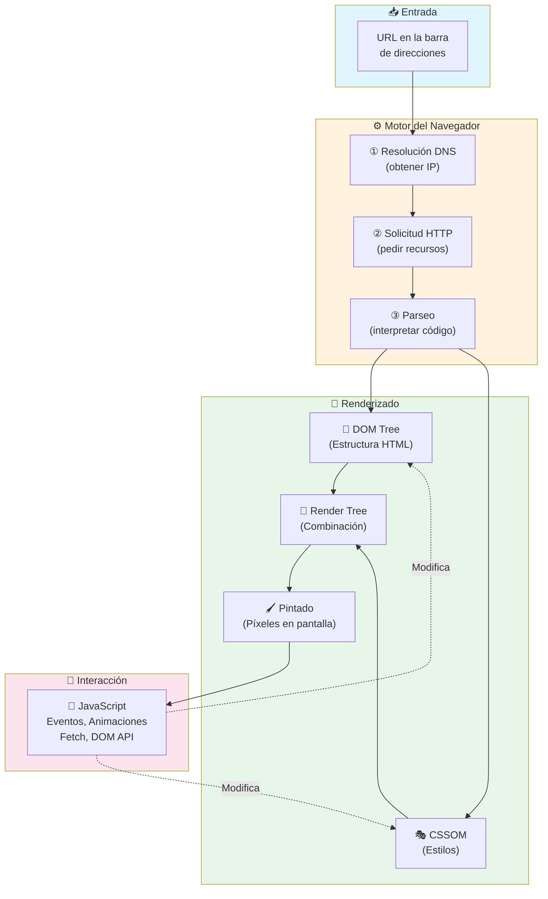

### Componentes clave de un navegador

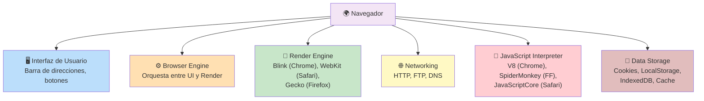

### Flujo completo de una petición web

```mermaid
flowchart LR
    A["① Ingresas URL<br/>google.com"] --> B["② DNS Resuelve<br/>→ 142.250.184.14"]
    B --> C["③ Conexión TCP<br/>(apertura socket)"]
    C --> D["④ Handshake TLS<br/>(si es HTTPS)"]
    D --> E["⑤ Solicitud HTTP<br/>GET /index.html"]
    E --> F["⑥ Servidor procesa<br/>(backend)"]
    F --> G["⑦ Respuesta HTTP<br/>200 OK + HTML"]
    G --> H["⑧ Navegador<br/>parsea HTML"]
    H --> I["⑨ Solicita recursos<br/>CSS, JS, imágenes"]
    I --> J["⑩ Renderiza y<br/>ejecuta JS"]
    J --> K["🎉 ¡Página lista!"]

    style A fill:#e3f2fd
    style B fill:#e8f5e9
    style C fill:#fff3e0
    style D fill:#fce4ec
    style E fill:#f3e5f5
    style F fill:#e1f5fe
    style G fill:#e8f5e9
    style H fill:#fff3e0
    style I fill:#fce4ec
    style J fill:#f3e5f5
    style K fill:#c8e6c9
```

---

## Resumen visual: el viaje completo

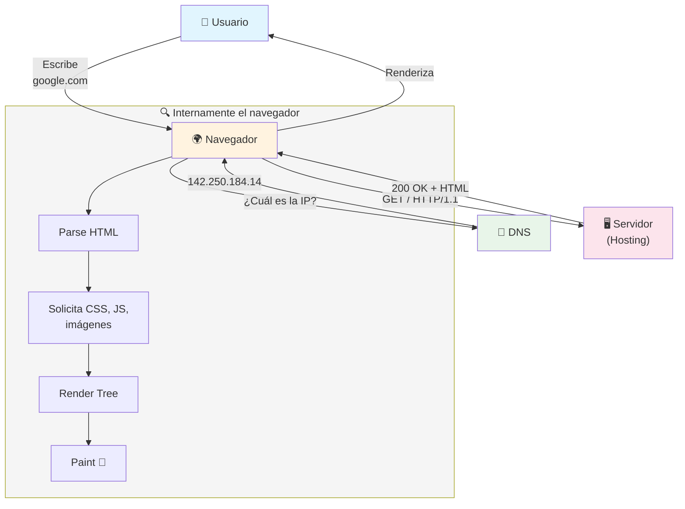

### Conceptos clave para recordar

| Concepto       | Analogía                        |
| -------------- | ------------------------------- |
| **Internet**   | La red de carreteras mundial    |
| **HTTP**       | El idioma que hablan los barcos (datos) al viajar |
| **DNS**        | La guía telefónica que traduce nombres a números |
| **Hosting**    | El terreno donde construyes tu casa (sitio web) |
| **Navegador**  | El auto que te lleva a cualquier dirección |
| **Servidor**   | La casa que guarda y sirve la información |

---

> **Siguiente paso:** Aprende sobre protocolos más a fondo y cómo crear tu primer servidor HTTP con Node.js o Python.

## Relacionados:
- [[bases-del-frontend]]