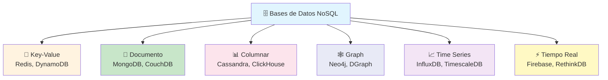
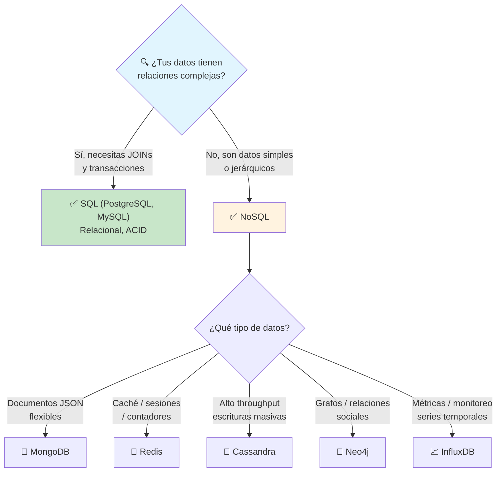
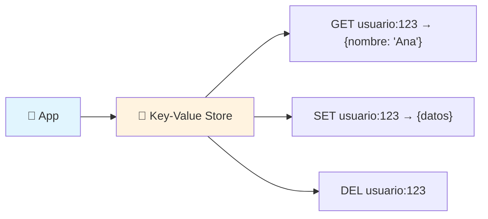
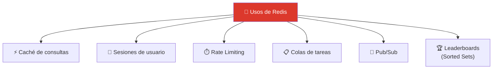
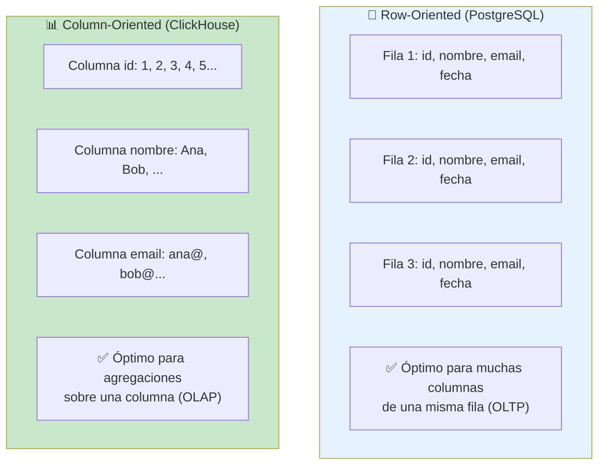
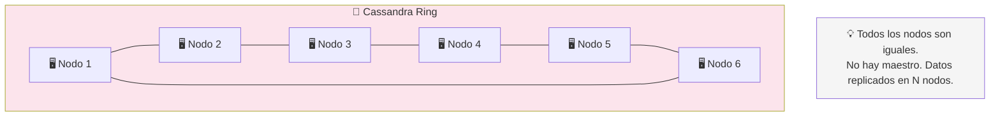
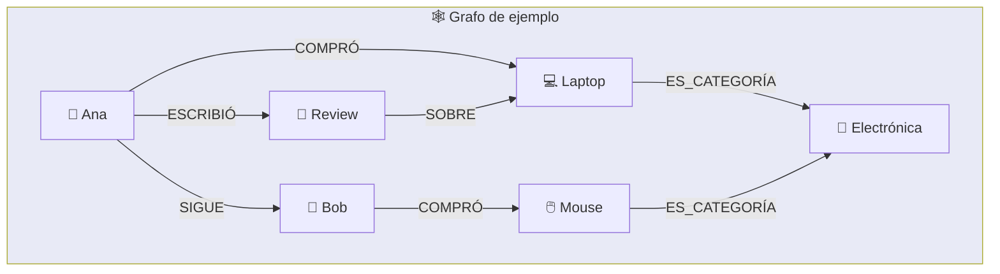
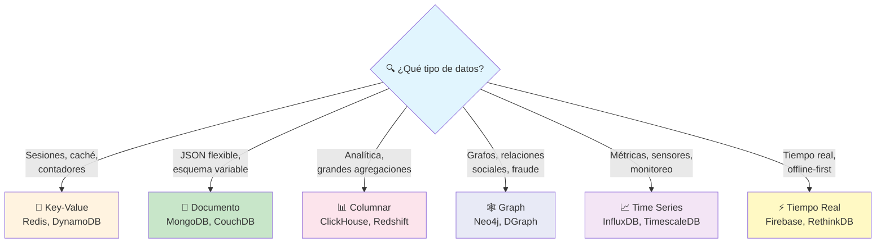
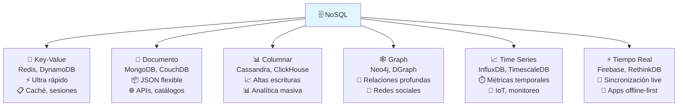

# Bases de datos NoSQL

Las bases de datos **NoSQL** (Not Only SQL) surgieron para manejar datos que no encajan bien en el modelo relacional: **gran volumen, esquemas flexibles, escalabilidad horizontal**. Cada tipo de NoSQL está optimizado para un caso de uso específico.



### Cuándo usar NoSQL vs SQL



---

## Key-Value

Las bases de datos **clave-valor** son las más simples: guardan un valor asociado a una clave única. Son ultra rápidas, ideales para caché, sesiones y contadores.



### Redis

**Redis** es el rey de las key-value en memoria. Soporta estructuras de datos avanzadas (strings, lists, sets, sorted sets, hashes, streams).

```bash
# Strings
SET usuario:1:nombre "Ana"
GET usuario:1:nombre

# Hashes (objetos)
HSET usuario:1 id 1 nombre "Ana" email "ana@email.com"
HGETALL usuario:1

# Lists (colas)
LPUSH cola:tareas "procesar_pago"
RPOP cola:tareas

# Sets
SADD seguidores:1 "usuario:2" "usuario:3"
SMEMBERS seguidores:1

# Con expiración
SET cache:producto:42 "{...}" EX 3600
```



### DynamoDB

**DynamoDB** es la base de datos key-value/documento de AWS. Totalmente gestionada, escala automáticamente, con consistencia eventual o fuerte.

| Característica       | Redis                       | DynamoDB                    |
| -------------------- | --------------------------- | --------------------------- |
| **Tipo**             | En memoria                  | Disco SSD                   |
| **Persistencia**     | Opcional (RDB/AOF)          | Siempre                     |
| **Escalado**         | Manual (cluster)            | Automático                  |
| **Consistencia**     | Siempre consistente         | Eventual (o fuerte opcional)|
| **Modelo de datos**  | Estructuras complejas        | Documento / Key-Value       |
| **Caso típico**      | Caché, sesiones, colas      | Producción serverless       |

---

## Document DBs

Las bases de datos **documentales** almacenan datos en formato **JSON** o **BSON**. Cada documento puede tener una estructura diferente (schema flexible).

```json
// Documento MongoDB
{
    "_id": "abc123",
    "nombre": "Ana",
    "email": "ana@email.com",
    "direccion": {
        "calle": "Av. Siempre Viva",
        "ciudad": "Madrid"
    },
    "pedidos": [
        { "producto": "Laptop", "total": 1000 },
        { "producto": "Mouse", "total": 25 }
    ]
}
```

### MongoDB

**MongoDB** es la base de datos documental más popular. Ideal para aplicaciones con esquemas cambiantes, prototipado rápido y datos jerárquicos.

```javascript
// Insertar
db.usuarios.insertOne({
    nombre: "Ana",
    email: "ana@email.com",
    pedidos: []
});

// Buscar
db.usuarios.find({ email: "ana@email.com" });

// Buscar con filtro en array anidado
db.usuarios.find({
    "pedidos.producto": "Laptop"
});

// Agregación (similar a GROUP BY)
db.pedidos.aggregate([
    { $group: { _id: "$producto", total: { $sum: "$cantidad" } } }
]);
```

### CouchDB

**CouchDB** usa un modelo **MVCC** (Multi-Version Concurrency Control) y sincronización multi-maestro. Su superpoder: **sincronización offline** entre dispositivos.

- **AP** en CAP (Availability + Partition Tolerance)
- **Sincronización bidireccional** entre pares (PouchDB en el navegador ↔ CouchDB en servidor)
- Ideal para apps que funcionan **offline** y sincronizan cuando hay conexión

### MongoDB vs CouchDB

| Característica   | MongoDB                  | CouchDB                     |
| ---------------- | ------------------------ | --------------------------- |
| **CAP**          | CP (Consistencia + Partición) | AP (Disponibilidad + Partición) |
| **Sincronización** | Réplica maestro-esclavo | Multi-maestro (offline-first) |
| **Lenguaje consulta** | JSON queries, aggregation pipeline | MapReduce (views) |
| **Caso típico**  | APIs, catálogos, analítica | Apps offline-first, móviles |

---

## Column DBs (Anchos / Columnares)

Las bases de datos **columnares** almacenan datos por columna (no por fila). Son ideales para **analítica, agregaciones y grandes volúmenes**.



### ClickHouse

**ClickHouse** es un sistema de gestión de bases de datos **analítico** (OLAP) open source. Consultas SQL sobre miles de millones de filas en **milisegundos**.

```sql
-- ClickHouse: ideal para agregaciones masivas
SELECT
    toMonth(fecha) as mes,
    count() as visitas,
    sum(ingresos) as total_ingresos
FROM eventos
WHERE fecha >= now() - INTERVAL 1 YEAR
GROUP BY mes
ORDER BY mes;
```

### Cassandra

**Apache Cassandra** es una base de datos distribuida **peer-to-peer** diseñada para alta disponibilidad y escalabilidad lineal sin punto único de fallo.



```cql
// Cassandra Query Language (CQL)
CREATE TABLE usuarios (
    id UUID PRIMARY KEY,
    nombre TEXT,
    email TEXT
);

SELECT * FROM usuarios WHERE id = ?;
```

### ScyllaDB

**ScyllaDB** es un reemplazo de Cassandra escrito en **C++** en vez de Java. Compatible con CQL pero **mucho más rápido** (10x).

| Característica | Cassandra             | ScyllaDB              |
| -------------- | --------------------- | --------------------- |
| **Lenguaje**   | Java                  | C++ (shard-per-core)  |
| **Rendimiento**| Bueno                 | 10x más rápido        |
| **Latencia**   | Mayor (GC de JVM)     | Mínima (sin GC)       |
| **Compatibilidad** | Original CQL      | Compatible CQL        |

---

## Graph DBs

Las bases de datos **de grafos** están diseñadas para datos **altamente relacionados**: redes sociales, motores de recomendación, detección de fraude.



### Neo4j

**Neo4j** es la base de datos de grafos más popular. Usa **Cypher** como lenguaje de consulta.

```cypher
// Crear nodos y relaciones
CREATE (ana:Usuario {nombre: 'Ana', edad: 25})
CREATE (bob:Usuario {nombre: 'Bob', edad: 30})
CREATE (ana)-[:SIGUE]->(bob)
CREATE (laptop:Producto {nombre: 'Laptop'})
CREATE (ana)-[:COMPRO {fecha: '2024-01-01'}]->(laptop)

// Consultar: ¿qué productos compraron los usuarios que sigo?
MATCH (yo:Usuario {nombre: 'Ana'})
      -[:SIGUE]->(amigo:Usuario)
      -[:COMPRO]->(producto:Producto)
RETURN amigo.nombre, producto.nombre
```

### AWS Neptune

**Neptune** es el servicio de base de datos de grafos gestionado de AWS. Soporta dos modelos: **Property Graph** (Gremlin/SPARQL) y **RDF** (SPARQL).

### DGraph

**DGraph** es una base de datos de grafos open source con **GraphQL nativo**. Escalabilidad horizontal y baja latencia.

```graphql
// DGraph: consultas en GraphQL
query {
    queryUsuario(filter: { nombre: { eq: "Ana" } }) {
        nombre
        sigue {
            nombre
            compro {
                nombre
            }
        }
    }
}
```

| Base de Datos | Lenguaje     | Escalabilidad | Mejor para                 |
| ------------- | ------------ | ------------- | -------------------------- |
| **Neo4j**     | Cypher       | Vertical      | Redes sociales, fraude     |
| **Neptune**   | Gremlin/SPARQL | Horizontal (AWS) | Apps AWS, RDF           |
| **DGraph**    | GraphQL      | Horizontal    | Apps modernas, GraphQL     |

---

## Time Series

Las bases de datos **de series temporales** están optimizadas para datos con **marca de tiempo**: métricas de servidores, sensores IoT, datos financieros.

### InfluxDB

**InfluxDB** es la time-series DB más popular. Usa su propio lenguaje de consulta (Flux) o SQL.

```sql
-- InfluxDB SQL
SELECT
    MEAN(temperature) as avg_temp,
    MAX(temperature) as max_temp
FROM sensor_data
WHERE time >= now() - INTERVAL '1 hour'
GROUP BY time(5m), device_id
```

### TimescaleDB

**TimescaleDB** es PostgreSQL con extensiones para time-series. Lo mejor de ambos mundos: **SQL completo + rendimiento time-series**.

```sql
-- TimescaleDB: SQL normal + hiper-tablas
CREATE TABLE sensor_data (
    time TIMESTAMPTZ NOT NULL,
    device_id INT,
    temperature FLOAT
);

-- Convertir a hiper-tabla particionada por tiempo
SELECT create_hypertable('sensor_data', 'time');

-- Consultas en tiempo real
SELECT time_bucket('5 minutes', time) as bucket,
       AVG(temperature)
FROM sensor_data
WHERE time > now() - INTERVAL '1 day'
GROUP BY bucket;
```

### InfluxDB vs TimescaleDB

| Característica   | InfluxDB                 | TimescaleDB               |
| ---------------- | ------------------------ | ------------------------- |
| **Motor**        | Propio (TSM)             | PostgreSQL + extensiones  |
| **SQL**          | Flux (similar a SQL)     | SQL completo              |
| **JOINs**        | ❌ Limitados              | ✅ Completo (PostgreSQL)  |
| **Ecosistema**   | Telegraf + Chronograf    | PostgreSQL + todo su ecosistema |
| **Retención**    | Nativa (automática)      | Manual (policies)         |
| **Compresión**   | Excelente                | Buena                     |

---

## Tiempo Real

Bases de datos diseñadas para **sincronizar datos en tiempo real** entre clientes y servidores.

### Firebase (Firestore)

**Firebase Firestore** es la base de datos en tiempo real de Google. Los clientes se **suscriben a documentos** y reciben cambios al instante.

```javascript
// Firebase: escuchar cambios en tiempo real
import { doc, onSnapshot } from "firebase/firestore";

const unsub = onSnapshot(doc(db, "chat", "sala-1"), (doc) => {
    console.log("Nuevos datos:", doc.data());
});

// Dejar de escuchar
unsub();
```

### RethinkDB

**RethinkDB** fue la primera DB en ofrecer **cambios en tiempo real** mediante un modelo push. Aunque su desarrollo comercial cesó, su influencia sigue viva en otras bases de datos.

```javascript
// RethinkDB: changefeeds
r.table('chat')
 .changes()
 .run(conn, (err, cursor) => {
     cursor.each((err, row) => {
         console.log('Cambio:', row.new_val);
     });
 });
```

---

## Comparativa general



### Tabla resumen

| Tipo         | Base de Datos   | Modelo          | CAP   | Caso de uso principal        |
| ------------ | --------------- | --------------- | ----- | ---------------------------- |
| **KV**       | Redis           | En memoria      | CP    | Caché, sesiones, colas       |
| **KV**       | DynamoDB        | Documento/KV    | AP    | Producción serverless        |
| **Documento**| MongoDB         | JSON            | CP    | APIs, prototipado            |
| **Documento**| CouchDB         | JSON            | AP    | Offline-first, móvil         |
| **Columnar** | Cassandra       | Wide column     | AP    | Altas escrituras, IoT        |
| **Columnar** | ClickHouse      | Columnar        | CP    | Analítica, OLAP              |
| **Graph**    | Neo4j           | Propiedad       | CP    | Redes sociales, fraude       |
| **Time Series** | InfluxDB    | TSM             | CP    | Métricas, monitoreo          |
| **Time Series** | TimescaleDB | SQL + hypertable | CA  | SQL + time-series            |
| **Tiempo Real** | Firebase    | Documento       | AP    | Apps en tiempo real          |

---

## Resumen visual



> **Siguiente paso:** Identifica un caso de uso en tu proyecto que no encaje bien en SQL. Por ejemplo: ¿necesitas caché? → Redis. ¿Datos JSON flexibles? → MongoDB. ¿Analítica rápida? → ClickHouse.

## Relacionados:
- [[escalando-bases-de-datos]] #anterior 
- [[habilidades-basicas-de-operaciones-devops]] #siguiente