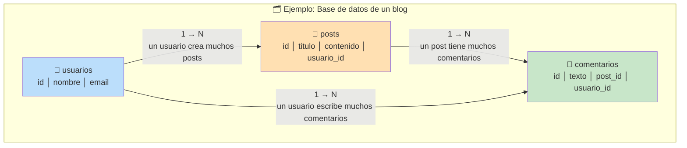
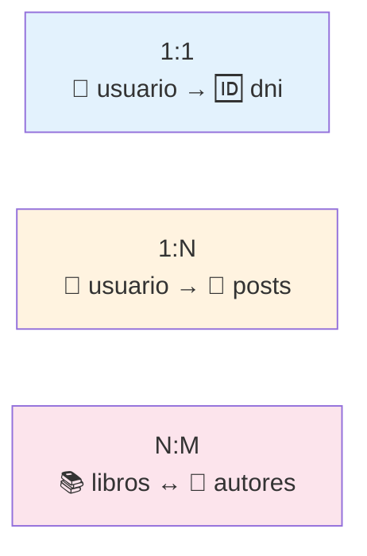
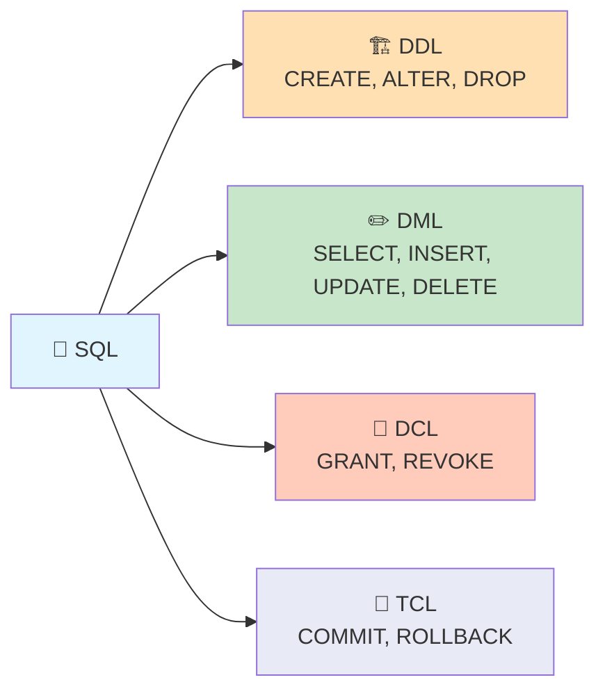
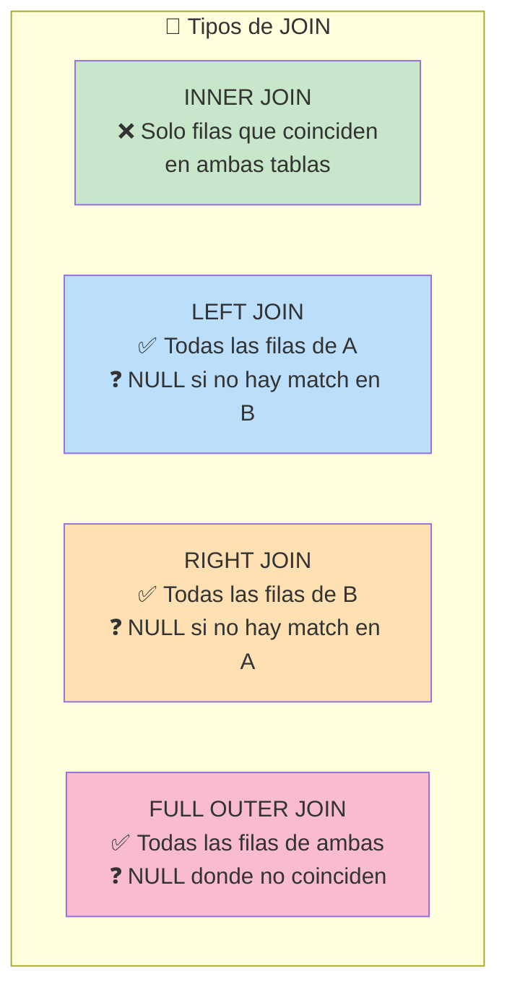
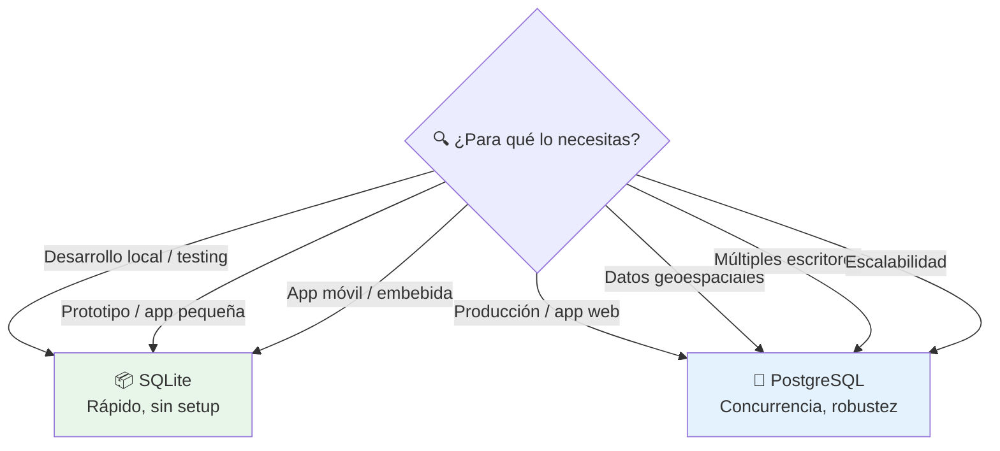
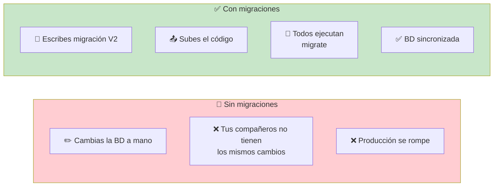
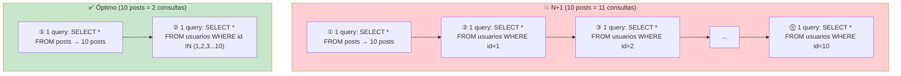
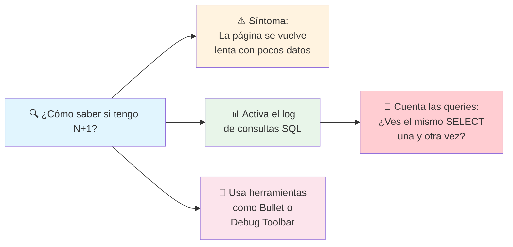
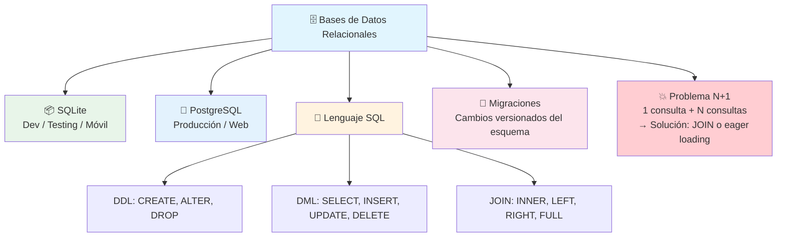

# Bases de datos relacionales

Una **base de datos relacional** organiza los datos en **tablas** compuestas por filas y columnas. Las tablas se relacionan entre sí mediante claves (IDs), y se consultan con **SQL** (Structured Query Language).



### Conceptos clave

| Concepto      | Definición                                      |
| ------------- | ----------------------------------------------- |
| **Tabla**     | Conjunto de datos organizados en filas y columnas |
| **Fila**      | Un registro completo (ej. un usuario)             |
| **Columna**   | Un atributo del registro (ej. nombre, email)      |
| **PK**        | Primary Key — identifica únicamente cada fila     |
| **FK**        | Foreign Key — enlaza una fila con otra tabla      |
| **Índice**    | Acelera búsquedas en columnas específicas         |
| **Query**     | Consulta SQL para leer o modificar datos          |

### Tipos de relaciones



---

## SQL

SQL es el lenguaje universal para hablar con bases de datos relacionales. Se divide en sub-lenguajes:



### Comandos DML esenciales

```sql
-- Leer datos
SELECT * FROM usuarios;
SELECT nombre, email FROM usuarios WHERE id = 1;
SELECT * FROM posts ORDER BY created_at DESC LIMIT 10;

-- Insertar datos
INSERT INTO usuarios (nombre, email) VALUES ('Ana', 'ana@email.com');

-- Actualizar datos
UPDATE usuarios SET email = 'nuevo@email.com' WHERE id = 1;

-- Eliminar datos
DELETE FROM usuarios WHERE id = 1;

-- JOINs (combinar tablas)
SELECT posts.titulo, usuarios.nombre
FROM posts
JOIN usuarios ON posts.usuario_id = usuarios.id;
```

### JOINs visuales



```
INNER JOIN:     ⚪───────⚪       LEFT JOIN:     ⚪───────⚪
                │  A ∩ B  │                     │  A  ∪ (A∩B)
                └─────────┘                     └─────────┘

RIGHT JOIN:    ⚪───────⚪       FULL JOIN:    ⚪───────⚪
               │ (A∩B) ∪ B │                 │  A  ∪  B  │
               └───────────┘                 └───────────┘
```

---

## SQLite

SQLite es una base de datos **embebida y sin servidor**. Todo el motor vive en un solo archivo `.db` o `.sqlite`. Es la más usada del mundo (cada smartphone tiene decenas de bases SQLite).

- **Sin servidor** — no necesitas instalar ni configurar nada
- **Zero configuración** — funciona con `sqlite3 database.db`
- **Ligera** — el binario pesa menos de 1 MB
- **Ideal para:** desarrollo local, prototipado, apps móviles, testing

```bash
# Crear y abrir una base de datos SQLite
sqlite3 mi_app.db

# Dentro de la consola SQLite:
sqlite> CREATE TABLE usuarios (id INTEGER PRIMARY KEY, nombre TEXT, email TEXT);
sqlite> INSERT INTO usuarios VALUES (1, 'Ana', 'ana@email.com');
sqlite> SELECT * FROM usuarios;
1|Ana|ana@email.com
sqlite> .tables        # listar tablas
sqlite> .schema        # ver esquema
sqlite> .exit          # salir
```

**¿Cuándo NO usar SQLite?** Cuando tienes múltiples escritores concurrentes (soporta escritura en serie), o cuando necesitas features avanzadas como roles de usuario, replicación o escalar horizontalmente.

---

## PostgreSQL

PostgreSQL (Postgres) es el base de datos relacional **open source más avanzado del mundo**. Es el estándar en la industria para aplicaciones web modernas.

- **Cliente-servidor** — corre como un servicio en un puerto (5432)
- **ACID compliant** — transacciones seguras y confiables
- **Tipos avanzados** — JSON, arrays, rangos, geometrías (GIS)
- **Extensiones** — PostGIS (geoespacial), pgvector (vectores), TimescaleDB (series temporales)
- **Ideal para:** producción, aplicaciones web, datos geoespaciales, analítica

```bash
# Conectarse a una base de datos PostgreSQL
psql -U usuario -d mi_app -h localhost

# Dentro de psql:
mi_app=# CREATE TABLE usuarios (
    id SERIAL PRIMARY KEY,
    nombre VARCHAR(100) NOT NULL,
    email VARCHAR(255) UNIQUE NOT NULL
);

mi_app=# INSERT INTO usuarios (nombre, email)
         VALUES ('Ana', 'ana@email.com');

mi_app=# SELECT * FROM usuarios;
 id | nombre | email
----+--------+-----------------
  1 | Ana    | ana@email.com
(1 row)

mi_app=# \dt              # listar tablas
mi_app=# \d usuarios      # describir tabla
mi_app=# \q               # salir
```

### SQLite vs PostgreSQL: ¿cuándo usar cada uno?



---

## Migraciones

Las **migraciones** son cambios versionados en el esquema de la base de datos. En lugar de modificar las tablas a mano en producción, escribes migraciones que se ejecutan en orden.



### Ejemplo con Node.js (Knex.js)

```javascript
// migrations/20250101_create_users.js
exports.up = function(knex) {
    return knex.schema.createTable('usuarios', (table) => {
        table.increments('id');
        table.string('nombre').notNullable();
        table.string('email').unique().notNullable();
        table.timestamps(true, true);
    });
};

exports.down = function(knex) {
    return knex.schema.dropTable('usuarios');
};
```

```bash
# Comandos típicos
npx knex migrate:make create_users    # crear migración
npx knex migrate:latest                # aplicar migraciones pendientes
npx knex migrate:rollback              # deshacer la última migración
npx knex migrate:status                # ver estado de migraciones
```

### Ejemplo con Python (Alembic + SQLAlchemy)

```python
# migrations/versions/20250101_create_users.py
def upgrade():
    op.create_table(
        'usuarios',
        sa.Column('id', sa.Integer(), primary_key=True),
        sa.Column('nombre', sa.String(100), nullable=False),
        sa.Column('email', sa.String(255), nullable=False),
    )

def downgrade():
    op.drop_table('usuarios')
```

```bash
alembic revision --autogenerate -m "create users"
alembic upgrade head
```

### Buenas prácticas con migraciones

- **Una migración por cambio lógico** — no mezcles crear tabla + agregar columna en otra
- **Siempre define `down`** — para poder deshacer si algo sale mal
- **Nunca edites migraciones ya aplicadas** — crea una nueva
- **Versiona las migraciones en el repositorio** — así todo el equipo las tiene

---

## El problema de N+1

El **problema N+1** ocurre cuando haces una consulta que devuelve N registros, y luego haces 1 consulta adicional **por cada registro**. Resultado: 1 + N consultas donde bastaba con 1.

### Ejemplo del problema

```javascript
// ❌ N+1: 1 consulta para posts + N consultas para autores
const posts = db.query('SELECT * FROM posts');

posts.forEach(post => {
    const autor = db.query(                          // ← esto se ejecuta N veces
        'SELECT * FROM usuarios WHERE id = ?',
        [post.usuario_id]
    );
    console.log(post.titulo, autor.nombre);
});
```



### Cómo solucionarlo

```javascript
// ✅ Solución con JOIN (1 consulta)
const posts = db.query(`
    SELECT posts.titulo, usuarios.nombre AS autor
    FROM posts
    JOIN usuarios ON posts.usuario_id = usuarios.id
`);

// ✅ Solución con carga ansiosa (eager loading) en ORM
const posts = await Post.findAll({ include: Autor });
```

```sql
-- ✅ 1 sola consulta con JOIN
SELECT posts.titulo, usuarios.nombre AS autor
FROM posts
JOIN usuarios ON posts.usuario_id = usuarios.id
WHERE usuarios.activo = true;
```

### ¿Cómo detectar N+1?

1. **Log de consultas:** activa el logging de tu ORM y cuenta las queries
2. **Herramientas:**
   - `rails console` + gem `bullet` (Rails)
   - `django-debug-toolbar` (Django)
   - `knex-enable-logging` (Node.js)
3. **Síntoma:** una página tarda mucho cuando hay pocos registros, y el tiempo escala linealmente



---

## Resumen visual



---

> **Siguiente paso:** Elige PostgreSQL para producción, usa SQLite para desarrollo y testing, y aprende un ORM (Prisma, Sequelize, SQLAlchemy) para trabajar más productivamente.

## Relacionados:
- [[servicio-de-hospedaje-de-repositorios]] #anterior 
- [[aprende-acerca-de-apis]] #siguiente 