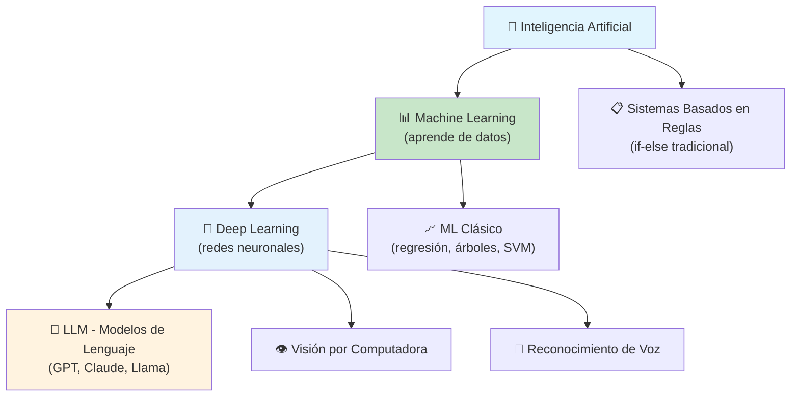
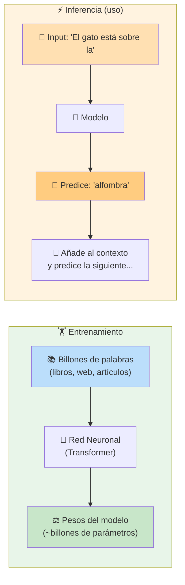
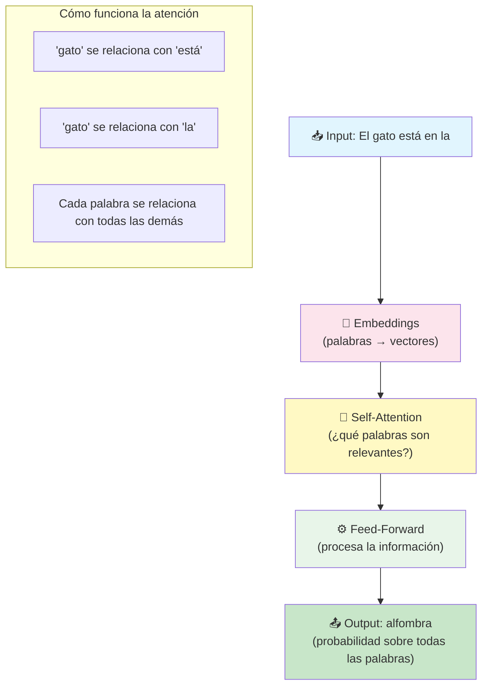
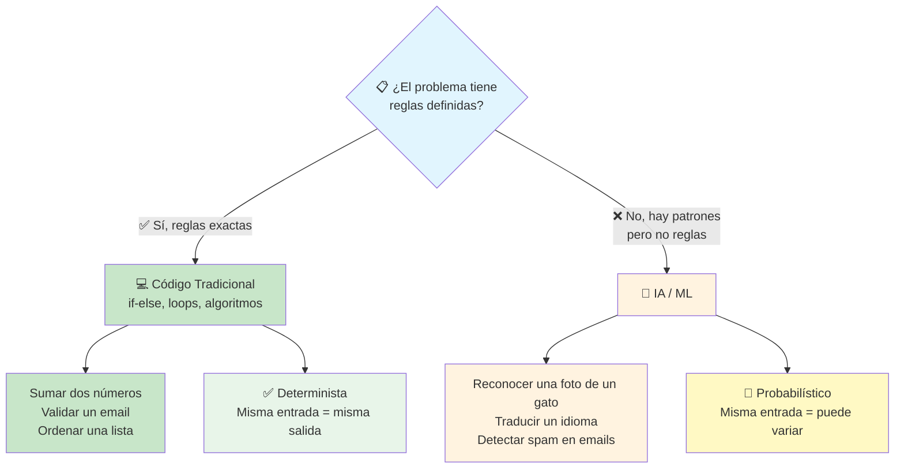
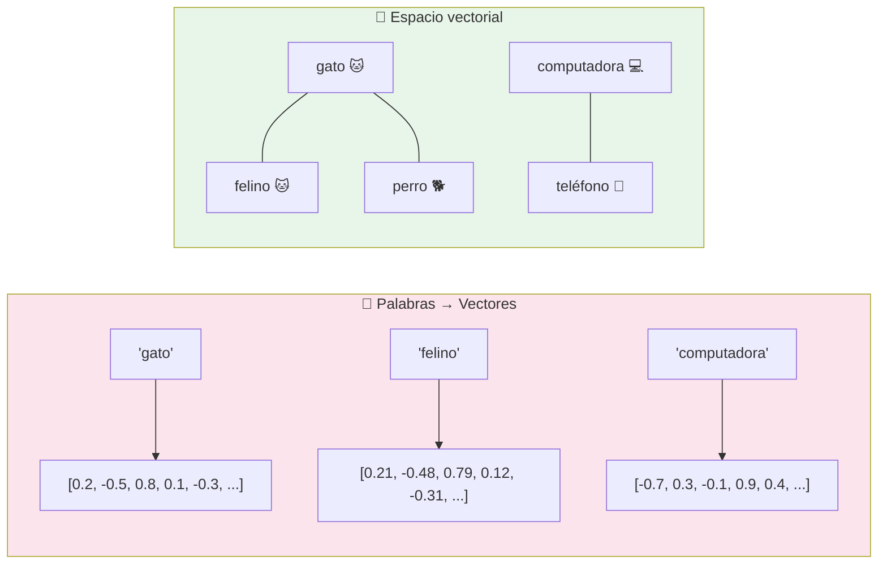
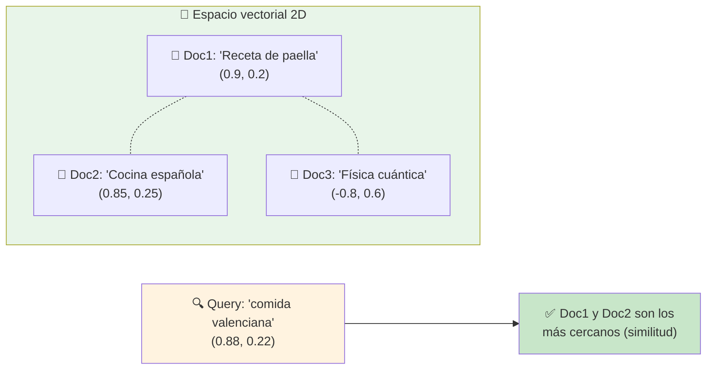
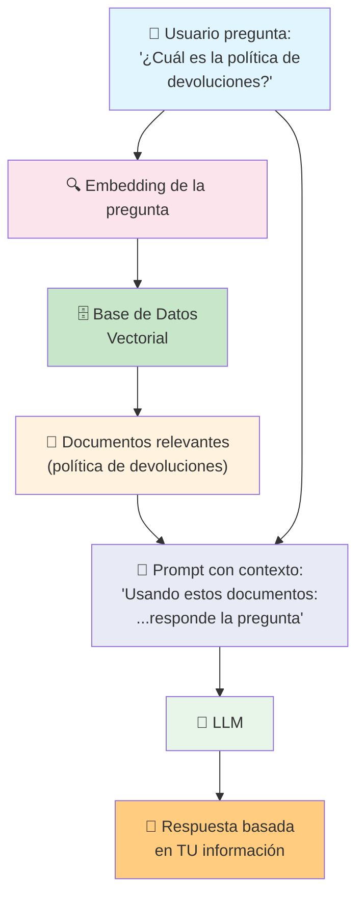
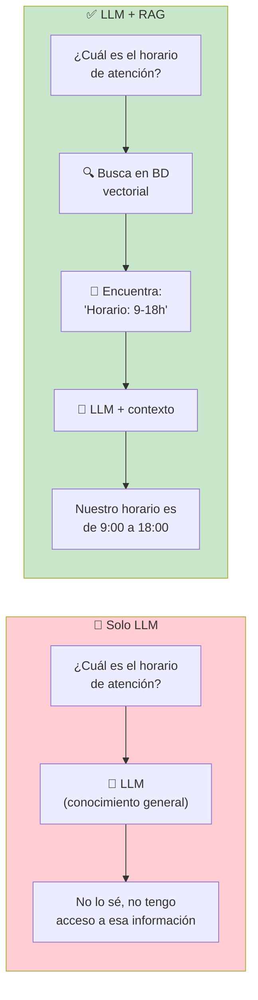
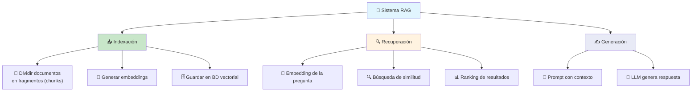
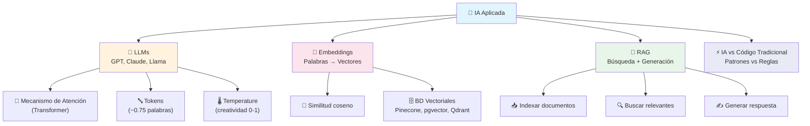

# Bases de inteligencia artificial

La **Inteligencia Artificial** (IA) es la rama de la computación que crea sistemas capaces de realizar tareas que normalmente requieren inteligencia humana: entender lenguaje, reconocer imágenes, tomar decisiones.



---

## ¿Cómo funcionan los LLM?

Un **LLM** (Large Language Model) es una red neuronal entrenada con **enormes cantidades de texto** para predecir la siguiente palabra en una secuencia. Así de simple en esencia: **predecir la siguiente palabra**.



### La arquitectura Transformer

Los LLM modernos usan la arquitectura **Transformer** (Google, 2017). Su innovación clave es el **mecanismo de atención** (self-attention).



### Conceptos clave de LLMs

| Concepto           | Explicación                                      |
| ------------------ | ------------------------------------------------ |
| **Parámetros**     | Pesos del modelo (~billones). Más parámetros ≠ mejor, pero suele correlacionar |
| **Contexto**       | Ventana de texto que el modelo puede "ver" (ej: 8K, 32K, 128K tokens) |
| **Tokens**         | Fragmentos de palabras (~0.75 palabras en inglés). El modelo lee/ genera tokens |
| **Temperature**    | Controla cuán "creativa" es la respuesta (0 = siempre la misma, 1 = más variada) |
| **Top-p / Top-k**  | Estrategias para elegir la siguiente palabra entre las más probables |
| **Fine-tuning**    | Entrenar el modelo con datos específicos para una tarea concreta |

> **Analogía:** Un LLM es como un pianista que ha escucho millones de canciones. No "entiende" la música, pero sabe qué nota suele ir después de otra.

---

## IA vs Codificación tradicional

No son competencia, son herramientas para problemas diferentes.



### Tabla comparativa

| Característica       | Código tradicional               | IA / Machine Learning             |
| -------------------- | -------------------------------- | --------------------------------- |
| **Reglas**           | Las escribes tú (if-else)        | Las aprende de datos              |
| **Precisión**        | 100% (si está bien programado)   | >90% (nunca perfecto)            |
| **Explicabilidad**   | Total (sabes exactamente qué hace) | Baja (caja negra)               |
| **Escalabilidad**    | Necesitas programar cada caso    | Con más datos, mejora solo        |
| **Mantenimiento**    | Actualizas el código             | Actualizas los datos y reentrenas |

### ¿Cuándo usar cada uno?

```javascript
// ✅ Código tradicional: validar formato de email
function esEmailValido(email) {
    return /^[^\s@]+@[^\s@]+\.[^\s@]+$/.test(email);
}

// ❌ NO usarías IA para esto (sería como usar un cañón para matar una mosca)
```

```python
# ✅ IA: detectar si un email es phishing
# No puedes escribir reglas exactas para detectar todos los casos de phishing
model.predict("Ganaste $1,000,000!!! Haz click aquí")
# → 95% probabilidad de phishing
```

---

## Embeddings

Un **embedding** es una **representación vectorial** de un texto (palabra, frase, documento) en un espacio de N dimensiones, donde palabras con significado similar quedan **cerca** entre sí.



> **Analogía:** Los embeddings son como coordenadas GPS del lenguaje. "Madrid" y "Barcelona" están cerca. "Madrid" y "manzana" están lejos.

### ¿Para qué sirven?

- **Búsqueda semántica** — encontrar documentos por significado, no por palabras exactas
- **Clasificación** — agrupar textos similares
- **Recomendación** — encontrar contenido relacionado
- **RAG** — recuperar información relevante para un LLM

```python
# Ejemplo con OpenAI
response = openai.embeddings.create(
    model="text-embedding-3-small",
    input="El gato está sobre la alfombra"
)
vector = response.data[0].embedding  # → [0.002, -0.015, ... 1536 dimensiones]
```

---

## Vectores

Los vectores son la **representación matemática** detrás de embeddings y búsqueda por similitud.



### Búsqueda por similitud (coseno)

Para encontrar textos similares, se calcula la **distancia coseno** entre vectores. Cuanto más cerca de 1, más similares.

```python
import numpy as np
from sklearn.metrics.pairwise import cosine_similarity

vector_paella = [0.9, 0.2]
vector_cocina = [0.85, 0.25]
vector_fisica = [-0.8, 0.6]
vector_query = [0.88, 0.22]

sim_paella = cosine_similarity([vector_query], [vector_paella])  # → ~0.99
sim_fisica = cosine_similarity([vector_query], [vector_fisica])  # → ~-0.5
```

### Bases de datos vectoriales

Para buscar entre millones de vectores de forma eficiente, se usan **bases de datos vectoriales**:

| Base de datos     | Tipo                      |
| ----------------- | ------------------------- |
| **Pinecone**      | SaaS (gestionado)         |
| **Weaviate**      | Open source + cloud       |
| **Qdrant**        | Open source + cloud       |
| **ChromaDB**      | Open source, embebida     |
| **pgvector**      | Extensión para PostgreSQL |

```sql
-- pgvector: buscar los 5 documentos más similares
SELECT * FROM documentos
ORDER BY embedding <=> '[0.88, 0.22, ...]'
LIMIT 5;
```

---

## RAGs (Retrieval-Augmented Generation)

**RAG** es una técnica que combina **búsqueda en una base de conocimiento** con la **generación de un LLM**. Resuelve el problema principal de los LLM: no tienen acceso a tu información privada o actual.



### Sin RAG vs Con RAG



### Flujo típico de RAG

```python
# Pseudocódigo: RAG simplificado

# 1. Indexar documentos (una vez)
documentos = [
    "Política de devoluciones: 30 días...",
    "Horario: lunes a viernes 9-18h..."
]
for doc in documentos:
    vector = embedding_model.embed(doc)
    vector_db.insert(vector, doc)

# 2. Responder pregunta
def preguntar(pregunta_usuario):
    # Buscar documentos relevantes
    query_vector = embedding_model.embed(pregunta_usuario)
    resultados = vector_db.search(query_vector, top_k=3)

    # Construir prompt con contexto
    contexto = "\n".join(resultados)
    prompt = f"""
    Basado en esta información:
    {contexto}

    Responde: {pregunta_usuario}
    """

    # Generar respuesta
    return llm.generate(prompt)
```

### Componentes de un sistema RAG



### Ventajas de RAG

| Ventaja               | Explicación                                      |
| --------------------- | ------------------------------------------------ |
| **Información actualizada** | La BD se actualiza sin reentrenar el modelo |
| **Datos privados**    | El LLM nunca ve tus datos (se quedan en tu BD)   |
| **Fuentes citables**  | Puedes mostrar al usuario de qué documento salió la respuesta |
| **Costo reducido**    | No necesitas fine-tunear el modelo               |
| **Alucinaciones**     | Se reducen drásticamente (el modelo responde sobre hechos, no de memoria) |

> **RAG es el patrón más usado hoy en día** para construir aplicaciones con IA que trabajen sobre información privada o actualizada. Es el motor detrás de chatbots de soporte, asistentes legales, buscadores semánticos, etc.

---

## Resumen visual



---

> **Siguiente paso:** Juega con la API de OpenAI o alguna open source (Ollama + Llama 3). Prueba a generar embeddings con `text-embedding-3-small` y construye tu primer RAG con LangChain o LlamaIndex.

## Relacionados:
- [[servidores-web]] #anterior 
- [[aplicaciones-con-ia]] #siguiente 