# Bases del Frontend

El **frontend** es la parte visible de una aplicación web: todo lo que el usuario ve, toca y con lo que interactúa en el navegador. Se compone de tres pilares fundamentales que trabajan en equipo.

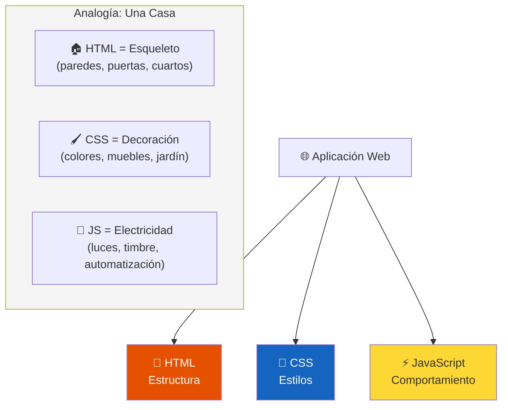

---

## HTML

**HTML** (HyperText Markup Language) es el lenguaje de marcado que define la **estructura y el contenido** de una página web. No es un lenguaje de programación, sino de **marcado**: usa etiquetas (tags) para decirle al navegador qué es cada cosa.

### Anatomía de una etiqueta HTML

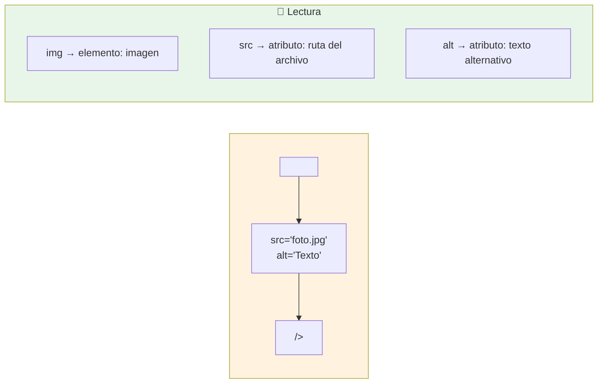

### Estructura básica de un documento HTML

```html
<!DOCTYPE html>
<html lang="es">
<head>
    <meta charset="UTF-8">
    <title>Mi página</title>
</head>
<body>
    <header>
        <h1>Título principal</h1>
        <nav>Menú de navegación</nav>
    </header>
    <main>
        <article>
            <h2>Artículo</h2>
            <p>Contenido del artículo</p>
        </article>
    </main>
    <footer>Pie de página</footer>
</body>
</html>
```

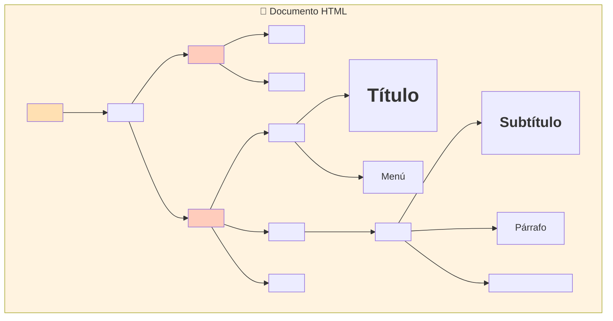

### Etiquetas HTML más comunes

| Categoría       | Etiquetas                            | Función                        |
| --------------- | ------------------------------------ | ------------------------------ |
| **Texto**       | `<h1>`-`<h6>`, `<p>`, `<span>`      | Títulos y párrafos             |
| **Enlaces**     | `<a>`                                | Hipervínculos                  |
| **Multimedia**  | ``, `<video>`, `<audio>`        | Imágenes, videos, audio        |
| **Listas**      | `<ul>`, `<ol>`, `<li>`               | Listas ordenadas y no ordenadas |
| **Tablas**      | `<table>`, `<tr>`, `<td>`            | Datos tabulares                |
| **Formularios** | `<form>`, `<input>`, `<button>`      | Entrada de datos del usuario   |
| **Semánticos**  | `<header>`, `<nav>`, `<main>`, `<footer>`, `<article>`, `<section>` | Dan significado estructural |

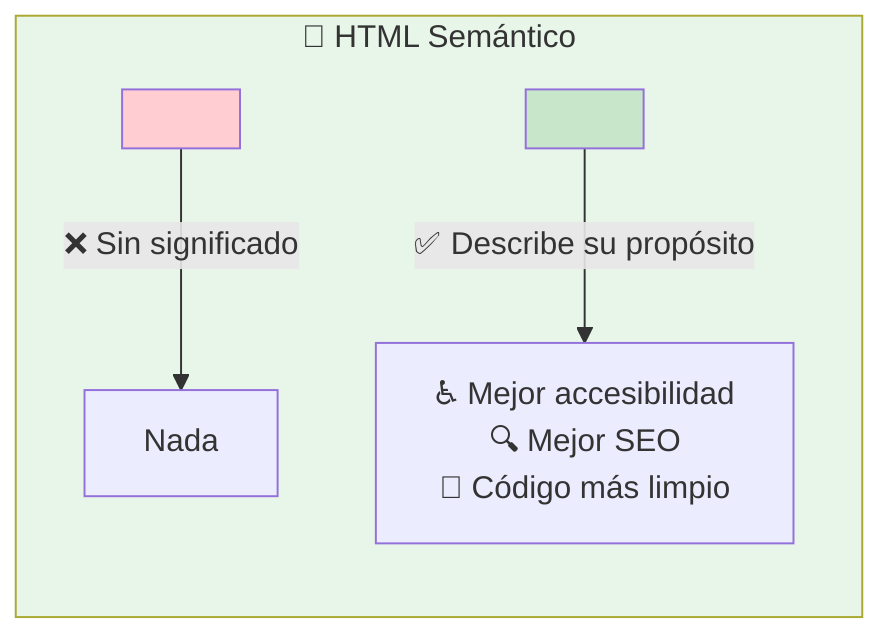

> **Regla de oro:** El HTML debe describir **qué es el contenido**, no cómo se ve. Para eso está CSS.

---

## CSS

**CSS** (Cascading Style Sheets) es el lenguaje que controla la **presentación visual** de los elementos HTML. Colores, fuentes, tamaños, posiciones, animaciones... todo eso es responsabilidad de CSS.

### Anatomía de una regla CSS

```css
selector {
    propiedad: valor;
}
```

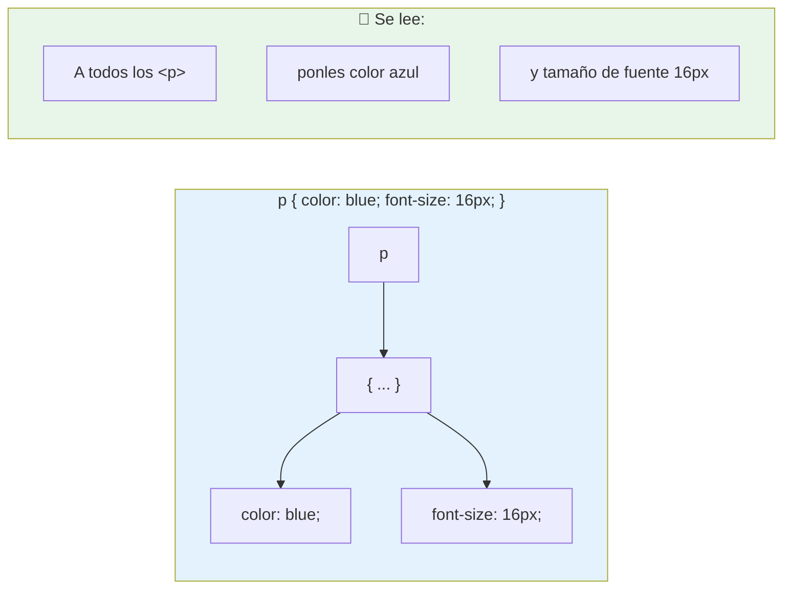

### Formas de aplicar CSS

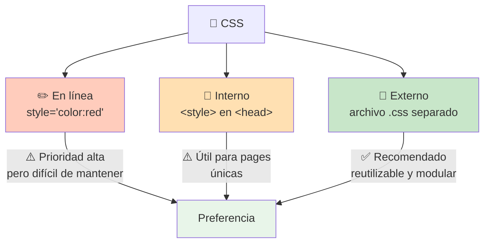

### Selectores CSS

```css
/* Selector de etiqueta */
p     { color: red; }

/* Selector de clase */
.card { background: white; }

/* Selector de ID */
#logo { width: 100px; }

/* Selector anidado */
div p { margin: 0; }       /* <p> dentro de <div> */

/* Selector múltiple */
h1, h2 { font-weight: bold; }

/* Pseudo-clases */
a:hover { color: green; }  /* cuando pasa el mouse */
```

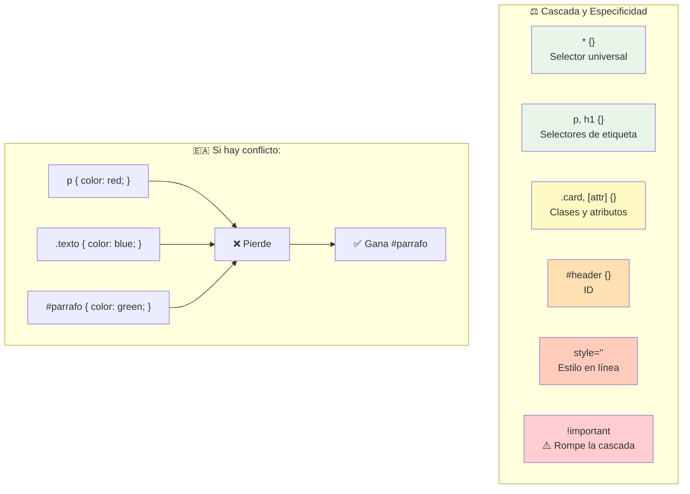

### El Modelo de Caja (Box Model)

Todo elemento HTML es una **caja rectangular**. CSS te permite controlar cada capa de esa caja.

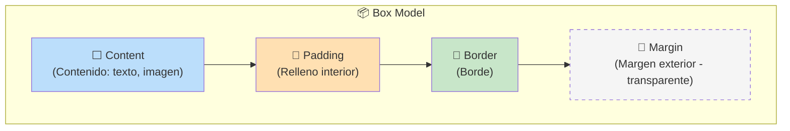

```
                         ╔══════════════════════╗
                         ║      MARGIN          ║
                         ║   ┌──────────────┐   ║
                         ║   ║    BORDER     ║   ║
                         ║   ║  ┌────────┐   ║   ║
                         ║   ║  ║ PADDING ║   ║   ║
                         ║   ║  ║ ┌──────┐║   ║   ║
                         ║   ║  ║ │CONTENT│║   ║   ║
                         ║   ║  ║ └──────┘║   ║   ║
                         ║   ║  └────────┘║   ║   ║
                         ║   ╚════════════╝   ║   ║
                         ╚══════════════════════╝
```

### Layout: cómo posicionar elementos

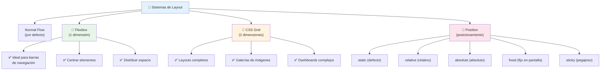

> **💡 Dato clave:** Flexbox es unidimensional (fila O columna). Grid es bidimensional (filas Y columnas). Se complementan, no compiten.

### Unidades CSS

| Unidad  | Relativa a              | Ejemplo              |
| ------- | ----------------------- | -------------------- |
| `px`    | Píxel físico            | `width: 300px`       |
| `%`     | Elemento padre          | `width: 50%`         |
| `em`    | Tamaño de fuente del padre | `padding: 2em`    |
| `rem`   | Tamaño de fuente raíz   | `font-size: 1.5rem`  |
| `vw`    | 1% del ancho del viewport | `width: 100vw`    |
| `vh`    | 1% del alto del viewport | `height: 100vh`   |
| `ch`    | Ancho del carácter `0`  | `max-width: 60ch`    |

> **💡 Recomendación:** Usa `rem` para fuentes (accesibilidad), `%`/`vw`/`vh` para layouts responsive, y `px` solo para bordes finos o elementos fijos pequeños.

---

## JavaScript

**JavaScript** es el lenguaje de programación del frontend. Hace que las páginas web **reaccionen** a las acciones del usuario: clics, formularios, animaciones, peticiones al servidor, etc.

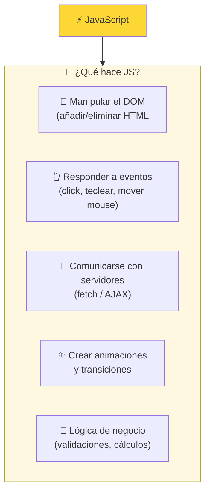

### Conceptos fundamentales

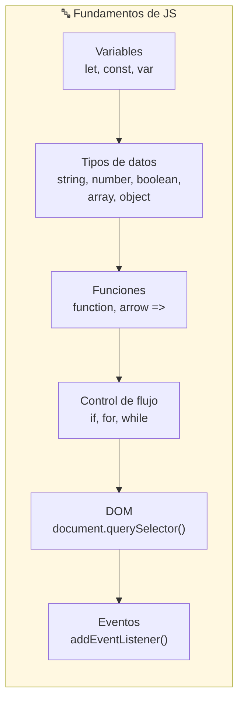

### El DOM (Document Object Model)

Cuando el navegador lee HTML, crea un **árbol de nodos** en memoria llamado DOM. JavaScript puede navegar y modificar ese árbol.

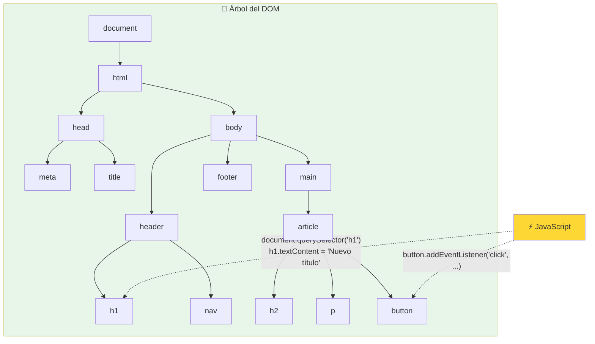

### Ejemplos básicos

```javascript
// Variables
let nombre = "Ana";
const edad = 25;
var antigua = "No usar";  // ❌ obsoleto

// Tipos de datos
let texto = "Hola";          // string
let numero = 42;             // number
let activo = true;           // boolean
let colores = ["rojo", "verde", "azul"]; // array
let persona = {              // object
    nombre: "Ana",
    edad: 25
};

// Funciones
function saludar(nombre) {
    return `Hola, ${nombre}!`;
}

const sumar = (a, b) => a + b;  // arrow function

// Manipular el DOM
const titulo = document.querySelector("h1");
titulo.textContent = "Nuevo título";
titulo.style.color = "blue";

// Eventos
const boton = document.querySelector("button");
boton.addEventListener("click", () => {
    alert("¡Click!");
});

// Petición al servidor (fetch)
fetch("https://api.ejemplo.com/datos")
    .then(respuesta => respuesta.json())
    .then(datos => console.log(datos));
```

### Eventos del navegador

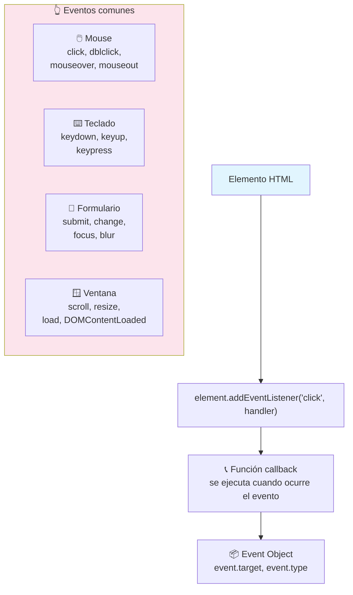

### Flujo de eventos: Burbujeo vs Captura

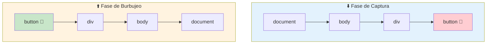

> 💡 Por defecto, los eventos **burbujean** (van del elemento más específico al más general). Puedes detenerlo con `event.stopPropagation()`.

### Cómo se integran HTML, CSS y JS

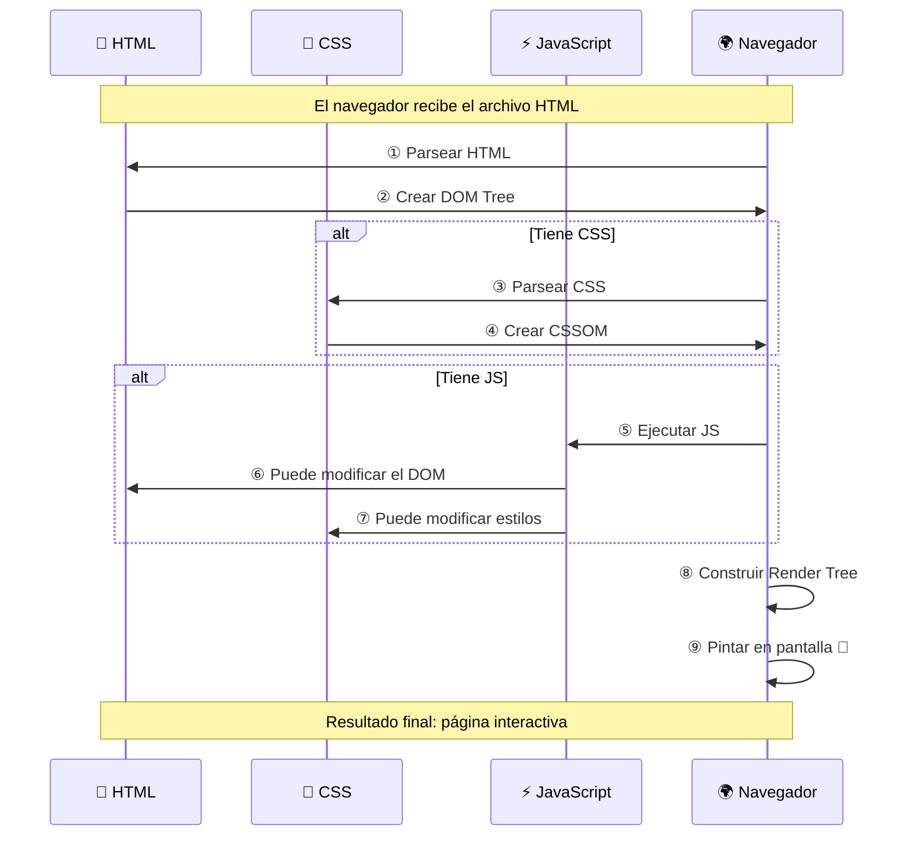

---

## Resumen visual: el ecosistema frontend

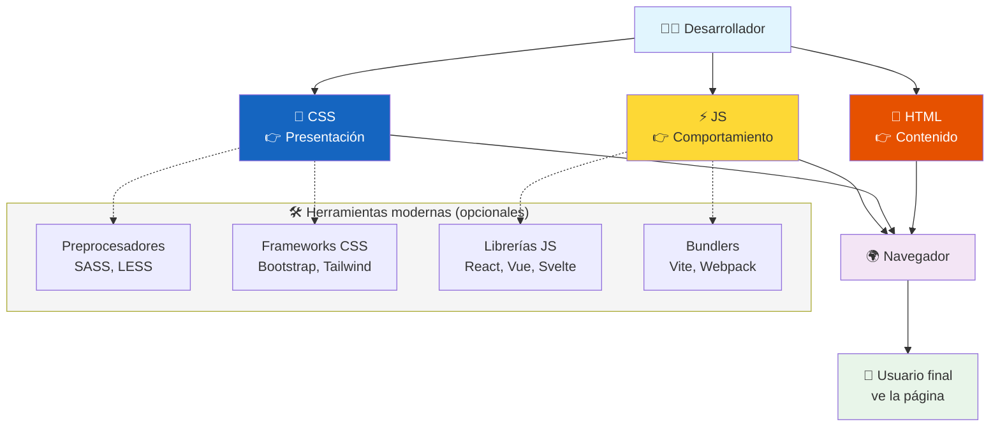

### Los tres pilares resumidos

| Pilar       | Función           | Analogía           | Sintaxis           |
| ----------- | ----------------- | ------------------ | ------------------ |
| **HTML**    | Estructura        | 🏠 Esqueleto       | `<etiqueta>`      |
| **CSS**     | Estilo            | 🖌️ Decoración      | `selector { ... }` |
| **JS**      | Interactividad    | 🔌 Electricidad    | `código lógico`    |

> **Siguiente paso:** Profundiza en cada tecnología por separado y luego elige un framework como React, Vue o Svelte para construir aplicaciones más complejas.

## Relacionados:
- [[backend-introduccion]] #anterior  
- [[elige-un-lenguaje-de-backend]] #siguiente 