# Broker de Mensajes

Un **broker de mensajes** (message broker) es un intermediario que permite que **servicios se comuniquen de forma asíncrona** enviando y recibiendo mensajes. Es el corazón de la arquitectura de microservicios.

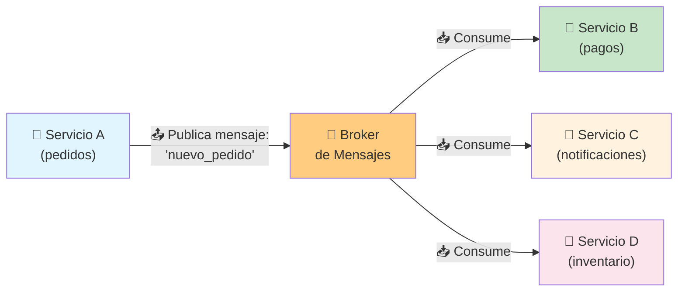

### ¿Qué problema resuelve?

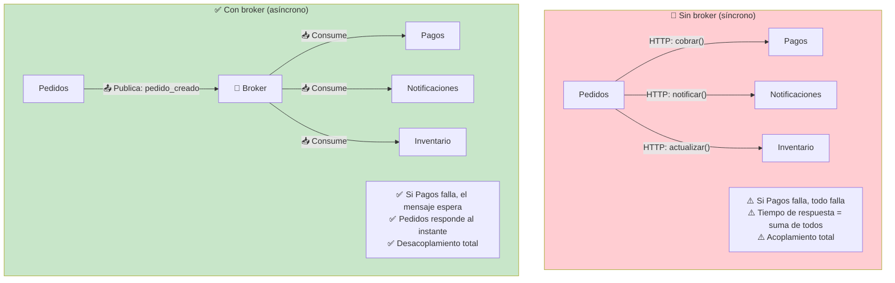

### Conceptos clave

| Concepto       | Definición                                    |
| -------------- | --------------------------------------------- |
| **Mensaje**    | Unidad de datos que viaja por el broker       |
| **Productor**  | Quien envía mensajes                          |
| **Consumidor** | Quien recibe y procesa mensajes               |
| **Cola**       | Buffer donde los mensajes esperan ser procesados |
| **Exchange**   | Enruta mensajes a una o varias colas          |
| **Tópico**     | Categoría de mensajes (pub/sub)               |
| **ACK**        | Confirmación de que un mensaje fue procesado  |
| **DLQ**        | Dead Letter Queue: mensajes que fallaron       |

### Patrones de mensajería

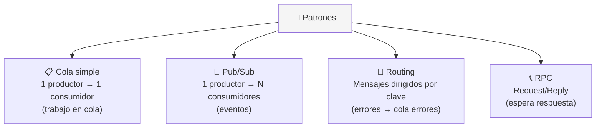

---

## RabbitMQ

**RabbitMQ** es un broker de mensajes maduro, fácil de usar y basado en el protocolo **AMQP** (Advanced Message Queuing Protocol). Ideal para la mayoría de los casos de uso.

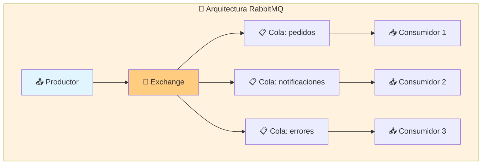

### Tipos de Exchange

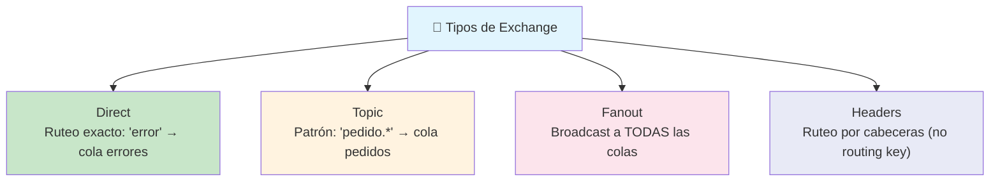

### Ejemplo Node.js

```javascript
const amqp = require('amqplib');

// PRODUCTOR
async function enviarPedido(pedido) {
    const conn = await amqp.connect('amqp://localhost');
    const channel = await conn.createChannel();
    const queue = 'pedidos';

    await channel.assertQueue(queue, { durable: true });
    channel.sendToQueue(queue, Buffer.from(JSON.stringify(pedido)), {
        persistent: true  // mensaje sobrevive a reinicios
    });

    console.log('Pedido enviado:', pedido.id);
}

// CONSUMIDOR
async function procesarPedidos() {
    const conn = await amqp.connect('amqp://localhost');
    const channel = await conn.createChannel();
    const queue = 'pedidos';

    await channel.assertQueue(queue, { durable: true });
    channel.consume(queue, (msg) => {
        const pedido = JSON.parse(msg.content.toString());
        console.log('Procesando pedido:', pedido.id);
        // ... lógica de negocio

        channel.ack(msg);  // confirmar procesado
    });
}
```

### Características de RabbitMQ

| Característica       | RabbitMQ                              |
| -------------------- | ------------------------------------- |
| **Protocolo**        | AMQP 0-9-1 (estándar)                 |
| **Persistencia**     | Sí (mensajes en disco)                |
| **Routing**          | Exchange + routing keys (flexible)    |
| **Lenguajes**        | Clientes para todos los lenguajes     |
| **Administración**   | UI web en puerto 15672                |
| **Ideal para**       | Colas de trabajo, comunicación entre servicios |

---

## Kafka

**Apache Kafka** es una plataforma de streaming distribuida diseñada para **alto rendimiento y gran volumen de datos**. No es solo un broker: es un **sistema de logs distribuido**.

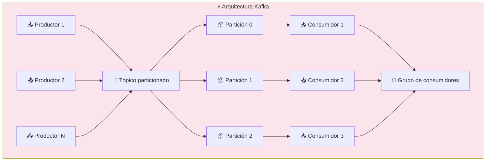

### Conceptos clave de Kafka

| Concepto        | Explicación                                      |
| --------------- | ------------------------------------------------ |
| **Tópico**      | Categoría de mensajes (ej: pedidos, eventos)     |
| **Partición**   | Subdivisión de un tópico (ordenada, inmutable)   |
| **Offset**      | Posición de un mensaje dentro de una partición   |
| **Consumer Group** | Grupo de consumidores que reparten particiones |
| **Retención**   | Los mensajes no se eliminan al consumirse (por tiempo/tamaño) |
| **Broker**      | Servidor Kafka                                   |

### La clave de Kafka: el log

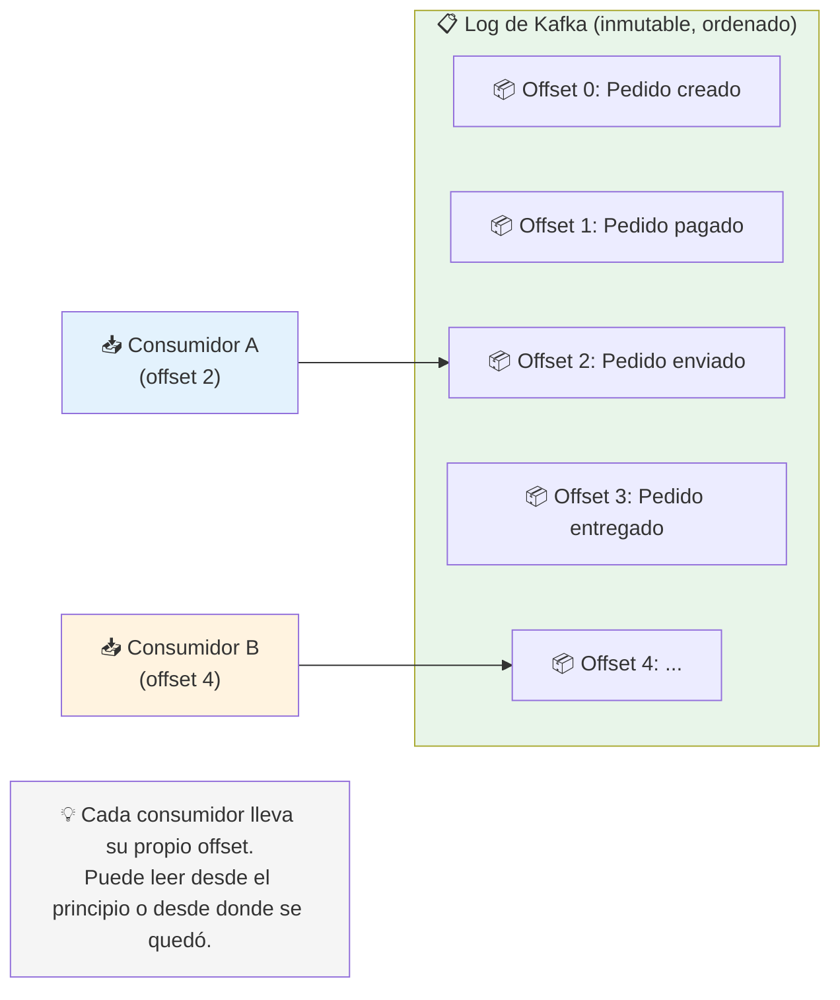

### Ejemplo Node.js

```javascript
const { Kafka } = require('kafkajs');

// PRODUCTOR
const kafka = new Kafka({ clientId: 'miapp', brokers: ['localhost:9092'] });
const producer = kafka.producer();

async function enviarEvento() {
    await producer.connect();
    await producer.send({
        topic: 'pedidos',
        messages: [{ key: 'pedido-1', value: JSON.stringify({ id: 1, total: 100 }) }]
    });
}

// CONSUMIDOR
const consumer = kafka.consumer({ groupId: 'grupo-pagos' });

async function consumir() {
    await consumer.connect();
    await consumer.subscribe({ topic: 'pedidos', fromBeginning: true });

    await consumer.run({
        eachMessage: async ({ topic, partition, message }) => {
            console.log('Procesando:', message.value.toString());
            // ... lógica de negocio
        }
    });
}
```

### Kafka vs RabbitMQ

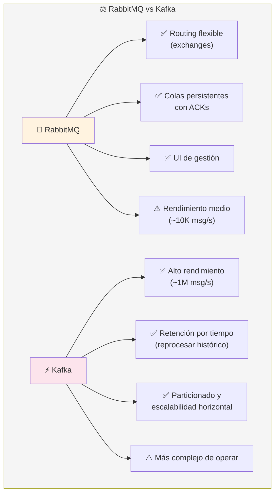

### ¿Cuál elegir?

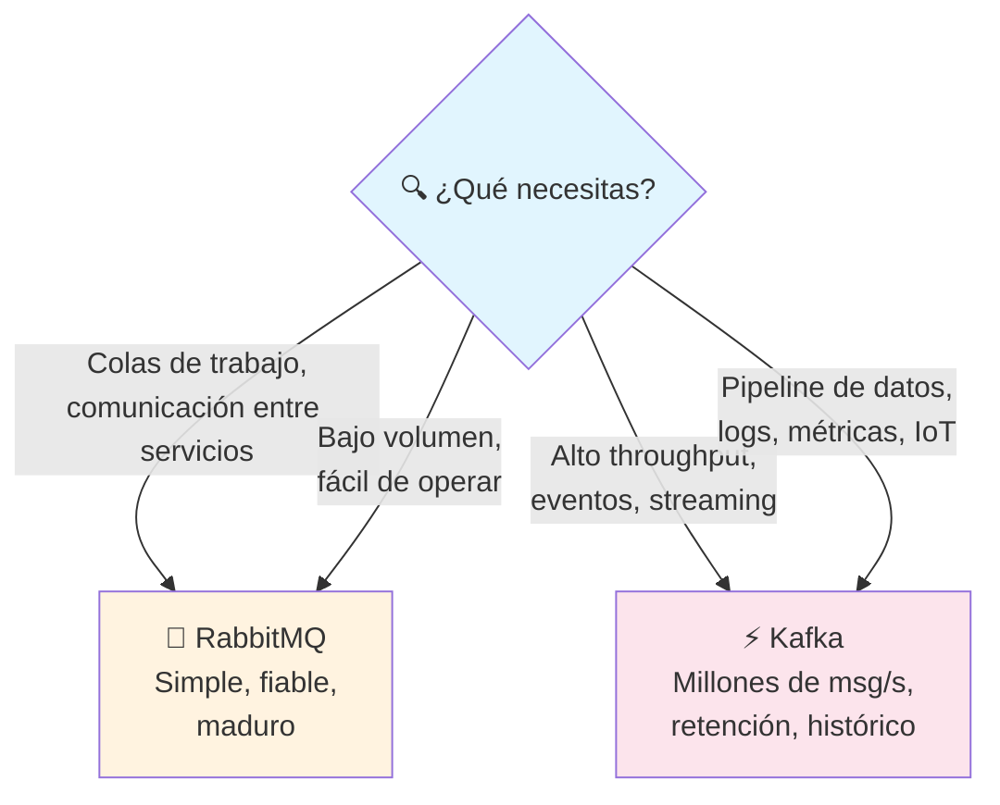

### Tabla comparativa

| Característica           | RabbitMQ           | Kafka                |
| ------------------------ | ------------------ | -------------------- |
| **Modelo**               | Colas + Exchange   | Log particionado     |
| **Rendimiento**          | ~10K msg/s         | ~1M msg/s            |
| **Routing**              | Flexible (AMQP)    | Simple (tópico)      |
| **Persistencia**         | ACK + disco        | Retención por tiempo |
| **Consumidores**         | Comptien por cola  | Grupo particionado   |
| **Reprocesar**           | ❌ (se elimina)    | ✅ (retención)       |
| **Complejidad**          | Baja-Media         | Alta                 |
| **Caso típico**          | Microservicios     | Eventos, analytics   |

---

## Buenas prácticas

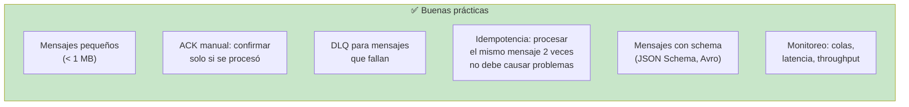

---

## Resumen visual

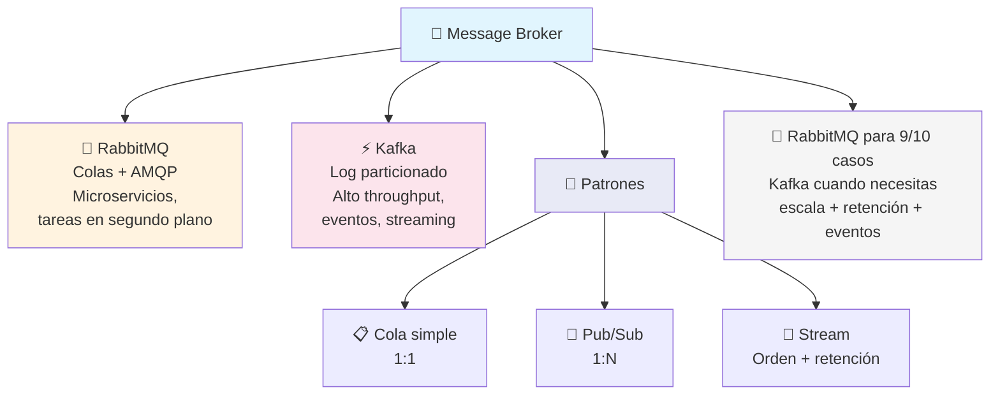

> **Siguiente paso:** Instala RabbitMQ con Docker y crea un productor + consumidor. Luego prueba Kafka si necesitas alto rendimiento o eventos históricos.

## Relacionados:
- [[containerización]] #anterior 
- [[motores-de-busqueda]] #siguiente 