# Caching

El **caching** es la técnica de almacenar datos temporalmente en un lugar de acceso rápido para evitar tener que generarlos o buscarlos repetidamente. Es una de las estrategias más efectivas para mejorar rendimiento.

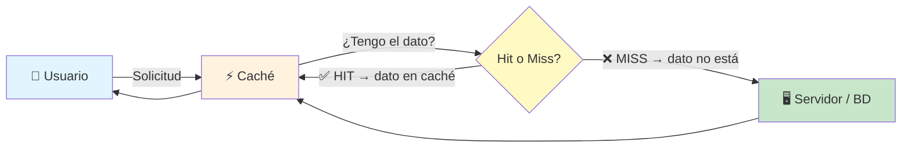

> **Analogía:** Caching es como tener los ingredientes que más usas en la encimera de la cocina, en vez de ir al refrigerador cada vez que los necesitas.

### Conceptos clave

| Término   | Significado                                    |
| --------- | ---------------------------------------------- |
| **Cache Hit**  | El dato está en caché → respuesta rápida   |
| **Cache Miss** | El dato no está → hay que ir al origen     |
| **TTL**   | Time To Live — tiempo que vive el dato en caché |
| **Expiración** | El dato se elimina automáticamente al vencer |
| **Invalidación** | Se elimina el dato porque cambió el original |
| **Evicción** | Se elimina un dato para hacer espacio al nuevo |

### Estrategias de caché

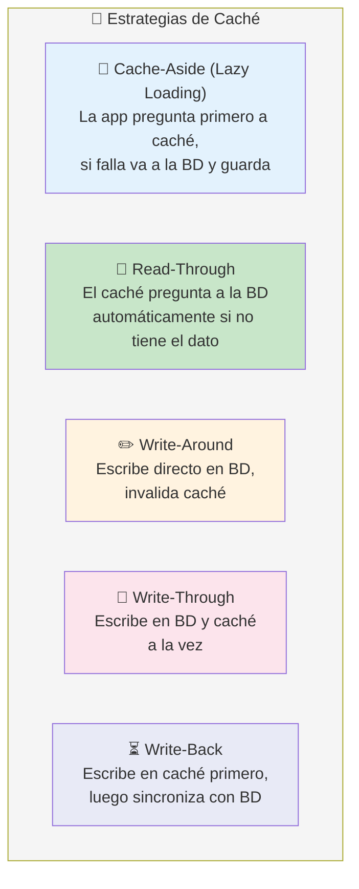

### ¿Qué cachear?

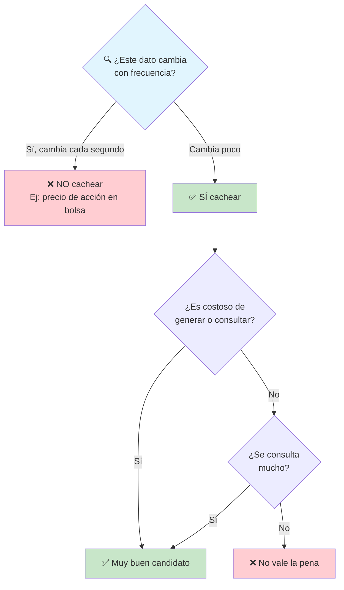

---

## HTTP Caching

El **caching HTTP** ocurve en el navegador o en proxies intermedios (CDN). Las respuestas HTTP incluyen **cabeceras** que controlan cómo y por cuánto tiempo se pueden cachear.

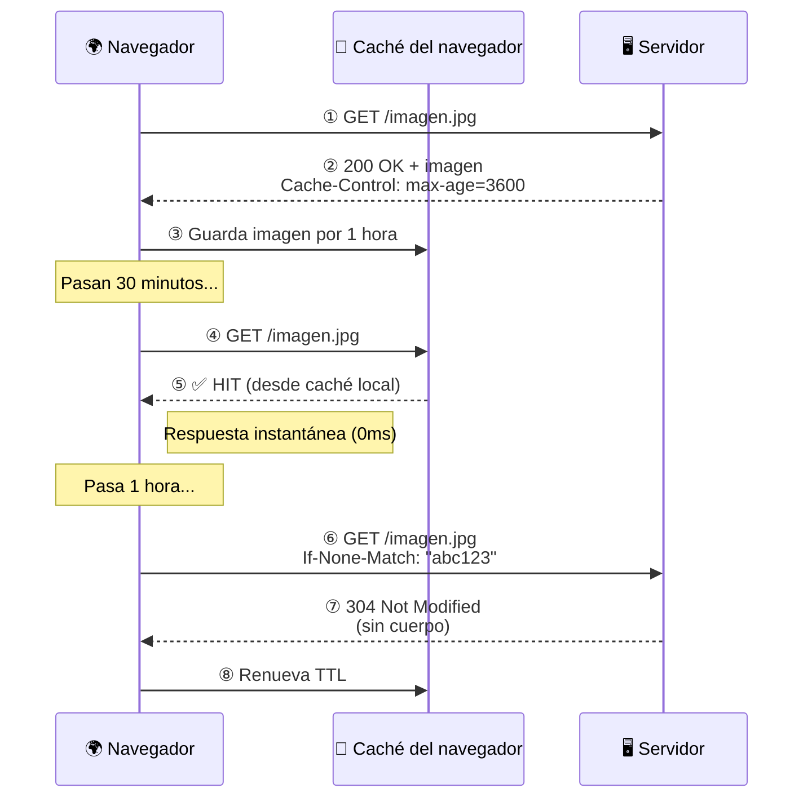

### Cabeceras principales

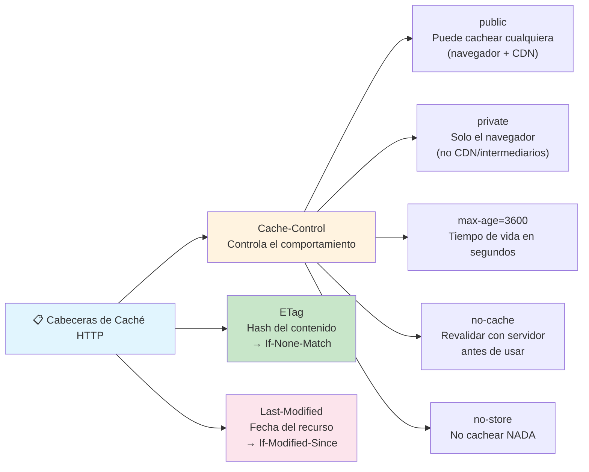

### Ejemplo de cabeceras

```http
# Respuesta cacheable por 1 hora
HTTP/1.1 200 OK
Content-Type: application/json
Cache-Control: public, max-age=3600
ETag: "abc123"
Last-Modified: Tue, 15 May 2025 12:00:00 GMT

# El navegador revalida con:
GET /api/usuarios
If-None-Match: "abc123"
If-Modified-Since: Tue, 15 May 2025 12:00:00 GMT

# Respuesta si no cambió:
HTTP/1.1 304 Not Modified
# (sin cuerpo — ahorra ancho de banda)
```

---

## Caché del lado del servidor

La caché del lado del servidor almacena datos en **memoria RAM** (mucho más rápida que el disco) para evitar consultas repetitivas a la base de datos o cálculos costosos.

```mermaid
flowchart LR
    App["📱 App"] --> Cache["⚡ Caché en RAM"]
    Cache -->|"Hit"| App
    Cache -->|"Miss"| BD["🗄️ Base de Datos"]
    BD --> Cache

    Note right of Cache: ~0.1ms por lectura
    Note right of BD: ~10-50ms por consulta

    style App fill:#e1f5fe
    style Cache fill:#fff3e0
    style BD fill:#c8e6c9
```

### Casos de uso típicos

- **Páginas enteras:** HTML renderizado que cambia poco (home, landing pages)
- **Fragmentos:** Sidebars, menús, configuraciones
- **Resultados de consultas:** Listados paginados que se repiten
- **Sesiones:** Datos de sesión de usuario (evitar consultar BD en cada request)
- **Rate limiting:** Contadores para limitar peticiones por IP

---

## Redis

**Redis** es un almacén de datos en memoria, de tipo **clave-valor**, que se usa principalmente como caché, cola de mensajes y base de datos ligera. Es el rey del caching moderno.

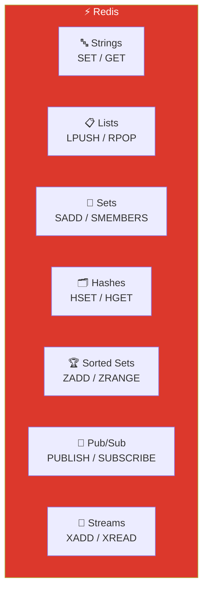

### Comandos básicos

```bash
# Strings (el tipo más simple)
SET usuario:1:nombre "Ana"
GET usuario:1:nombre          # → "Ana"
TTL usuario:1:nombre           # → -1 (no expira)
EXPIRE usuario:1:nombre 3600   # → expira en 1 hora

# Con expiración en el SET
SET usuario:1:session "token123" EX 3600

# Hashes (objetos anidados)
HSET usuario:1 id 1 nombre "Ana" email "ana@email.com"
HGET usuario:1 nombre           # → "Ana"
HGETALL usuario:1               # → todos los campos

# Lists (colas)
LPUSH cola:tareas "procesar_pago"
RPOP cola:tareas                # → "procesar_pago"

# Pub/Sub (mensajería)
PUBLISH canal:noticias "nuevo artículo"
SUBSCRIBE canal:noticias
```

### Patrón típico con Redis

```javascript
// Pseudocódigo: Cache-Aside con Redis
function getUsuario(id) {
    const cacheKey = `usuario:${id}`;

    // 1. Intentar obtener de caché
    const cached = redis.get(cacheKey);
    if (cached) {
        return JSON.parse(cached);          // ✅ HIT
    }

    // 2. Si no está, ir a la BD
    const usuario = db.query(
        'SELECT * FROM usuarios WHERE id = ?', [id]
    );

    // 3. Guardar en caché por 5 minutos
    redis.set(cacheKey, JSON.stringify(usuario), 'EX', 300);

    return usuario;                          // ⚠️ MISS
}
```

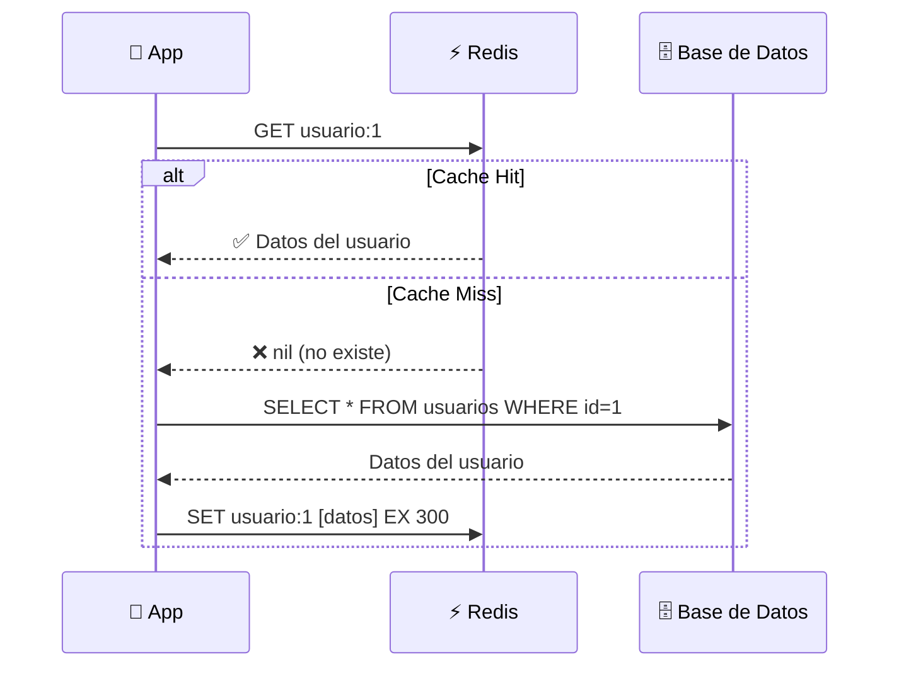

### Características clave

| Característica      | Redis                        |
| ------------------- | ---------------------------- |
| **Persistencia**    | Opcional (RDB / AOF)         |
| **Estructuras**     | Strings, Lists, Sets, Hashes, Sorted Sets, Streams, HyperLogLog, Bitmaps |
| **Replicación**     | Maestro-esclavo, Sentinel, Cluster |
| **Velocidad**       | ~100,000 ops/seg (en memoria) |
| **Usos**            | Caché, sesiones, colas, rate limiter, pub/sub |

---

## Memcached

**Memcached** es un sistema de caché distribuida en memoria, también clave-valor pero **más simple** que Redis. Fue el estándar antes de que Redis ganara popularidad.

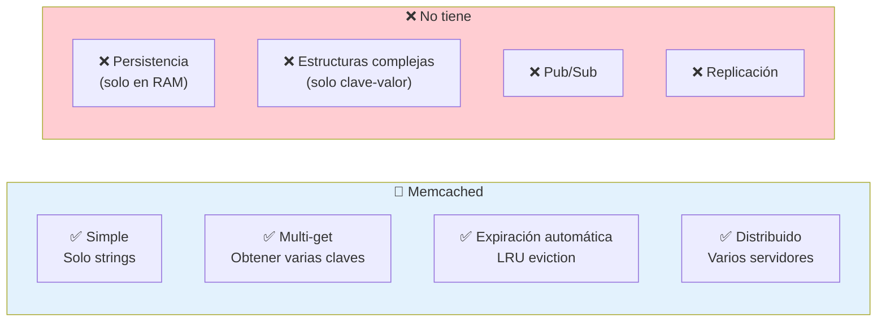

### Comandos básicos

```bash
# Guardar y obtener
set usuario:1 0 3600 15
Ana|ana@email.com
STORED

get usuario:1  # → "Ana|ana@email.com"

# Eliminar
delete usuario:1

# Incrementar (útil para contadores)
incr contador:visitas 1
```

### Redis vs Memcached

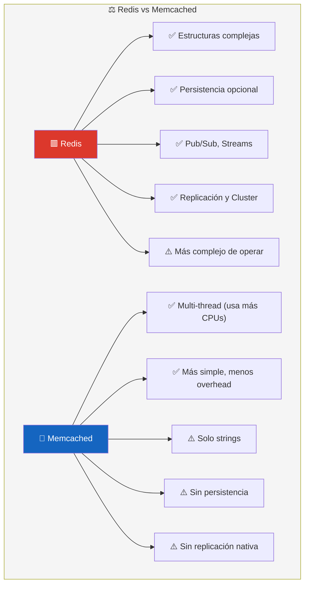

**¿Cuándo usar Memcached hoy?** En casos muy simples donde solo necesitas un caché clave-valor, multi-thread y no necesitas persistencia ni estructuras complejas. Redis es casi siempre la mejor opción hoy en día.

---

## Niveles de caché

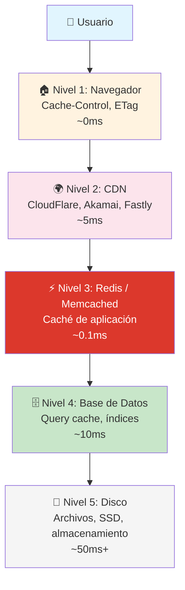

---

## Buenas prácticas

- **No cachees todo:** Evalúa frecuencia de cambio y costo de generar el dato
- **TTL razonable:** Ni muy corto (pierdes beneficio) ni muy largo (datos obsoletos)
- **Invalidación manual:** Cuando un dato cambia, elimínalo de caché (o actualízalo)
- **Key naming consistente:** `entidad:id:campo` (ej: `usuario:1:nombre`)
- **Cacheo de páginas vs fragmentos:** Prefiere fragmentos pequeños y reutilizables
- **Monitoreo:** Mide hit ratio, latencia y memoria usada
- **Cache stampede:** Cuando expira un dato popular y N peticiones intentan regenerarlo a la vez → usa bloqueo (lock) o TTL escalonado

---

## Resumen visual

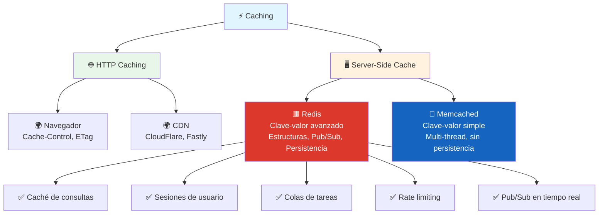

---

> **Siguiente paso:** Instala Redis, juega con `redis-cli`, e intégralo en tu backend con la librería `ioredis` (Node.js) o `redis-py` (Python).

## Relacionados:
- [[aprende-acerca-de-apis]] #anterior 
- [[servidores-web]] #siguiente 