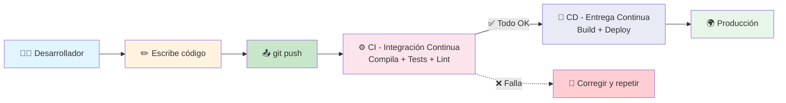
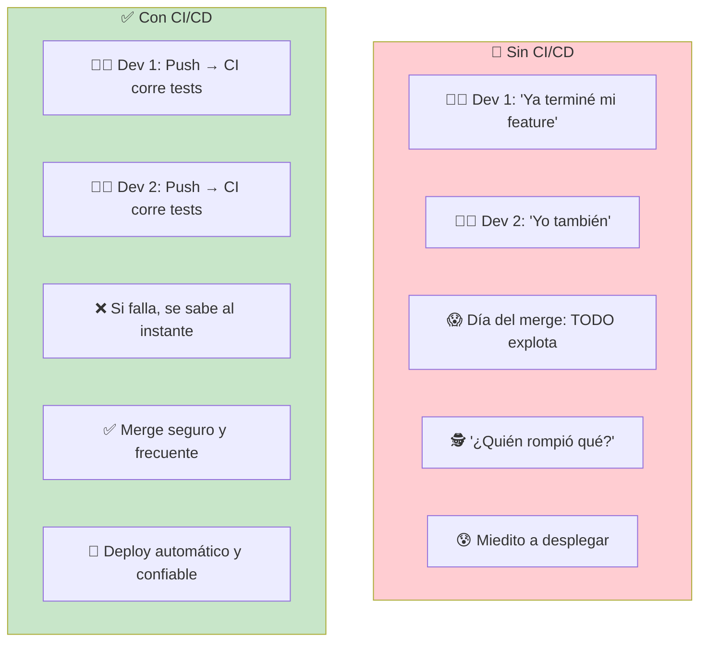
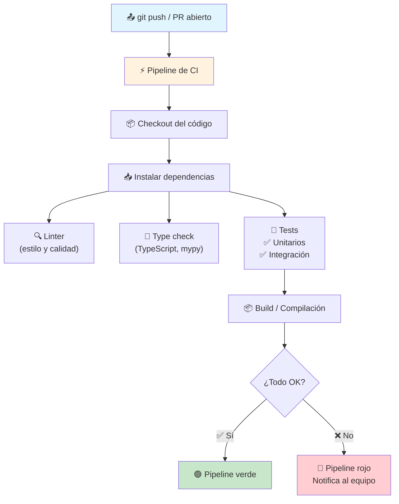
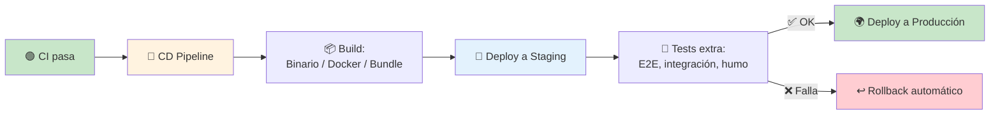
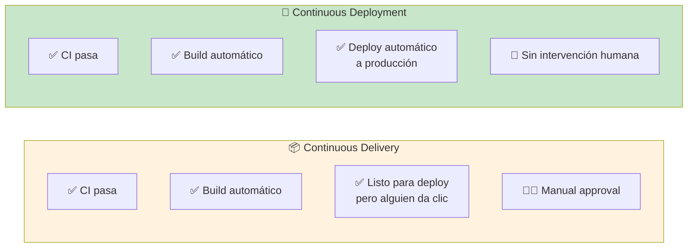
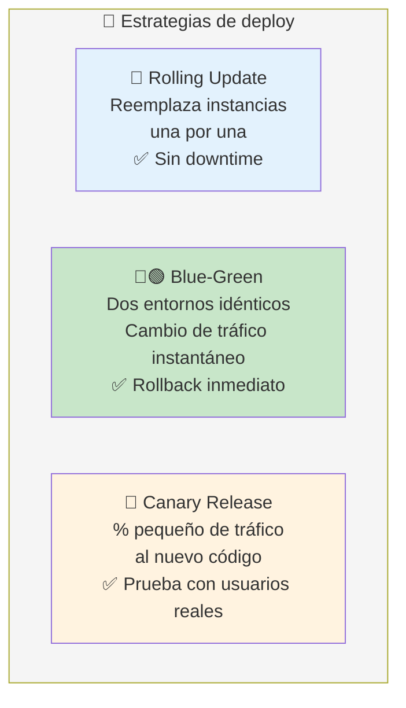
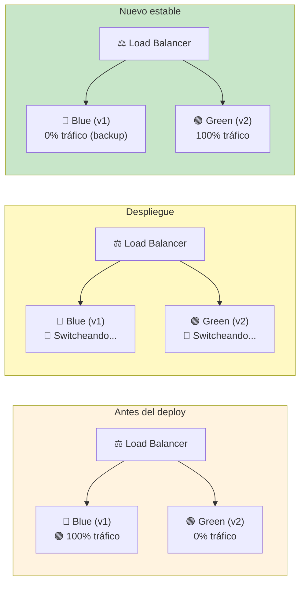
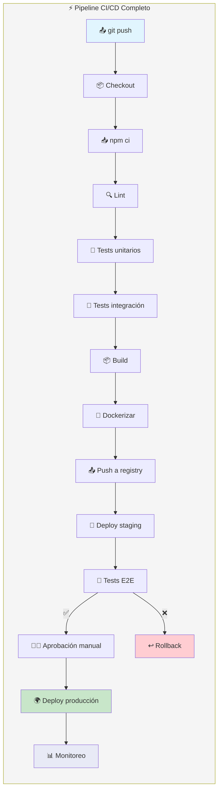
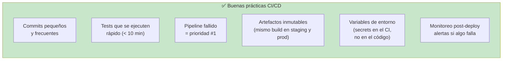
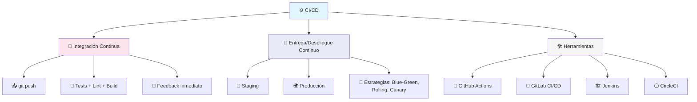

# CI/CD

**CI/CD** (Continuous Integration / Continuous Delivery) es una práctica de desarrollo que automatiza la integración, prueba y despliegue del código. El objetivo: detectar errores rápido y entregar software con frecuencia y confianza.



### ¿Qué problema resuelve?



---

## CI: Integración Continua

**CI** ejecuta automáticamente **tests, linters y compilación** cada vez que haces push. Te dice si tu código rompió algo **en segundos o minutos**.



### Ejemplo: GitHub Actions (Node.js)

```yaml
# .github/workflows/ci.yml
name: CI

on: [push, pull_request]

jobs:
  test:
    runs-on: ubuntu-latest

    steps:
      - uses: actions/checkout@v4

      - name: Setup Node.js
        uses: actions/setup-node@v4
        with:
          node-version: 20

      - name: Instalar dependencias
        run: npm ci

      - name: Linter
        run: npm run lint

      - name: Tests
        run: npm test

      - name: Build
        run: npm run build
```

### Ejemplo: GitLab CI

```yaml
# .gitlab-ci.yml
stages:
  - test
  - build

test:
  stage: test
  image: node:20
  script:
    - npm ci
    - npm run lint
    - npm test

build:
  stage: build
  image: node:20
  script:
    - npm run build
  artifacts:
    paths:
      - dist/
```

---

## CD: Entrega/Despliegue Continuo

**CD** automatiza el despliegue del código validado a los entornos correspondientes (staging, producción).



### CD: Delivery vs Deployment



|                           | Continuous Delivery | Continuous Deployment |
| ------------------------- | ------------------- | --------------------- |
| **Despliegue a prod**     | Manual (clic)       | Automático            |
| **Riesgo**                | Menor (alguien revisa) | Mayor (totalmente automático) |
| **Velocidad**            | Rápido              | Inmediato             |
| **¿Para quién?**          | Equipos con releases programadas | Equipos con confianza en tests |

### Ejemplo: CD con GitHub Actions

```yaml
# .github/workflows/deploy.yml
name: Deploy

on:
  push:
    branches: [main]

jobs:
  deploy:
    runs-on: ubuntu-latest

    steps:
      - uses: actions/checkout@v4

      - name: Build Docker image
        run: docker build -t miapp .

      - name: Push to registry
        run: docker push ghcr.io/miusuario/miapp:latest

      - name: Deploy to server
        uses: appleboy/ssh-action@v1
        with:
          host: ${{ secrets.SERVER_HOST }}
          username: ${{ secrets.SERVER_USER }}
          key: ${{ secrets.SSH_KEY }}
          script: |
            cd /app
            docker-compose pull
            docker-compose up -d
```

---

## Estrategias de despliegue



### Blue-Green Deployment



---

## Pipeline completo



---

## Mejores prácticas



### Reglas de oro

1. **Nunca hagas push directo a main** — usa Pull Requests con CI que valide
2. **Pipeline rápido es pipeline bueno** — si tarda >15 min, la gente ignora los fallos
3. **Un solo comando para deploy** — `npm run deploy` o similar
4. **Rollback con un clic** — si puedes deployar, puedes revertir
5. **Inmutabilidad** — build una vez, deploya ese mismo artefacto en todos lados

---

## Resumen visual



---

> **Siguiente paso:** Agrega CI a tu proyecto con GitHub Actions (el `.yml` que viste arriba funciona). Luego configura CD para que al hacer push a main se deploye automáticamente a staging.

## Relacionados:
- [[patrones-de-integracion]] #anterior 
- [[mas-acerca-de-bases-de-datos]] #siguiente 