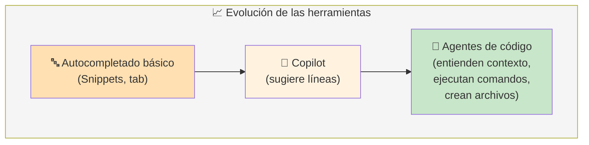
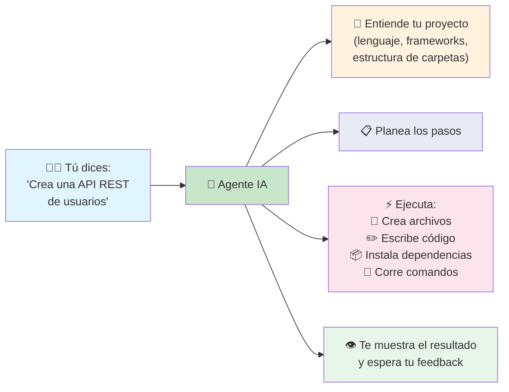
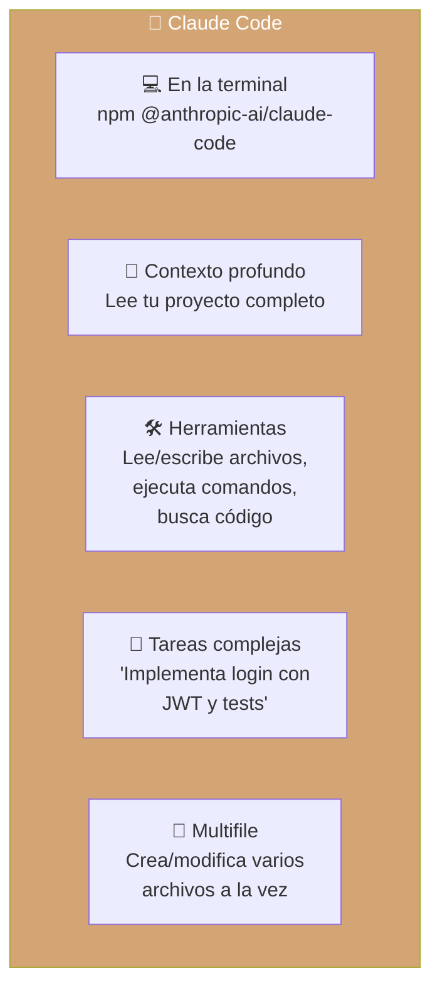
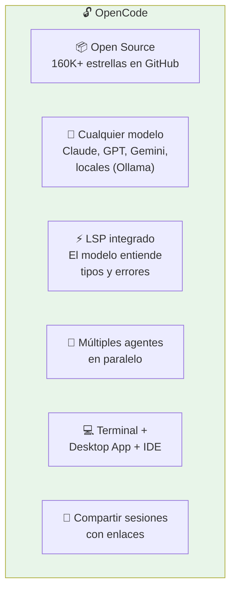
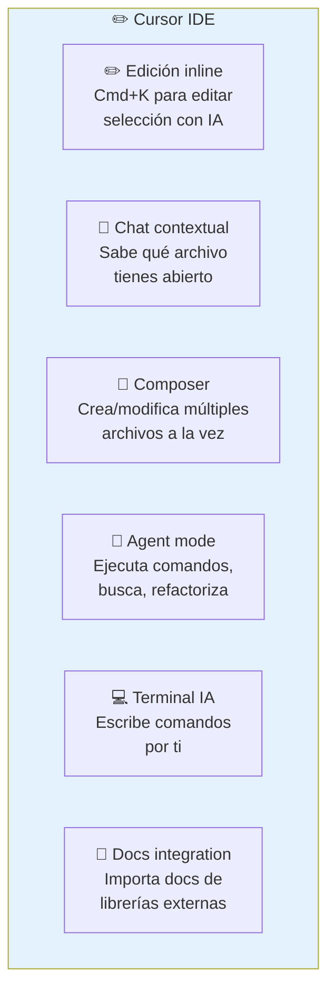
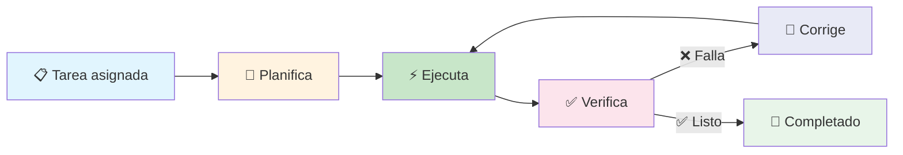
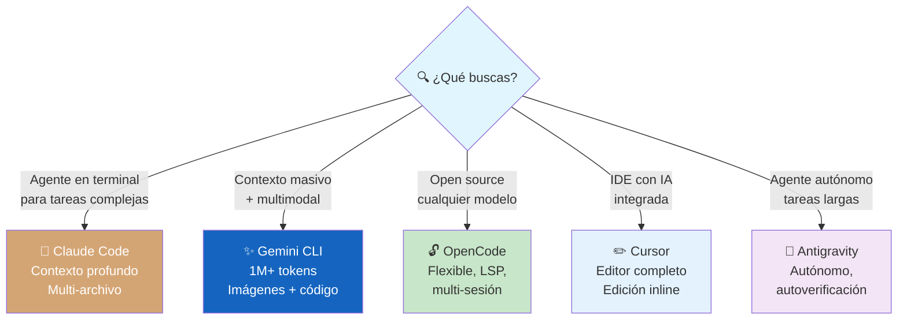
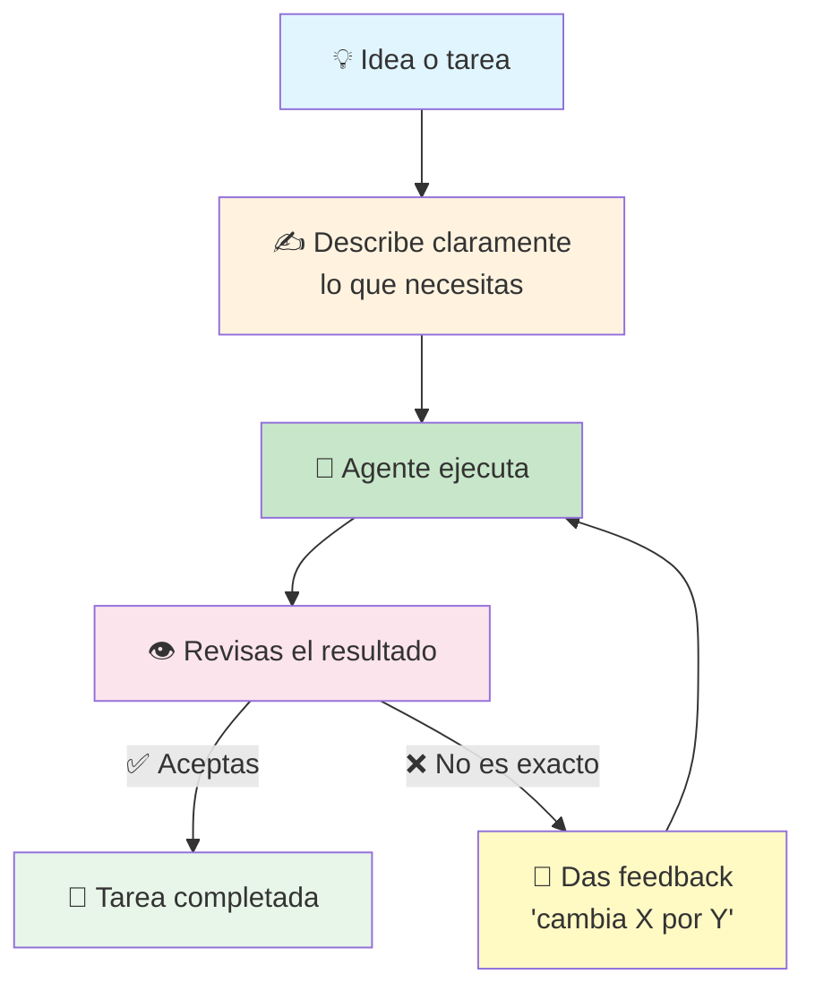
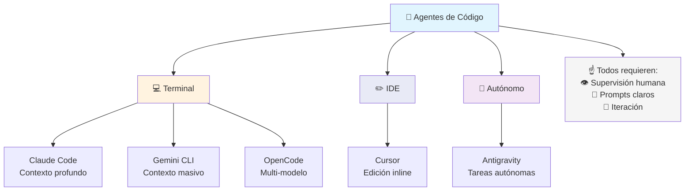

# Código asistido por IA

Los **agentes de código asistido por IA** son herramientas que integran modelos de lenguaje directamente en el flujo de desarrollo. No solo autocompletan: entienden tu proyecto, ejecutan comandos, crean archivos y refactorizan.



### ¿Qué hace un agente de código?



> **Diferencia clave:** Un autocompletado sugiere la siguiente línea. Un agente entiende tu proyecto y hace cambios complejos por ti.

---

## Claude Code

**Claude Code** es el agente de código de Anthropic, creado por los mismos que hicieron Claude. Funciona en la terminal y está diseñado para tareas complejas de ingeniería de software.



### Cómo funciona

```bash
# En la terminal de tu proyecto
claude

# Luego le dices:
# "Crea un modelo de Usuario con Prisma,
#  un endpoint POST /register y sus tests"
# Claude analiza tu proyecto y ejecuta los cambios
```

**Ideal para:** Tareas complejas que requieren entender todo el proyecto, refactorizaciones grandes, análisis de código legacy.

---

## Gemini CLI

**Gemini CLI** es el agente de código de Google, basado en el modelo Gemini 2.5. Se integra en la terminal y entiende el contexto completo de tu proyecto.

```bash
# Iniciar sesión interactiva
gemini-cli

# O pasar una tarea directa
gemini-cli "Refactoriza este componente React para usar hooks modernos"
```

### Características principales

- **Contexto completo del proyecto** — entiende estructura, dependencias y config
- **Multimodal** — puede analizar capturas de pantalla, diagramas, mockups
- **Integración con Google Cloud** — despliega directo a Cloud Run, Firestore
- **1000 requests/día gratis** — generoso tier gratuito

| Ventajas                     | Ideal para                         |
| ---------------------------- | ---------------------------------- |
| Contexto masivo (1M+ tokens) | Proyectos grandes y complejos      |
| Multimodal                   | Convertir diseños a código         |
| Integración Google Cloud     | Equipos en ecosistema Google       |

---

## OpenCode

**OpenCode** es un agente de código **open source** que corre en tu terminal, escritorio o IDE. Es el más flexible porque puedes usar **cualquier modelo** (Claude, GPT, Gemini, locales).



### Cómo se usa

```bash
# En la terminal
opencode

# O modo autónomo (sin preguntar)
opencode "Agrega un endpoint GET /health a la API" --yes

# Múltiples agentes en paralelo
opencode "Crea el modelo User" & 
opencode "Crea los tests de User" &
```

| Ventajas                       | Ideal para                          |
| ------------------------------ | ----------------------------------- |
| 100% open source               | Quienes quieren control total       |
| Cualquier modelo (BYOM)        | Equipos con suscripciones existentes |
| LSP integrado                  | Proyectos donde la precisión importa |
| Multi-session paralelo         | Tareas grandes divididas            |

---

## Cursor

**Cursor** es un **editor de código** (fork de VS Code) con IA integrada en cada aspecto. No es un plugin, es un IDE diseñado desde cero para trabajar con IA.



### Cómo se usa

```bash
# Atajos clave en Cursor:
Cmd+K      # Editar código seleccionado con IA
Cmd+L      # Chat contextual (sabe qué archivo tienes abierto)
Cmd+I      # Composer (multifile)

# Agent mode:
# "Instala Tailwind, configura el archivo base,
#  y crea un componente Navbar responsivo"
```

| Ventajas                       | Ideal para                          |
| ------------------------------ | ----------------------------------- |
| IDE completo (fork VS Code)    | Quienes quieren IA en todo momento  |
| Edición inline ultra rápida    | Cambios rápidos sin cambiar contexto |
| Composer multifile             | Tareas que afectan varios archivos  |
| Agent mode                     | Automatización de tareas complejas  |

---

## Antigravity

**Antigravity** es un agente de código autónomo especializado en **tareas de ingeniería complejas y de larga duración**. A diferencia de otros asistentes que requieren supervisión constante, Antigravity puede trabajar de forma independiente durante períodos prolongados.



**Ideal para:** Automatización de procesos complejos, migraciones de código a gran escala, tareas que requieren iteración y autoverificación.

---

## Comparativa rápida



### Tabla comparativa

| Herramienta      | Tipo          | Modelos              | Open Source | Ideal para                    |
| ---------------- | ------------- | -------------------- | ----------- | ----------------------------- |
| **Claude Code**  | Terminal      | Claude               | ❌          | Tareas complejas, contexto    |
| **Gemini CLI**   | Terminal      | Gemini               | ❌          | Contexto masivo, multimodal   |
| **OpenCode**     | Terminal/IDE  | Cualquiera           | ✅          | Flexibilidad, control total   |
| **Cursor**       | IDE completo  | Claude, GPT, Gemini  | ❌          | Edición inline, productividad |
| **Antigravity**  | Agente CLI    | Múltiples            | ❌          | Tareas autónomas, migraciones |

---

## Flujo de trabajo con agentes



### Consejos para sacarles el máximo partido

1. **Sé específico** — "Crea un endpoint POST /register" > "Haz un registro de usuarios"
2. **Itera** — No esperes perfección al primer intento. Da feedback
3. **Revisa siempre** — La IA comete errores. Tú eres el responsable del código
4. **Divide tareas grandes** — "Implementa el modelo" → "Crea el endpoint" → "Añade tests"
5. **Usa el contexto a tu favor** — Mantén archivos relevantes abiertos para que el agente los vea

---

## Resumen visual



---

> **Siguiente paso:** Elige una herramienta según tu flujo. ¿Pasas mucho en la terminal? Prueba Claude Code u OpenCode. ¿Prefieres un IDE? Cursor. ¿Tareas masivas? Gemini CLI o Antigravity. Lo importante es **empezar a usarlas**.

## Relacionados:
- [[aplicaciones-con-ia]] #anterior 
- [[prompt-engineering]] #relacionado
- [[proveedores-de-ia]] #siguiente 