# Containerización

La **containerización** empaqueta una aplicación con todo lo que necesita (código, librerías, configuraciones) en un **contenedor** liviano y portátil que se ejecuta igual en cualquier entorno.

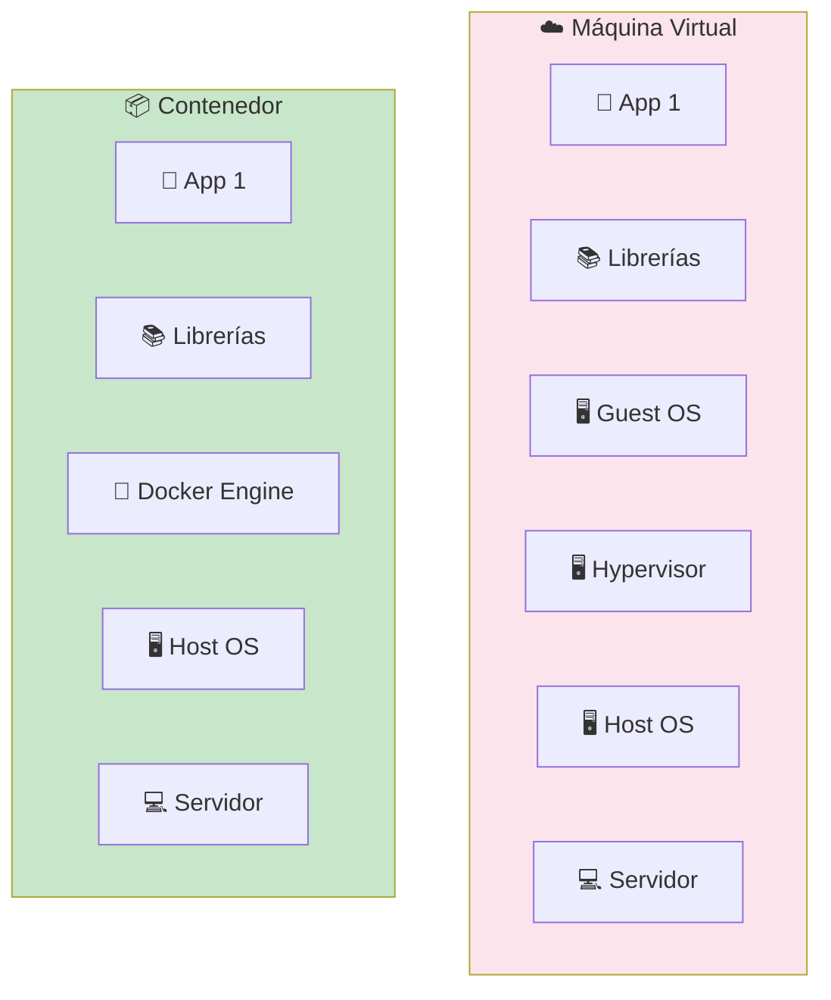

| Característica     | Máquina Virtual         | Contenedor           |
| ------------------ | ----------------------- | -------------------- |
| **Peso**           | GB (SO completo)        | MB (solo app)        |
| **Inicio**         | Minutos                 | Segundos             |
| **Aislamiento**    | Completo (SO propio)    | Procesos del host    |
| **Consumo**        | Alto (cada VM su SO)    | Bajo (comparten SO)  |

---

## Docker

**Docker** es la plataforma de containerización más usada. Permite empaquetar, distribuir y ejecutar aplicaciones en contenedores de forma sencilla.

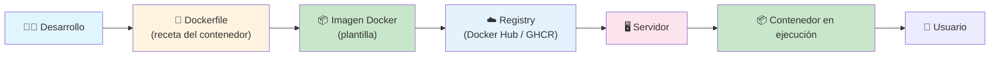

### Dockerfile

Un **Dockerfile** es la receta para construir una imagen. Cada instrucción crea una **capa** (layer) que se cachea.

```dockerfile
# Usa una imagen base con Node.js
FROM node:20-alpine

# Directorio de trabajo
WORKDIR /app

# Copia package.json primero (aprovecha caché)
COPY package*.json ./
RUN npm ci --production

# Copia el código fuente
COPY . .

# Puerto que expone
EXPOSE 3000

# Comando al iniciar
CMD ["node", "server.js"]
```

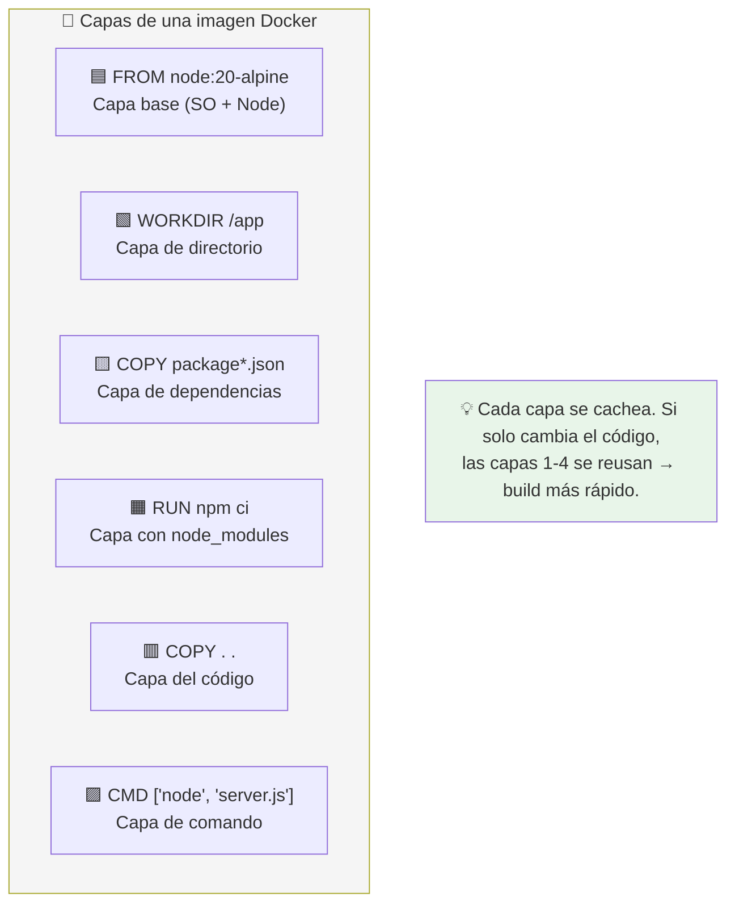

### Comandos esenciales

```bash
# Construir imagen
docker build -t miapp:latest .

# Ejecutar contenedor
docker run -d -p 3000:3000 --name mi-app miapp:latest

# Ver contenedores
docker ps
docker ps -a  # incluye detenidos

# Ver logs
docker logs -f mi-app

# Detener y eliminar
docker stop mi-app
docker rm mi-app

# Ejecutar comando dentro del contenedor
docker exec -it mi-app sh
```

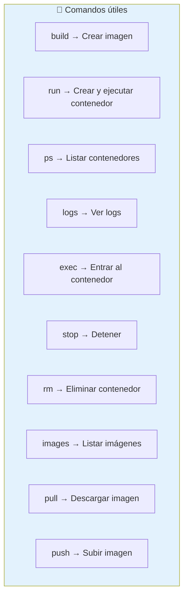

### Docker Compose

Para aplicaciones con múltiples servicios (app + BD + Redis), **Docker Compose** orquesta todo con un archivo YAML.

```yaml
# docker-compose.yml
services:
  app:
    build: .
    ports:
      - "3000:3000"
    environment:
      - DATABASE_URL=postgres://user:pass@db:5432/miapp
    depends_on:
      - db

  db:
    image: postgres:16
    volumes:
      - pgdata:/var/lib/postgresql/data
    environment:
      - POSTGRES_PASSWORD=pass

volumes:
  pgdata:
```

```bash
# Iniciar todos los servicios
docker compose up -d

# Ver logs
docker compose logs -f

# Detener
docker compose down
```

### Ventajas de Docker

| Ventaja               | Explicación                                    |
| --------------------- | ---------------------------------------------- |
| **Portabilidad**      | "Funciona en mi máquina" → funciona en todas   |
| **Aislamiento**       | Cada app con sus dependencias, sin conflictos  |
| **Reproducibilidad**  | Misma imagen → mismo comportamiento siempre    |
| **Escalabilidad**     | Múltiples contenedores = múltiples instancias  |
| **Eficiencia**        | Comparte SO, solo empaqueta la app             |

---

## LXC (Linux Containers)

**LXC** es una tecnología de containerización a nivel de **sistema operativo** que permite ejecutar entornos Linux completos y aislados. Es más cercano a una VM que Docker, pero sin el overhead de un hypervisor.

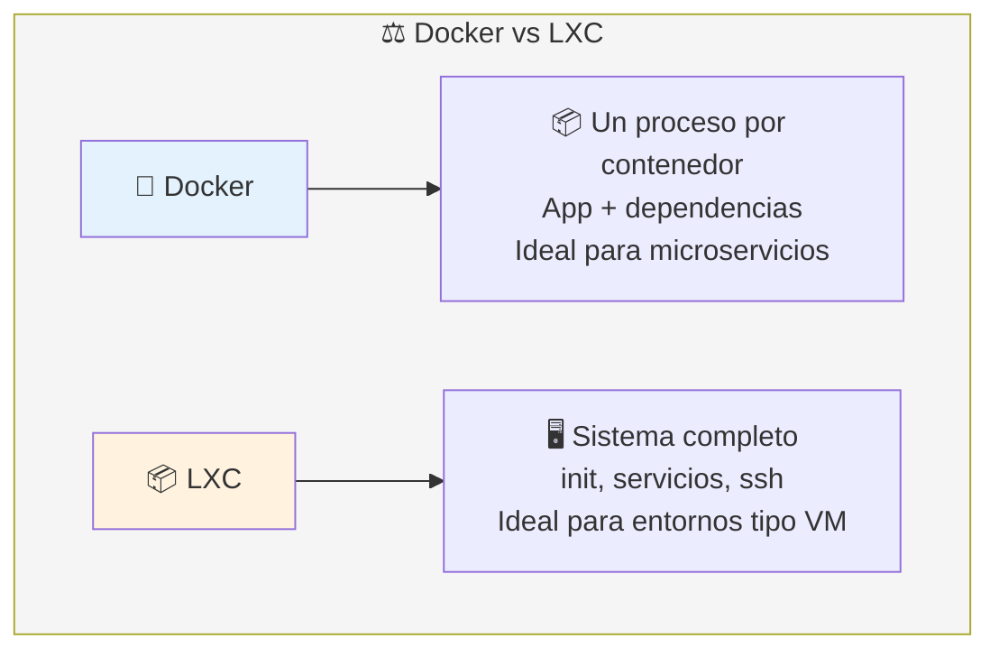

### LXC vs Docker

| Característica       | Docker                     | LXC                         |
| -------------------- | -------------------------- | --------------------------- |
| **Propósito**        | Una app por contenedor     | Un sistema completo         |
| **Inicio**           | Segundos                   | Segundos (como Docker)      |
| **Init system**      | No (solo el proceso)       | Sí (systemd, OpenRC)        |
| **Caso típico**      | Microservicios, APIs       | Entornos de desarrollo, CI  |

---

# Orquestación de contenedores

La **orquestación** gestiona automáticamente el ciclo de vida de los contenedores: despliegue, escalado, redes, balanceo, actualizaciones y recuperación ante fallos.

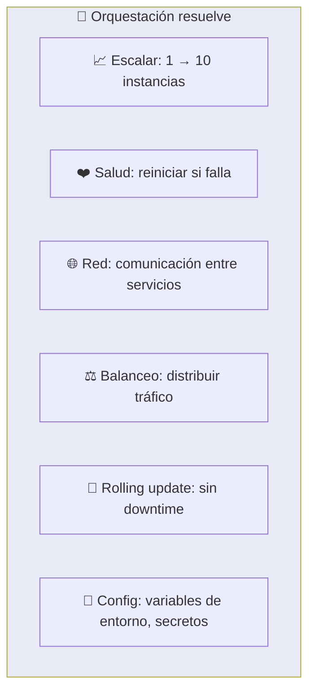

---

## Kubernetes

**Kubernetes (K8s)** es el orquestador de contenedores más usado. Automatiza el despliegue, escalado y operación de contenedores en clusters de servidores.

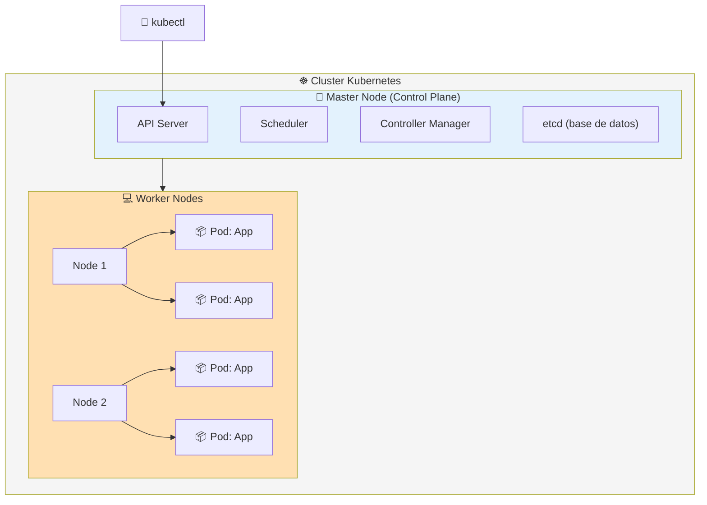

### Conceptos clave

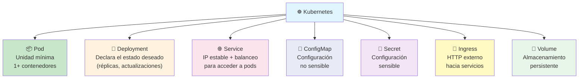

### Ejemplo: Deployment + Service

```yaml
# deployment.yml
apiVersion: apps/v1
kind: Deployment
metadata:
  name: miapp
spec:
  replicas: 3
  selector:
    matchLabels:
      app: miapp
  template:
    metadata:
      labels:
        app: miapp
    spec:
      containers:
        - name: app
          image: miapp:latest
          ports:
            - containerPort: 3000
---
# service.yml
apiVersion: v1
kind: Service
metadata:
  name: miapp-svc
spec:
  selector:
    app: miapp
  ports:
    - port: 80
      targetPort: 3000
  type: LoadBalancer
```

```bash
# Aplicar configuración
kubectl apply -f deployment.yml
kubectl apply -f service.yml

# Ver estado
kubectl get pods
kubectl get deployments
kubectl get services

# Escalar
kubectl scale deployment miapp --replicas=5

# Rolling update (cambiar imagen)
kubectl set image deployment/miapp app=miapp:v2

# Logs
kubectl logs -l app=miapp
```

### Auto-escalado

```yaml
# Horizontal Pod Autoscaler: escala según CPU
apiVersion: autoscaling/v2
kind: HorizontalPodAutoscaler
metadata:
  name: miapp-hpa
spec:
  scaleTargetRef:
    apiVersion: apps/v1
    kind: Deployment
    name: miapp
  minReplicas: 2
  maxReplicas: 10
  metrics:
    - type: Resource
      resource:
        name: cpu
        target:
          type: Utilization
          averageUtilization: 70
```

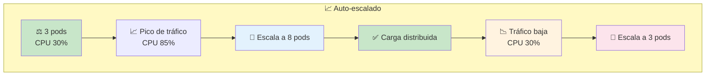

---

## Docker vs Kubernetes

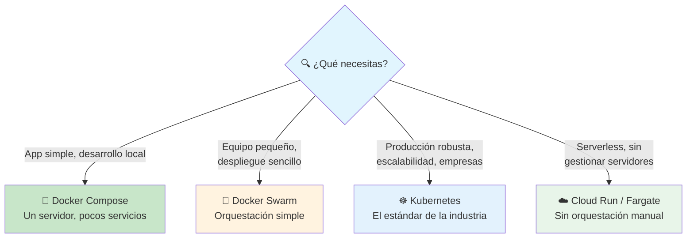

### Tabla comparativa

| Característica       | Docker Compose       | Docker Swarm       | Kubernetes             |
| -------------------- | -------------------- | ------------------ | ---------------------- |
| **Complejidad**      | Baja                | Media              | Alta                   |
| **Instalación**      | Incluida en Docker  | Incluida en Docker | Requiere setup         |
| **Escalabilidad**    | Un servidor         | Multi-servidor     | Multi-servidor masivo  |
| **Auto-recuperación**| ❌                  | ✅                 | ✅                     |
| **Rolling update**   | ❌                  | ✅                 | ✅                     |
| **Ecosistema**       | Pequeño             | Limitado           | Gigante (CNCF)         |
| **¿Para quién?**     | Dev local           | Equipos pequeños   | Producción profesional |

---

## Resumen visual

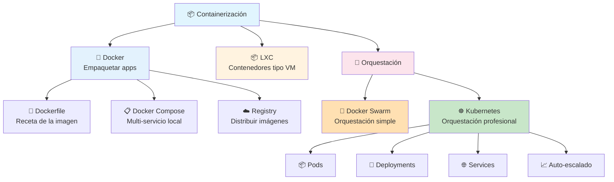

---

> **Siguiente paso:** Crea un Dockerfile para tu proyecto backend. Luego añade un `docker-compose.yml` con tu app + PostgreSQL. Finalmente, si te sientes ambicioso, despliega en Kubernetes con Minikube local.

## Relacionados:
- [[testing]] #anterior 
- [[broker-de-mensajes]] #siguiente 