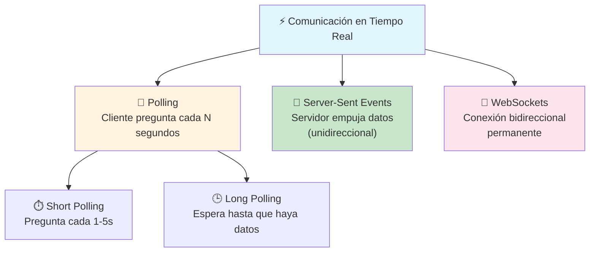
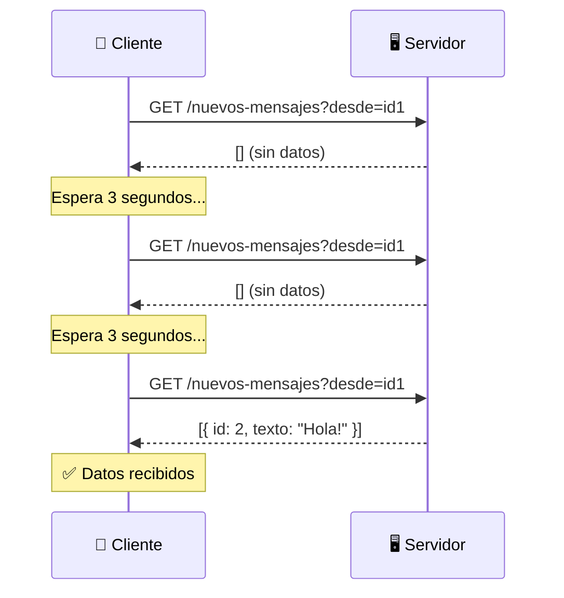
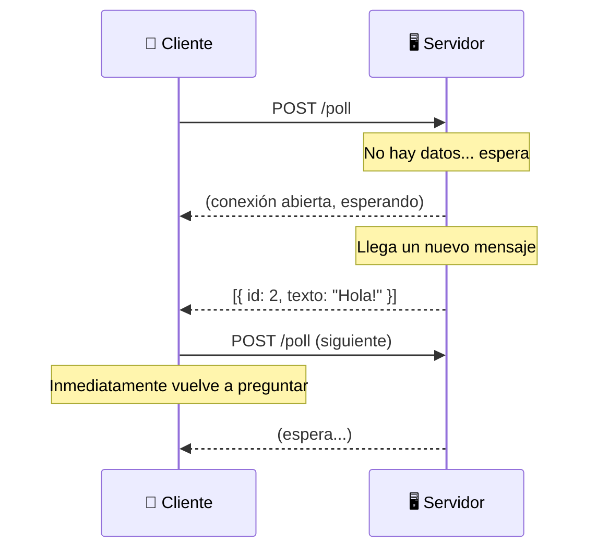
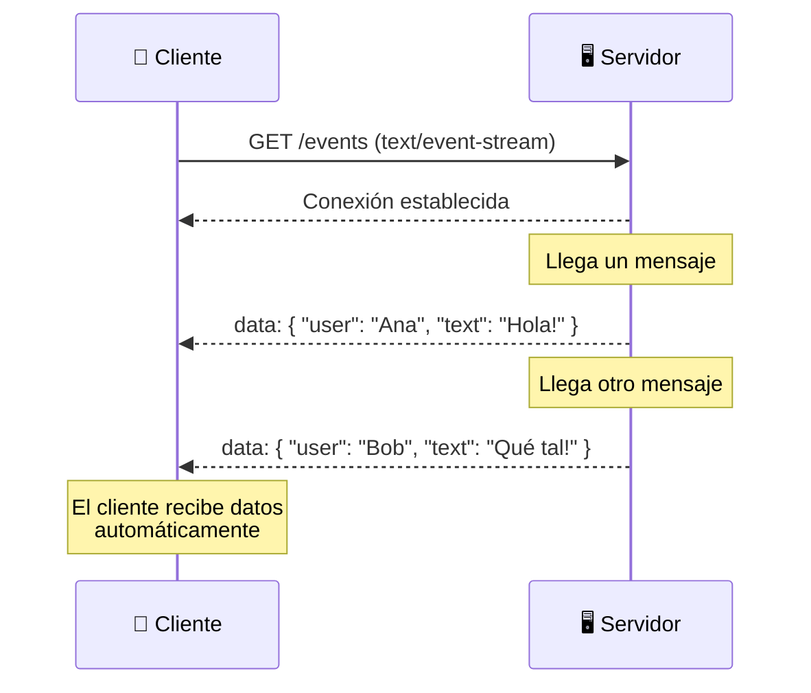
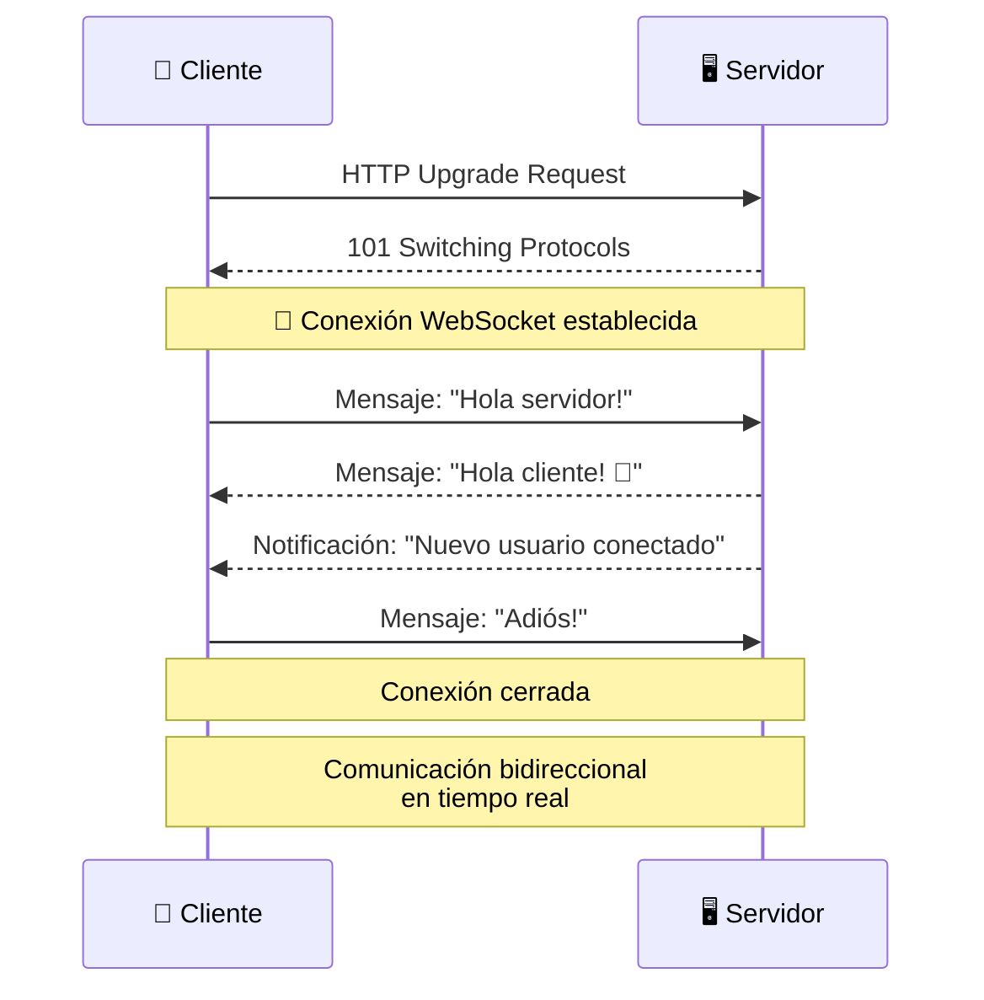
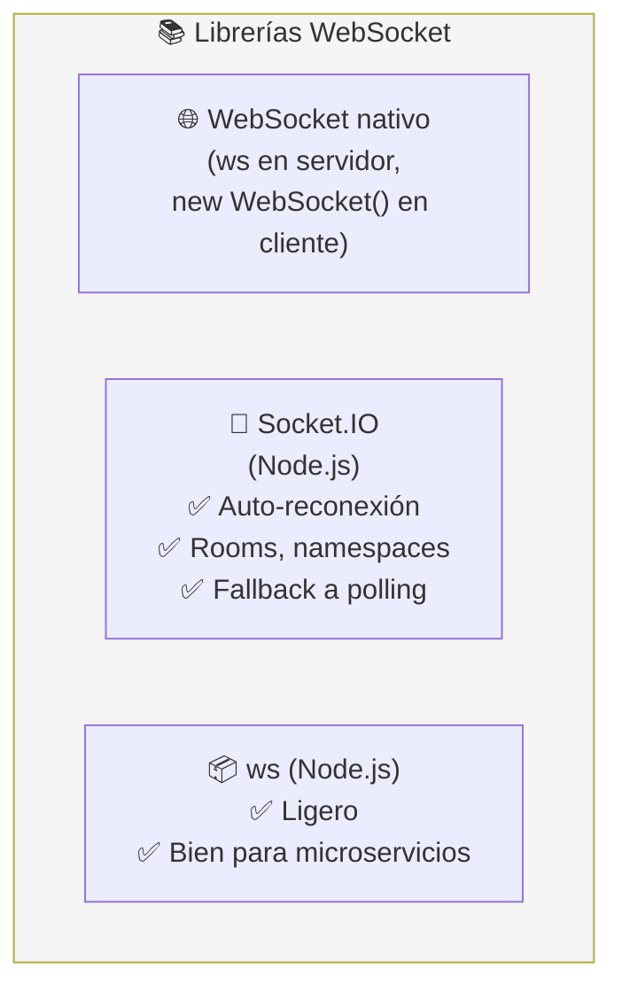
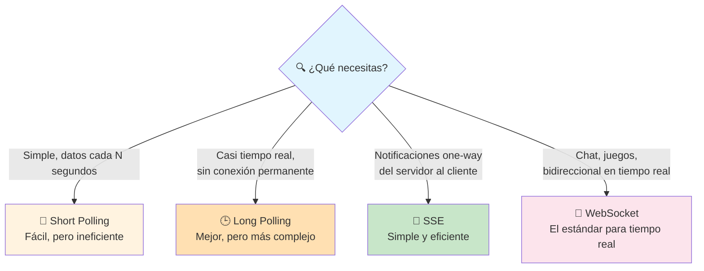
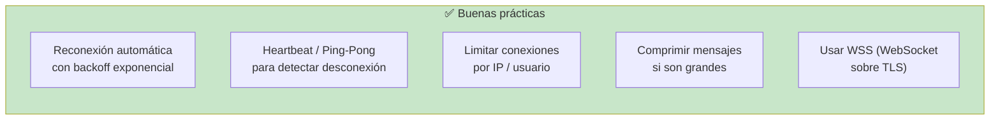
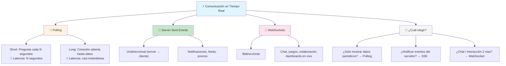

# Data en tiempo real

Las aplicaciones modernas necesitan **comunicación en tiempo real**: chats, notificaciones, dashboards en vivo, juegos multijugador. Existen varias técnicas para lograr que el servidor envíe datos al cliente **sin que el cliente los pida explícitamente**.



---

## Polling (Short y Long Polling)

El **polling** es la técnica más simple: el cliente pregunta al servidor repetidamente si hay datos nuevos.

### Short Polling

El cliente hace peticiones **cada N segundos** independientemente de si hay datos nuevos.



```javascript
// Short Polling en el cliente
async function checkMessages() {
    const res = await fetch('/api/messages?since=lastId');
    const messages = await res.json();

    if (messages.length > 0) {
        showMessages(messages);
    }
}

// Preguntar cada 3 segundos
setInterval(checkMessages, 3000);
```

| Ventajas                         | Desventajas                          |
| -------------------------------- | ------------------------------------ |
| ✅ Simple de implementar          | ❌ Muchas peticiones innecesarias    |
| ✅ Funciona en cualquier servidor | ❌ Latencia de hasta N segundos       |
| ✅ Sin conexiones persistentes    | ❌ Alto consumo de ancho de banda    |

### Long Polling

El cliente hace una petición y el servidor **mantiene la conexión abierta** hasta que haya datos (o hasta un timeout).



```javascript
// Long Polling
async function longPoll() {
    try {
        const res = await fetch('/api/poll');
        const data = await res.json();
        processData(data);
    } catch (err) {
        // timeout o error, reconectar
        console.log('Reconectando...');
    } finally {
        longPoll(); // inmediatamente vuelve a preguntar
    }
}

longPoll();
```

| Ventajas                       | Desventajas                         |
| ------------------------------ | ----------------------------------- |
| ✅ Latencia menor que short polling | ❌ Mantiene conexiones abiertas   |
| ✅ Más eficiente que short polling | ❌ Timeout y reconexión compleja |
| ✅ Mensajería casi instantánea  | ❌ No escala tan bien como WebSocket |

---

## Server-Sent Events (SSE)

**SSE** permite que el servidor **empuje datos al cliente** a través de una conexión HTTP larga. Es **unidireccional** (servidor → cliente). Más simple que WebSocket pero sin comunicación bidireccional.



### Implementación

```javascript
// Servidor (Node.js + Express)
app.get('/events', (req, res) => {
    res.writeHead(200, {
        'Content-Type': 'text/event-stream',
        'Cache-Control': 'no-cache',
        'Connection': 'keep-alive'
    });

    // Enviar evento cada vez que hay datos
    const interval = setInterval(() => {
        const data = { time: new Date().toISOString() };
        res.write(`data: ${JSON.stringify(data)}\n\n`);
    }, 1000);

    req.on('close', () => clearInterval(interval));
});
```

```javascript
// Cliente (navegador)
const eventSource = new EventSource('/events');

eventSource.onmessage = (event) => {
    const data = JSON.parse(event.data);
    console.log('Nuevo dato:', data);
};

eventSource.onerror = () => {
    console.log('Error de conexión, reconectando...');
    // SSE reconecta automáticamente
};
```

| Ventajas                       | Desventajas                          |
| ------------------------------ | ------------------------------------ |
| ✅ API nativa del navegador (EventSource) | ❌ Solo unidireccional (server → cliente) |
| ✅ Reconexión automática        | ❌ Límite de conexiones por navegador |
| ✅ Simple, sobre HTTP           | ❌ No funciona si el cliente necesita enviar datos |
| ✅ Ideal para notificaciones, feeds | ❌ No soportado en HTTP/1.1 con muchos clientes |

---

## WebSockets

**WebSockets** proporcionan una **conexión bidireccional y permanente** entre cliente y servidor. Ambos pueden enviar mensajes en cualquier momento.



### Implementación

```javascript
// Servidor (Node.js + ws)
const WebSocket = require('ws');
const wss = new WebSocket.Server({ port: 8080 });

wss.on('connection', (ws) => {
    console.log('Cliente conectado');

    // Recibir mensajes del cliente
    ws.on('message', (data) => {
        console.log('Recibido:', data.toString());

        // Responder solo a ese cliente
        ws.send(`Servidor recibió: ${data}`);

        // O broadcast a todos los clientes
        wss.clients.forEach(client => {
            if (client.readyState === WebSocket.OPEN) {
                client.send(`Broadcast: ${data}`);
            }
        });
    });

    // Enviar mensaje al conectarse
    ws.send('Bienvenido al servidor WebSocket!');
});
```

```javascript
// Cliente (navegador)
const ws = new WebSocket('ws://localhost:8080');

ws.onopen = () => {
    console.log('Conectado!');
    ws.send('Hola servidor!');
};

ws.onmessage = (event) => {
    console.log('Mensaje del servidor:', event.data);
};

ws.onclose = () => {
    console.log('Desconectado');
};

ws.onerror = (err) => {
    console.error('Error:', err);
};
```

### WebSocket en el navegador vs Socket.IO



### Socket.IO (ejemplo rápido)

```javascript
// Servidor
const io = require('socket.io')(3000);

io.on('connection', (socket) => {
    socket.on('mensaje', (data) => {
        io.emit('mensaje', data); // broadcast
    });

    socket.join('sala-1'); // unirse a sala
    io.to('sala-1').emit('evento', { data: 'solo sala 1' });
});

// Cliente
const socket = io('http://localhost:3000');
socket.emit('mensaje', { texto: 'Hola!' });
socket.on('mensaje', (data) => console.log(data));
```

---

## Comparativa



### Tabla comparativa

| Característica         | Short Polling | Long Polling  | SSE            | WebSocket      |
| ---------------------- | ------------- | ------------- | -------------- | -------------- |
| **Dirección**          | Cliente → Servidor | Cliente → Servidor | Servidor → Cliente | Bidireccional |
| **Latencia**           | Segundos       | ~Instantáneo  | Instantáneo    | Instantáneo    |
| **Conexión persistente**| ❌            | ✅ (parcial)  | ✅             | ✅             |
| **Complejidad**        | Muy baja       | Media         | Baja           | Media-Alta     |
| **Navegador nativo**   | ✅ fetch       | ✅ fetch      | ✅ EventSource | ✅ WebSocket API |
| **Reconexión auto**    | ❌             | ❌            | ✅             | ❌ (Socket.IO sí) |
| **Escalabilidad**      | Alta           | Media         | Media          | Media (más conexiones) |
| **Ideal para**         | Datos que cambian lento | Notificaciones casi reales | Feeds, precios, logs | Chat, juegos, colaboración |

---

## Buenas prácticas



### Backoff exponencial para reconexión

```javascript
function connectWebSocket(retries = 0) {
    const ws = new WebSocket('ws://localhost:8080');

    ws.onclose = () => {
        const delay = Math.min(1000 * Math.pow(2, retries), 30000);
        console.log(`Reconectando en ${delay}ms...`);
        setTimeout(() => connectWebSocket(retries + 1), delay);
    };

    ws.onopen = () => {
        console.log('Conectado!');
        retries = 0; // resetear al reconectar
    };
}
```

---

## Resumen visual



> **Siguiente paso:** Implementa SSE para notificaciones en vivo o WebSockets para un chat simple. Prueba Socket.IO si tu app Node.js necesita reconexión automática y rooms.

## Relacionados:
- [[patrones-arquitectonicos]] #anterior 
- [[escalando-bases-de-datos]] #siguiente