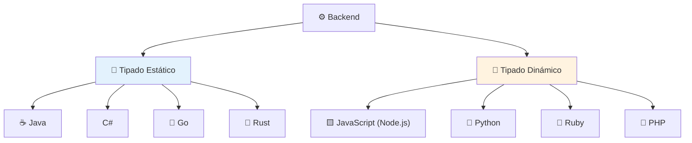
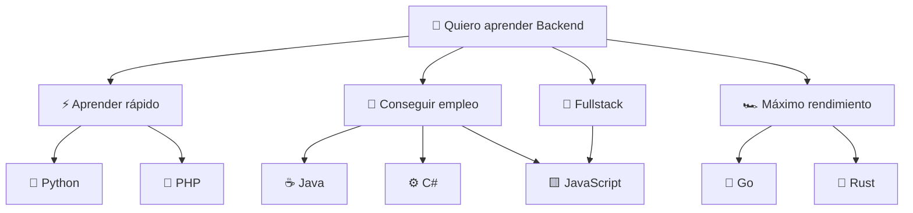
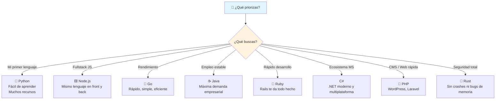

# Elige un lenguaje de Backend

Elegir tu primer lenguaje backend es como elegir una herramienta de trabajo: todas construyen, pero cada una tiene su filosofía, sus puntos fuertes y su ecosistema. Aquí tienes los principales candidatos.



---

## JavaScript (Node.js)

JavaScript nació en el navegador, pero con **Node.js** saltó al servidor y revolucionó el backend. Usa un modelo **asíncrono y orientado a eventos** que lo hace liviano y eficiente para aplicaciones en tiempo real.

- **Ejecución:** Single-thread con event loop (no bloqueante)
- **Tipado:** Dinámico y débil
- **Curva:** Media — si vienes del frontend, te sentirás en casa
- **Ecosistema:** npm (el registro de paquetes más grande del mundo)
- **Frameworks populares:** Express, Fastify, NestJS, Koa
- **Ideal para:** APIs REST, tiempo real (WebSockets), microservicios, aplicaciones full-stack JS

```javascript
const http = require('http');

const server = http.createServer((req, res) => {
    res.writeHead(200, { 'Content-Type': 'text/plain' });
    res.end('Hola desde Node.js!');
});

server.listen(3000);
```

> **¿Para quién?** Si ya sabes frontend con JS y quieres unificar tu stack en un solo lenguaje.

---

## Python

Python es famoso por su **legibilidad y sintaxis limpia**. Es el lenguaje favorito para startups, ciencia de datos, machine learning y automatización. En backend destaca por su rapidez de desarrollo.

- **Ejecución:** Interpretado, con GIL (Global Interpreter Lock)
- **Tipado:** Dinámico y fuerte (con soporte opcional de type hints)
- **Curva:** Baja — ideal para principiantes, se lee como inglés
- **Ecosistema:** PyPI, maduro y extenso
- **Frameworks populares:** Django, FastAPI, Flask
- **Ideal para:** APIs, prototipado rápido, aplicaciones con ML/IA, automatización

```python
from http.server import HTTPServer, BaseHTTPRequestHandler

class Handler(BaseHTTPRequestHandler):
    def do_GET(self):
        self.send_response(200)
        self.end_headers()
        self.wfile.write(b'Hola desde Python!')

HTTPServer(('localhost', 3000), Handler).serve_forever()
```

> **¿Para quién?** Si valoras la claridad del código, la productividad y te interesa la ciencia de datos.

---

## Go

Go (o Golang) fue creado por Google para resolver problemas de **escala, concurrencia y rendimiento** en sistemas de producción. Su filosofía es la simplicidad: pocas features, máximo provecho.

- **Ejecución:** Compilado a binario nativo (rápido como C)
- **Tipado:** Estático y fuerte con inferencia
- **Curva:** Media — sintaxis pequeña, fácil de aprender pero potente
- **Ecosistema:** stdlib muy completa (no necesita frameworks pesados)
- **Frameworks populares:** Gin, Echo, Fiber, Chi
- **Ideal para:** Microservicios, APIs de alto rendimiento, CLI tools, infraestructura

```go
package main

import (
    "fmt"
    "net/http"
)

func handler(w http.ResponseWriter, r *http.Request) {
    fmt.Fprintf(w, "Hola desde Go!")
}

func main() {
    http.HandleFunc("/", handler)
    http.ListenAndServe(":3000", nil)
}
```

> **¿Para quién?** Si buscas rendimiento nativo, despliegues sencillos (un solo binario) y concurrencia nativa con goroutines.

---

## Ruby

Ruby fue diseñado para la **felicidad del desarrollador**. Su sintaxis es elegante y expresiva. Debe su fama backend a Ruby on Rails, el framework que popularizó las convenciones sobre configuración.

- **Ejecución:** Interpretado (MRI, YJIT)
- **Tipado:** Dinámico y fuerte
- **Curva:** Baja — muy legible, casi como lenguaje natural
- **Ecosistema:** RubyGems + Ruby on Rails
- **Frameworks populares:** Ruby on Rails, Sinatra
- **Ideal para:** Aplicaciones web completas (Rails), prototipado, startups

```ruby
require 'sinatra'

get '/' do
  'Hola desde Ruby!'
end
```

> **¿Para quién?** Si quieres un framework todo-en-uno (Rails) que te dé estructura sin perder velocidad de desarrollo.

---

## Java

Java es el **veterano empresarial** por excelencia. Usado en bancos, gobierno y grandes corporaciones. Su fortaleza es la madurez, la estabilidad y un ecosistema de herramientas enorme.

- **Ejecución:** Compilado a bytecode → JVM (máquina virtual)
- **Tipado:** Estático y fuerte
- **Curva:** Alta — verboso al inicio, pero muy explícito
- **Ecosistema:** Maven/Gradle, Spring, Jakarta EE
- **Frameworks populares:** Spring Boot, Quarkus, Micronaut
- **Ideal para:** Sistemas empresariales, microservicios, aplicaciones críticas, big data

```java
// Java requiere más estructura
import com.sun.net.httpserver.*;

class Handler implements HttpHandler {
    public void handle(HttpExchange t) {
        String response = "Hola desde Java!";
        t.sendResponseHeaders(200, response.length());
        t.getResponseBody().write(response.getBytes());
        t.close();
    }
}
```

> **¿Para quién?** Si buscas estabilidad, ofertas laborales en empresas grandes y un lenguaje probado por décadas.

---

## C#

C# es la apuesta de Microsoft para el desarrollo profesional. Con **.NET** es multiplataforma, moderno y muy performante. Es el principal lenguaje del ecosistema Microsoft.

- **Ejecución:** Compilado a IL → CLR (Common Language Runtime)
- **Tipado:** Estático y fuerte (con tipado dinámico opcional)
- **Curva:** Media-Alta — similar a Java pero con más azúcar sintáctico
- **Ecosistema:** NuGet, .NET, Azure
- **Frameworks populares:** ASP.NET Core, Blazor
- **Ideal para:** Aplicaciones empresariales, juegos (Unity), APIs de alto rendimiento

```csharp
using Microsoft.AspNetCore.Builder;

var builder = WebApplication.CreateBuilder(args);
var app = builder.Build();

app.MapGet("/", () => "Hola desde C#!");
app.Run();
```

> **¿Para quién?** Si estás en el ecosistema Microsoft, te gusta la productividad de .NET o te interesa desarrollo de videojuegos con Unity.

---

## PHP

PHP impulsa aproximadamente **el 75% de la web** (incluyendo WordPress, Facebook nació en PHP). Es un lenguaje diseñado específicamente para la web, con un ciclo de vida petición → script → respuesta.

- **Ejecución:** Interpretado, con JIT desde PHP 8
- **Tipado:** Dinámico (con tipado fuerte opcional desde PHP 7+)
- **Curva:** Baja — fácil de empezar, solo necesitas un servidor web
- **Ecosistema:** Composer, Laravel, WordPress
- **Frameworks populares:** Laravel, Symfony, CodeIgniter
- **Ideal para:** Sitios web CMS (WordPress), aplicaciones web tradicionales, prototipado

```php
<?php
echo "Hola desde PHP!";
```

> **¿Para quién?** Si quieres construir sitios web rápidamente, trabajar con CMS, o tienes clientes con hosting compartido.

---

## Rust

Rust es el lenguaje de sistemas que promete **rendimiento de C con seguridad de memoria** garantizada en tiempo de compilación. Está ganando terreno en backend gracias a su velocidad y confiabilidad.

- **Ejecución:** Compilado a binario nativo (tan rápido como C/C++)
- **Tipado:** Estático y fuerte con inferencia
- **Curva:** Muy alta — el borrow checker exige cambiar la forma de pensar
- **Ecosistema:** Cargo (construcción, testing, documentación), creciente
- **Frameworks populares:** Actix-web, Axum, Rocket, Warp
- **Ideal para:** APIs de alto rendimiento, sistemas críticos, herramientas CLI, WebAssembly

```rust
use actix_web::{get, App, HttpResponse, HttpServer};

#[get("/")]
async fn index() -> HttpResponse {
    HttpResponse::Ok().body("Hola desde Rust!")
}

#[actix_web::main]
async fn main() {
    HttpServer::new(|| App::new().service(index))
        .bind("127.0.0.1:3000")
        .unwrap()
        .run()
        .await;
}
```

> **¿Para quién?** Si necesitas el máximo rendimiento con garantías de seguridad, o te interesa la programación de sistemas.

---

## Comparativa rápida



### Tabla resumen

| Lenguaje   | Tipado   | Curva      | ¿Para qué brilla?                        |
| ---------- | -------- | ---------- | ---------------------------------------- |
| **JS**     | Dinámico | Media      | Fullstack, tiempo real, microservicios   |
| **Python** | Dinámico | Baja       | APIs, prototipado, ML/IA, automatización |
| **Go**     | Estático | Media      | APIs rápidas, microservicios, CLI        |
| **Ruby**   | Dinámico | Baja       | Web apps completas, startups             |
| **Java**   | Estático | Alta       | Empresas, sistemas críticos, big data    |
| **C#**     | Estático | Media-Alta | .NET ecosystem, juegos, APIs             |
| **PHP**    | Dinámico | Baja       | CMS, hosting compartido, web tradicional |
| **Rust**   | Estático | Muy alta   | Rendimiento extremo, sistemas seguros    |

---

## ¿Cuál elegir?



> **No hay una respuesta incorrecta.** Todos estos lenguajes son poderosos. Elige el que mejor se alinee con tus objetivos, el tipo de proyectos que quieres construir y el mercado laboral al que apuntas. Lo importante es **empezar**.

## Relacionados:
- [[bases-del-frontend]] #anterior
- [[proyectos-backend-para-principiantes]] #siguiente 