# Escalando Bases de Datos

A medida que tu aplicación crece, la base de datos se convierte en el **cuello de botella** más común. Escalar una BD no es trivial: requiere estrategias de índices, replicación, particionamiento y entender las limitaciones teóricas (Teorema CAP).

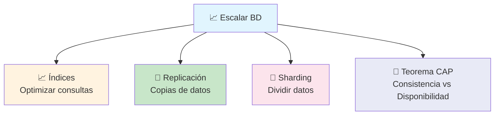

---

## Bases de datos indexadas

Un **índice** es una estructura de datos (B-tree, Hash) que acelera las búsquedas en una tabla a cambio de espacio en disco y velocidad de escritura.

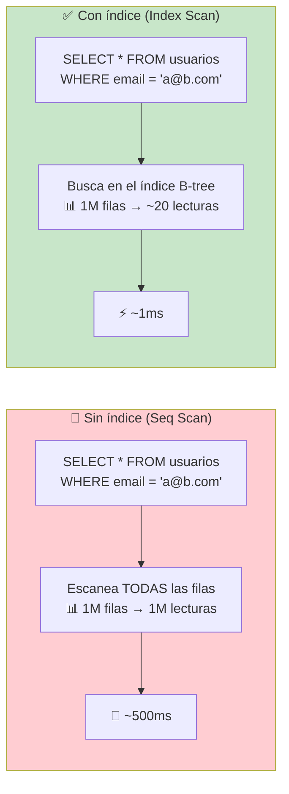

### Cuándo crear índices

```sql
-- ✅ Crear índice en columnas de filtro (WHERE)
CREATE INDEX idx_usuarios_email ON usuarios(email);

-- ✅ Índice compuesto para múltiples columnas
CREATE INDEX idx_pedidos_usuario_fecha
    ON pedidos(usuario_id, created_at);

-- ✅ Índice parcial (solo filas activas)
CREATE INDEX idx_pedidos_activos
    ON pedidos(usuario_id)
    WHERE estado = 'pendiente';

-- 📊 Ver índices existentes
-- PostgreSQL
SELECT * FROM pg_indexes WHERE tablename = 'usuarios';
```

### Cuándo NO crear índices

- Columnas con **pocos valores distintos** (booleanos, género)
- Tablas **pequeñas** (< 1000 filas)
- Columnas que se **actualizan frecuentemente**
- Tablas con **altas escrituras y bajas lecturas**

### Tipos de índices

| Tipo       | Uso principal                     | Velocidad           |
| ---------- | --------------------------------- | ------------------- |
| **B-tree** | Por defecto, búsquedas exactas y rango | ✅ Balanceado   |
| **Hash**   | Búsquedas de igualdad exacta      | ⚡ Muy rápido       |
| **GIN**    | Arrays, JSONB, full-text          | 🔍 Búsqueda textual |
| **GiST**   | Datos geométricos, búsqueda por rango | 🗺️ Geoespacial |

> **Regla:** Los índices aceleran lecturas (SELECT) pero ralentizan escrituras (INSERT/UPDATE/DELETE). No indexes todo.

---

## Replicación de datos

La **replicación** mantiene copias de los datos en múltiples servidores. Sirve para **alta disponibilidad**, **balanceo de lecturas** y **recuperación ante desastres**.

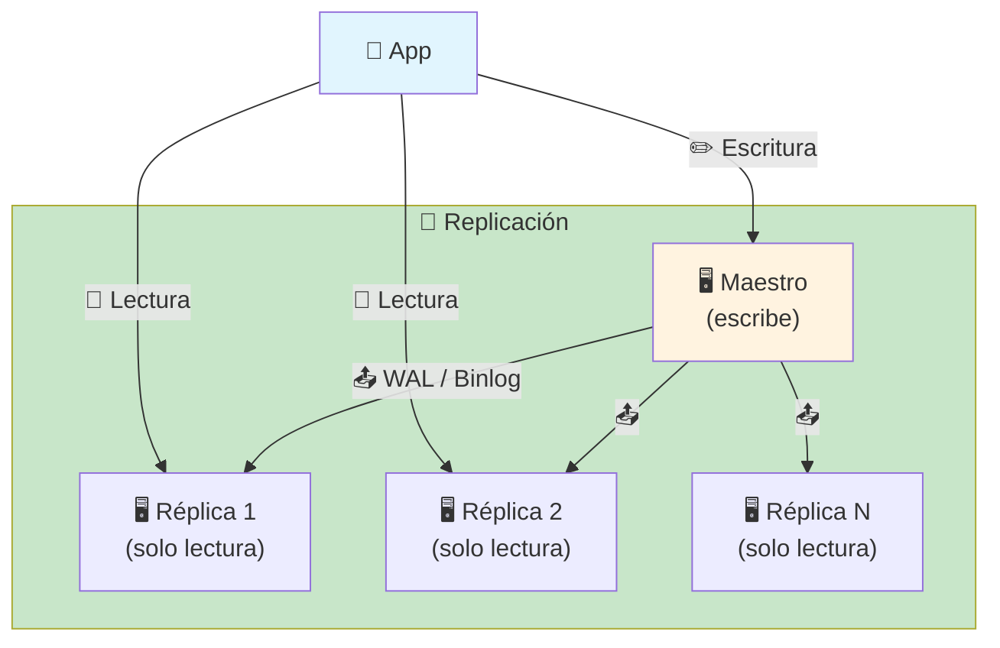

### Topologías de replicación

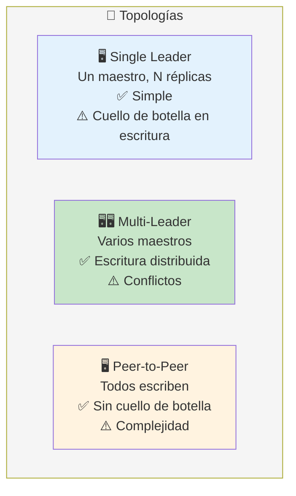

### Replicación síncrona vs asíncrona

| Tipo       | Confirmación                       | Riesgo                          |
| ---------- | ---------------------------------- | ------------------------------- |
| **Síncrona** | Escritura confirmada cuando todas las réplicas tienen el dato | Lento, pero cero pérdida |
| **Asíncrona** | Escritura confirmada al escribir en maestro | Rápido, pero posible pérdida si el maestro falla |

> **Caso típico:** 1 maestro para escrituras, N réplicas para lecturas. La app escribe en el maestro y lee de las réplicas (separa lecturas de escrituras).

---

## Estrategias de Sharding (Fragmentación)

El **sharding** (o fragmentación) **divide los datos horizontalmente** entre múltiples servidores. Cada servidor (shard) tiene un subconjunto de los datos.

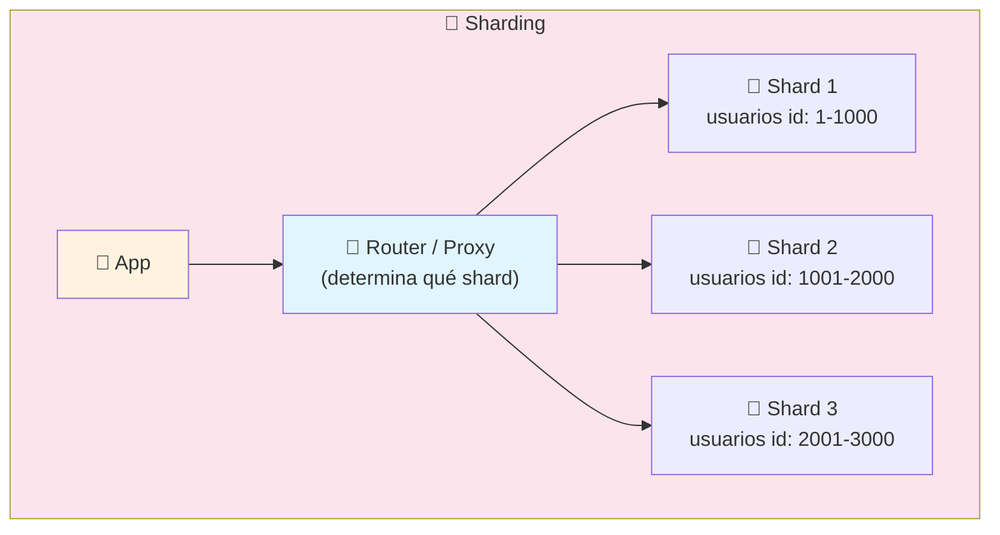

### Estrategias de sharding

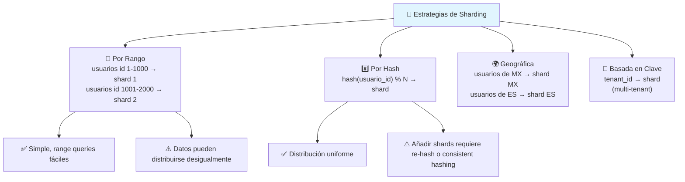

### Desafíos del sharding

| Desafío              | Explicación                                    |
| -------------------- | ---------------------------------------------- |
| **Consultas cross-shard** | JOINs entre shards son lentos o imposibles   |
| **Re-balanceo**      | Añadir/quitar shards requiere redistribuir datos |
| **Transacciones**    | ACID entre shards es muy complejo              |
| **Auto-increment**   | IDs únicos globales requieren estrategia (UUID, Snowflake) |
| **Backup/Restore**   | Más complejo que una sola BD                   |

### Consistent Hashing

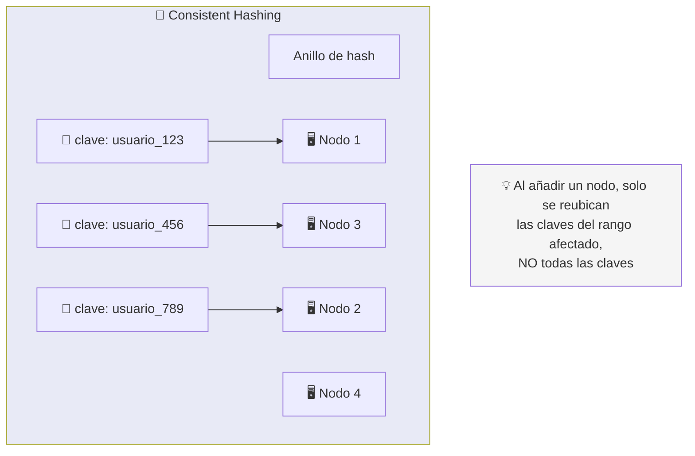

> **Consistent Hashing** es la técnica que usan sistemas como Cassandra, DynamoDB y Redis Cluster para distribuir datos minimizando la relocalización al añadir/quitar nodos.

---

## Teorema CAP

El **Teorema CAP** (Brewer) dice que un sistema distribuido solo puede garantizar **2 de 3** propiedades simultáneamente:

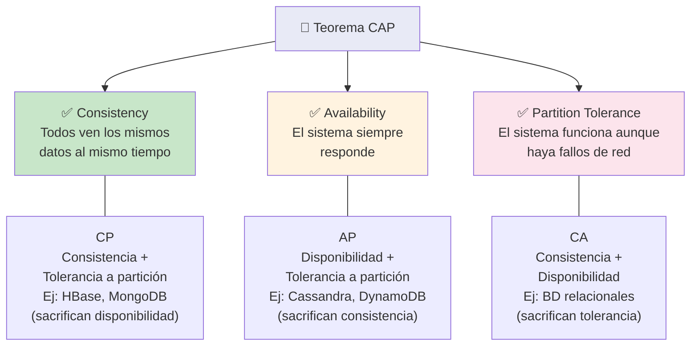

### Explicación práctica

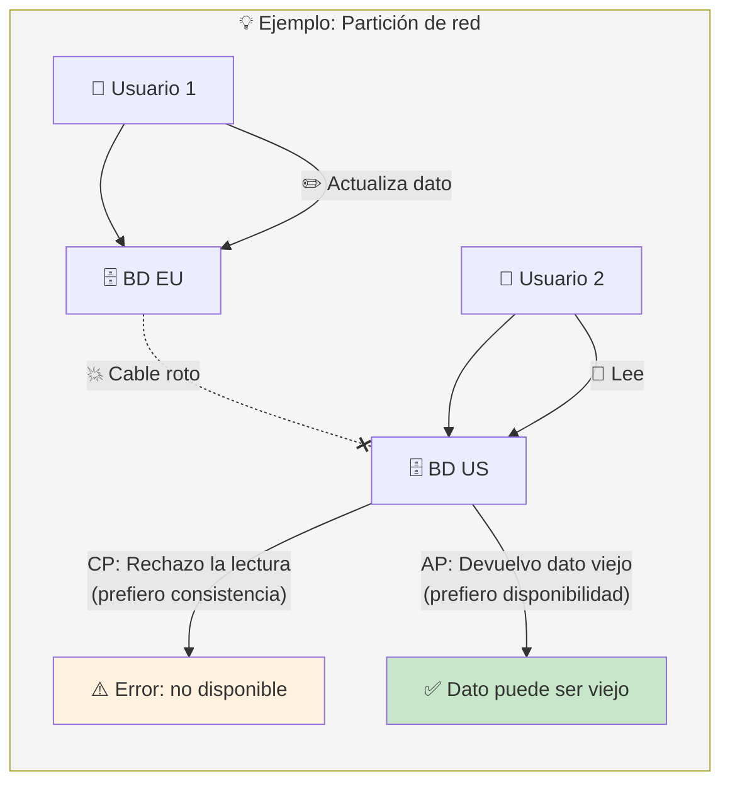

### BD y su elección CAP

| Base de Datos       | Prioriza | Explicación                         |
| ------------------- | -------- | ----------------------------------- |
| **PostgreSQL**      | CA       | Consistencia + Disponibilidad (sacrifica tolerancia a partición) |
| **MongoDB**         | CP       | Consistencia + Tolerancia (si el primario cae, se elige nuevo) |
| **Cassandra**       | AP       | Disponibilidad + Tolerancia (consistencia eventual) |
| **DynamoDB**        | AP       | Disponibilidad + Tolerancia         |
| **Redis**           | CP       | Consistencia + Tolerancia (cluster) |

> **No significa que las BD CA no puedan particionarse.** Significa que en presencia de una partición de red, eligen negar la operación antes que devolver datos inconsistentes.

---

## Estrategia de escalado: orden de aplicación

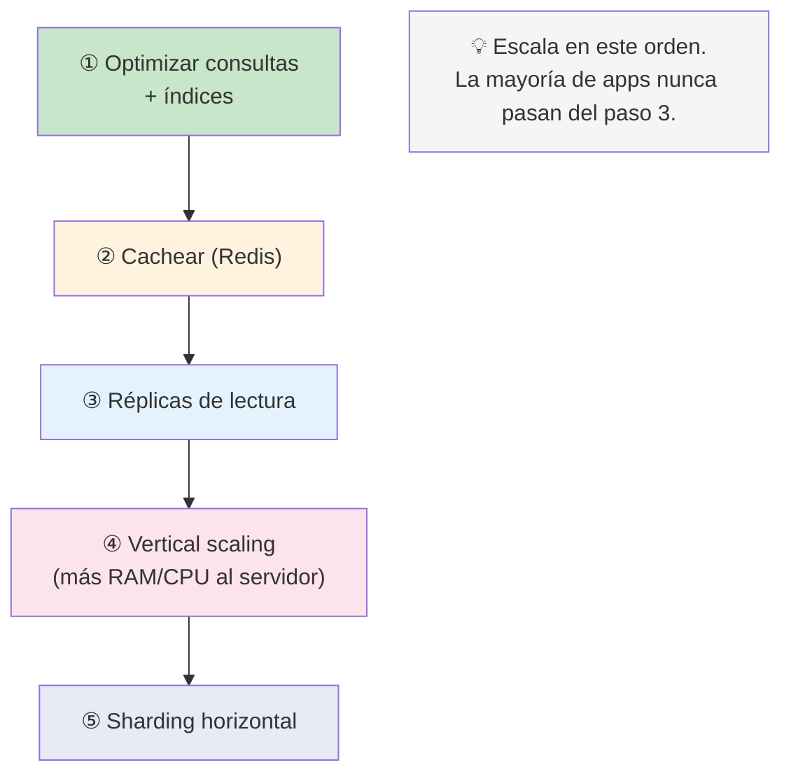

---

## Resumen visual

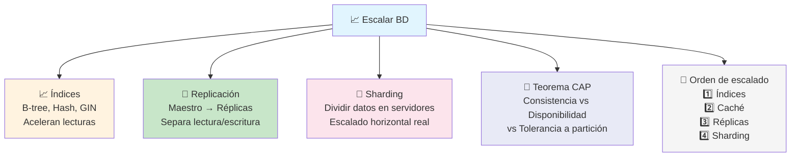

> **Siguiente paso:** Identifica la consulta más lenta de tu app con EXPLAIN ANALYZE, créale un índice, y mide la mejora. Luego considera añadir una réplica de solo lectura para separar tráfico.

## Relacionado:
- [[data-en-tiempo-real]] #anterior 
- [[bases-de-datos-no-sql]] #siguiente