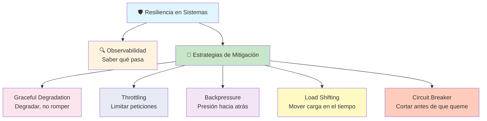
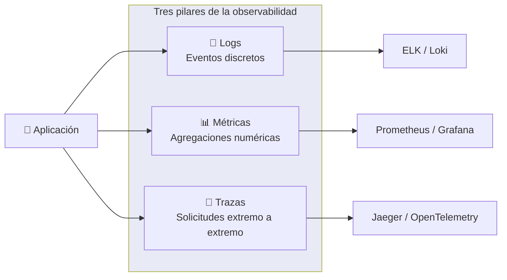
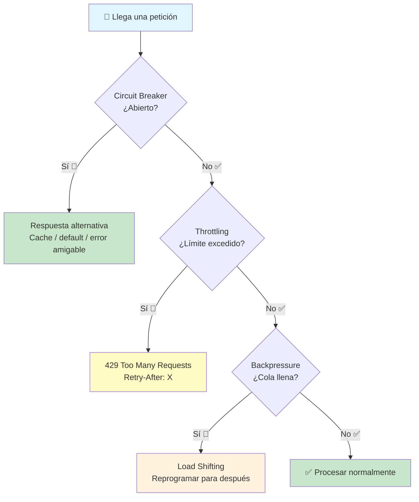
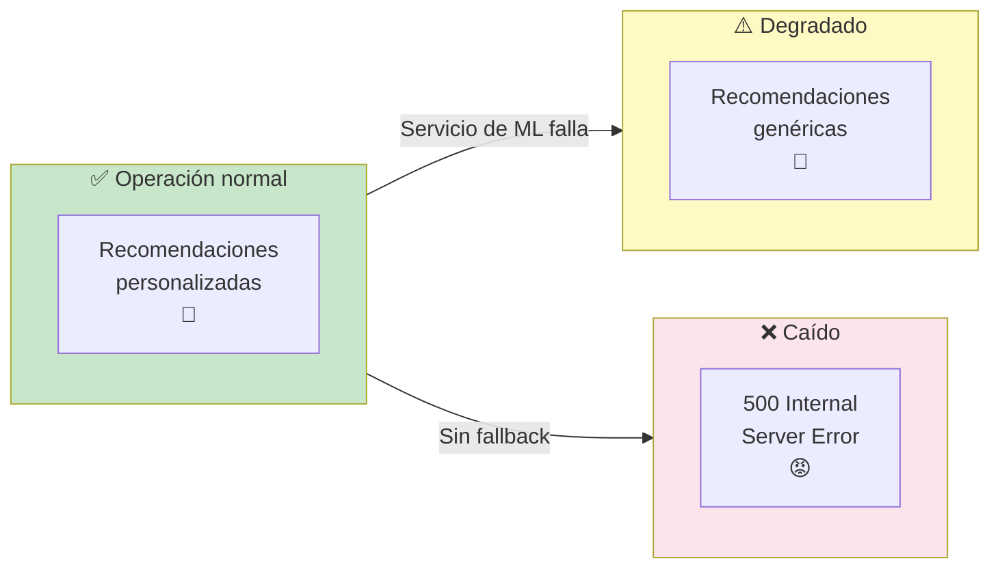
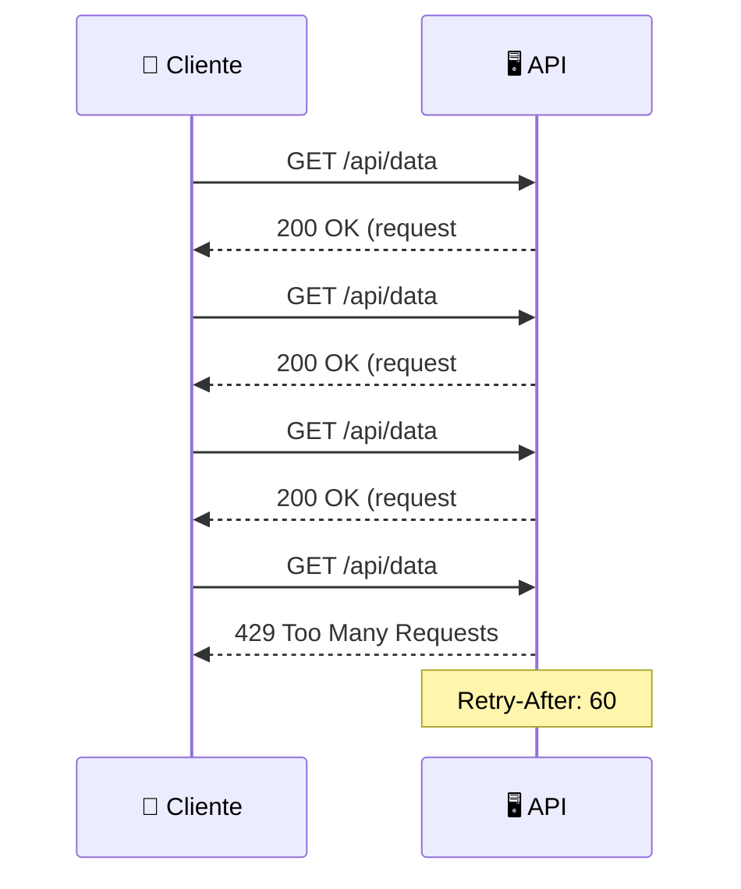
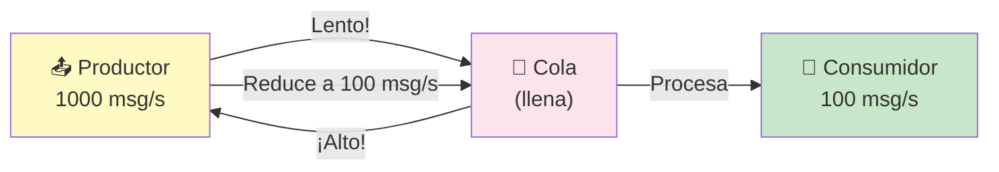
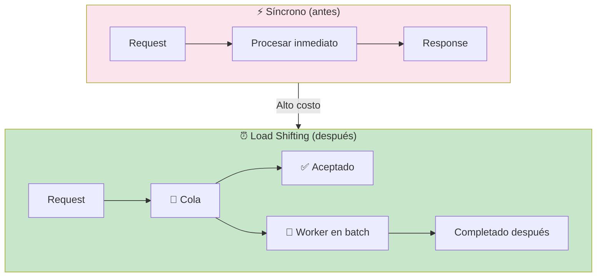
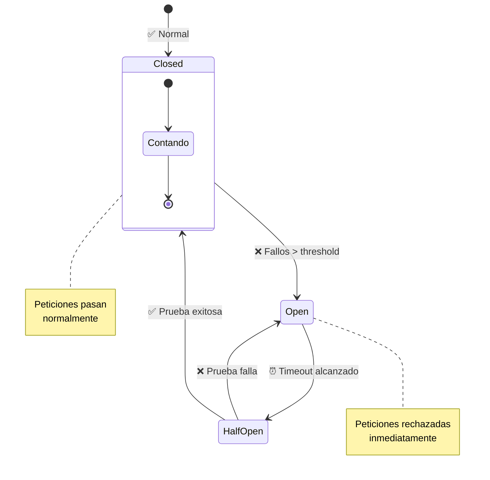
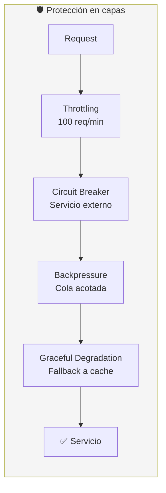

# Construyendo para escalar

Escalar no es solo agregar servidores. Es construir sistemas que **sigan funcionando cuando las cosas salen mal**. Aquí entran las estrategias de mitigación: patrones para que tu aplicación degrade de forma elegante, no catastrófica.



---

## 🔍 Observabilidad

No puedes mitigar lo que no ves. **Observabilidad** es la capacidad de entender el estado interno de un sistema desde afuera, usando sus outputs (logs, métricas, traces).



### 📝 Logs (eventos)

```javascript
// ✅ Bueno: estructurado, con contexto
logger.info({ userId: 123, action: 'purchase', amount: 50 }, 'Compra exitosa')

// ❌ Malo: texto plano sin contexto
logger.info('Usuario 123 hizo una compra de 50')
```

### 📊 Métricas (agregaciones)

```python
# Contadores, histogramas, gauges
from prometheus_client import Counter, Histogram

requests_total = Counter('http_requests_total', 'Total de requests')
request_duration = Histogram('http_request_duration_seconds', 'Duración')

# Uso
requests_total.inc()
with request_duration.time():
    procesar_request()
```

### 🔗 Trazas (trazabilidad)

```javascript
// OpenTelemetry: sigue una request entre servicios
const tracer = opentelemetry.trace.getTracer('mi-servicio')
const span = tracer.startSpan('procesar-pedido')
span.setAttribute('pedido.id', 'abc-123')
// ... llamar a BD, cola, etc.
span.end()
```

---

## 🧩 Estrategias de Mitigación



---

### Graceful Degradation

Cuando un componente falla, el sistema **debe seguir funcionando** — quizás más lento o con menos features, pero no caerse por completo.



```javascript
// Graceful Degradation: si el servicio de recomenaciones falla,
// devuelve recomendaciones genéricas en vez de error
async function getRecommendations(userId) {
    try {
        return await recommendationsAPI.getPersonalized(userId)
    } catch (err) {
        logger.warn({ userId, err }, 'Fallo recomendaciones, usando defaults')
        return getDefaultRecommendations() // 🪄 degradación elegante
    }
}
```

**Ejemplo real:** Netflix — si el motor de recomendaciones falla, muestran los títulos más populares. No una página de error.

---

### Throttling (Límite de tasa)

Controla **cuántas requests** puede hacer un cliente en un período de tiempo.



```javascript
// Express + express-rate-limit
const rateLimit = require('express-rate-limit')

const limiter = rateLimit({
    windowMs: 15 * 60 * 1000, // 15 minutos
    max: 100,                  // 100 requests por ventana
    standardHeaders: true,
    message: { error: 'Demasiadas peticiones. Intenta más tarde.' }
})

app.use('/api/', limiter)
```

```python
# Flask + flask-limiter
from flask_limiter import Limiter

limiter = Limiter(app, key_func=lambda: request.remote_addr)

@app.route('/api/data')
@limiter.limit("100/hour")
def get_data():
    return jsonify(data)
```

**Estrategias de throttling:**

| Estrategia | Descripción | Cuándo usarla |
|---|---|---|
| **Token Bucket** | Se agregan tokens a tasa fija; cada request consume uno | APIs públicas, spikes aceptables |
| **Leaky Bucket** | Cola FIFO que procesa a tasa fija; el exceso se rechaza | Procesamiento por lotes |
| **Fixed Window** | Contador que se resetea cada ventana de tiempo | Simple, popular |
| **Sliding Window** | Ventana deslizante más precisa que fixed | Cuando la precisión importa |
| **Concurrency Limit** | Límite de requests simultáneas | Proteger recursos compartidos |

---

### Backpressure

Cuando un componente recibe datos más rápido de lo que puede procesar, **presiona hacia atrás** al emisor para que reduzca la velocidad.



```javascript
// Backpressure con streams en Node.js
const readable = getReadableStream()
const writable = getWritableStream()

readable.pipe(writable) // Node.js maneja backpressure automáticamente

// O manualmente
readable.on('data', (chunk) => {
    const canContinue = writable.write(chunk)
    if (!canContinue) {
        readable.pause() // ⏸️ dejar de leer
        writable.once('drain', () => readable.resume()) // ▶️ reanudar
    }
})
```

```python
# Backpressure con asyncio + colas
import asyncio

async def producer(queue):
    for i in range(1000):
        await queue.put(f"item-{i}")  # Espera si la cola está llena
        await asyncio.sleep(0.01)

async def consumer(queue):
    while True:
        item = await queue.get()  # Espera si la cola está vacía
        await process(item)

async def main():
    queue = asyncio.Queue(maxsize=10)  # 🪄 backpressure natural
    await asyncio.gather(producer(queue), consumer(queue))
```

**Señales de backpressure:**
- Colas de mensajería crecen sin control
- Latencia de p95 aumenta
- Uso de memoria se dispara
- Timeouts en cascada

---

### Load Shifting (Cambio de carga)

Mueve el procesamiento **a un momento menos cargado** en vez de hacerlo en caliente.



```javascript
// Load Shifting: procesar facturación en batch nocturno
app.post('/api/pedidos', async (req, res) => {
    const pedido = await crearPedido(req.body)

    // En lugar de facturar ahora...
    await queue.send('facturacion', {
        pedidoId: pedido.id,
        programarPara: '03:00' // 🕐 load shifting!
    })

    res.json({ ok: true, pedidoId: pedido.id })
})

// Worker nocturno
queue.consume('facturacion', async (msg) => {
    const { pedidoId } = msg
    await procesarFacturacion(pedidoId) // proceso pesado
})
```

**Cuándo usar load shifting:**
- Reportes pesados que no necesitan ser inmediatos
- Procesamiento de imágenes/videos
- Sincronización de datos con terceros
- Facturación, generación de PDFs
- Envío de emails masivos

---

### Circuit Breaker

Protege a tu sistema de **fallos en cascada**. Si un servicio externo falla repetidamente, el circuit breaker "se abre" y deja de llamarlo, dando tiempo a que se recupere.



```javascript
// Implementación con opossum (Node.js)
const CircuitBreaker = require('opossum')

async function llamarServicioExterno() {
    const response = await fetch('https://api.example.com/data')
    return response.json()
}

const breaker = new CircuitBreaker(llamarServicioExterno, {
    timeout: 3000,               // 3s de timeout
    errorThresholdPercentage: 50, // Abrir si 50% fallan
    resetTimeout: 30000           // Intentar reabrir tras 30s
})

// Fallback cuando el circuito está abierto
breaker.fallback(() => ({ data: 'servicio no disponible' }))

// Usar
app.get('/api/data', async (req, res) => {
    try {
        const result = await breaker.fire()
        res.json(result)
    } catch (err) {
        res.status(503).json({ error: 'Servicio externo no disponible' })
    }
})
```

```python
# Implementación con pybreaker
import pybreaker
import requests

breaker = pybreaker.CircuitBreaker(
    fail_max=5,          # Abrir tras 5 fallos
    reset_timeout=30     # Reintentar tras 30s
)

@breaker
def call_external_api():
    response = requests.get('https://api.example.com/data', timeout=3)
    return response.json()

# Fallback automático
@breaker
def call_external_api():
    ...

def fallback():
    return {'data': 'cache'}

breaker.add_state_listener(pybreaker.CircuitBreakerListener())
```

**Parámetros clave:**

| Parámetro | Descripción | Valor típico |
|---|---|---|
| `failureThreshold` | Fallos consecutivos antes de abrir | 5 |
| `successThreshold` | Éxitos consecutivos para cerrar (Half-Open) | 2 |
| `timeout` | Tiempo máximo por llamada | 3-10s |
| `resetTimeout` | Tiempo en Open antes de Half-Open | 30-60s |

---

## Estrategias combinadas

En producción rara vez usas un solo patrón. Se combinan:



```javascript
// Ejemplo: todas las estrategias juntas
app.get('/api/recomendaciones', rateLimit({ max: 60 }), async (req, res) => {
    try {
        const data = await circuitBreaker.fire(() => fetchRecomendaciones(req.user))
        res.json(data)
    } catch (err) {
        // Graceful degradation
        const defaults = await cache.get('recomendaciones:defaults')
        res.json(defaults)
    }
})
```

---

## Tabla comparativa

| Estrategia | Objetivo | Mecanismo | Metáfora |
|---|---|---|---|
| **Graceful Degradation** | Seguir funcionando sin features críticas | Try/catch + fallbacks | Avión con un motor |
| **Throttling** | Limitar tasa de requests | Contadores, tokens | Semáforo en hora pico |
| **Backpressure** | Ralentizar al emisor | Colas acotadas, streams | Embudo que se atora |
| **Load Shifting** | Mover carga a otro momento | Colas, workers, batch | Lavar ropa en la noche |
| **Circuit Breaker** | Evitar llamadas a servicio caído | Estados open/closed/half-open | Disyuntor eléctrico |

> **Siguiente paso:** Implementa circuit breaker en una API que llame a un servicio externo (ej. GitHub API). Agrega rate limiting con Redis. Monitorea todo con métricas en Grafana.

## Relacionados:
- [[habilidades-basicas-de-operaciones-devops]] #anterior 