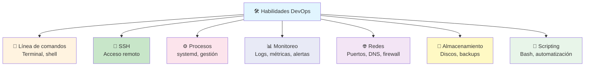
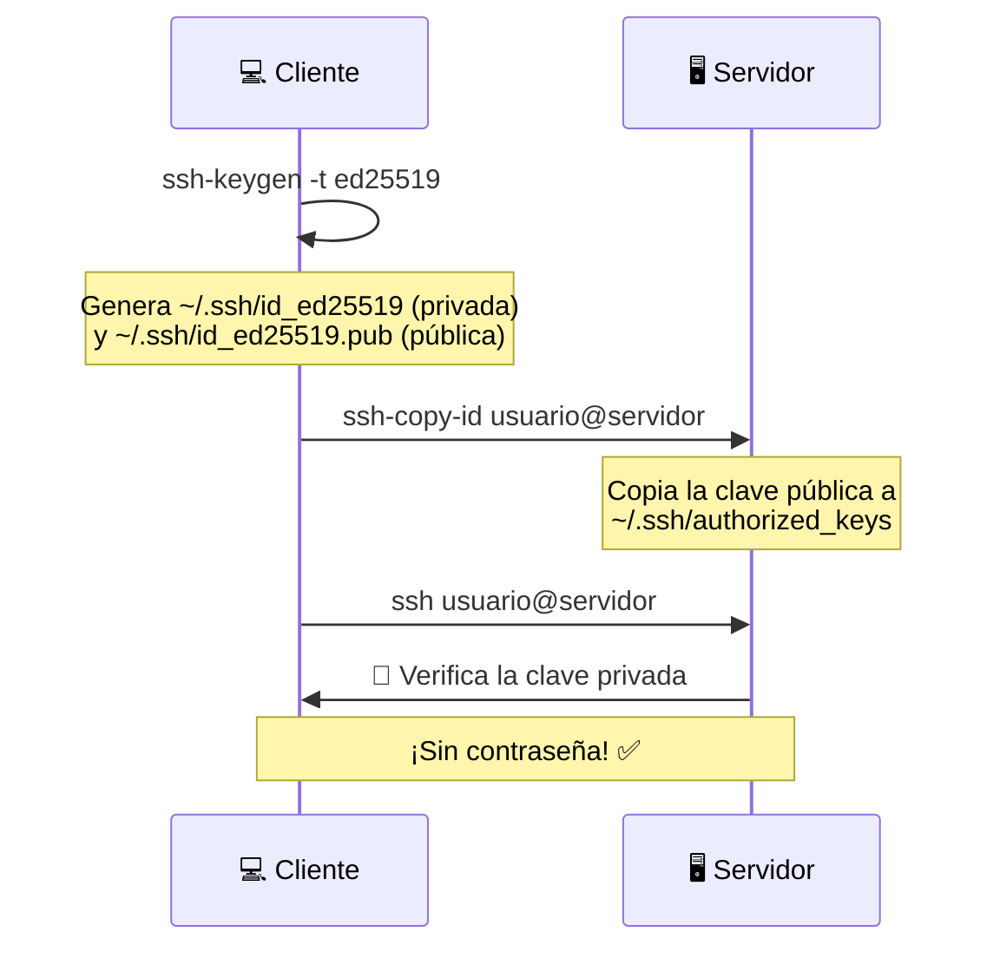
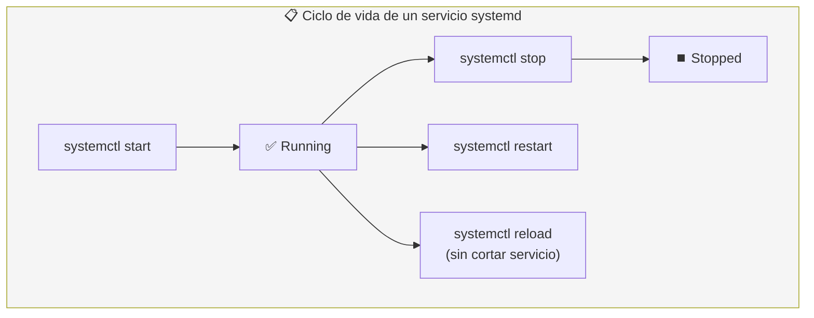
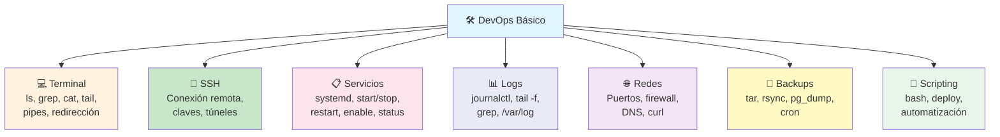

# Habilidades Básicas de Operaciones (DevOps)

**DevOps** no es un rol, es una cultura que une desarrollo y operaciones. Como backend, necesitas habilidades básicas de operaciones para desplegar, mantener y depurar tus aplicaciones en producción.



---

## Línea de comandos (Linux)

La terminal es tu herramienta más importante como DevOps. No es opcional: es donde viven los servidores.

### Comandos esenciales

```bash
# Navegación
pwd              # ¿Dónde estoy?
ls -la           # Listar archivos (con detalles)
cd /var/log      # Cambiar directorio
find /etc -name "*.conf"   # Buscar archivos

# Archivos
cat archivo.log          # Ver contenido
less archivo.log         # Ver con paginación (q para salir)
tail -f archivo.log      # Ver en tiempo real (follow)
head -n 100 archivo.log  # Ver primeras 100 líneas
nano / vim archivo       # Editar

# Permisos
chmod 755 script.sh      # Dar permisos de ejecución
chown usuario:grupo archivo   # Cambiar dueño

# Discos
df -h                # Espacio en disco
du -sh /var/log      # Tamaño de carpeta
```

### Tuberías (pipes) y redirección

```bash
# Pipe (|): pasar salida de un comando a otro
journalctl -u nginx | grep error | tail -n 50

# Redirigir salida a archivo
./script.sh > salida.log          # stdout
./script.sh 2> error.log          # stderr
./script.sh &> todo.log           # ambos

# Combinar
./app.sh > app.log 2>&1 &         # stdout + stderr a archivo, en background
```

### Gestión de paquetes

```bash
# Debian / Ubuntu (apt)
sudo apt update          # Actualizar lista de paquetes
sudo apt upgrade         # Actualizar paquetes
sudo apt install nginx   # Instalar
sudo apt remove nginx    # Desinstalar

# CentOS / RHEL (yum/dnf)
sudo dnf install nginx
```

---

## SSH (Secure Shell)

**SSH** es el protocolo para acceder a servidores remotos de forma segura.

### Conectarse

```bash
# Básico
ssh usuario@192.168.1.100

# Puerto personalizado
ssh -p 2222 usuario@servidor.com

# Con clave privada específica
ssh -i ~/.ssh/mi-clave.pem ec2-user@3.45.67.89
```

### Claves SSH (sin contraseña)



### Hardening de SSH

```bash
# /etc/ssh/sshd_config (seguridad mínima)
Port 2222                     # Cambiar puerto (no 22)
PermitRootLogin no            # No permitir root
PasswordAuthentication no     # Solo claves
PubkeyAuthentication yes      # Claves públicas
```

### Túneles SSH

```bash
# Forward de puerto local a remoto (acceder a BD local)
ssh -L 5432:localhost:5432 usuario@servidor
# Ahora localhost:5432 apunta a la BD del servidor 🪄

# Invertido: exponer puerto local al servidor
ssh -R 8080:localhost:3000 usuario@servidor
```

---

## Gestión de procesos

### Procesos

```bash
# Ver procesos
ps aux                  # Todos los procesos
ps aux | grep nginx     # Filtrar
top                     # En tiempo real (htop es mejor)
htop                    # Mejor que top (instalar)

# Señales
kill 1234               # Terminar proceso (SIGTERM)
kill -9 1234            # Forzar (SIGKILL) - último recurso
kill -15 1234           # Graceful shutdown

# Background / Foreground
./app.sh &              # Ejecutar en background
nohup ./app.sh &        # Ejecutar incluso si cierras terminal
jobs                    # Ver trabajos en background
fg %1                   # Traer a foreground
```

### Systemd

**systemd** es el sistema de inicio y gestión de servicios en Linux moderno.



```bash
# systemctl: gestionar servicios
sudo systemctl start nginx       # Iniciar
sudo systemctl stop nginx        # Detener
sudo systemctl restart nginx     # Reiniciar
sudo systemctl reload nginx      # Recargar config (sin downtime)
sudo systemctl enable nginx      # Iniciar al arrancar
sudo systemctl status nginx      # Ver estado
sudo systemctl --failed          # Servicios que fallaron

# journalctl: ver logs de systemd
journalctl -u nginx              # Logs de nginx
journalctl -u nginx -f           # Logs en tiempo real
journalctl -u nginx --since "1 hour ago"
```

### Crear un servicio systemd

```ini
# /etc/systemd/system/miapp.service
[Unit]
Description=Mi aplicación Node.js
After=network.target

[Service]
Type=simple
User=deploy
WorkingDirectory=/opt/miapp
ExecStart=/usr/bin/node server.js
Restart=on-failure
RestartSec=5
Environment=NODE_ENV=production
EnvironmentFile=/etc/miapp.env

[Install]
WantedBy=multi-user.target
```

```bash
sudo systemctl daemon-reload     # Recargar después de crear/editar
sudo systemctl enable miapp      # Habilitar en arranque
sudo systemctl start miapp       # Iniciar
sudo systemctl status miapp      # Verificar
```

---

## Monitoreo y Logs

### Logs

```bash
# Logs del sistema
/var/log/syslog          # Ubuntu/Debian
/var/log/messages        # CentOS/RHEL
/var/log/nginx/access.log
/var/log/nginx/error.log

# Ver en tiempo real
tail -f /var/log/nginx/access.log

# Filtrar
grep "ERROR" /var/log/app.log
grep "500" /var/log/nginx/access.log | awk '{print $1}' | sort | uniq -c
```

### Métricas básicas

```bash
# CPU, memoria, disco
htop                        # CPU + RAM interactivo
free -h                     # Memoria RAM
df -h                       # Disco
du -sh /var/log             # Tamaño de carpeta

# Red
ss -tlnp                    # Puertos en escucha
netstat -tlnp               # Alternativa
iftop                       # Ancho de banda en tiempo real
```

### Alertas básicas

```bash
#!/bin/bash
# Script simple de monitoreo de disco
THRESHOLD=90
USAGE=$(df -h / | awk 'NR==2 {print $5}' | tr -d '%')

if [ "$USAGE" -gt "$THRESHOLD" ]; then
    echo "⚠️ Disco al $USAGE% - $(date)" | mail -s "Alerta disco" admin@email.com
fi
```

---

## Redes básicas

```bash
# Puertos y conexiones
ss -tlnp                # Puertos en escucha (TCP)
ss -tlnp | grep 3000    # ¿Algo corre en el puerto 3000?
lsof -i :5432           # ¿Qué proceso usa el puerto 5432?

# DNS
dig google.com          # Resolver dominio
nslookup google.com     # Alternativa
host google.com         # Más simple

# Conexiones
ping google.com         # ¿Hay conexión?
curl -I https://miapp.com  # Probar HTTP
traceroute google.com   # Ruta de red

# Firewall (ufw)
sudo ufw status
sudo ufw allow 22          # SSH
sudo ufw allow 80          # HTTP
sudo ufw allow 443         # HTTPS
sudo ufw enable
```

---

## Almacenamiento y Backups

```bash
# Comprimir y archivar
tar -czvf backup.tar.gz /var/data          # Comprimir
tar -xzvf backup.tar.gz                    # Extraer

# Sincronizar archivos (rsync)
rsync -avz /datos/ usuario@servidor:/backup/
rsync -avz --delete /datos/ /backup/       # Sincronizar exacto

# Copias de seguridad de BD (ejemplo PostgreSQL)
pg_dump -U usuario miapp > miapp_$(date +%Y%m%d).sql
gzip miapp_20250101.sql

# Restaurar
gunzip -c miapp_20250101.sql.gz | psql -U usuario miapp
```

---

## Scripting (Bash)

Automatizar tareas repetitivas es esencial. Un script bash bien hecho vale oro.

```bash
#!/bin/bash
set -euo pipefail  # Salir ante error, variables no definidas, pipes rotos

# Script de deploy básico
APP_DIR="/opt/miapp"
BACKUP_DIR="/backups"
BRANCH="main"

echo "📦 Iniciando deploy..."

# 1. Backup
echo "📁 Haciendo backup..."
cp -r "$APP_DIR" "$BACKUP_DIR/miapp_$(date +%Y%m%d_%H%M%S)"

# 2. Actualizar código
echo "📥 Actualizando código..."
cd "$APP_DIR"
git pull origin "$BRANCH"

# 3. Instalar dependencias
echo "📦 Instalando dependencias..."
npm ci --production

# 4. Reiniciar servicio
echo "🔄 Reiniciando servicio..."
sudo systemctl restart miapp

# 5. Verificar
echo "✅ Verificando..."
sleep 5
if curl -s -o /dev/null -w "%{http_code}" http://localhost:3000/health | grep -q 200; then
    echo "✅ Deploy exitoso!"
else
    echo "❌ Deploy falló!"
    exit 1
fi
```

### Tareas programadas (cron)

```bash
# Editar crontab
crontab -e

# Formato: minuto hora día_mes mes día_sem comando

# Ejecutar backup cada día a las 3am
0 3 * * * /opt/scripts/backup.sh

# Ejecutar script cada hora
0 * * * * /opt/scripts/monitor.sh

# Cada 5 minutos
*/5 * * * * /opt/scripts/healthcheck.sh
```

---

## Resumen visual



> **Siguiente paso:** Practica conectándote por SSH a un servidor (puede ser una VPS de $5/mes o local con Vagrant). Crea un servicio systemd para tu app, configura el firewall, y escribe un script de deploy.

## Relacionados:
- [[bases-de-datos-no-sql]] #anterior 
- [[estrategias-de-mitigación]] #siguiente 