# Más acerca de bases de datos

Más allá de las consultas básicas, las bases de datos relacionales tienen conceptos profundos que todo backend debe dominar para construir sistemas **confiables**, **rápidos** y **bien diseñados**.

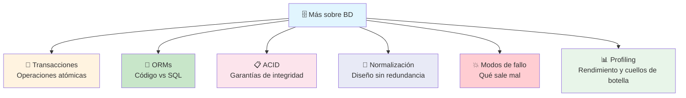

---

## Transacciones

Una **transacción** es un conjunto de operaciones que se ejecutan **como una sola unidad**: o se hacen **todas** o **ninguna**.

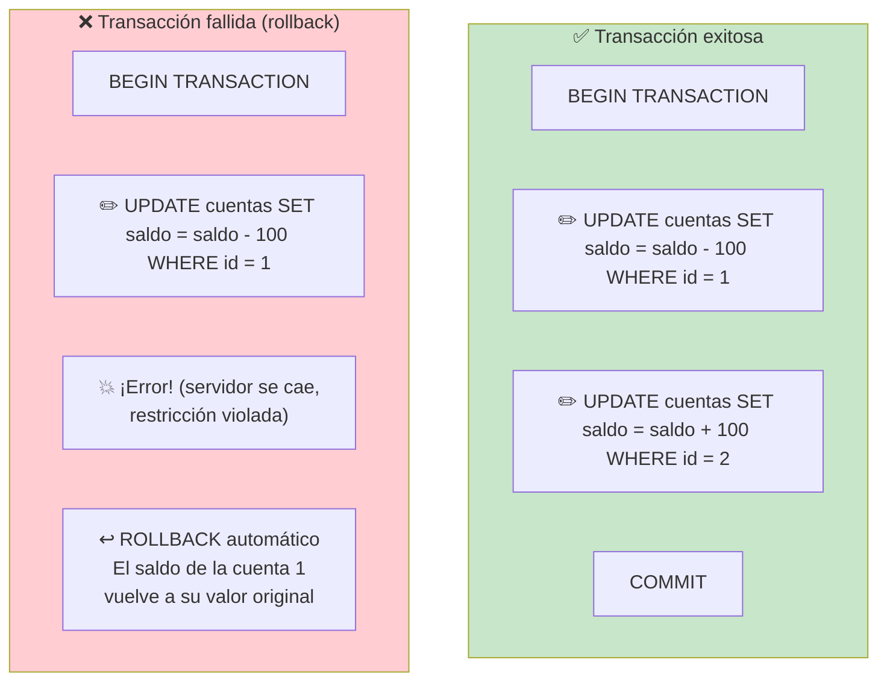

> **Analogía:** Transferencia bancaria. Si el sistema falla después de descontar de A pero antes de acreditar a B, el dinero no debe desaparecer. La transacción lo evita.

### Ejemplo SQL

```sql
BEGIN;

UPDATE cuentas SET saldo = saldo - 100 WHERE id = 1;
UPDATE cuentas SET saldo = saldo + 100 WHERE id = 2;

COMMIT;
-- Si algo falla antes del COMMIT,
-- todo se revierte automáticamente
```

```javascript
// Con ORM (Prisma)
await prisma.$transaction([
    prisma.cuenta.update({
        where: { id: 1 },
        data: { saldo: { decrement: 100 } }
    }),
    prisma.cuenta.update({
        where: { id: 2 },
        data: { saldo: { increment: 100 } }
    })
]);
```

### Niveles de aislamiento

Controlan cuánto "ve" una transacción de los cambios de otras transacciones concurrentes.

| Nivel               | Suciedad (dirty read) | No repetible | Fantasmas |
| ------------------- | --------------------- | ------------ | --------- |
| **READ UNCOMMITTED** | ❌ Puede leer datos no commitados | ❌ | ❌ |
| **READ COMMITTED**  | ✅ Previene           | ❌           | ❌        |
| **REPEATABLE READ** | ✅                    | ✅           | ❌        |
| **SERIALIZABLE**    | ✅                    | ✅           | ✅        |

---

## ACID

**ACID** es el acrónimo de las cuatro propiedades que garantizan que las transacciones sean confiables.

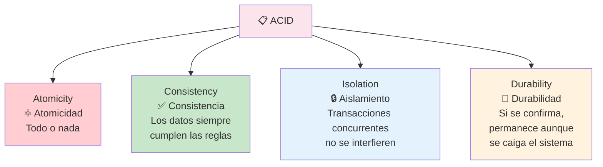

| Propiedad    | Explicación                                      | Analogía                     |
| ------------ | ------------------------------------------------ | ---------------------------- |
| **Atomicidad** | La transacción se completa toda o se revierte toda | Un interruptor: o prende todo o no prende nada |
| **Consistencia** | Los datos siempre cumplen las reglas (claves, tipos, constraints) | Un libro de contabilidad que siempre cuadra |
| **Aislamiento** | Dos transacciones simultáneas no se ven entre sí hasta que terminan | Dos cajeros atendiendo a la vez sin mezclar clientes |
| **Durabilidad** | Una vez commiteado, el cambio sobrevive a un reinicio | Escribir con tinta indeleble, no con lápiz |

> **No todas las BD son iguales:** Las relacionales (PostgreSQL, MySQL) son ACID. Algunas NoSQL sacrifican ACID por rendimiento o escalabilidad (teorema CAP).

---

## ORMs (Object-Relational Mapping)

Un **ORM** es una capa que traduce entre tu **código orientado a objetos** y las **tablas relacionales**. Escribes en tu lenguaje y el ORM genera el SQL.

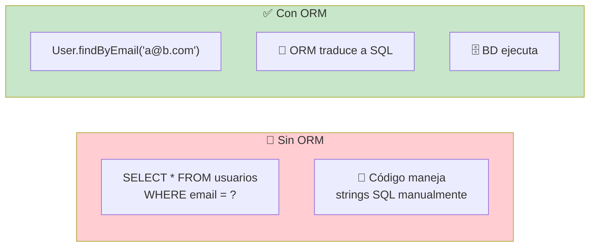

### Ejemplos en distintos lenguajes

```javascript
// Prisma (Node.js / TypeScript)
const usuario = await prisma.user.findUnique({
    where: { email: 'ana@email.com' },
    include: { posts: true }
});
```

```python
# SQLAlchemy (Python)
usuario = session.query(User).filter(
    User.email == 'ana@email.com'
).first()
```

```ruby
# ActiveRecord (Ruby on Rails)
usuario = User.find_by(email: 'ana@email.com')
```

### Ventajas y desventajas

| Ventajas                         | Desventajas                         |
| -------------------------------- | ----------------------------------- |
| ✅ Productividad (menos SQL)      | ❌ Curva de aprendizaje             |
| ✅ Previene SQL injection         | ❌ Puede generar SQL ineficiente    |
| ✅ Migraciones versionadas        | ❌ Problema N+1 si no sabes usarlo  |
| ✅ Cambias de BD con mínimo esfuerzo | ❌ Menos control sobre queries complejas |

### ¿Cuándo usar ORM vs SQL puro?

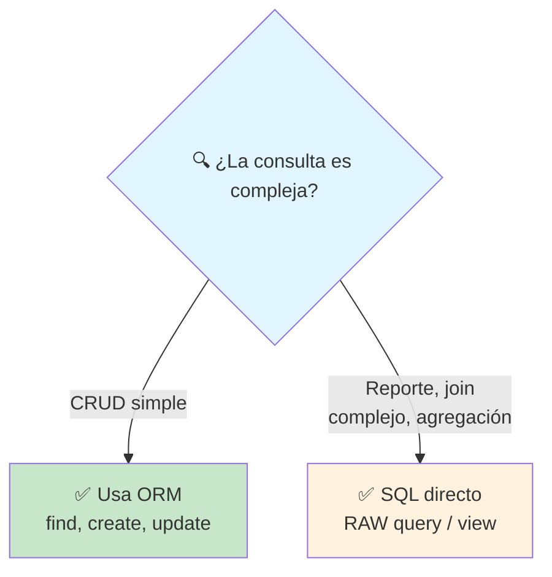

---

## Normalización

La **normalización** es el proceso de diseñar tablas para **eliminar redundancia** y **evitar anomalías** al insertar, actualizar o eliminar datos.

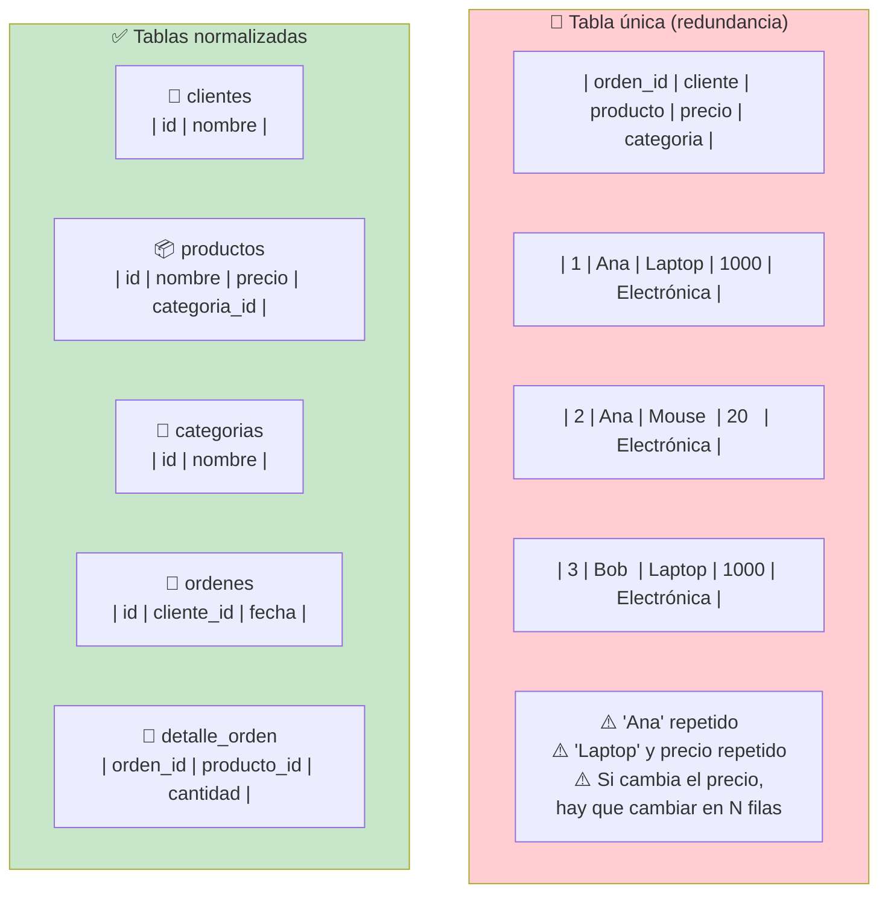

### Formas normales

| Forma     | Regla                                       |
| --------- | ------------------------------------------- |
| **1NF**   | Cada celda = un valor atómico. No listas    |
| **2NF**   | 1NF + cada columna no clave depende de TODA la clave primaria |
| **3NF**   | 2NF + no hay dependencias transitivas (A→B→C) |

**En la práctica:** llegar a 3NF es suficiente para la mayoría de los casos. A veces se **desnormaliza** intencionalmente por rendimiento (evitar joins costosos).

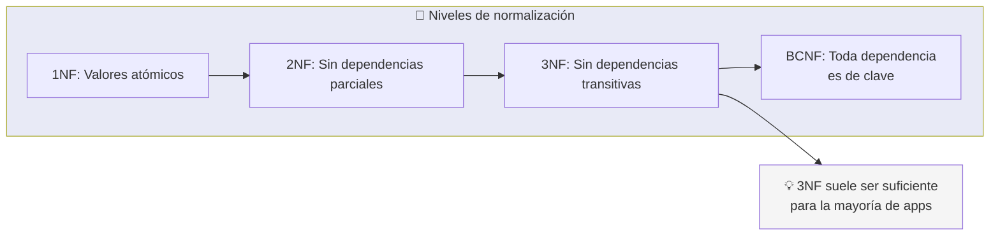

---

## Failure Modes (Modos de fallo)

Las bases de datos pueden fallar de muchas formas. Conocer estos modos te ayuda a diseñar sistemas resilientes.

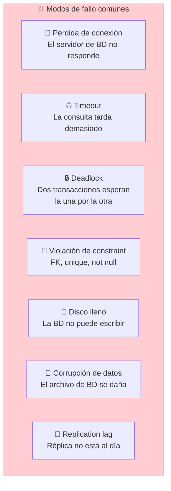

### Estrategias de mitigación

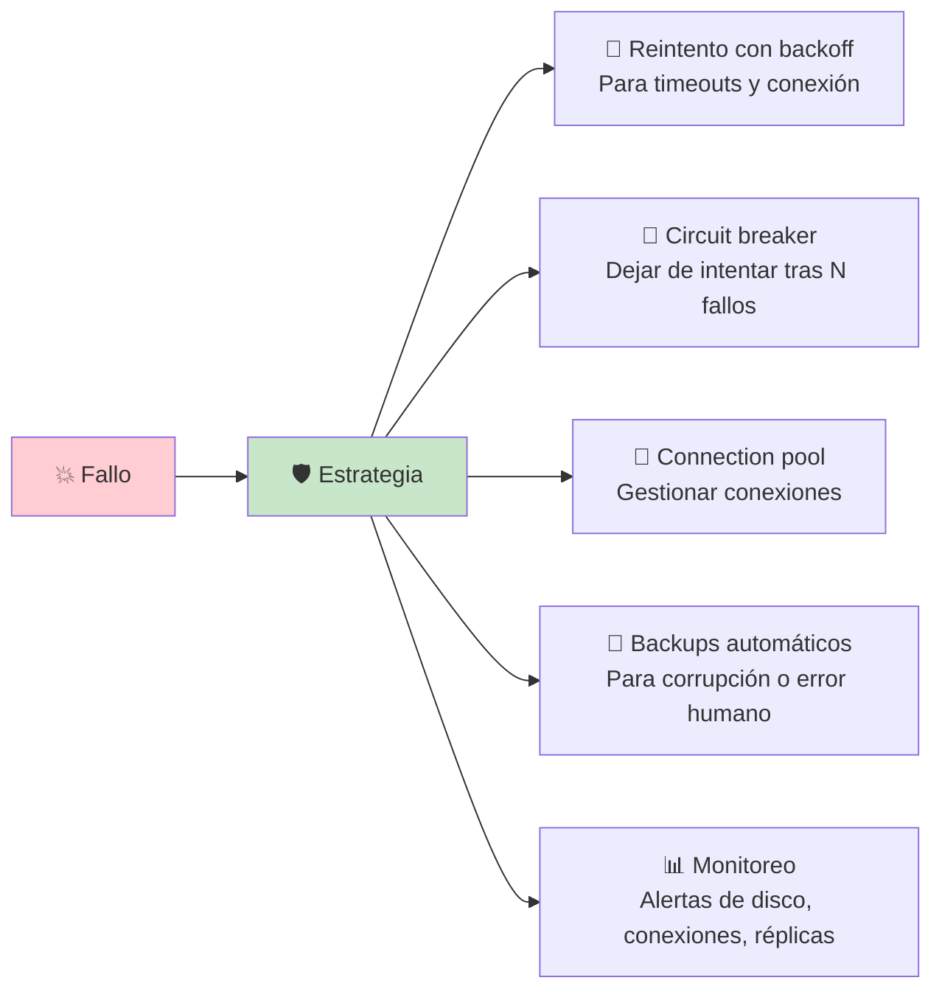

### Código resiliente

```javascript
// Manejo de fallos con retry
async function queryWithRetry(sql, params, retries = 3) {
    for (let i = 0; i < retries; i++) {
        try {
            return await db.query(sql, params);
        } catch (err) {
            if (i === retries - 1) throw err;
            if (err.code === 'CONNECTION_ERROR' || err.code === 'DEADLOCK') {
                console.log(`Reintento ${i + 1}/${retries}`);
                await sleep(1000 * Math.pow(2, i)); // backoff exponencial
            } else {
                throw err; // errores no recuperables
            }
        }
    }
}
```

---

## Perfilando el desempeño (Profiling Performance)

El **profiling** consiste en identificar consultas lentas, cuellos de botella y oportunidades de optimización.

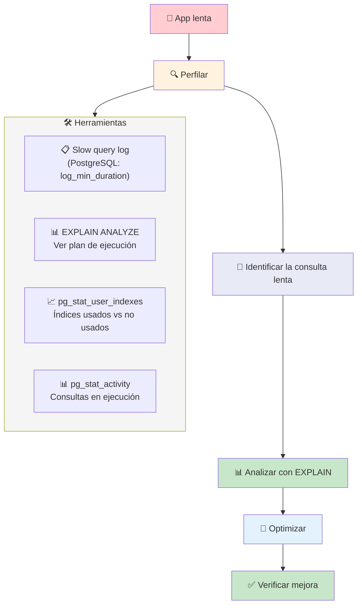

### Cómo leer un plan de ejecución (EXPLAIN)

```sql
EXPLAIN ANALYZE
SELECT u.nombre, COUNT(p.id) as total_posts
FROM usuarios u
LEFT JOIN posts p ON p.usuario_id = u.id
WHERE u.activo = true
GROUP BY u.id;
```

```
                                        QUERY PLAN
-------------------------------------------------------------------
 GroupAggregate  (cost=125.00..250.00 rows=1000 width=40)
   ->  Hash Left Join  (cost=100.00..200.00 rows=5000 width=36)
         Hash Cond: (u.id = p.usuario_id)
         ->  Seq Scan on usuarios u  (cost=0.00..50.00 rows=1000 width=32)
               Filter: activo = true
         ->  Hash  (cost=50.00..50.00 rows=5000 width=8)
               ->  Seq Scan on posts p  (cost=0.00..50.00 rows=5000 width=8)
 Planning Time: 0.500 ms
 Execution Time: 15.200 ms
```

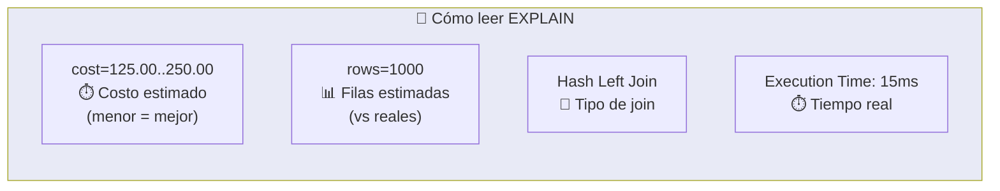

### Estrategias de optimización

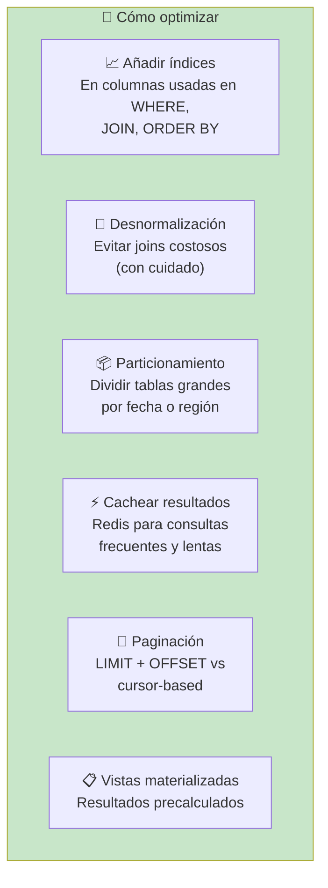

### Reglas de oro de performance

1. **Mide antes de optimizar** — no adivines, usa EXPLAIN ANALYZE
2. **Índices en WHERE y JOIN** — las columnas de filtrado y unión
3. **Cuidado con SELECT \*** — solo pide las columnas que necesitas
4. **N+1 es el enemigo #1** — usa JOIN o eager loading
5. **Paginación cursor-based** para tablas grandes (evita OFFSET)
6. **Cachea lo que se repite** — si una consulta se ejecuta 1000 veces/min, cachea

---

## Resumen visual

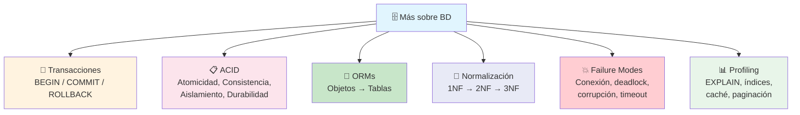

> **Siguiente paso:** Implementa transacciones en tu próxima feature que modifique múltiples tablas. Agrega índices a las columnas que más consultas. Y habilita el slow query log para encontrar cuellos de botella ocultos.

## Relacionados:
- [[ci-cd]] #anterior 
- [[testing]] #siguiente 