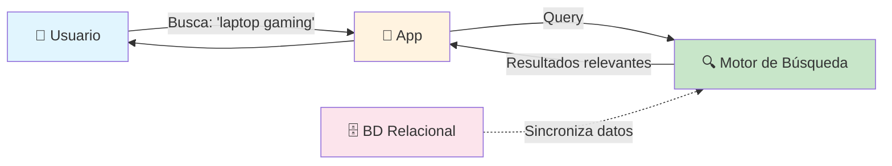
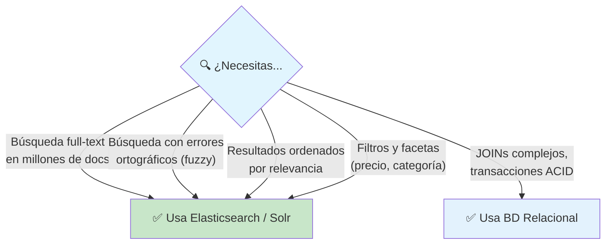
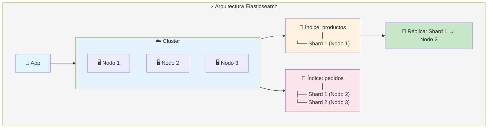
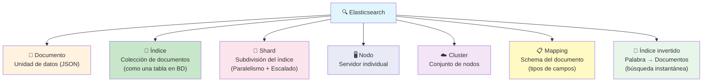
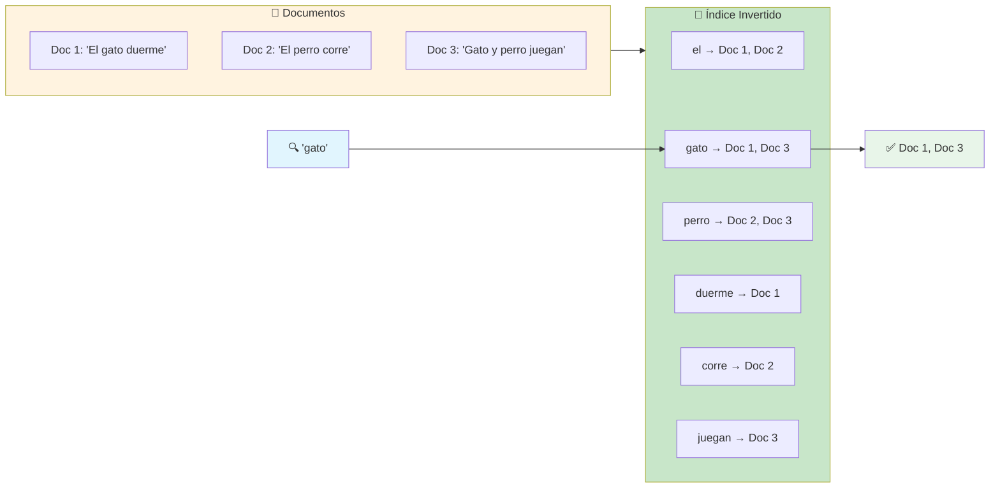
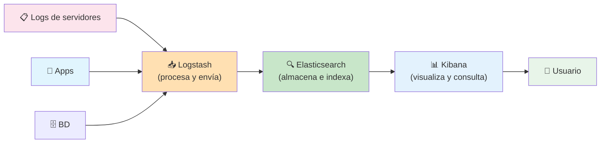
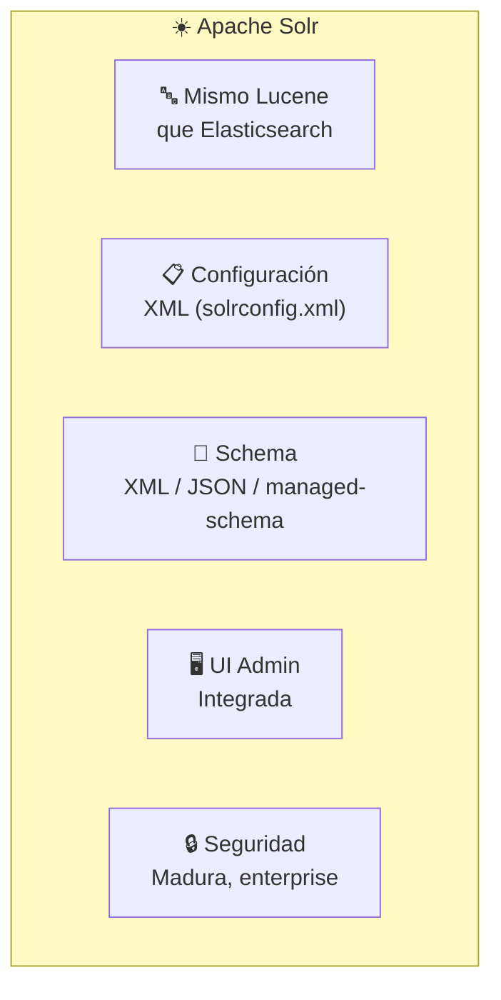
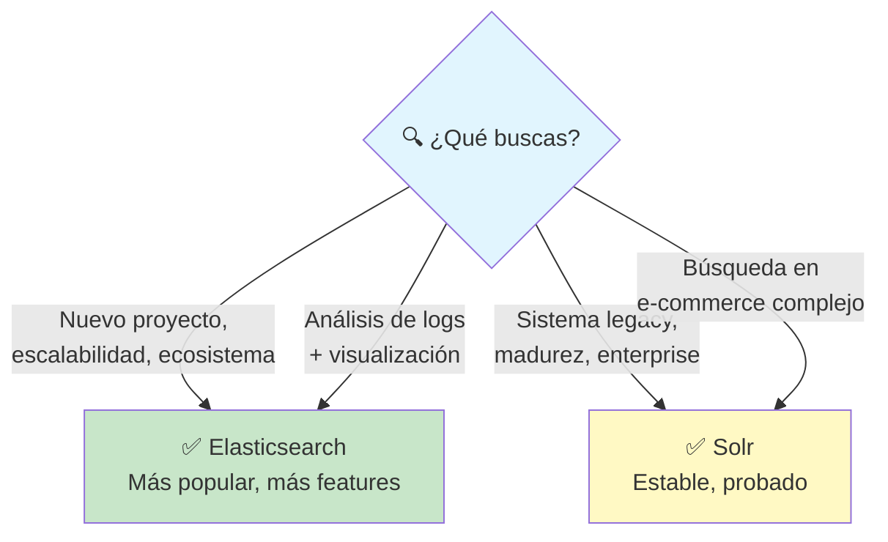
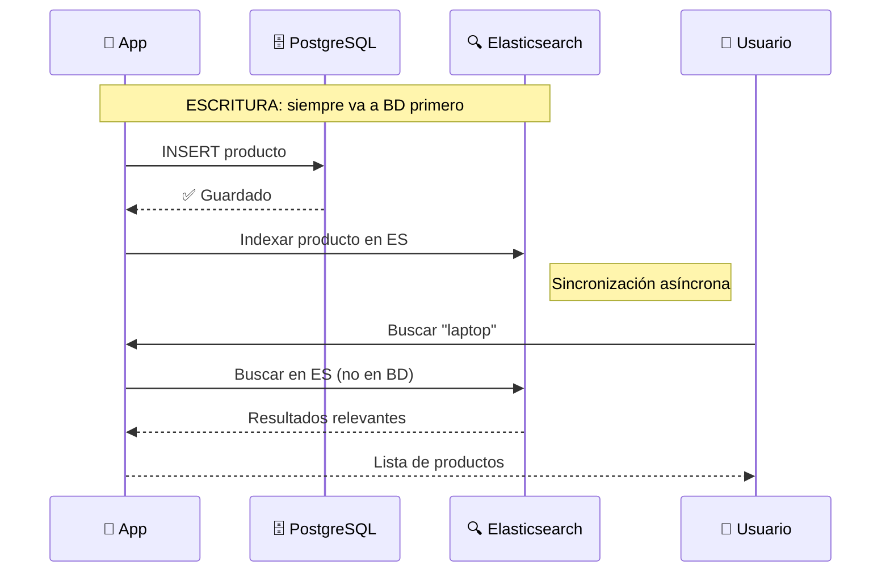
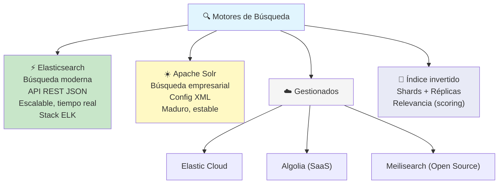

# Motores de búsqueda

Los **motores de búsqueda** (search engines) están diseñados para **indexar y buscar grandes volúmenes de texto** de forma rápida y relevante. No son bases de datos (aunque almacenan datos): su fuerte es la **búsqueda full-text**, los **filtros** y la **relevancia**.



### BD vs Motor de Búsqueda

| Característica       | Base de Datos (PostgreSQL) | Motor de Búsqueda (ES) |
| -------------------- | -------------------------- | ---------------------- |
| **Búsqueda de texto**| LIKE / ILIKE (lento)       | Full-text indexado     |
| **Relevancia**       | ❌ (exacto o nada)         | ✅ Scoring por relevancia |
| **Fuzzy search**     | ❌                         | ✅ (errores ortográficos) |
| **Facetas**          | ❌ (GROUP BY complejo)     | ✅ Aggregations        |
| **Tiempo real**      | Depende del índice         | Casi tiempo real       |
| **Analítica**        | Agregaciones simples       | Pipeline de agregactions |

### ¿Cuándo usar un motor de búsqueda?



---

## Elasticsearch

**Elasticsearch** es el motor de búsqueda y analítica más usado del mundo. Es distribuido, escalable horizontalmente y está basado en **Apache Lucene**.



### Conceptos clave



### ¿Qué es el índice invertido?



> **Analogía:** El índice invertido es como el índice al final de un libro: tú buscas "gato" y te dice en qué páginas (documentos) aparece.

### Operaciones básicas

```bash
# Indexar un documento (crear/actualizar)
PUT /productos/_doc/1
{
    "nombre": "Laptop Gamer",
    "precio": 1500,
    "categoria": "electrónica",
    "descripcion": "Laptop con RTX 4070, 32GB RAM"
}

# Buscar
GET /productos/_search
{
    "query": {
        "match": {
            "descripcion": "laptop gaming"
        }
    }
}
```

### Tipos de consulta

```json
// Búsqueda full-text con relevancia
{
    "query": {
        "match": { "descripcion": "laptop gaming" }
    }
}

// Búsqueda exacta (filtro)
{
    "query": {
        "term": { "categoria": "electrónica" }
    }
}

// Combinación (bool)
{
    "query": {
        "bool": {
            "must": [{ "match": { "descripcion": "laptop" } }],
            "filter": [{ "term": { "categoria": "electrónica" } }],
            "must_not": [{ "term": { "marca": "lenovo" } }]
        }
    }
}

// Fuzzy (tolera errores)
{
    "query": {
        "fuzzy": {
            "nombre": {
                "value": "laptop",
                "fuzziness": "AUTO"
            }
        }
    }
}

// Agregaciones (facetas)
{
    "size": 0,
    "aggs": {
        "por_categoria": {
            "terms": { "field": "categoria" }
        },
        "precio_promedio": {
            "avg": { "field": "precio" }
        }
    }
}
```

### Stack ELK

Elasticsearch suele usarse con **Kibana** (visualización) y **Logstash** (ingesta de datos) → el stack **ELK**.



---

## Solr

**Apache Solr** también está basado en Apache Lucene (como Elasticsearch). Fue el primer motor de búsqueda empresarial open source y aún se usa en aplicaciones legacy y sistemas donde importa más la madurez que la velocidad de evolución.



### Elasticsearch vs Solr

| Característica        | Elasticsearch         | Solr                 |
| --------------------- | --------------------- | -------------------- |
| **Configuración**     | JSON (API REST)       | XML (archivos)       |
| **Escalabilidad**     | Nativa (sharding automático) | Manual (requiere ZooKeeper) |
| **Tiempo real**       | Casi real (1s)        | Casi real            |
| **UI**                | Kibana (separado)     | Admin UI integrada   |
| **Ecosistema**        | ELK Stack (enorme)    | Limitado             |
| **Casos de uso**      | Búsqueda web, logs, analítica | Búsqueda empresarial, e-commerce |
| **Popularidad**       | ⭐⭐⭐⭐⭐             | ⭐⭐⭐               |

### ¿Cuál elegir?



---

## Integración con tu backend

### Patrón típico: BD + Elasticsearch



### Sincronización BD → ES

```javascript
// Después de guardar en BD, indexar en ES
async function crearProducto(data) {
    // 1. Guardar en BD
    const producto = await db.query(
        'INSERT INTO productos SET ?', [data]
    );

    // 2. Indexar en Elasticsearch
    await esClient.index({
        index: 'productos',
        id: producto.insertId,
        body: data
    });

    return producto;
}

// Búsqueda
async function buscarProductos(query) {
    const result = await esClient.search({
        index: 'productos',
        body: {
            query: {
                match: { nombre: query }
            }
        }
    });

    return result.hits.hits.map(h => h._source);
}
```

---

## Buenas prácticas

- **No uses ES como BD primaria** — los datos van en BD, ES es para búsqueda
- **Mapea campos correctamente** — `text` para búsqueda full-text, `keyword` para filtros exactos
- **Normaliza texto** — lowercase, stemming (raíces), stop words
- **Alias de índices** — usa alias para hacer reindexación sin downtime
- **Monitoreo** — Heap, índices, shards (Kibana Stack Monitoring)
- **Sharding adecuado** — ni muy pocos (1-2) ni demasiados shards
- **Refresh interval** — ajusta según necesidad de tiempo real vs rendimiento

---

## Resumen visual



> **Siguiente paso:** Levanta Elasticsearch con Docker, indexa unos documentos de prueba y juega con las queries match, term, bool y fuzzy. Luego conéctalo desde tu backend.

## Relacionados:
- [[broker-de-mensajes]] #anterior 
- [[patrones-arquitectonicos]] #siguiente 