# Patrones Arquitectónicos

Los **patrones arquitectónicos** son soluciones probadas a problemas recurrentes de diseño de software. Definen la **estructura general** del sistema: cómo se organizan los componentes, cómo se comunican y cómo escalan.

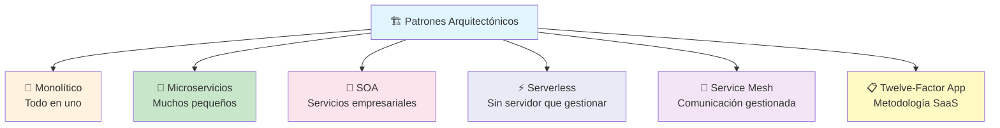

---

## Monolítico

Un **monolito** es una aplicación donde **toda la funcionalidad** vive en un solo código base, se despliega como una sola unidad y corre en un solo proceso.

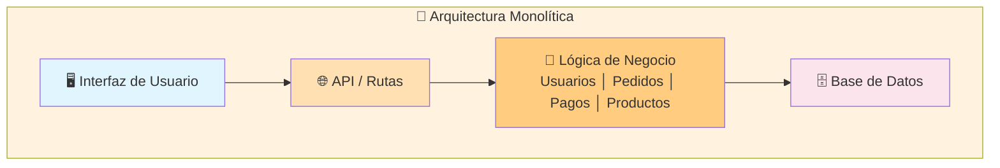

### Ventajas y desventajas

| Ventajas                     | Desventajas                          |
| ---------------------------- | ------------------------------------ |
| ✅ Simple de desarrollar      | ❌ Escala todo o nada                |
| ✅ Fácil de desplegar         | ❌ Un bug puede tumbar todo          |
| ✅ Comunicación rápida        | ❌ Difícil de mantener al crecer     |
| ✅ Monitoreo simple           | ❌ Tecnología única forzada          |
| ✅ Ideal para empezar         | ❌ Despliegues lentos y riesgosos    |

> **¿Cuándo usarlo?** MVPs, proyectos pequeños, equipos chicos, startups en etapa inicial. **No asumas que necesitas microservicios.** La mayoría de proyectos deberían empezar como monolito.

---

## Microservicios

Los **microservicios** dividen la aplicación en **servicios pequeños, independientes y desplegables** cada uno con su propia lógica, BD y API.

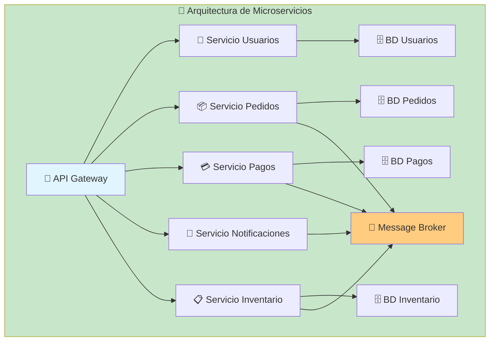

### Características clave

- **Despliegue independiente** — cada servicio se deploya sin afectar a otros
- **BD por servicio** — cada uno tiene su propia base de datos (desacoplamiento)
- **Comunicación vía red** — HTTP/REST, gRPC o mensajes (RabbitMQ, Kafka)
- **Escalado granular** — escalas solo el servicio que lo necesita
- **Tecnología heterogénea** — cada servicio puede usar su lenguaje/BD ideal

### El problema de la BD compartida

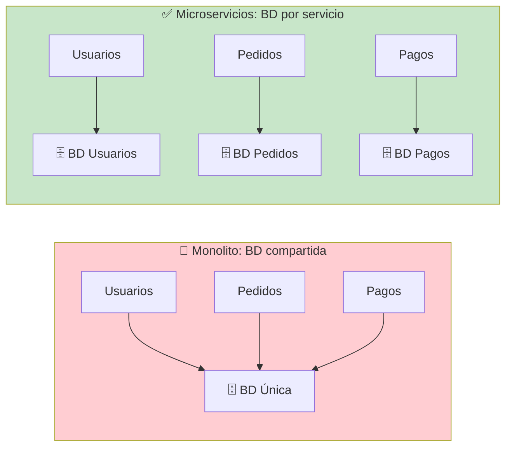

### Retos de microservicios

| Reto                | Descripción                                    |
| ------------------- | ---------------------------------------------- |
| **Complejidad**     | Múltiples servicios, despliegues, monitoreo    |
| **Comunicación**    | Latencia de red, fallos, reintentos            |
| **Consistencia**    | Transacciones distribuidas (eventual consistency) |
| **Testing**         | Tests de integración entre servicios           |
| **Observabilidad**  | Logs, métricas, traces distribuidos            |
| **DevOps**          | CI/CD, infraestructura, contenedores           |

> **¿Cuándo usarlos?** Equipos grandes (2+ por servicio), cuando partes del sistema escalan de forma diferente, cuando necesitas tecnologías diversas para distintas funcionalidades.

---

## SOA (Service-Oriented Architecture)

**SOA** es un estilo arquitectónico donde los servicios son **grandes, reutilizables y orquestados** a través de un bus empresarial (ESB). Fue el predecesor de microservicios.

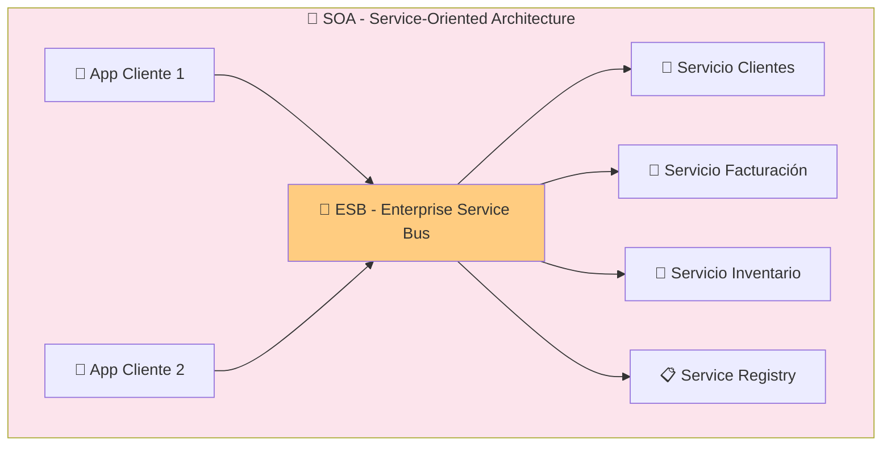

### SOA vs Microservicios

| Característica | SOA                      | Microservicios            |
| -------------- | ------------------------ | ------------------------- |
| **Tamaño**     | Grandes servicios        | Pequeños servicios        |
| **Comunicación** | ESB (bus pesado)       | API directa / broker      |
| **BD**         | Compartida frecuentemente | Por servicio             |
| **Governance** | Centralizado             | Descentralizado           |
| **Despliegue** | Monolítico por servicio  | Independiente             |

---

## Serverless

**Serverless** (Funciones como Servicio / FaaS) ejecuta tu código en respuesta a eventos **sin que gestiones servidores**. Pagas solo por el tiempo de ejecución.

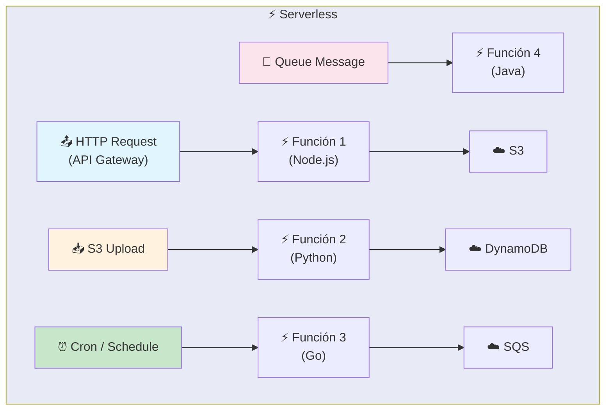

### Ventajas y limitaciones

| Ventajas                       | Limitaciones                         |
| ------------------------------ | ------------------------------------ |
| ✅ Sin gestión de servidores    | ❌ Tiempo máximo de ejecución (15 min) |
| ✅ Escala automáticamente       | ❌ Cold starts (latencia inicial)     |
| ✅ Pago por uso (idle = $0)    | ❌ Difícil debugging local            |
| ✅ Escalamiento a cero          | ❌ Vendor lock-in                     |

> **¿Cuándo usarlo?** APIs con tráfico variable, procesamiento de eventos, tareas programadas, prototipos. AWS Lambda, Google Cloud Functions, Cloudflare Workers.

---

## Service Mesh

Un **Service Mesh** es una capa de infraestructura dedicada a gestionar la **comunicación entre microservicios** (descubrimiento, load balancing, retry, métricas, trazabilidad).

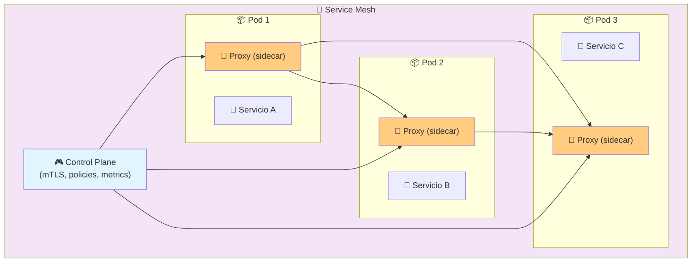

### ¿Qué resuelve?

| Problema                    | Solución Service Mesh               |
| --------------------------- | ------------------------------------ |
| **mTLS entre servicios**    | Encriptación automática              |
| **Retry / Timeout**         | Políticas de resiliencia             |
| **Traza distribuida**       | OpenTelemetry integrado              |
| **Blue/Green, Canary**      | Enrutamiento de tráfico              |
| **Métricas por servicio**   | Prometheus + Grafana                 |

**Implementaciones:** Istio, Linkerd, Consul Connect, Envoy.

---

## Twelve-Factor App

**Twelve-Factor App** es una metodología para construir **aplicaciones SaaS** modernas, portables y escalables. Doce principios basados en la experiencia de Heroku.

```mermaid
flowchart TB
    Twelve2["📋 Twelve-Factor App"]

    Twelve2 --> F1["① Código base<br/>Un repo, múltiples deploys"]
    Twelve2 --> F2["② Dependencias<br/>Explicitas y aisladas"]
    Twelve2 --> F3["③ Configuración<br/>En variables de entorno"]
    Twelve2 --> F4["④ Backing services<br/>Recursos como adjuntos"]
    Twelve2 --> F5["⑤ Build, release, run<br/>Separación estricta"]
    Twelve2 --> F6["⑥ Procesos<br/>Sin estado (stateless)"]
    Twelve2 --> F7["⑦ Puerto bind<br/>Auto-contenido (export port)"]
    Twelve2 --> F8["⑧ Concurrencia<br/>Escalar con procesos"]
    Twelve2 --> F9["⑨ Desechabilidad<br/>Inicio/rápido, shutdown graceful"]
    Twelve2 --> F10["⑩ Paridad dev/prod<br/>Entornos lo más similares posible"]
    Twelve2 --> F11["⑪ Logs<br/>Como flujo de eventos"]
    Twelve2 --> F12["⑫ Admin processes<br/>Tareas como one-off"]

    style Twelve2 fill:#fff9c4
```

### Los 12 factores resumidos

| #  | Factor                        | Significado                                    |
| -- | ----------------------------- | ---------------------------------------------- |
| 1  | **Código base**               | Un repo por app, múltiples deploys (staging, prod) |
| 2  | **Dependencias**              | Declarar todo (package.json, requirements.txt) |
| 3  | **Configuración**             | Variables de entorno, no archivos en el código |
| 4  | **Backing services**          | BD, Redis, etc. son recursos adjuntos          |
| 5  | **Build, release, run**       | Separar build, release y ejecución             |
| 6  | **Procesos**                  | Stateless, no guardar estado local             |
| 7  | **Port binding**              | La app es auto-contenida (exporta puerto)      |
| 8  | **Concurrencia**              | Escalar horizontalmente con procesos           |
| 9  | **Desechabilidad**            | Startup rápido, shutdown graceful              |
| 10 | **Paridad dev/prod**          | Entornos lo más parecidos posible              |
| 11 | **Logs**                      | stdout, no archivos de log                     |
| 12 | **Admin processes**           | Migraciones, scripts como one-off procesos     |

---

# Diseño y Arquitectura

El **diseño arquitectónico** es el proceso de definir la estructura, componentes, interfaces y datos de un sistema para satisfacer requisitos funcionales y no funcionales.

## Principios fundamentales

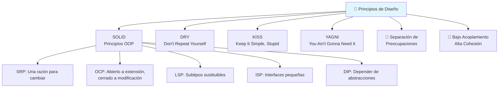

### C4 Model para documentar arquitectura

El **C4 Model** es una forma jerárquica de documentar arquitectura de software en 4 niveles.

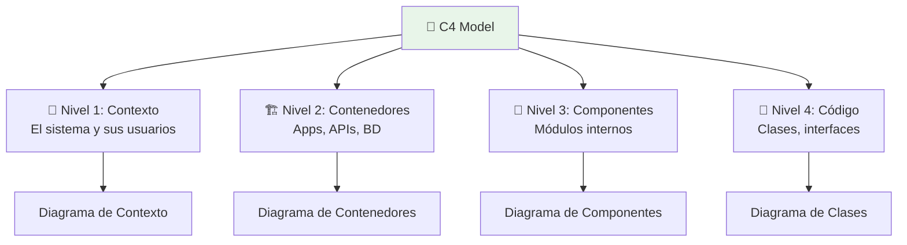

### Atributos de calidad (no funcionales)

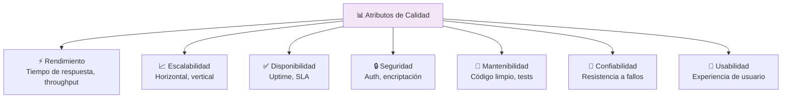

---

## Patrón de diseño de sistemas comunes

- **Proxy inverso** (Nginx) — balanceo de carga, SSL, caché
- **Colas** (RabbitMQ, Kafka) — comunicación asíncrona, desacoplamiento
- **Caché** (Redis) — acelerar consultas frecuentes
- **CDN** — contenido estático cerca del usuario
- **Read replicas** — separar lecturas de escrituras en BD
- **Sharding** — dividir BD horizontalmente
- **CQRS** — separar comandos (escritura) de consultas (lectura)
- **Event Sourcing** — almacenar eventos en lugar de estado actual

---

## Resumen visual

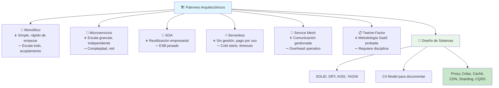

> **Siguiente paso:** Documenta la arquitectura de tu proyecto actual con C4 Model (empieza con el diagrama de contexto). Evalúa si tu arquitectura actual cumple con los Twelve-Factor App principles.

## Relacionados:
- [[motores-de-busqueda]] #anterior 
- [[data-en-tiempo-real]] #siguiente