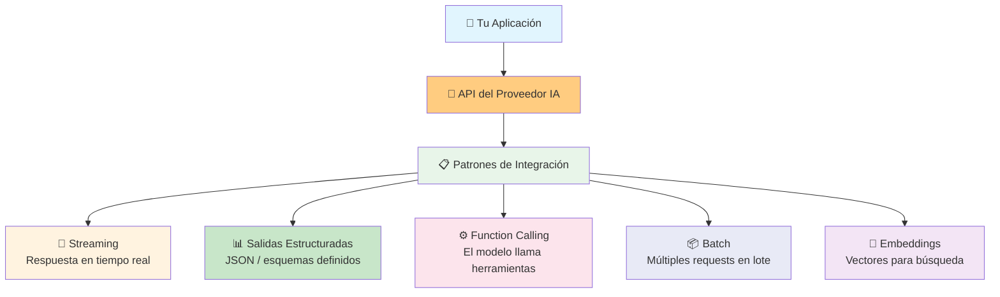
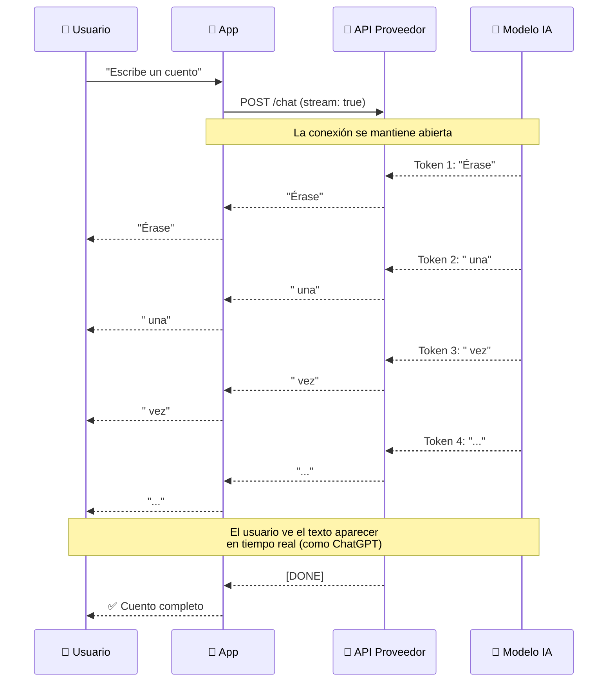
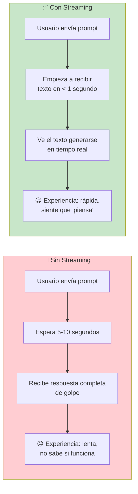
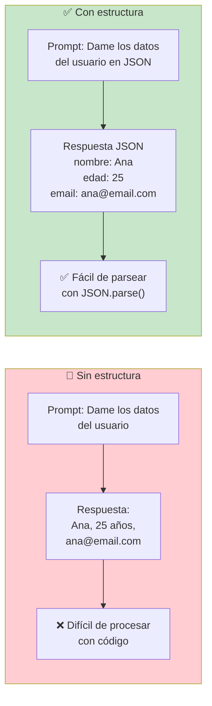
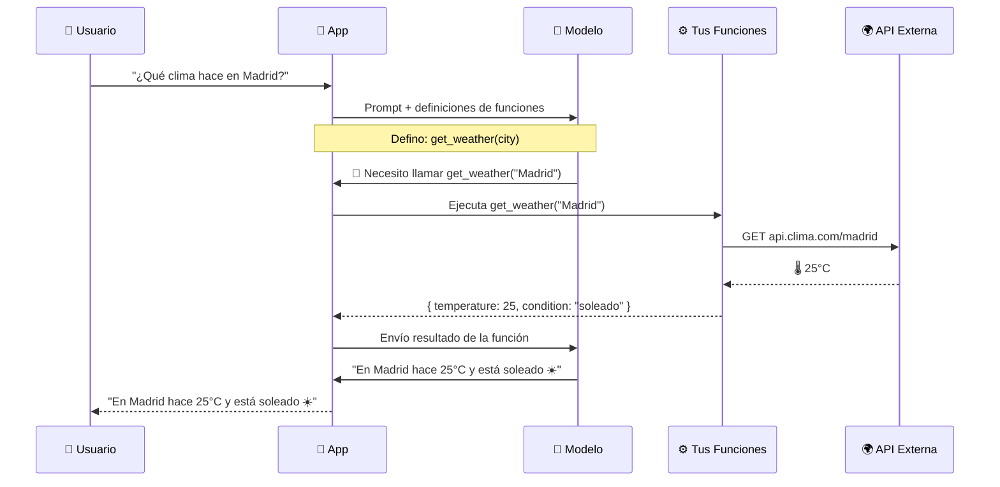
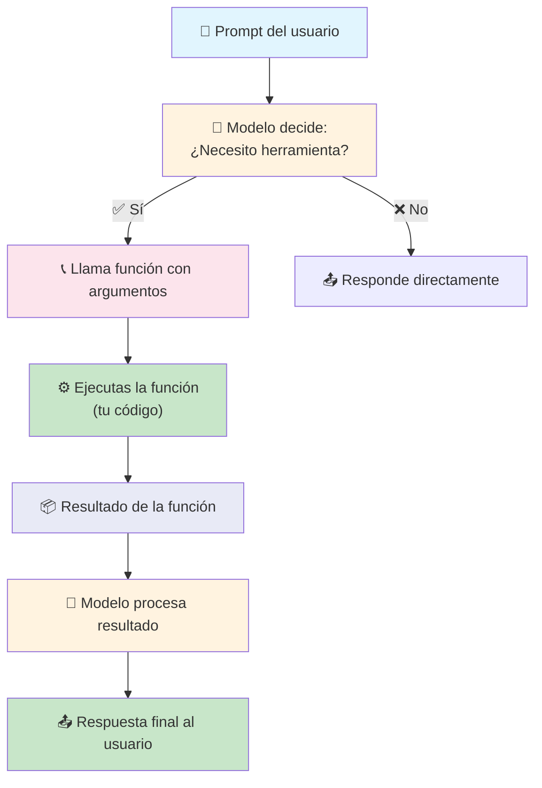
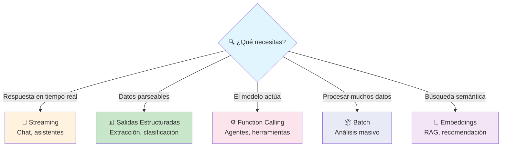
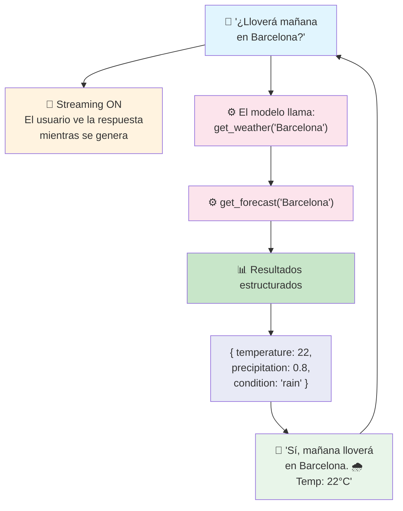
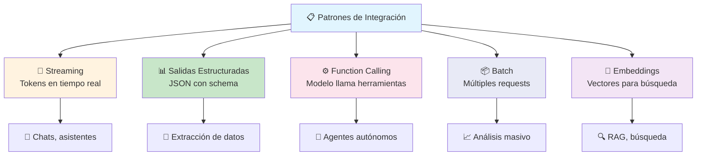

# Patrones de integración

Los **patrones de integración** son formas estandarizadas de conectar aplicaciones con modelos de IA. Dominarlos es esencial para construir aplicaciones robustas con LLMs.



---

## Streaming

El **streaming** permite que el modelo envíe la respuesta **token por token** a medida que los genera, en lugar de esperar a tener la respuesta completa.



### Sin streaming vs Con streaming



### Implementación

```javascript
// Node.js con OpenAI (streaming)
const response = await openai.chat.completions.create({
    model: "gpt-4o",
    messages: [{ role: "user", content: "Escribe un cuento" }],
    stream: true,  // ← activa streaming
});

for await (const chunk of response) {
    const token = chunk.choices[0]?.delta?.content || "";
    process.stdout.write(token);  // muestra token en tiempo real
}
```

```python
# Python con OpenAI (streaming)
response = client.chat.completions.create(
    model="gpt-4o",
    messages=[{"role": "user", "content": "Escribe un cuento"}],
    stream=True
)

for chunk in response:
    token = chunk.choices[0].delta.content or ""
    print(token, end="", flush=True)
```

| Ventajas                       | Desventajas                          |
| ------------------------------ | ------------------------------------ |
| ✅ Mejor experiencia de usuario | ⚠️ Más complejo de implementar       |
| ✅ Feedback inmediato           | ⚠️ No puedes reutilizar la respuesta fácilmente |
| ✅ Percibido como más rápido    | ⚠️ Manejo de interrupciones          |

---

## Salidas estructuradas

Las **salidas estructuradas** garantizan que el modelo devuelva datos en un **formato específico** (JSON, XML, etc.) que tu aplicación pueda parsear de forma confiable.



### Con schema definido (recomendado)

Los proveedores modernos permiten definir un **schema JSON** que el modelo debe respetar estrictamente.

```python
# Python con OpenAI (structured outputs)
from pydantic import BaseModel

class Usuario(BaseModel):
    nombre: str
    edad: int
    email: str
    activo: bool

response = client.beta.chat.completions.parse(
    model="gpt-4o",
    messages=[{"role": "user", "content": "Ana, 25 años, anA@email.com"}],
    response_format=Usuario,  # ← esquema definido
)

usuario = response.choices[0].message.parsed
print(usuario.nombre)  # → "Ana"
```

```javascript
// Node.js con OpenAI (structured outputs)
const response = await openai.chat.completions.create({
    model: "gpt-4o",
    messages: [{ role: "user", content: "Ana, 25 años" }],
    response_format: {
        type: "json_schema",
        json_schema: {
            name: "usuario",
            schema: {
                type: "object",
                properties: {
                    nombre: { type: "string" },
                    edad: { type: "number" },
                    email: { type: "string" }
                },
                required: ["nombre", "edad", "email"]
            }
        }
    }
});
```

### Casos de uso

| Caso                    | Esquema de salida                     |
| ----------------------- | ------------------------------------- |
| **Extraer datos**       | JSON con campos específicos           |
| **Clasificación**       | `{ "categoria": "spam" }`            |
| **Generar UI**          | `{ "type": "button", "text": "..." }` |
| **Agentes**             | `{ "tool": "search", "args": {...} }` |

> **Beneficio clave:** Eliminas la necesidad de parsear texto libre. El modelo devuelve datos que tu código puede consumir directamente.

---

## Function Calling

El **function calling** (o tool use) permite que el modelo **decida llamar funciones de tu código** cuando sea necesario. Es la base de los agentes.



### Definición de funciones

```javascript
// Node.js: definir funciones disponibles
const tools = [
    {
        type: "function",
        function: {
            name: "get_weather",
            description: "Obtener el clima de una ciudad",
            parameters: {
                type: "object",
                properties: {
                    city: {
                        type: "string",
                        description: "Nombre de la ciudad"
                    }
                },
                required: ["city"]
            }
        }
    }
];

// Enviar al modelo
const response = await openai.chat.completions.create({
    model: "gpt-4o",
    messages: [{ role: "user", content: "¿Clima en Madrid?" }],
    tools: tools  // ← el modelo puede llamarlas
});

// El modelo pide llamar la función
const toolCall = response.choices[0].message.tool_calls[0];
// → { function: { name: "get_weather", arguments: '{"city":"Madrid"}' } }
```

```python
# Python con OpenAI
tools = [
    {
        "type": "function",
        "function": {
            "name": "get_weather",
            "description": "Obtener el clima de una ciudad",
            "parameters": {
                "type": "object",
                "properties": {
                    "city": {"type": "string"}
                },
                "required": ["city"]
            }
        }
    }
]

response = client.chat.completions.create(
    model="gpt-4o",
    messages=[{"role": "user", "content": "¿Clima en Madrid?"}],
    tools=tools
)
```

### Ciclo completo de function calling



### Buenas prácticas

- **Descripciones claras** — explica qué hace cada función y cada parámetro
- **Errores manejados** — si la función falla, devuelve un error que el modelo entienda
- **No confíes en el input** — valida los argumentos que el modelo envía
- **Funciones atómicas** — cada función hace una cosa bien

---

## Comparativa de patrones



---

## Ejemplo completo: asistente del clima



---

## Resumen visual



> **Siguiente paso:** Implementa streaming en tu app para mejor UX, agrega salidas estructuradas para integrar IA con tu lógica de negocio, y experimenta con function calling para crear tu primer agente autónomo.

## Relacionados:
- [[proveedores-de-ia]] #anterior 
- [[ci-cd]] #siguiente 