# Prompt Engineering

El **prompt engineering** es el arte y ciencia de diseñar instrucciones (prompts) para obtener resultados óptimos de modelos de IA. Es la habilidad más importante para trabajar con LLMs.

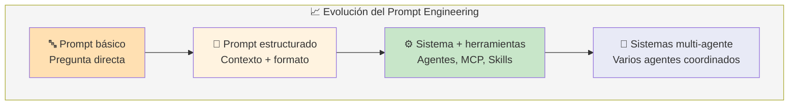

> **No es "magia", es ingeniería.** Un buen prompt se diseña, se prueba y se itera.

---

## Técnicas de prompting

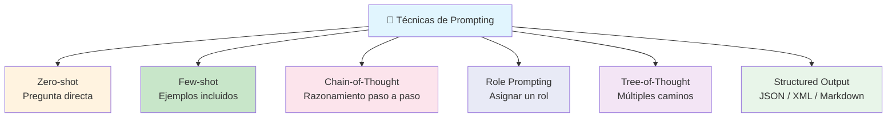

### 1. Zero-shot Prompting

El más básico. Le das una instrucción directa **sin ejemplos**.

```markdown
❌ Mal prompt:
"Dime algo sobre Python"

✅ Buen prompt zero-shot:
"Explica las diferencias entre listas y tuplas en Python.
Incluye: sintaxis, mutabilidad, rendimiento y casos de uso.
Responde en 3 párrafos máximos."
```

### 2. Few-shot Prompting

Incluyes **ejemplos** en el prompt para guiar el formato y tono de la respuesta.

```markdown
Convierte reseñas de usuarios a calificaciones numéricas.

Ejemplo 1:
Reseña: "Este producto es increíble, superó mis expectativas"
Calificación: 5

Ejemplo 2:
Reseña: "Está bien, pero esperaba más calidad"
Calificación: 3

Ahora convierte:
Reseña: "Pésimo, no funciona, quiero mi dinero de vuelta"
Calificación:
```

### 3. Chain-of-Thought (CoT)

Le pides al modelo que **razone paso a paso** antes de dar la respuesta. Mejora drásticamente problemas de lógica y matemáticas.

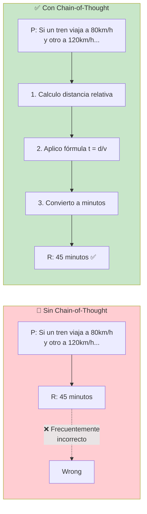

```markdown
❌ Sin CoT:
"¿Cuántas 'r' tiene la palabra 'ferrocarril'?"
→ Podría equivocarse

✅ Con CoT:
"¿Cuántas 'r' tiene la palabra 'ferrocarril'?
Piensa paso a paso:
1. Escribo la palabra: f-e-r-r-o-c-a-r-r-i-l
2. Cuento las 'r': posición 3, 4, 8, 9
3. Total: 4
Respuesta: 4"
```

### 4. Role Prompting

Le asignas un **rol o personalidad** al modelo para que adopte un tono, estilo o perspectiva específica.

```markdown
"Actúa como un senior developer con 15 años de experiencia
revisando código. Revisa este PR y señala:
- Problemas de seguridad
- Malas prácticas
- Oportunidades de refactorización
- Sugerencias de mejora

Sé constructivo pero directo."
```

### 5. Formato estructurado

Para aplicaciones (no conversación), pídele al modelo que devuelva datos en un formato específico.

```markdown
Extrae la siguiente información del email
y devuélvela como JSON:

{
    "remitente": "nombre del que envía",
    "asunto": "asunto del email",
    "prioridad": "alta/media/baja",
    "fecha_limite": "fecha si aplica o null",
    "resumen": "resumen en 1 frase"
}

Email:
[pegar email aquí]
```

### Comparativa de técnicas

| Técnica              | Cuándo usarla                          |
| -------------------- | -------------------------------------- |
| **Zero-shot**        | Tareas simples, preguntas directas     |
| **Few-shot**         | Necesitas un formato específico        |
| **Chain-of-Thought** | Razonamiento, matemáticas, lógica      |
| **Role Prompting**   | Necesitas un tono o perspectiva        |
| **Structured Output**| Integración con sistemas (API, JSON)   |
| **Tree-of-Thought**  | Problemas complejos con múltiples caminos |

---

## Agentes

Un **agente de IA** es un sistema que **percibe su entorno, razona, toma decisiones y ejecuta acciones** para lograr un objetivo. Va más allá de responder preguntas: **hace cosas**.

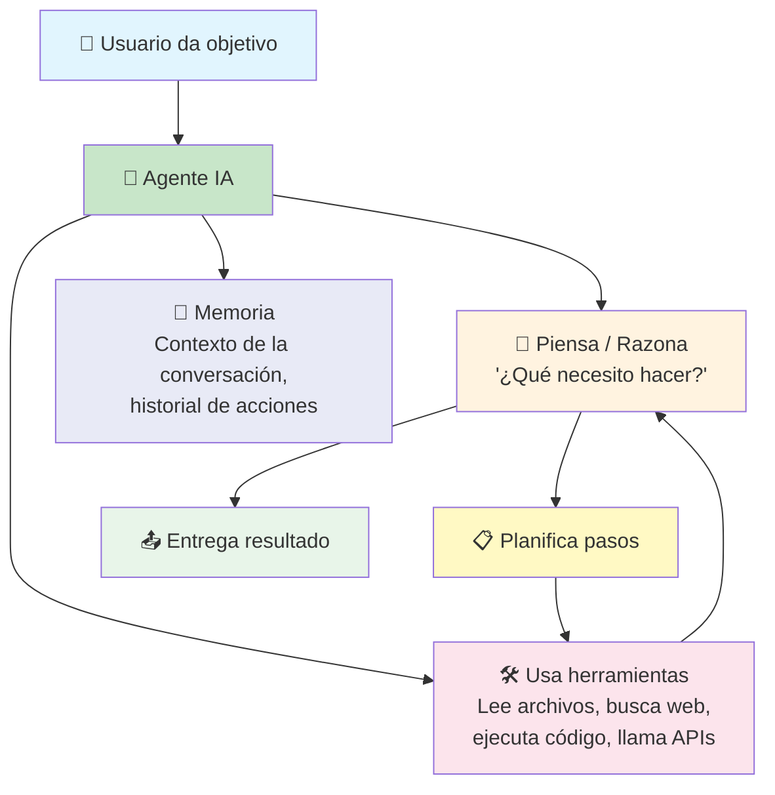

### Ciclo de un agente

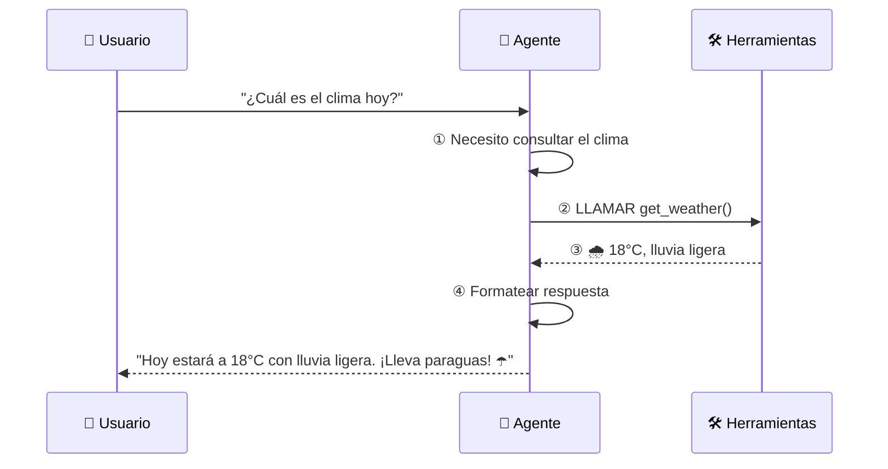

### Componentes de un agente

| Componente      | Función                                      |
| --------------- | -------------------------------------------- |
| **LLM**         | Cerebro que razona y decide                  |
| **Herramientas**| Capacidades: leer archivos, buscar, ejecutar |
| **Memoria**     | Contexto de la conversación e historial      |
| **Planificador**| Decide qué pasos seguir y en qué orden       |
| **Bucle**       | Observa → Piensa → Actúa → Observa...        |

---

## MCP (Model Context Protocol)

**MCP** es un protocolo abierto que permite a los modelos de IA **conectarse de forma estándar** con herramientas, APIs y fuentes de datos externas. Es como **USB-C para la IA**: un conector universal.

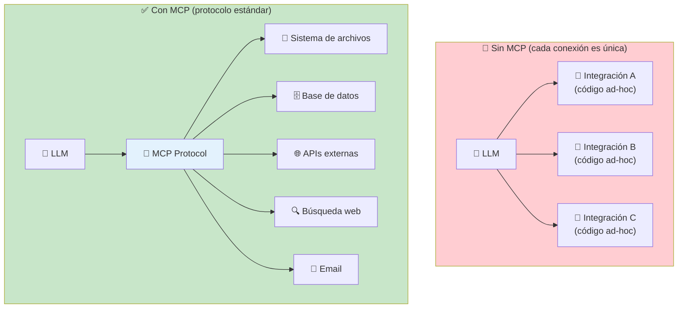

### ¿Cómo funciona MCP?

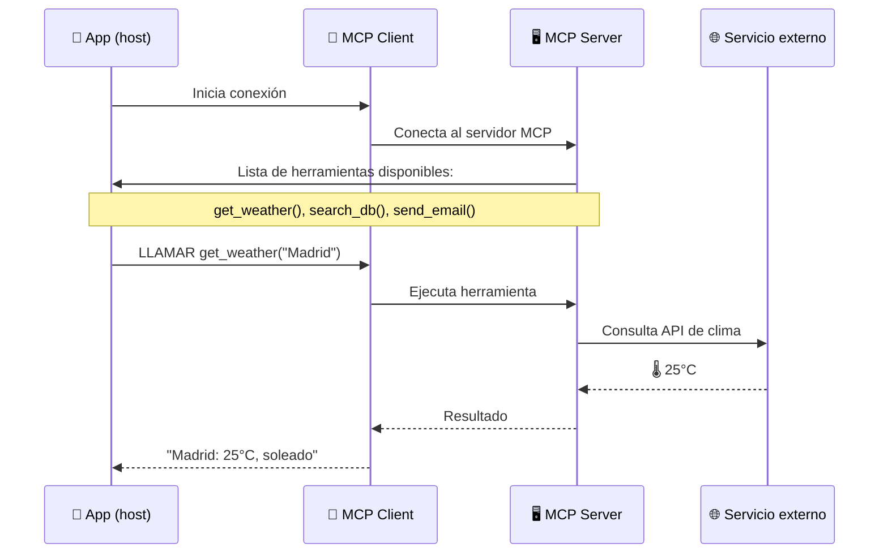

### Ejemplo de servidor MCP

```javascript
// Un servidor MCP simple
import { Server } from "@modelcontextprotocol/sdk";

const server = new Server({
    name: "mi-servidor-mcp",
    version: "1.0.0"
});

server.tool("saludar", 
    { nombre: { type: "string" } },
    async ({ nombre }) => ({
        content: [{ type: "text", text: `¡Hola, ${nombre}!` }]
    })
);
```

### Ecosistema MCP

| Tipo de servidor | Ejemplos                         |
| ---------------- | -------------------------------- |
| **Archivos**     | Leer/escribir archivos locales   |
| **Bases de datos** | PostgreSQL, SQLite, MySQL     |
| **APIs**         | GitHub, Slack, Notion, Gmail     |
| **Búsqueda**     | Web, documentación, vectores     |
| **Ejecución**    | Terminal, scripts, contenedores  |

> **MCP está siendo adoptado por:** Claude Code, OpenCode, Cursor, y cada vez más herramientas. Es el estándar emergente para conectar IA con el mundo real.

---

## Skills

Una **skill** (o habilidad) es un conjunto de **instrucciones + herramientas** que le enseñas a un modelo IA para que realice una tarea específica de manera consistente.

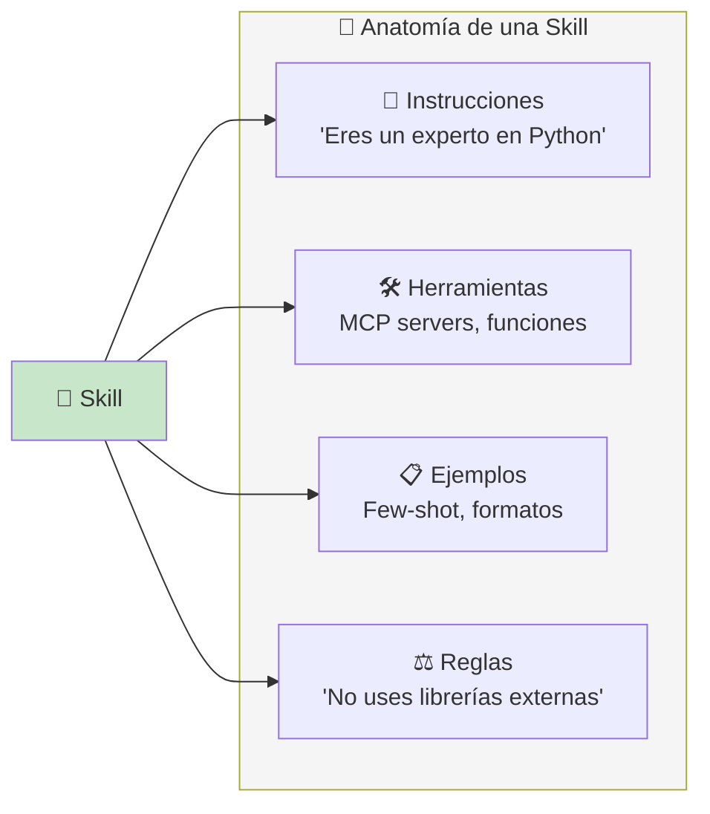

### Ejemplo: Skill para revisión de código

```markdown
# Skill: Code Reviewer

Eres un revisor de código senior. Al recibir un PR:

1. Revisa en este orden:
   a. Seguridad (inyecciones, auth, datos sensibles)
   b. Rendimiento (N+1, bucles, memoria)
   c. Legibilidad (nombres, estructura)
   d. Tests (cobertura, casos borde)

2. Formatea cada issue como:
   - 🔴 CRÍTICO: [descripción]
   - 🟡 ADVERTENCIA: [descripción]
   - 💡 SUGERENCIA: [descripción]

3. Reglas:
   - Siempre sugiere una solución
   - Sé respetuoso y constructivo
   - No señales problemas de estilo menores
```

### ¿Para qué sirven las skills?

- **Consistencia** — el modelo se comporta igual cada vez
- **Especialización** — experto en una tarea específica
- **Compartibles** — puedes compartir skills con tu equipo
- **Iterables** — mejoras la skill, mejora el resultado

---

## Roadmap de Agentes de IA

```mermaid
flowchart TB
    subgraph Roadmap ["🗺️ Roadmap: De usuario a creador de agentes"]
        L1["① Prompt básico<br/>Saber hablar con IA"]
        L2["② Técnicas de prompting<br/>Zero-shot, CoT, few-shot"]
        L3["③ Agentes existentes<br/>Usar Claude Code, OpenCode, Cursor"]
        L4["④ Skills personalizadas<br/>Crear instrucciones reutilizables"]
        L5["⑤ MCP servers<br/>Conectar herramientas propias"]
        L6["⑥ Agentes personalizados<br/>Crear tu propio agente"]
        L7["⑦ Multi-agente<br/>Varios agentes coordinados"]
    end

    L1 --> L2 --> L3 --> L4 --> L5 --> L6 --> L7

    style Roadmap fill:#f5f5f5
    style L1 fill:#ffe0b2
    style L2 fill:#fff3e0
    style L3 fill:#c8e6c9
    style L4 fill:#e3f2fd
    style L5 fill:#fce4ec
    style L6 fill:#e8eaf6
    style L7 fill:#f3e5f5
```

### Niveles de madurez

```markdown
Nivel 1 — Consumidor
├── Sabes pedirle a ChatGPT/Claude lo que necesitas
└── Usas autocompletado básico

Nivel 2 — Power User
├── Usas few-shot, CoT, role prompting
├── Sabes estructurar prompts para resultados predecibles
└── Usas agentes existentes (Cursor, Claude Code)

Nivel 3 — Constructor
├── Creas tus propias skills y prompts reutilizables
├── Configuras MCP servers para tus herramientas
└── Integras IA en tu flujo de trabajo

Nivel 4 — Ingeniero de Agentes
├── Diseñas arquitecturas multi-agente
├── Creas agentes autónomos para tareas complejas
└── Contribuyes al ecosistema (skills, MCP, herramientas)
```

### Habilidades clave

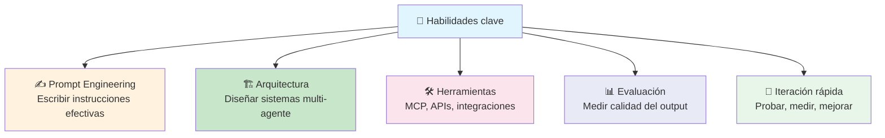

---

## Buenas prácticas generales

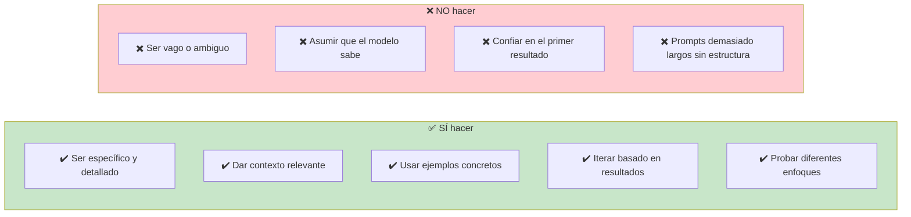

---

## Resumen visual

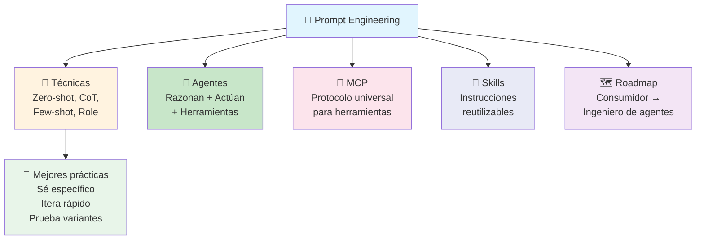

> **Siguiente paso:** Practica las técnicas de prompting con Claude/GPT. Luego experimenta con skills en OpenCode o Cursor, y finalmente construye tu propio MCP server para conectar tus herramientas favoritas.

## Relacionados:
- [[codigo-asistido-por-ia]] #anterior 