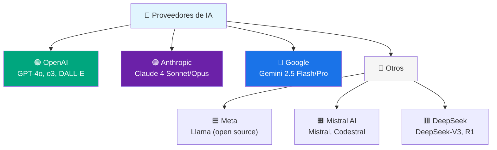
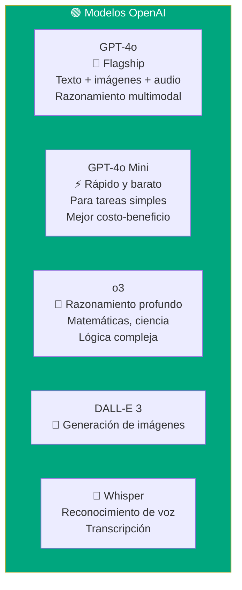
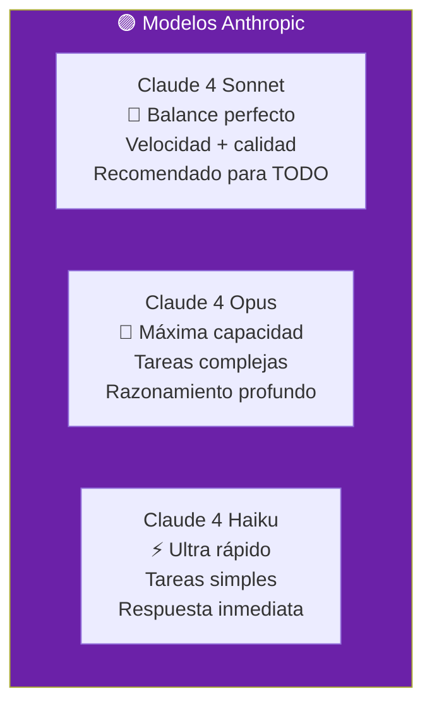
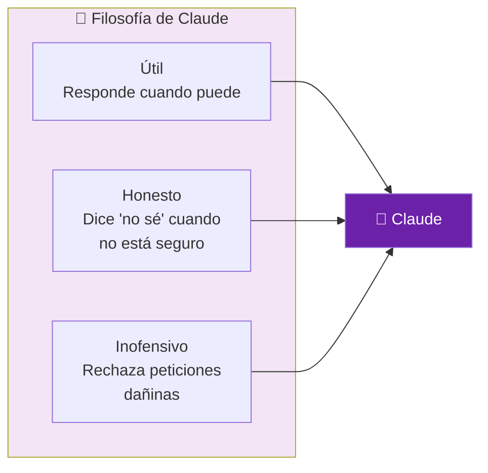
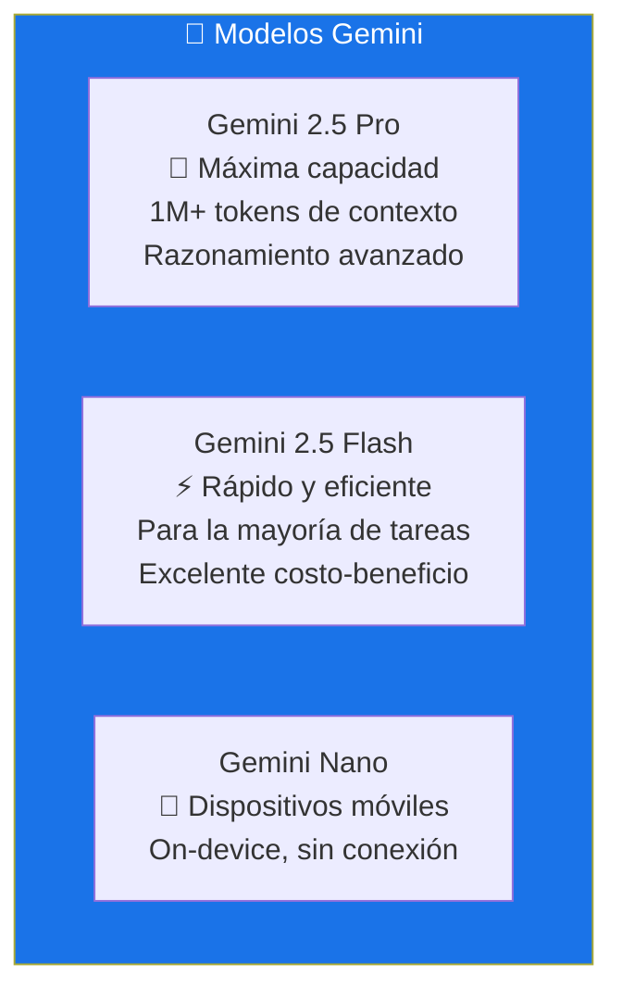
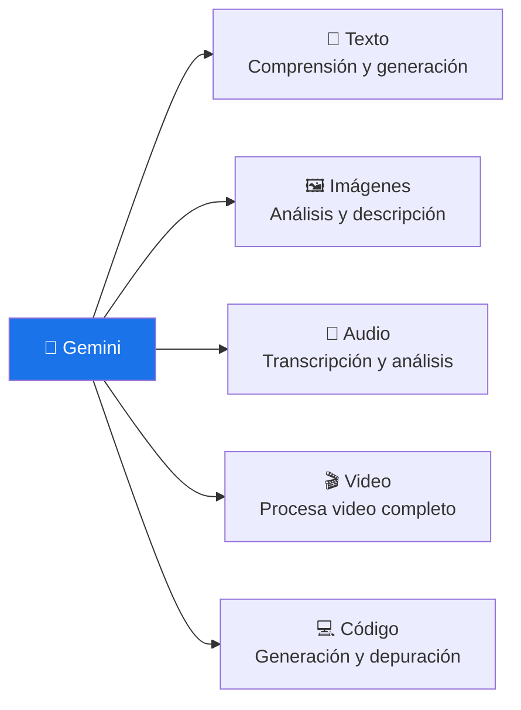
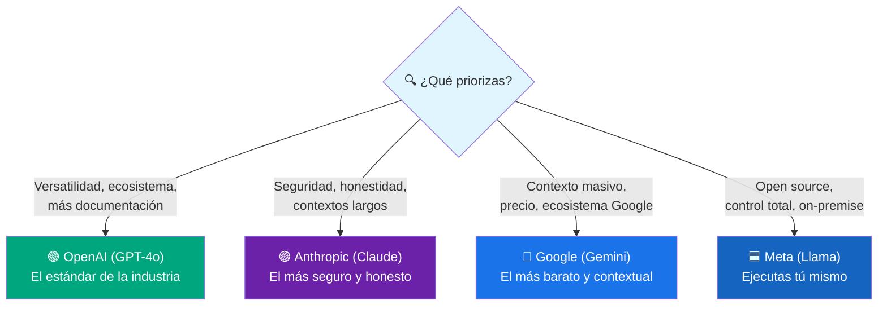
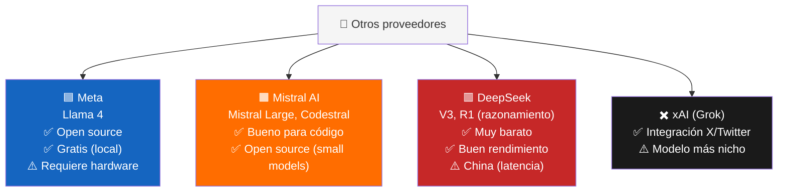
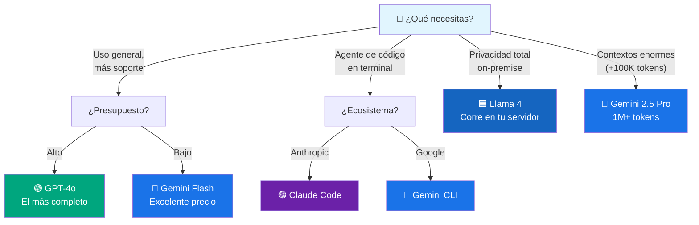
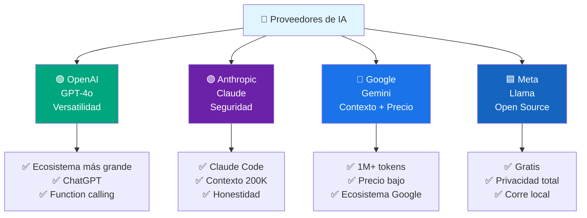

# Proveedores de IA

Los **proveedores de IA** son las empresas que desarrollan y ofrecen modelos de lenguaje (LLMs) a través de APIs. Cada uno tiene su filosofía, modelos emblemáticos y casos de uso ideales.



---

## OpenAI

**OpenAI** es la empresa que inició la revolución de los LLMs con ChatGPT. Sus modelos son los más conocidos y usados del mundo.



### Características clave

- **ChatGPT** — el producto estrella, interfaz conversacional
- **API versátil** — la más usada en integraciones
- **Function calling** — pionero en llamar herramientas desde el modelo
- **Modos** — texto, imágenes, audio, TTS
- **Razonamiento** — modelo o3 para problemas complejos

### Precios aproximados (por millón de tokens)

| Modelo       | Input (por M tokens) | Output (por M tokens) |
| ------------ | -------------------- | --------------------- |
| GPT-4o       | $2.50                | $10.00                |
| GPT-4o Mini  | $0.15                | $0.60                 |
| o3           | $10.00               | $40.00                |

```python
# Ejemplo con OpenAI
from openai import OpenAI

client = OpenAI()

response = client.chat.completions.create(
    model="gpt-4o",
    messages=[
        {"role": "system", "content": "Eres un experto en Python"},
        {"role": "user", "content": "Explica las diferencias entre listas y tuplas"}
    ]
)
print(response.choices[0].message.content)
```

> **¿Para quién?** Si quieres el modelo más versátil y conocido, con el ecosistema más grande de herramientas y documentación.

---

## Anthropic

**Anthropic** es la empresa creadora de **Claude**, un modelo conocido por su **seguridad, alineación y capacidad de razonamiento**. Fue fundada por ex-empleados de OpenAI.



### Características clave

- **Seguridad por diseño** — Constitutional AI, entrenado para ser útil y honesto
- **Contexto largo** — hasta 200K tokens (puede leer libros enteros)
- **Tool use / Function calling** — excelente para agentes y herramientas
- **Claude Code** — agente de código en terminal
- **Artefactos** — genera y muestra documentos, código, diagramas en la interfaz

### Filosofía de Claude



### Precios aproximados (por millón de tokens)

| Modelo           | Input (por M tokens) | Output (por M tokens) |
| ---------------- | -------------------- | --------------------- |
| Claude Sonnet    | $3.00                | $15.00                |
| Claude Opus      | $15.00               | $75.00                |
| Claude Haiku     | $0.25                | $1.25                 |

```python
# Ejemplo con Anthropic
from anthropic import Anthropic

client = Anthropic()

response = client.messages.create(
    model="claude-sonnet-4-20250514",
    max_tokens=1000,
    system="Eres un experto en Python",
    messages=[
        {"role": "user", "content": "Explica las diferencias entre listas y tuplas"}
    ]
)
print(response.content[0].text)
```

> **¿Para quién?** Si priorizas la seguridad, quieres un modelo honesto (que admita cuando no sabe), y necesitas contextos muy largos o razonamiento profundo.

---

## Google (Gemini)

**Google DeepMind** desarrolla **Gemini**, una familia de modelos multimodales nativos integrados con el ecosistema Google.



### Características clave

- **Contexto masivo** — 1M+ tokens (puede analizar repos enteros)
- **Multimodal nativo** — texto, imágenes, audio, video desde el diseño
- **Google ecosystem** — integración con Google Cloud, Workspace, Search
- **Gemini CLI** — agente de código en terminal
- **Grounding** — puede buscar en Google para respuestas actualizadas



### Precios aproximados (por millón de tokens)

| Modelo           | Input (por M tokens) | Output (por M tokens) |
| ---------------- | -------------------- | --------------------- |
| Gemini 2.5 Flash | $0.15                | $0.60                 |
| Gemini 2.5 Pro   | $1.25                | $5.00                 |

```python
# Ejemplo con Gemini
import google.generativeai as genai

genai.configure(api_key="tu-api-key")
model = genai.GenerativeModel("gemini-2.5-flash")

response = model.generate_content("Explica las diferencias entre listas y tuplas")
print(response.text)
```

> **¿Para quién?** Si necesitas contextos muy grandes, estás en el ecosistema Google Cloud, o quieres el mejor precio por calidad.

---

## Comparativa



### Tabla comparativa

| Característica         | OpenAI (GPT-4o)     | Anthropic (Claude)   | Google (Gemini)      |
| ---------------------- | ------------------- | -------------------- | -------------------- |
| **Modelo estrella**    | GPT-4o              | Claude Sonnet 4      | Gemini 2.5 Flash     |
| **Contexto máximo**    | 128K tokens         | 200K tokens          | 1M+ tokens           |
| **Multimodal**         | ✅ Texto + Img + Audio | ✅ Texto + Imágenes | ✅ Texto + Img + Audio + Video |
| **Agente de código**   | ❌ (solo API)       | ✅ Claude Code       | ✅ Gemini CLI        |
| **Open source**        | ❌                  | ❌                   | ❌                   |
| **Precio (input/M)**   | ~$2.50              | ~$3.00               | ~$0.15               |
| **Fortaleza única**    | Ecosistema + ChatGPT| Seguridad + Honestidad| Contexto masivo + precio |

---

## Otros proveedores destacados



### ¿Cuándo usar cada uno?

| Proveedor     | Ideal para                                    |
| ------------- | --------------------------------------------- |
| **OpenAI**    | Cualquier tarea, máxima compatibilidad        |
| **Anthropic** | Seguridad, agentes, contextos largos          |
| **Google**    | Contexto masivo, precio, ecosistema Google     |
| **Meta (Llama)** | On-premise, privacidad, sin costo de API  |
| **Mistral**   | Código, modelos ligeros open source            |
| **DeepSeek**  | Razonamiento barato, presupuesto ajustado      |

---

## Cómo elegir un proveedor



---

## Resumen visual



> **Siguiente paso:** Regístrate en las APIs de OpenAI, Anthropic y Google (todas tienen crédito gratis inicial). Prueba el mismo prompt en los tres modelos y compara resultados. Así encontrarás tu favorito.

## Relacionados:
- [[codigo-asistido-por-ia]] #anterior 
- [[patrones-de-integracion]] #siguiente 