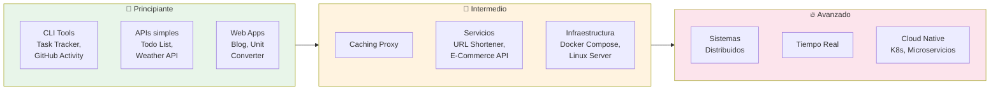
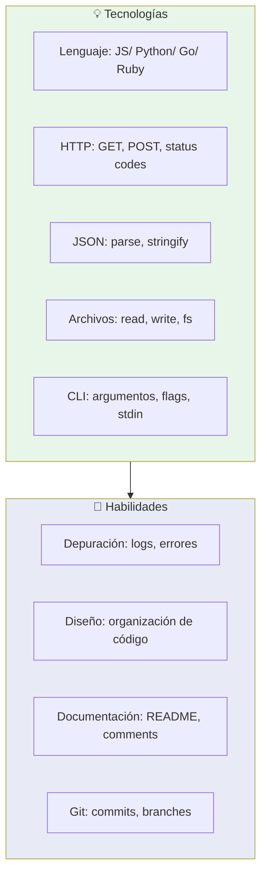
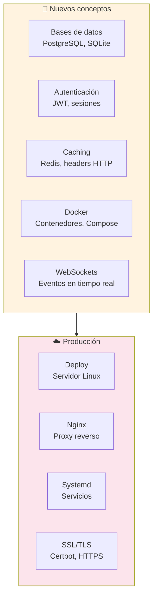
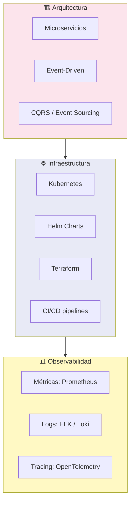

# Proyectos Backend para Principiantes

La mejor forma de aprender backend es **construyendo**. Estos proyectos están clasificados por dificultad y cubren desde CLI básicos hasta sistemas distribuidos. No los leas — hazlos.



---

## 🌱 Nivel Principiante

Enfócate en dominar: **CLI, APIs REST, JSON, CRUD, archivos**.

### CLI Tools

| Proyecto | Conceptos | Comenzados |
|---|---|---|
| **Task Tracker CLI** | Argumentos CLI, JSON, archivos, estado | 25k |
| **GitHub User Activity CLI** | HTTP requests, APIs públicas, JSON | 4.7k |
| **Expense Tracker CLI** | CRUD, persistencia en archivos | 4.1k |
| **Number Guessing Game CLI** | Lógica, entrada/salida, loops | 4.1k |
| **GitHub Trending CLI** | API GitHub, ranking, terminal UI | 167 |
| **TMDB CLI Tool** | APIs REST, JSON, paginación | 474 |

```bash
# Ejemplo: estructura de un CLI en Node.js
#!/usr/bin/env node
const [,, command, ...args] = process.argv

switch (command) {
    case 'add':
        // add task to JSON file
        break
    case 'list':
        // read and display tasks
        break
}
```

### APIs Web

| Proyecto | Conceptos | Comenzados |
|---|---|---|
| **Todo List API** | REST, CRUD, routing, status codes | 1.9k |
| **Weather API** | API externa, fetch, caching | 2.8k |
| **Blogging Platform API** | CRUD, auth básica, paginación | 1.3k |
| **Expense Tracker API** | REST, filtros, ordenamiento | 1.2k |
| **Unit Converter Web App** | SSR, formularios, lógica | 1.9k |
| **Personal Blog Web App** | SSR/SPA, templates, posts | 2k |

### Habilidades que ganarás



### 💡 Cómo abordarlos

1. **Elige un lenguaje** que ya conozcas (JS/ Python/ Go)
2. **No uses frameworks** al principio — puro HTTP nativo
3. **Persiste en archivos JSON** primero, luego migra a BD
4. **Termínalo** antes de empezar otro
5. **Súbelo a GitHub** con un README que explique qué aprendiste

---

## 🚀 Nivel Intermedio

Construye sobre lo básico: **bases de datos, autenticación, Docker, caching**.

| Proyecto | Conceptos | Comenzados |
|---|---|---|
| **Caching Proxy** | Proxy inverso, headers Cache-Control, TTL | 1.8k |
| **URL Shortening Service** | Hash IDs, redirects 301/302, analytics | 1.3k |
| **E-Commerce API** | Auth, carrito, pagos, ORM, migraciones | 2k |
| **Markdown Note-taking App** | Parsing, editor, persistencia | 858 |
| **Broadcast Server** | WebSockets, pub/sub, conexiones concurrentes | 742 |
| **Workout Tracker** | CRUD con auth, relaciones, estadísticas | 1k |
| **Image Processing Service** | Upload, resize, formatos, storage | 633 |
| **Multi-Container Application** | Docker Compose, servicios, redes | 213 |
| **Linux Server Setup** | SSH, firewall, nginx, systemd, seguridad | 146 |

### Habilidades que ganarás



### 💡 Cómo abordarlos

1. **Usa un framework** (Express, FastAPI, Gin, Rails)
2. **Agrega una BD real** (PostgreSQL recomendada)
3. **Dockeriza** la aplicación
4. **Despliega** en un VPS con nginx + systemd
5. **Documenta** toda la arquitectura

---

## 🔥 Nivel Avanzado

Sistemas distribuidos, escalabilidad, cloud-native.

| Proyecto | Conceptos | Comenzados |
|---|---|---|
| **Scalable E-Commerce Platform** | Microservicios, Docker, K8s, event-driven | 2.8k |
| **Movie Reservation System** | Concurrencia, transacciones, locking, pagos | 2.4k |
| **Real-time Leaderboard System** | Redis Sorted Sets, WebSockets, streaming | 1.5k |
| **Database Backup Utility** | Estrategias backup/restore, cron, S3 | 1.3k |
| **API Gateway** | Rate limiting, routing, auth centralizada | 1.2k |
| **Message Queue System** | RabbitMQ / Kafka, productores, consumidores | 934 |
| **Caching and Load Balancing** | CDN, reverse proxy, sticky sessions | 755 |
| **Security Audit Tool** | OWASP, pentesting, reportes | 563 |
| **Cloud-Native Application** | K8s, Helm, CI/CD, auto-scaling | 463 |
| **AI/ML Integration** | Embeddings, RAG, LLM APIs, vectors | 385 |

### Habilidades que ganarás



---

## 🗺️ Ruta de aprendizaje sugerida

```mermaid
flowchart LR
    CLI["🖥️ Task Tracker CLI"] --> API["🌐 Todo List API"]
    API --> AuthAPI["🛡️ E-Commerce API"]
    AuthAPI --> CacheProxy["⚡ Caching Proxy"]
    CacheProxy --> Docker["🐳 Multi-Container App"]
    Docker --> K8s["☸️ Scalable E-Commerce"]
    K8s --> MQ["📨 Message Queue System"]
    MQ --> Cloud["☁️ Cloud-Native App"]

    style CLI fill:#e8f5e9
    style API fill:#e8f5e9
    style AuthAPI fill:#fff3e0
    style CacheProxy fill:#fff3e0
    style Docker fill:#fff3e0
    style K8s fill:#fce4ec
    style MQ fill:#fce4ec
    style Cloud fill:#fce4ec
```



---

## ⚡ Consejos finales

| ☝️ Haz esto | 🚫 Evita esto |
|---|---|
| Termina proyectos pequeños | Empezar 10 proyectos a la vez |
| Usa Git desde el día 1 | Deploy sin pruebas manuales |
| Despliega en producción real | Quedarte solo en localhost |
| Lee código de proyectos open source | Copiar sin entender |
| Escribe tests | Ignorar errores |
| Documenta tu aprendizaje | Esperar a "saber suficiente" |

El mejor proyecto no es el más complejo — es el **que terminas**.

> **Siguiente paso:** Elige un proyecto principiante, créalo desde cero, y súbelo a GitHub. Cuando termines, muévete al siguiente nivel.

## Relacionados:
- [[elige-un-lenguaje-de-backend]] #anterior
- [[sistema-de-control-de-versiones]] #siguiente