# Seguridad Web

La seguridad web abarca las prácticas, protocolos y herramientas para proteger aplicaciones web contra ataques, fugas de datos y accesos no autorizados.

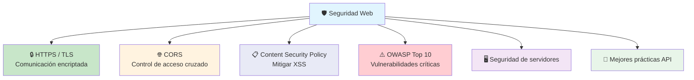

---

## HTTPS / SSL / TLS

**HTTPS** (HTTP over SSL/TLS) encripta toda la comunicación entre el navegador y el servidor. Sin HTTPS, cualquier dato viaja en texto plano y puede ser interceptado.

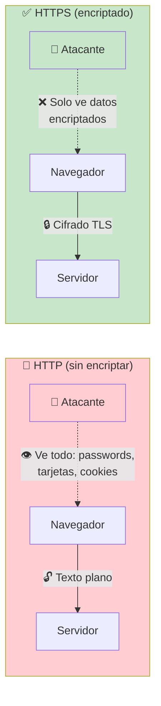

> **Analogía:** HTTP es una postal (cualquiera la lee). HTTPS es una carta sellada (solo el destinatario la abre).

### TLS Handshake (apretón de manos)

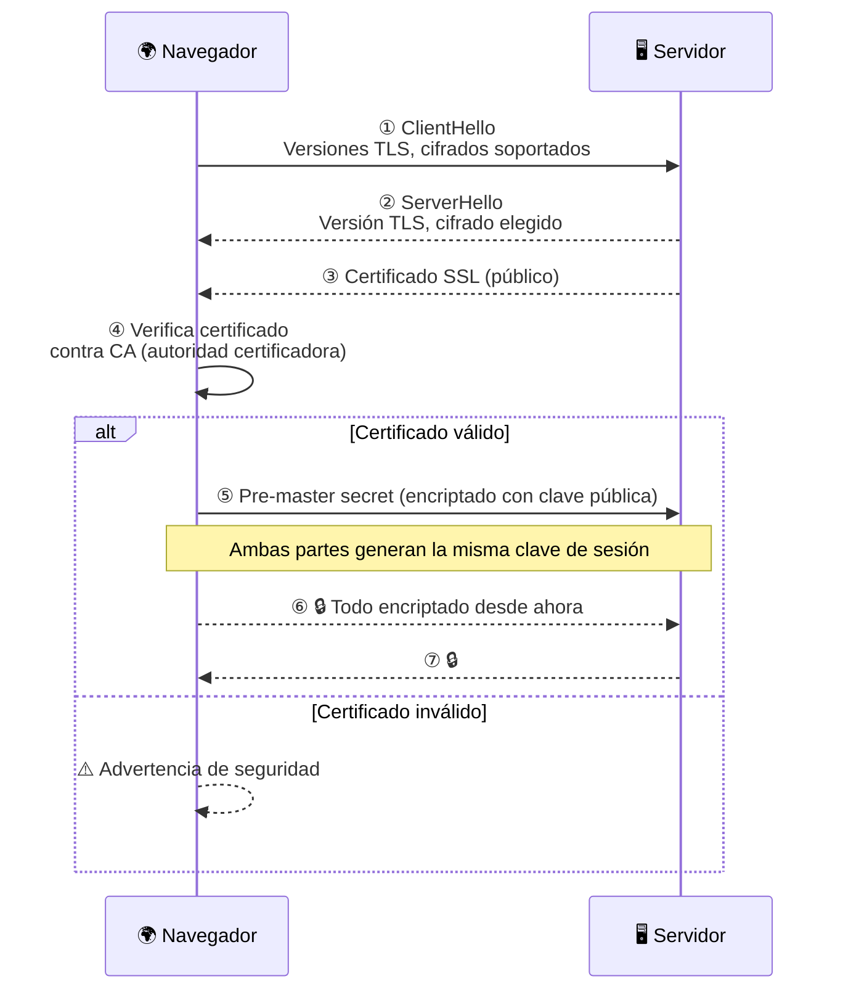

### ¿Qué es un certificado SSL?

Es un archivo digital que **vincula una identidad (dominio) con una clave pública**. Es emitido por una **CA** (Certificate Authority) como Let's Encrypt, DigiCert, Cloudflare.

```
🔐 Certificado contiene:
├── Dominio: mipagina.com
├── Emitido por: Let's Encrypt
├── Válido: 01/01/2025 - 01/04/2025
├── Clave pública: [clave para encriptar]
└── Firma digital de la CA
```

### Cómo obtener HTTPS

```bash
# Let's Encrypt + Certbot (¡gratis!)
sudo certbot --nginx -d mipagina.com -d www.mipagina.com

# O con Caddy (HTTPS automático)
# Solo pones el dominio en el Caddyfile y ya.
```

---

## CORS

**CORS** (Cross-Origin Resource Sharing) es un mecanismo de seguridad del navegador que controla qué dominios pueden acceder a los recursos de tu servidor.

### El problema del mismo origen

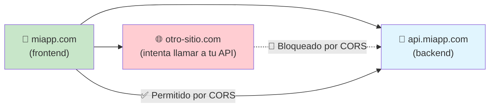

### Cómo funciona CORS

El navegador envía una cabecera `Origin` y el servidor responde si acepta o no ese origen.

```http
# Petición desde otro-sitio.com
GET /api/usuarios HTTP/1.1
Origin: https://otro-sitio.com

# Respuesta del servidor
HTTP/1.1 200 OK
Access-Control-Allow-Origin: https://miapp.com
#                             ↑ solo miapp.com tiene acceso
# O también:
Access-Control-Allow-Origin: *   # cualquiera (público)
```

### Preflight (OPTIONS)

Para peticiones "complejas" (métodos distintos a GET/POST, cabeceras personalizadas), el navegador primero envía una petición **OPTIONS** de verificación.

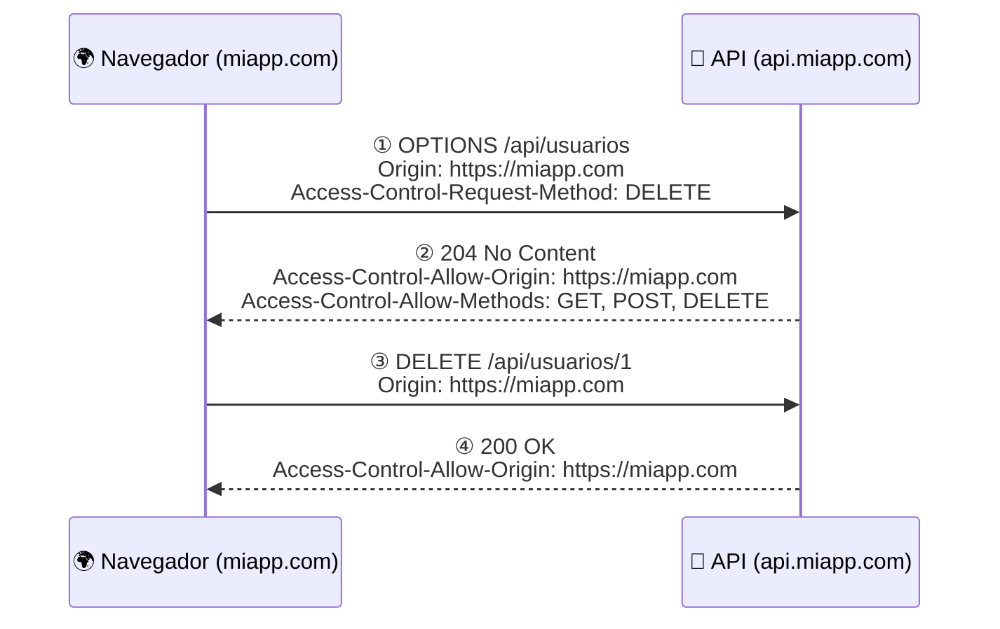

### Configuración CORS en backend

```javascript
// Node.js (Express)
app.use(cors({
    origin: 'https://miapp.com',
    methods: ['GET', 'POST', 'PUT', 'DELETE'],
    allowedHeaders: ['Content-Type', 'Authorization'],
    credentials: true
}));
```

```python
# FastAPI
app.add_middleware(
    CORSMiddleware,
    allow_origins=["https://miapp.com"],
    allow_methods=["*"],
    allow_headers=["*"],
)
```

### Buenas prácticas CORS

- **No uses `*` en producción** — especifica orígenes exactos
- **Credenciales** — si usas cookies, necesitas `credentials: true` y origen específico (no `*`)
- **Solo expón lo necesario** — no permitas métodos que no uses

---

## CSP (Content Security Policy)

**CSP** es una cabecera HTTP que controla **qué fuentes** (scripts, estilos, imágenes, etc.) puede cargar el navegador. Es la defensa más efectiva contra **XSS** (Cross-Site Scripting).

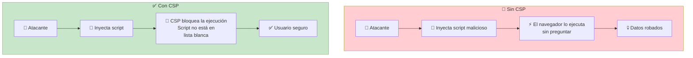

### Ejemplo de CSP

```http
Content-Security-Policy:
    default-src 'self';
    script-src 'self' https://cdn.jsdelivr.net;
    style-src 'self' https://fonts.googleapis.com;
    img-src 'self' https://images.example.com;
    font-src 'self' https://fonts.gstatic.com;
    connect-src 'self' https://api.miapp.com;
    frame-ancestors 'none';
```

| Directiva     | Controla                                    |
| ------------- | ------------------------------------------- |
| `default-src` | Fallback para todas las fuentes             |
| `script-src`  | Scripts JS permitidos                       |
| `style-src`   | Hojas de estilo permitidas                  |
| `img-src`     | Imágenes permitidas                         |
| `connect-src` | Conexiones fetch/XHR/WebSocket              |
| `font-src`    | Fuentes tipográficas                        |
| `frame-ancestors` | Quién puede incrustar en iframe (protege clickjacking) |

### Implementación

```javascript
// Node.js (helmet)
const helmet = require('helmet');
app.use(helmet.contentSecurityPolicy({
    directives: {
        defaultSrc: ["'self'"],
        scriptSrc: ["'self'", "https://cdn.jsdelivr.net"],
        // ...
    }
}));
```

---

## Riesgos OWASP

El **OWASP Top 10** es la lista de las vulnerabilidades web más críticas, actualizada por la comunidad de seguridad.

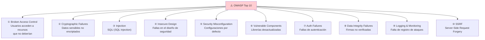

### Los más críticos para empezar

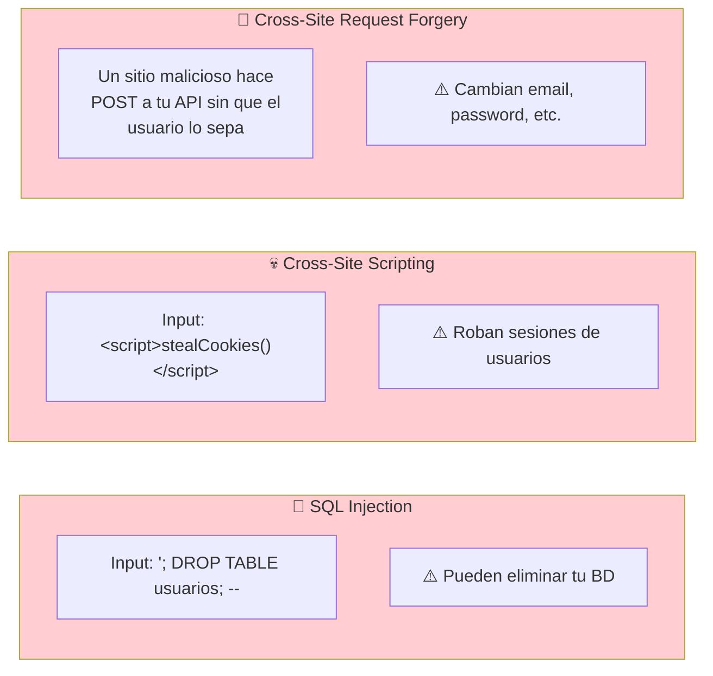

### Cómo mitigarlos

| Vulnerabilidad       | Mitigación                                       |
| -------------------- | ------------------------------------------------ |
| **SQL Injection**    | Usar **query parametrizado** (ORM/ prepared statements), nunca concatenar strings |
| **XSS**              | CSP, escapar output, validar input, cookies HttpOnly |
| **CSRF**             | Tokens CSRF, SameSite=Strict/Lax, verificar Origin/Referer |
| **Broken Access Control** | Validar permisos en cada endpoint, no confiar en parámetros del cliente |
| **Security Misconfiguration** | Deshabilitar servicios innecesarios, cabeceras de seguridad |

#### Ejemplo: SQL Injection vs Query parametrizado

```javascript
// ❌ VULNERABLE (no hagas esto)
const query = `SELECT * FROM usuarios WHERE email = '${email}'`;
// Input: email = "'; DROP TABLE usuarios; --"
// Resultado: ¡BD destruida!

// ✅ SEGURO (query parametrizado)
const query = 'SELECT * FROM usuarios WHERE email = ?';
db.query(query, [email]);
```

---

## Seguridad de servidores

Proteger el servidor donde corre tu aplicación es tan importante como escribir código seguro.

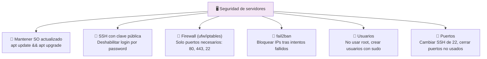

### Comandos esenciales de hardening

```bash
# Firewall (ufw)
sudo ufw default deny incoming
sudo ufw default allow outgoing
sudo ufw allow 22/tcp       # SSH
sudo ufw allow 80/tcp       # HTTP
sudo ufw allow 443/tcp      # HTTPS
sudo ufw enable

# fail2ban
sudo apt install fail2ban
sudo systemctl enable fail2ban

# SSH hardening
# /etc/ssh/sshd_config:
#   PermitRootLogin no
#   PasswordAuthentication no
#   PubkeyAuthentication yes
sudo systemctl restart sshd
```

### Cabeceras de seguridad HTTP

El servidor debe enviar estas cabeceras en todas las respuestas:

```http
Strict-Transport-Security: max-age=31536000; includeSubDomains
X-Content-Type-Options: nosniff
X-Frame-Options: DENY
Content-Security-Policy: default-src 'self'
Referrer-Policy: no-referrer
Permissions-Policy: camera=(), microphone=(), geolocation=()
```

```javascript
// Node.js con helmet (incluye todo)
const helmet = require('helmet');
app.use(helmet());
```

```python
# Python con Django
SECURE_HSTS_SECONDS = 31536000
SECURE_CONTENT_TYPE_NOSNIFF = True
SECURE_BROWSER_XSS_FILTER = True
```

---

## Mejores prácticas de seguridad para APIs

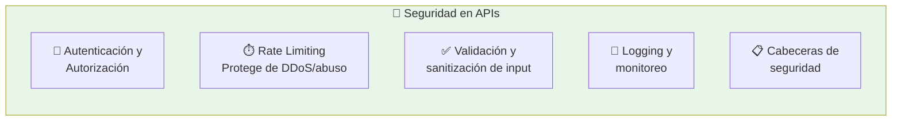

### Checklist de seguridad para APIs

- [ ] **HTTPS obligatorio** — redirige todo HTTP a HTTPS
- [ ] **Autenticación** — JWT, OAuth 2.0, o similar. No APIs abiertas sin auth
- [ ] **Rate limiting** — límite de peticiones por IP/usuario por minuto
- [ ] **Validar todo input** — nunca confíes en datos del cliente
- [ ] **No exponer información interna** — mensajes de error genéricos, sin stack traces
- [ ] **CORS restrictivo** — solo orígenes necesarios
- [ ] **Logging** — registra intentos de acceso, errores, cambios importantes
- [ ] **IDOR prevention** — verifica que el usuario tenga permiso para el recurso que pide
- [ ] **API keys** — rotación periódica, no hardcodearlas

### Rate limiting example

```javascript
// Express + express-rate-limit
const rateLimit = require('express-rate-limit');

const limiter = rateLimit({
    windowMs: 15 * 60 * 1000,  // 15 minutos
    max: 100,                    // 100 peticiones por ventana
    message: 'Demasiadas peticiones, intenta más tarde'
});

app.use('/api/', limiter);
```

### Manejo seguro de errores

```javascript
// ❌ MAL: expone información interna
{ "error": "SQLSTATE[23000]: ... duplicate entry 'admin' for key 'username'" }

// ✅ BIEN: mensaje genérico
{ "error": "El nombre de usuario ya está en uso" }
```

---

## Resumen visual

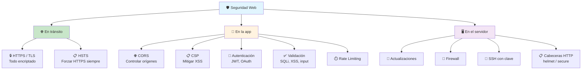

### Principios básicos de seguridad

| Principio                 | Significado                                      |
| ------------------------- | ------------------------------------------------ |
| **Defense in depth**      | Múltiples capas de seguridad (ninguna es suficiente sola) |
| **Least privilege**       | Mínimos permisos necesarios para cada usuario/servicio |
| **Never trust user input**| Todo input del cliente es potencialmente malicioso |
| **Security by design**    | La seguridad se integra desde el diseño, no se añade después |
| **Keep it simple**        | Complejidad innecesaria = más superficie de ataque |

> **Siguiente paso:** Implementa helmet en tu backend, configura CORS correctamente, añade rate limiting, y estudia el [OWASP Top 10](https://owasp.org/www-project-top-ten/) en detalle.
