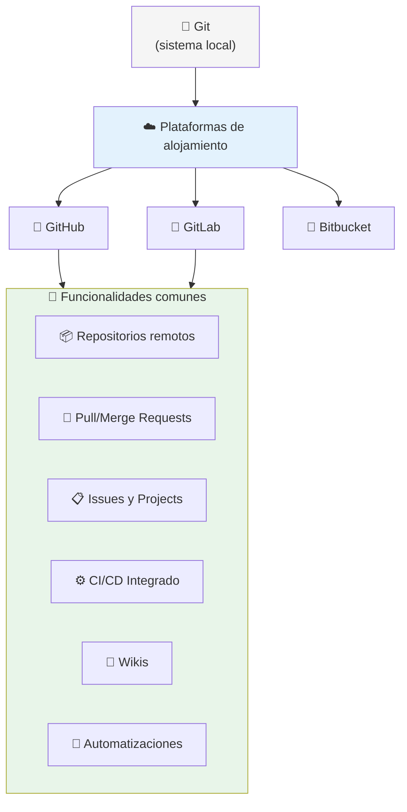
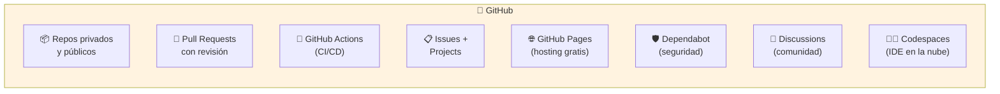
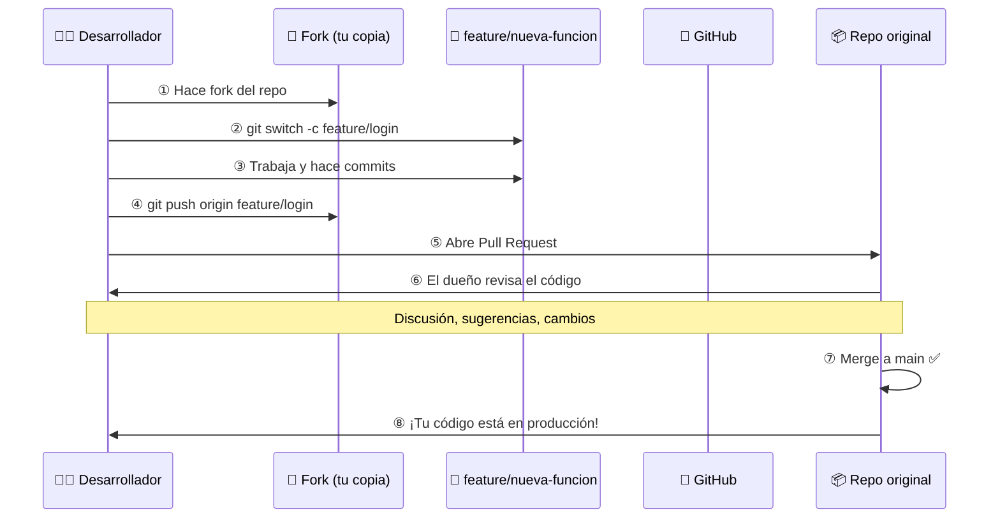
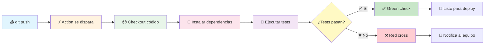
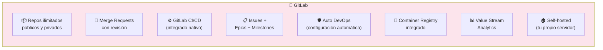
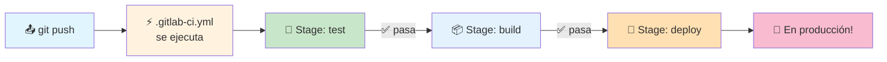
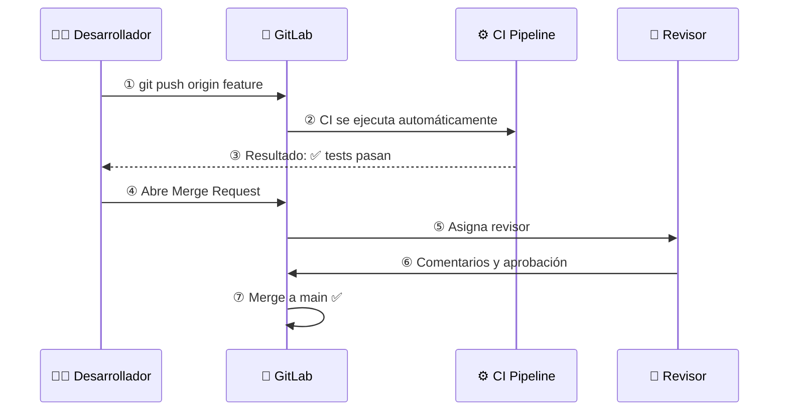
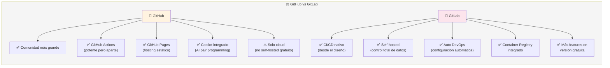
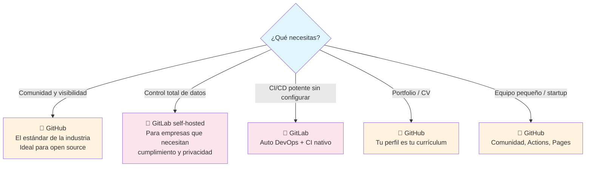

# Servicio de Alojamiento de Repositorios

Los servicios de alojamiento de repositorios son plataformas que almacenan tu código en la nube y añaden herramientas de colaboración: revisión de código, CI/CD, gestión de issues, wikis y más.



---

## GitHub

GitHub es la plataforma más grande del mundo para alojar código. Propiedad de Microsoft, alberga más de **100 millones de repositorios** y es el hogar de proyectos como React, Vue, Node.js, y el kernel de Linux.



### Pull Request: el corazón de la colaboración en GitHub



### GitHub Actions: flujo típico

```yaml
name: CI
on: [push, pull_request]
jobs:
  test:
    runs-on: ubuntu-latest
    steps:
      - uses: actions/checkout@v4
      - run: npm install
      - run: npm test
```



### Comandos esenciales para trabajar con GitHub

```bash
# Clonar un repositorio
git clone https://github.com/usuario/repo.git

# Conectar repo local a GitHub
git remote add origin https://github.com/usuario/repo.git

# Subir código por primera vez
git branch -M main
git push -u origin main

# Hacer fork de un repo (desde la web) y luego:
git clone https://github.com/tu-usuario/repo-forkeado.git
git remote add upstream https://github.com/original/repo.git
git fetch upstream
git merge upstream/main
```

### Ventajas de GitHub

| Característica       | Descripción breve                           |
| -------------------- | ------------------------------------------- |
| **Comunidad**        | La red social de código más grande del mundo |
| **GitHub Actions**   | CI/CD integrado sin necesidad de terceros   |
| **GitHub Pages**     | Hosting gratuito para sitios estáticos       |
| **Codespaces**       | Entorno de desarrollo en la nube            |
| **Dependabot**       | Seguridad automatizada de dependencias      |
| **Projects**         | Gestión de proyectos tipo Kanban            |

---

## GitLab

GitLab es una plataforma completa de DevOps **open source**. A diferencia de GitHub, ofrece CI/CD integrado desde el inicio y permite auto-hospedaje (self-hosted) en tu propio servidor.



### La diferencia clave: CI/CD nativo

Mientras que en GitHub Actions es un añadido posterior, GitLab nació con **CI/CD en el núcleo**. El archivo `.gitlab-ci.yml` se define en la raíz del repo y GitLab lo ejecuta automáticamente en cada push.

```yaml
stages:
  - test
  - build
  - deploy

test:
  stage: test
  script:
    - npm install
    - npm test

build:
  stage: build
  script:
    - npm run build

deploy:
  stage: deploy
  script:
    - rsync -avz ./dist/ usuario@servidor:/var/www/
```



### Merge Request en GitLab



### Auto DevOps

GitLab puede **configurar todo automáticamente**: detecta el lenguaje, crea el pipeline, construye la imagen Docker, la sube al Container Registry y la despliega. Sin escribir una línea de YAML.

---

## GitHub vs GitLab: comparativa



### Tabla comparativa

| Característica              | GitHub                        | GitLab                        |
| --------------------------- | ----------------------------- | ----------------------------- |
| **Tipo**                    | Cloud (GitHub.com)            | Cloud + Self-hosted           |
| **Repos privados gratis**   | Ilimitados                    | Ilimitados                    |
| **CI/CD**                   | GitHub Actions (añadido)      | Nativo (GitLab CI/CD)         |
| **Auto DevOps**             | No                            | Sí                            |
| **Container Registry**      | GitHub Packages               | Nativo                        |
| **Pages / Hosting**         | GitHub Pages (estático)       | GitLab Pages (estático)       |
| **Modelo de negocio**       | Freemium                      | Open Source + Enterprise      |
| **AI integrado**            | Copilot                       | GitLab Duo                    |

---

## ¿Cuál elegir?



> **Ambos son excelentes.** Si recién empiezas, GitHub te da la comunidad más grande y visibilidad. Si necesitas control total o CI/CD nativo, GitLab es imbatible. Muchos equipos usan GitHub para desarrollo y GitLab auto-hospedado para despliegues internos.

## Relacionados:
- [[sistema-de-control-de-versiones]] #anterior 
- [[bases-de-datos-relacionales]] #siguiente 