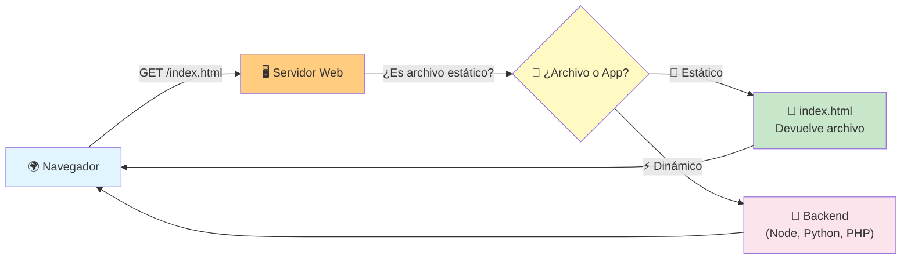
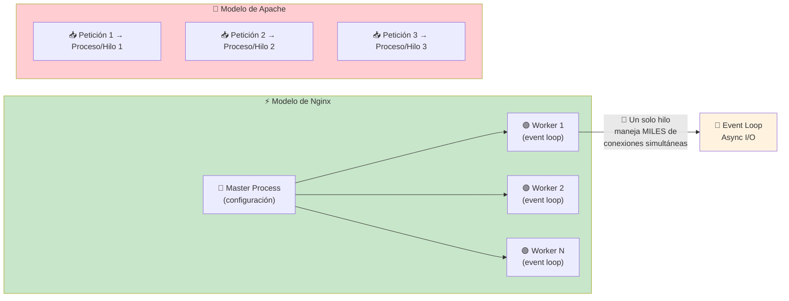
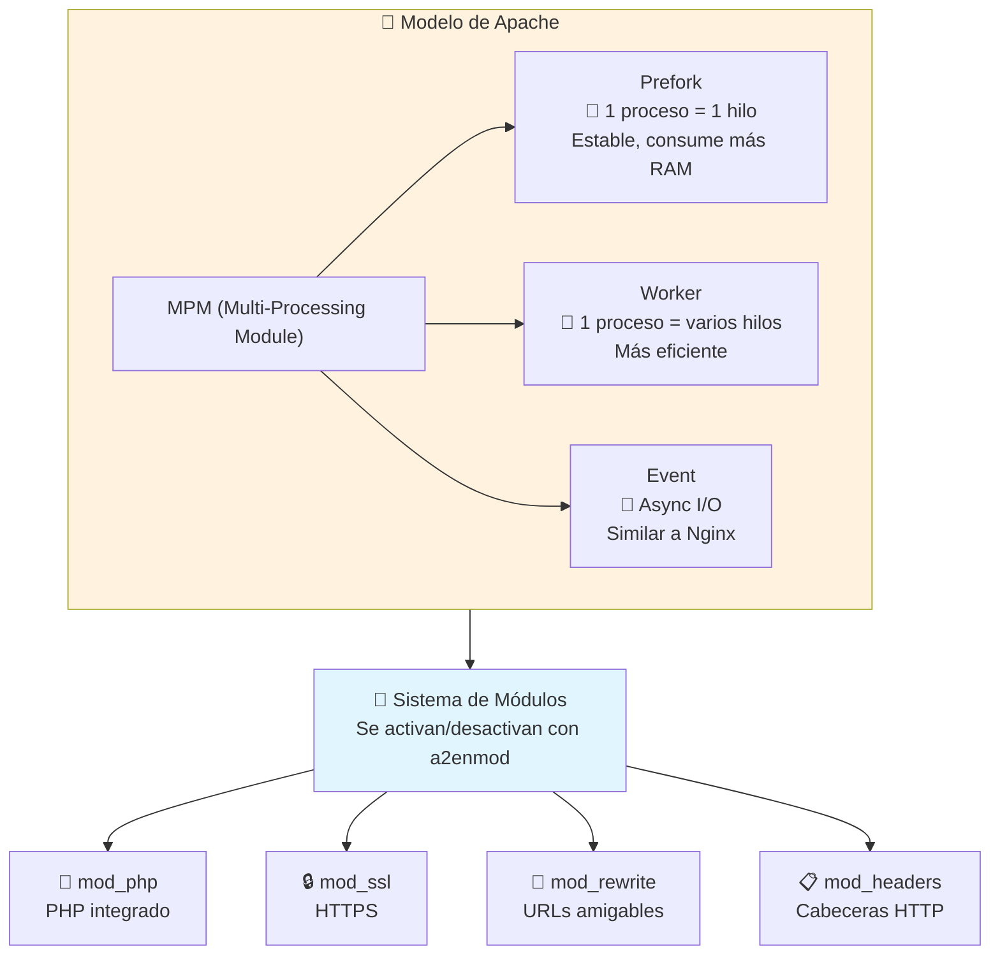
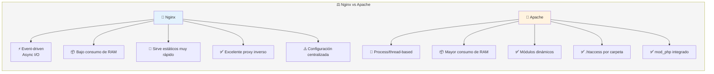
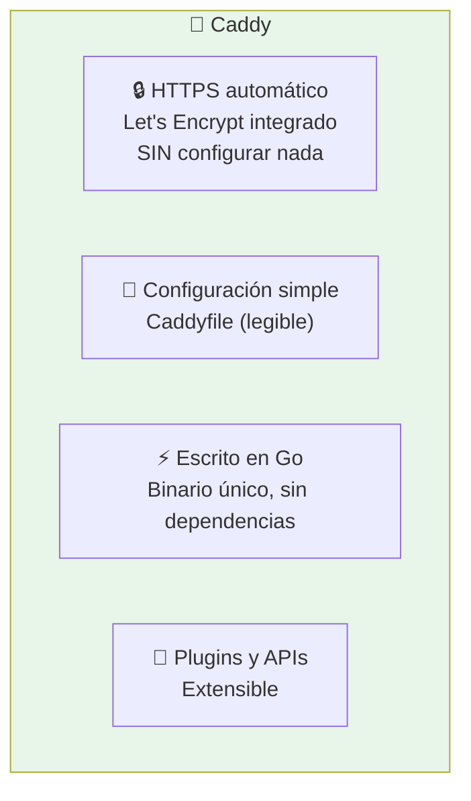
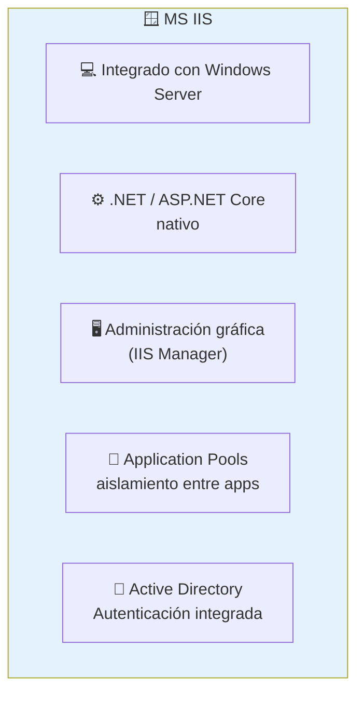
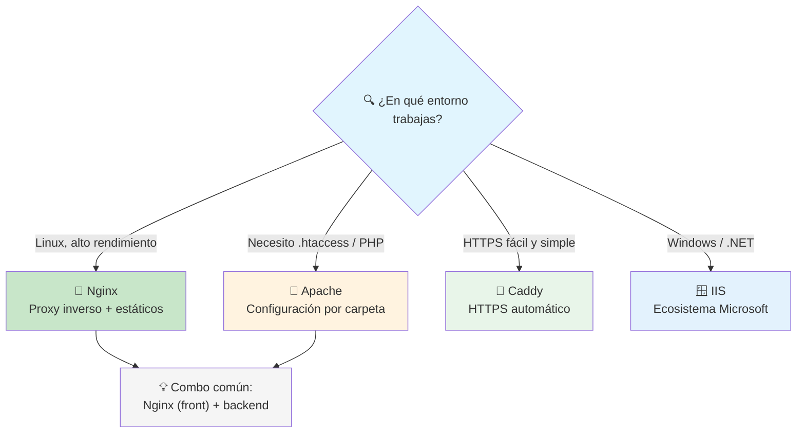
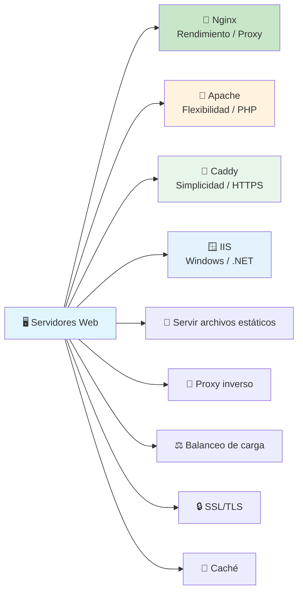

# Servidores Web

Un **servidor web** es un software que recibe peticiones HTTP de los clientes (navegadores) y responde con archivos (HTML, CSS, JS, imágenes) o delega la respuesta a una aplicación backend.



### ¿Qué hace un servidor web?

- **Servir contenido estático** (archivos HTML, CSS, JS, imágenes) directamente
- **Proxy inverso** (reverse proxy) — recibe peticiones y las redirige a un servidor de aplicaciones
- **Balanceo de carga** — distribuye tráfico entre varios servidores backend
- **SSL/TLS** — termina conexiones HTTPS
- **Compresión** — gzip/brotli para respuestas más rápidas
- **Cacheo** — sirve contenido cacheado sin tocar el backend
- **Virtual hosts** — sirve múltiples sitios desde un mismo servidor

---

## Nginx

**Nginx** (engine-x) es el servidor web más usado del mundo. Es famoso por su **alto rendimiento**, su modelo **asíncrono basado en eventos** y su consumo mínimo de recursos.



### Configuración básica de Nginx

```nginx
server {
    listen 80;
    server_name mipagina.com www.mipagina.com;

    root /var/www/mipagina;
    index index.html;

    # Archivos estáticos
    location / {
        try_files $uri $uri/ /index.html;
    }

    # Proxy inverso a Node.js en el puerto 3000
    location /api/ {
        proxy_pass http://localhost:3000;
        proxy_set_header Host $host;
        proxy_set_header X-Real-IP $remote_addr;
    }

    # Cacheo de archivos estáticos
    location ~* \.(jpg|jpeg|png|gif|ico|css|js)$ {
        expires 30d;
        add_header Cache-Control "public, immutable";
    }
}
```

### Usos típicos

```nginx
# 🔄 Balanceo de carga entre 3 servidores Node.js
upstream backend {
    server 10.0.0.1:3000;
    server 10.0.0.2:3000;
    server 10.0.0.3:3000;
}

server {
    listen 80;
    location / {
        proxy_pass http://backend;
    }
}
```

### Comandos esenciales

```bash
sudo nginx -t              # Verificar sintaxis de la configuración
sudo systemctl start nginx # Iniciar Nginx
sudo systemctl reload nginx # Recargar configuración sin cortar servicio
sudo nginx -s reload       # Alternativa para recargar
sudo systemctl status nginx # Ver estado
```

| Ventajas                      | Desventajas                    |
| ----------------------------- | ------------------------------ |
| Alto rendimiento (eventos)    | No tiene `.htaccess` (todo centralizado) |
| Bajo consumo de RAM           | Módulos dinámicos requieren compilar |
| Proxy inverso excelente       |                                 |
| Sirve archivos estáticos muy rápido |                            |

---

## Apache

**Apache HTTP Server** fue el servidor web dominante durante décadas. Su fortaleza es la **flexibilidad** mediante módulos y la configuración por directorio (`.htaccess`).

- **Modelo:** Basado en procesos/hilos (cada conexión = un proceso o hilo)
- **Módulos:** `mod_php`, `mod_ssl`, `mod_rewrite`, `mod_proxy`, cientos más
- **Configuración por directorio:** Cada carpeta puede tener su propio `.htaccess`



### Configuración básica de Apache

```apache
<VirtualHost *:80>
    ServerName mipagina.com
    DocumentRoot /var/www/mipagina

    <Directory /var/www/mipagina>
        Options Indexes FollowSymLinks
        AllowOverride All
        Require all granted
    </Directory>

    # Proxy inverso
    ProxyPass /api/ http://localhost:3000/
    ProxyPassReverse /api/ http://localhost:3000/

    ErrorLog ${APACHE_LOG_DIR}/error.log
    CustomLog ${APACHE_LOG_DIR}/access.log combined
</VirtualHost>
```

### Ejemplo de `.htaccess`

```apache
# En la carpeta del proyecto
RewriteEngine On
RewriteCond %{REQUEST_FILENAME} !-f
RewriteCond %{REQUEST_FILENAME} !-d
RewriteRule ^ index.php [QSA,L]
```

### Comandos esenciales

```bash
sudo apachectl configtest          # Verificar configuración
sudo systemctl start apache2       # Iniciar Apache
sudo a2enmod rewrite               # Activar módulo rewrite
sudo a2ensite mipagina.conf        # Activar sitio
sudo systemctl reload apache2      # Recargar configuración
```

| Ventajas                      | Desventajas                        |
| ----------------------------- | ---------------------------------- |
| Configuración por directorio  | Mayor consumo de RAM por conexión |
| Gran cantidad de módulos      | Rendimiento inferior en alto tráfico |
| PHP integrado nativo          | Modelo proceso/hilo escala peor   |
| Documentación enorme          |                                    |

### Nginx vs Apache



> **¿Cuál elegir?** Nginx para alto rendimiento, proxy inverso y archivos estáticos. Apache si necesitas `.htaccess` o módulos como mod_php. Hoy en día la combinación más común es **Nginx como proxy inverso + backend** (Node, Python, etc.).

---

## Caddy

**Caddy** es un servidor web moderno escrito en Go que se destaca por su **HTTPS automático** y su **configuración simple y legible**. Es el servidor más fácil de poner en marcha.



### Configuración básica (Caddyfile)

```caddy
mipagina.com {
    root * /var/www/mipagina
    file_server

    # Proxy inverso
    reverse_proxy /api/* localhost:3000

    # Compresión
    encode gzip
}

# ¡HTTPS automático! No necesitas certificados
```

### Características destacadas

| Característica               | Caddy                                |
| ---------------------------- | ------------------------------------ |
| **HTTPS automático**         | Let's Encrypt se configura solo      |
| **Configuración**            | Caddyfile (mucho más simple que Nginx/Apache) |
| **Lenguaje**                 | Go (binario estático, sin dependencias) |
| **Rendimiento**              | Bueno, aunque no tan alto como Nginx |
| **Ideal para**               | Proyectos pequeños/medianos, dev, HTTPS fácil |

> **¿Cuándo usarlo?** Cuando quieres HTTPS sin esfuerzo, configuración simple y un servidor que funcione "de una". Ideal para desarrolladores que no quieren ser administradores de sistemas.

---

## MS IIS

**IIS** (Internet Information Services) es el servidor web de Microsoft, integrado en Windows Server. Es el estándar en el ecosistema .NET y aplicaciones empresariales Windows.



### Características principales

- **Integración con Windows:** Active Directory, autenticación de Windows
- **App Pools:** Aislamiento de aplicaciones por pool de procesos
- **GUI:** Administración con interfaz gráfica (además de CLI)
- **.NET nativo:** Ejecuta ASP.NET / ASP.NET Core sin configuración extra
- **Módulos:** URL Rewrite, compression, caching, WebDeploy

### Configuración básica (CLI)

```powershell
# Crear un sitio web
New-WebSite -Name "MiSitio" -Port 80 `
    -PhysicalPath "C:\inetpub\wwwroot\misitio"

# Agregar binding HTTPS
New-WebBinding -Name "MiSitio" -Protocol https -Port 443

# Configurar proxy inverso
Install-WindowsFeature -Name Web-Application-Proxy
```

### Cuándo usar IIS

- Estás en ecosistema **Windows / .NET / Azure**
- Necesitas **Active Directory** para autenticación
- Prefieres **administración gráfica**
- Tu aplicación usa **ASP.NET / ASP.NET Core**

---

## Comparativa rápida



### Tabla comparativa

| Característica       | Nginx              | Apache             | Caddy              | IIS                |
| -------------------- | ------------------ | ------------------ | ------------------ | ------------------ |
| **Modelo**           | Event-driven       | Process/thread     | Event-driven       | Process pool       |
| **Rendimiento**      | ⭐⭐⭐⭐⭐         | ⭐⭐⭐             | ⭐⭐⭐⭐           | ⭐⭐⭐             |
| **RAM**              | Muy baja           | Alta               | Baja               | Media              |
| **HTTPS**            | Manual            | Manual             | Automático         | Manual             |
| **Configuración**    | Archivos           | Archivos + .htaccess | Caddyfile simple | GUI + CLI        |
| **Sistema**          | Linux/Windows      | Linux/Windows      | Linux/Windows/macOS | Windows          |
| **Proxy inverso**     | Excelente          | Bueno              | Bueno              | Bueno              |
| **Mejor para**        | Alto tráfico       | Flexibilidad       | Simplicidad        | Ecosistema MS      |

---

## Resumen visual



> **Siguiente paso:** Instala Nginx localmente, configura un virtual host, pon tu app Node.js detrás de él como proxy inverso, y juega con el balanceo de carga.

## Relacionados:
- [[caching]] #anterior 
- [[bases-de-la-ia]] #siguiente 