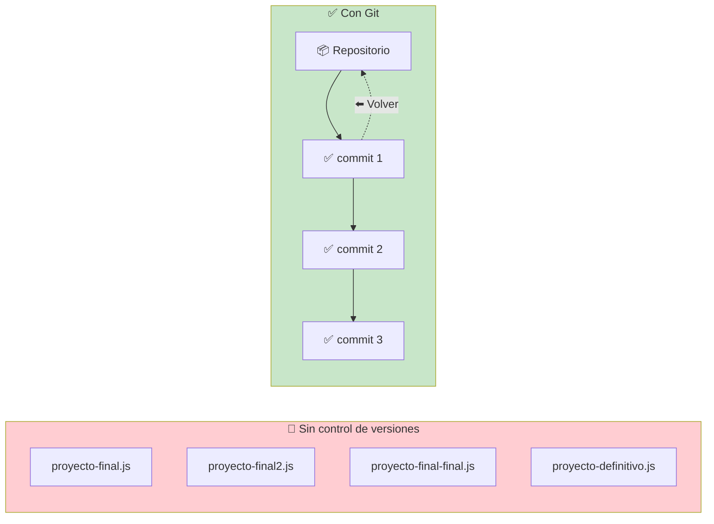
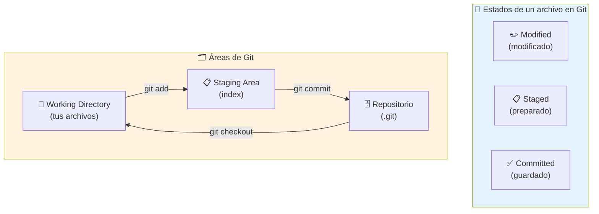
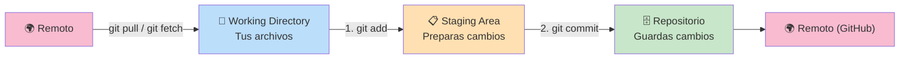
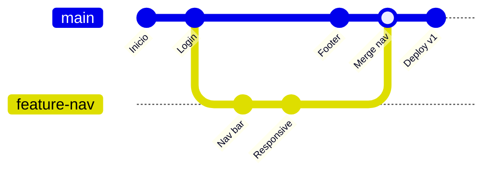
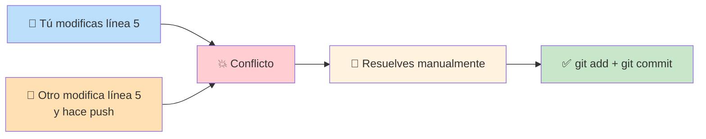
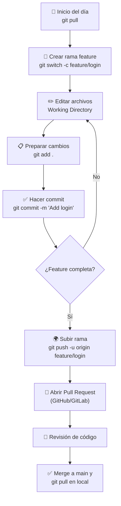
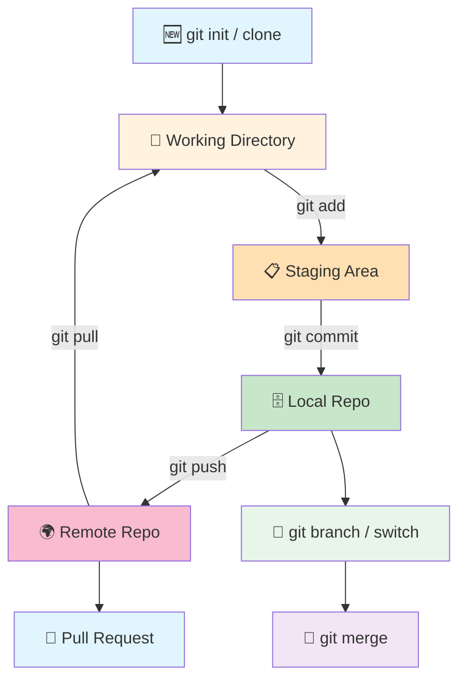

# Sistema de Control de Versiones

Un **sistema de control de versiones** (VCS) registra los cambios en tus archivos a lo largo del tiempo, permitiéndote volver a versiones anteriores, experimentar sin miedo y colaborar con otros desarrolladores.



---

## Git

Git es el sistema de control de versiones más usado del mundo. Es **distribuido** (cada desarrollador tiene una copia completa del historial), **rápido** y **confiable**.

### Conceptos fundamentales



### Flujo de trabajo básico



---

## Comandos esenciales

### Configuración inicial (una sola vez)

```bash
git config --global user.name "Tu Nombre"
git config --global user.email "tu@email.com"
```

### Crear o clonar un repositorio

| Comando                          | Qué hace                          |
| -------------------------------- | --------------------------------- |
| `git init`                       | Inicia un repo en la carpeta actual |
| `git clone <url>`                | Clona un repo remoto             |

### Trabajo diario

| Comando                        | Qué hace                              |
| ------------------------------ | ------------------------------------- |
| `git status`                   | Muestra el estado de tus archivos     |
| `git add <archivo>`            | Prepara un archivo para commit        |
| `git add .`                    | Prepara **todos** los archivos        |
| `git commit -m "mensaje"`      | Guarda los cambios preparados         |
| `git log`                      | Muestra el historial de commits       |
| `git log --oneline`            | Historial resumido (1 línea por commit) |
| `git diff`                     | Muestra cambios sin preparar          |
| `git diff --staged`            | Muestra cambios preparados            |

### Sincronizar con remoto

| Comando                        | Qué hace                              |
| ------------------------------ | ------------------------------------- |
| `git remote add origin <url>`  | Conecta tu repo local a uno remoto    |
| `git push origin main`         | Sube tus commits al remoto            |
| `git pull origin main`         | Baja y fusiona cambios del remoto     |
| `git fetch`                    | Baja cambios **sin fusionarlos**      |

### Ramas (branches)

```bash
git branch nombre-rama      # Crea una rama
git switch nombre-rama      # Cambia a una rama (o git checkout)
git switch -c nombre-rama   # Crea y cambia en un paso
git branch -d nombre-rama   # Elimina una rama
```

---

## Ramas (Branches)

Las ramas permiten trabajar en **múltiples versiones del proyecto en paralelo** sin afectar la versión estable.



### Estrategia de ramas típica

```
main          → Código en producción (estable)
├── develop   → Integración de características
│   ├── feature/login   → Trabajo en login
│   ├── feature/api     → Trabajo en API
│   └── hotfix/crash    → Parche urgente
```

| Rama     | Propósito                                  |
| -------- | ------------------------------------------ |
| `main`   | Producción, solo commits estables          |
| `develop`| Integración de features en desarrollo      |
| `feature/*` | Cada nueva funcionalidad en su rama    |
| `hotfix/*`  | Parches urgentes a producción          |

---

## Resolución de conflictos

Cuando dos personas modifican la misma línea del mismo archivo, Git no sabe cuál conservar.



```bash
# Al hacer pull aparece un conflicto
# Git marca las zonas en conflicto:

<<<<<<< HEAD
console.log("versión tuya");
=======
console.log("versión del otro");
>>>>>>> feature-otro

# Editas el archivo, dejas lo correcto
# Y luego:
git add archivo-resuelto.js
git commit -m "Resuelve conflicto en archivo-resuelto.js"
```

---

## Comandos útiles para emergencias

```bash
# Deshacer cambios sin preparar
git restore <archivo>

# Sacar archivos del staging
git restore --staged <archivo>

# Modificar el último commit (mensaje o contenido)
git commit --amend -m "Nuevo mensaje"

# Guardar cambios temporales (sin commitear)
git stash
git stash pop   # Recuperar cambios guardados

# Ver quién escribió cada línea de un archivo
git blame <archivo>

# Historial gráfico
git log --graph --oneline --all
```

---

## Flujo de trabajo completo (día típico)



---

## Resumen visual: Git en una imagen



### Reglas de oro

1. **Commits pequeños y frecuentes** — cada commit debe ser una unidad lógica
2. **Mensajes claros** — explica **qué** y **por qué**, no cómo
3. **Una rama por feature** — no trabajes en `main`
4. **Nunca forces push** (`--force`) en ramas compartidas
5. **Revisa antes de commitear** — `git diff` y `git status` son tus amigos
6. **Siempre haz pull antes de empezar a trabajar**

---

> **Siguiente paso:** Practica con [Learn Git Branching](https://learngitbranching.js.org/) y crea tu primer repositorio en GitHub.

## Relacionados:
- [[proyectos-backend-para-principiantes]] #anterior 
- [[servicio-de-hospedaje-de-repositorios]] #siguiente 